# Maven 故障保护插件

> 原文：<https://www.educba.com/maven-failsafe-plugin/>

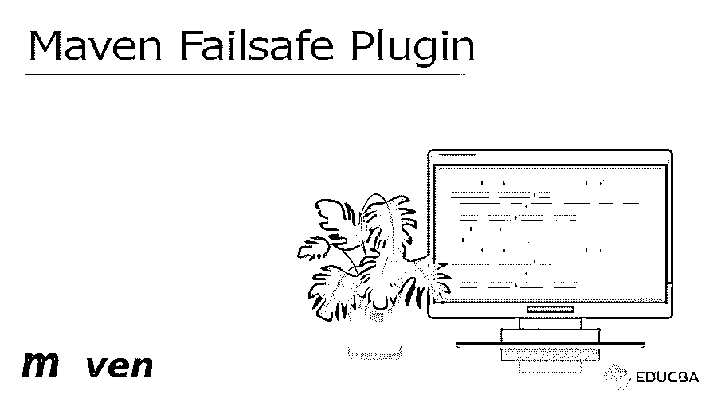


## Maven 故障保护插件简介

Maven failsafe 插件是 Maven 插件的一部分，用于运行我们的 maven 项目的集成测试。故障安全插件类似于 maven surefire 的插件。故障保护插件用于集成测试，而 surefire 插件运行项目的单元测试。在进行集成测试时，故障保护插件非常重要。

### Maven 故障保护插件概述

当运行集成测试时，生命周期将包含相同的四个阶段。下面是运行集成测试的生命周期阶段。

<small>网页开发、编程语言、软件测试&其他</small>

*   第一个阶段是预集成测试，用于设置集成测试环境。
*   集成测试生命周期的第二个阶段是用于运行集成测试的集成测试。
*   集成测试生命周期的第三个阶段是集成后测试，用于破坏集成测试的环境。
*   集成测试生命周期的第四个阶段是验证集成测试，它用于检查集成测试的结果。

故障安全的 maven 插件将报告创建为两种不同的文件格式，即故障安全集成测试针对特定应用的集成测试运行。故障安全验证将验证通过应用程序的集成测试。

### 关键要点

*   故障保护插件像 surefire 插件一样在测试类上运行该方法。一个故障保护插件被用来做集成测试。
*   failsafe 插件的目标是集成测试，默认情况下，它被绑定到集成测试阶段。

### 如何使用 Maven Failsafe 插件？

我们必须在 spring 工具套件中创建项目模板来使用故障保护插件。下面的步骤显示了我们如何使用故障保护插件。

*   在这一步，我们将在 spring 初始化器中创建故障保护插件的项目模板。我们将 maven 项目命名为 maven_failsafe。我们将打包定义为 jar，并将 java 版本选择为 8。

group name–com . example 工件–maven _ fail safe

名称–maven _ 故障保护包装–罐子

Java 版本–8

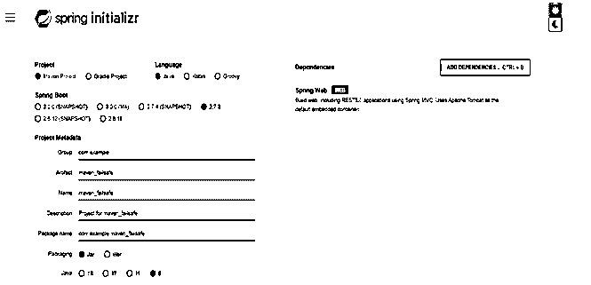


*   在创建了 maven failsafe 的模板之后，现在在这一步中，我们将 failsafe 插件项目打开到 spring 工具套件中，如下所示。

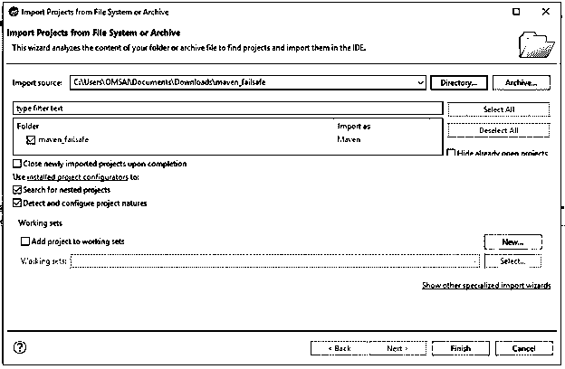


*   在打开故障保护插件的项目模板后，我们在这一步检查项目结构和文件。

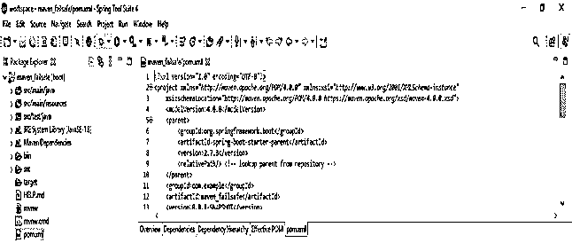


*   在这一步打开项目后，我们将故障保护插件添加到 pom.xml 文件中，如下所示。

**代码:**

```
<plugin>
<artifactId> maven-failsafe-plugin </artifactId>
<version> 3.0.0-M5 </version>
<executions>
<execution>
<goals>
<goal>integration-test</goal>
<goal>verify</goal>
</goals>
</execution>
</executions>
</plugin>
```

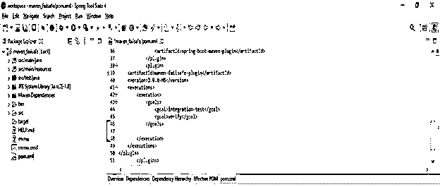


*   将插件添加到 pom.xml 文件后，我们通过 GUI 构建项目，如下所示。

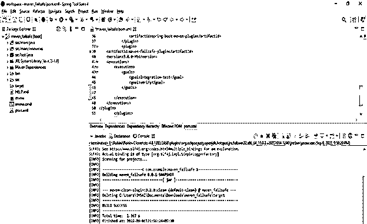


### Maven 故障安全运行

故障保护插件用于运行测试。在下面的例子中，我们将 jetty 服务器配置为启动集成测试，并在测试执行后停止。为了首先开始集成测试，我们需要将 jetty 服务器的插件添加到 pom.xml 文件中。在下面的例子中，我们首先将下面的代码添加到 pom.xml 文件中。在下面的例子中，我们定义了插件指令。

**代码:**

```
<plugin>
<groupId> org.eclipse.jetty </groupId>
<artifactId> maven-plugin </artifactId>
<version> 9.4.11.v20180605 </version>
<executions>
<execution>
<id> start </id>
<phase> integration test </phase>
<goals>
<goal> start </goal>
</goals>
</execution>
<execution>
<id> stop </id>
<phase> post test </phase>
<goals>
<goal> stop </goal>
</goals>
</execution>
</executions>
</plugin>
```

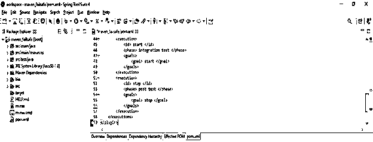


在添加了 jetty 的插件之后，下面我们对 jetty 插件进行如下的集成测试。在上面的例子中，我们添加了在集成测试时启动和停止 jetty 服务器的配置。在下面的例子中，我们从控制台执行测试并检查结果。在下面的例子中，我们可以看到我们已经在 jetty 插件上运行了集成测试。对于使用不同的插件进行不同的测试，这只是配置之间的分离。

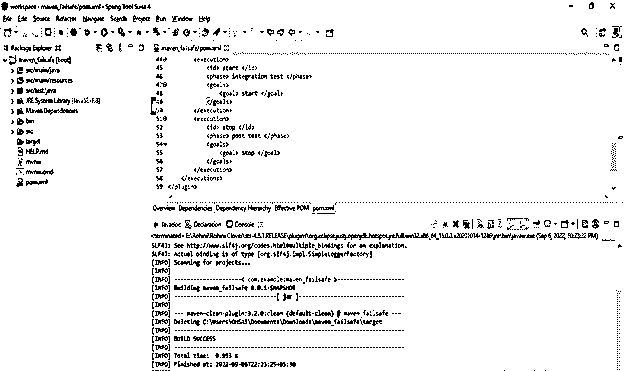


### 设置 Maven 故障保护插件

在首次设置故障安全插件时，我们需要将故障安全插件配置到 pom.xml 文件中。我们添加到项目中的所有插件都需要添加到 pom.xml 文件中。我们将下面的配置设置到 pom.xml 文件中。我们将工件 id 定义为“maven 故障安全设置”，然后我们将配置版本定义为 3.0.0。此外，我们将目标定义为一个集成测试，并对其进行如下验证。

**代码:**

```
<plugin>
<artifactId> maven-plugin </artifactId>
<version>3.0.0-M5</version>
<executions>
<execution>
<goals>
<goal>integration-test</goal>
<goal>verify</goal>
</goals>
</execution>
</executions>
</plugin>
```

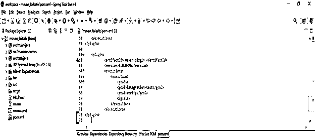


在设置了故障保护配置之后，我们现在正在运行集成测试并构建故障保护插件的配置，如下所示。

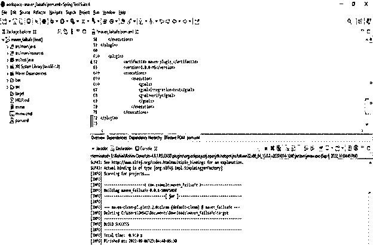


### Maven 故障保护插件排除

故障保护插件运行在 surefire 插件的测试类上。我们同样配置了 surefire 和 failsafe 插件。故障保护插件的目标是在 pom.xml 文件中指定。下面的例子显示了故障安全插件执行如下。在下面的例子中，我们将集成测试定义如下。

**代码:**

```
<plugin>
<artifactId> maven-failsafe </artifactId>
<version> 2.21.0 </version>
<executions>
<execution>
<goals>
<goal> test </goal>
</goals>
<configuration>
</configuration>
</execution>
</executions>
</plugin>
```

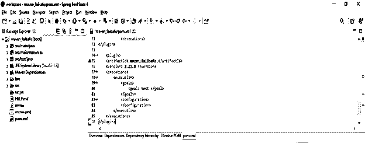


在定义了排除 maven 故障保护插件后，我们如下加载故障保护插件。

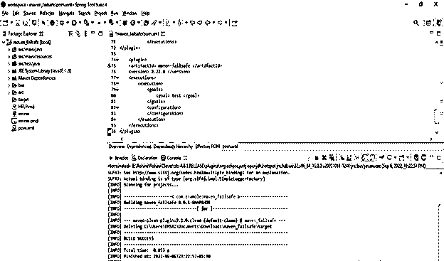


### 常见问题解答

下面是提到的常见问题:

#### Q1。maven 应用程序的故障保护插件有什么用？

**回答:**我们正在用 failsafe 插件做 maven 项目的集成测试。它的工作方式类似于 surefire 插件。

#### Q2。故障安全插件中定义了多少个目标？

**答:**故障保护插件中定义了两种目标，即验证和集成测试。

#### Q3。我们可以使用 jetty 服务器通过故障保护插件来运行集成测试吗？

**答:**为了运行项目的集成测试，我们使用 jetty 服务器来运行 maven 应用程序的测试。

### 结论

当运行集成测试时，生命周期包含 maven failsafe 插件的四个阶段。Maven failsafe 插件是插件的一部分，用于运行我们项目的集成测试。maven failsafe 插件类似于 maven surefire 的插件。

### 推荐文章

这是一个 Maven 故障保护插件的指南。在这里，我们讨论了介绍和如何使用 Maven 故障安全插件运行，设置和排除。您也可以看看以下文章，了解更多信息–

1.  [梅文十拿九稳](https://www.educba.com/maven-surefire/)
2.  [胃插件](https://www.educba.com/maven-plugins/)
3.  [Maven 跳过测试](https://www.educba.com/maven-skip-test/)
4.  [什么是 Maven 插件？](https://www.educba.com/what-is-maven-plugins/)