# Maven Enforcer 插件

> 原文：<https://www.educba.com/maven-enforcer-plugin/>

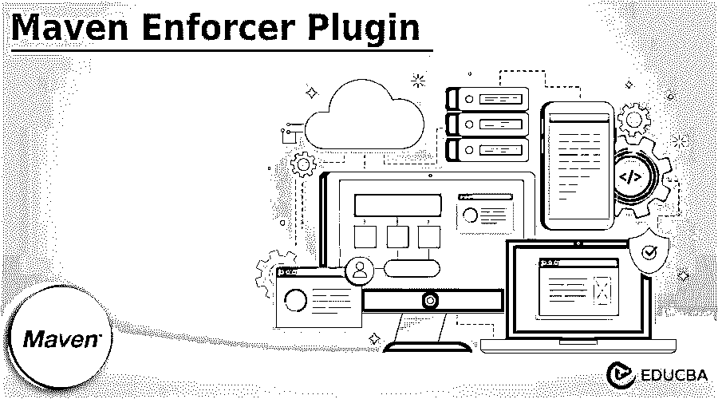


## Maven Enforcer 插件简介

Maven enforcer 插件提供了控制特定环境约束的目标。Jdk 和 os 系列的版本包含用户创建的规则和内置规则。它包含两个目标，第一个是 enforcer:enforce 为多项目中构建的每个项目执行规则。第二个目标是 enforcer:display-info，用于显示当前信息。

enforcer 显示信息的 Enforcer 插件目标将从内置规则中检测信息。目标被绑定到生命周期阶段，它将在 pom.xml 中配置。enforcer 插件将执行已配置的规则，这些规则已在约束中检查过。

<small>网页开发、编程语言、软件测试&其他</small>

maven enforcer 插件的目标是支持以下三个选项:

*   **Skip:** Skip 选项是一种快捷方式，用于从命令行或用户配置文件使用 denforcer skip 跳过检查。
*   **Fall:** 假设目标是在规则下降时在构建中下降。假设该值为 false，则错误将被记录为警告。
*   **failFast:** 假设目标在第一次失败时停止检查，则该选项的默认值为 false。

其中的每个规则都将被执行并添加到 rules 元素中，其配置特定于该规则的 enforcer 插件。在 1.4 版本之前，我们需要在指定的规则中添加级别元素。maven 的有效值是 warning 和 error。warn 和 level 是在规则中指定的，该规则发出一个警告，并且在构建中没有失败。

### 关键要点

*   maven enforcer 插件将控制构建在环境上的约束。这只是 java 版本、maven 版本或用户规则中定义的系统参数。
*   它定义了两种类型的规则，即实施和显示信息。

### 如何使用 Maven Enforcer 插件？

要使用 maven enforce 插件，我们需要在 spring 工具套件中创建项目。这里，我们将项目模板名称创建为 maven_enforcer_plugin，如下所示:

1.在这一步中，我们使用 spring initializer 创建项目模板名称 maven_enforcer_plugin。在下面的例子中，我们定义了名称 maven_enforcer_plugin。

此外，我们将组名定义为 com。例如，我们将工件定义为 maven_enforcer_plugin，将打包定义为 jar，将 java 版本定义为 8。

group Name–com . example 工件–maven _ enforcer _ plugin
名称–maven _ enforcer _ plugin 打包–jar
Java 版本–8

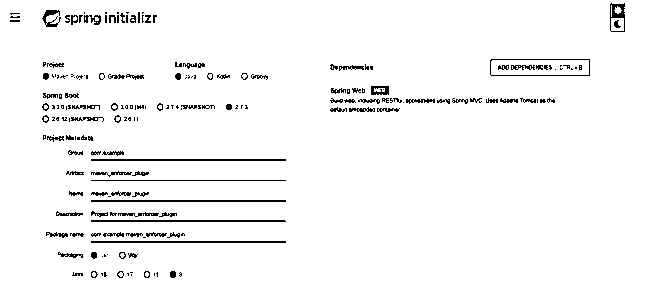


2.在上面的例子中，我们可以看到我们已经创建了一个模板。现在，在这一步中，我们提取模板文件，提取完成后，我们使用 spring 工具套件打开它。

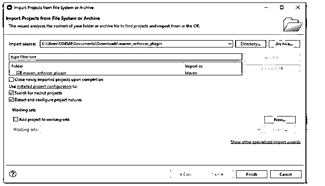


3.在 spring 工具套件中提取并打开项目后，现在在这一步中，我们检查项目结构和 pom.xml 文件，如下所示。

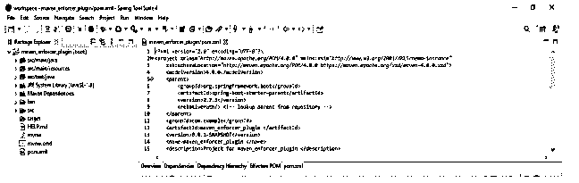


4.打开项目模板后，我们正在添加 maven enforcer 插件的代码。

**代码:**

```
<plugin>
<groupId> org.apache.maven.plugins </groupId>
<artifactId> maven-enforcer-plugin </artifactId>
<executions>
<execution>
<id> enforce </id>
<goals>
<goal> enforce </goal>
</goals>
</execution>
</executions>
</plugin>
```

**输出:**

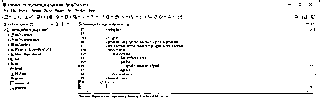


5.在 pom.xml 文件中添加了 enforcer 插件后，我们现在使用 mvn install 运行 maven enforcer 插件项目。

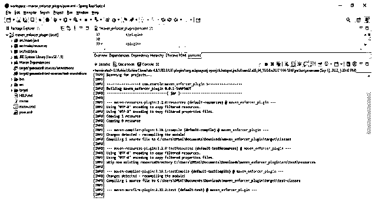


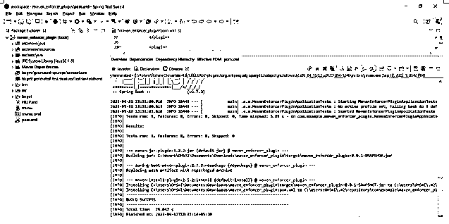


### Maven Enforcer 插件配置

我们正在 pom.xml 文件中配置插件。我们需要将它添加到 pom.xml 文件中。在下面的例子中，我们将 maven enforcer 插件配置如下:

**代码:**

```
<plugin>
<groupId> org.apache.maven.plugins </groupId>
<artifactId> maven-enforcer-plugin </artifactId>
<executions>
<execution>
<id> enforce </id>
<goals>
<goal> maven-enforce </goal>
</goals>
</execution>
</executions>
</plugin>
```

**输出:**

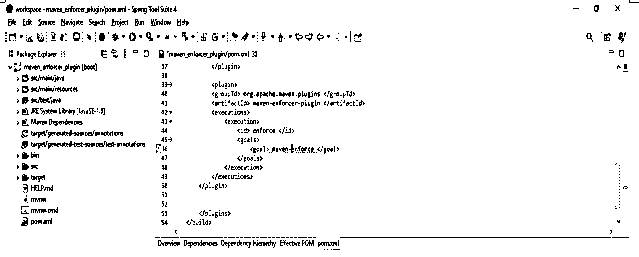


在 pom.xml 文件中添加代码之后，而不是在这一步中，我们通过使用 maven install 命令运行 maven install 命令，如下所示。


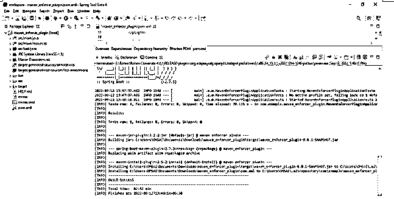


在下面的例子中，我们使用命令行工具来执行 mvn 安装命令。我们可以看到，我们正在使用命令行执行相同的代码，如下所示。在执行代码时，命令行和 GUI 的工作方式是一样的。

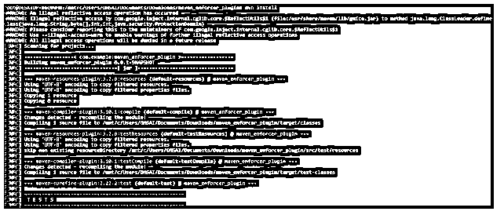


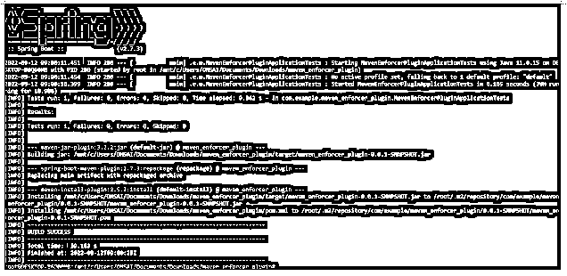


### Maven Enforcer 规则

maven 插件中的 enforce 关键字为现有规则提供了微妙的建议，告诉我们 maven enforcer 将如何工作。我们可以在项目的构建阶段配置 maven enforcer 插件的规则。

下面是规则如下:

#### 1.禁止重复依赖

在当时的多模块项目中，子关系将按照 POM 存在，确保 POM 项目中的重复依赖，这是有效的。

**代码:**

```
<plugin>
<groupId> org.apache.maven.plugins </groupId>
<artifactId> maven-enforcer-plugin </artifactId>
<executions>
<execution>
<id> enforce </id>
<goals>
<goal> maven-enforce </goal>
</goals>
<rules>
<banDuplicatePomDependencyVersions/>
</rules>
</execution>
</executions>
</plugin>
```

**输出:**

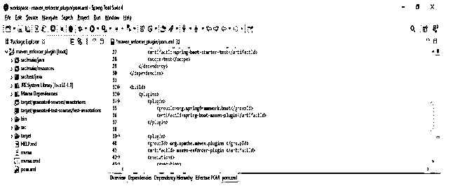


#### 2.需要 maven 和 java 版本

此规则正在启用项目范围锁定。这将有助于消除差距。

**代码:**

```
<requireMavenVersion>
<version>3.0</version>
</requireMavenVersion>
<requireJavaVersion>
<version>1.8</version>
</requireJavaVersion>
```

**输出:**

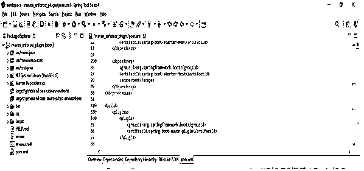


#### 3.需要环境变量

通过使用这个规则，我们可以确保在执行环境中设置指定的环境变量，如下所示。

**代码:**

```
<requireEnvironmentVariable>
<variableName> maven-ui </variableName>
</requireEnvironmentVariable>
<requireEnvironmentVariable>
<variableName> enforce </variableName>
</requireEnvironmentVariable>
```

**输出:**

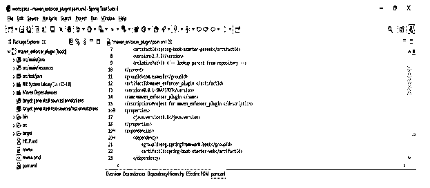


#### 4.需要活动配置文件

maven 项目中的概要文件将帮助我们如下配置属性。

**代码:**

```
<requireActiveProfile>
<profiles> local,base </profiles>
<message> Missing </message>
</requireActiveProfile>
```

**输出:**

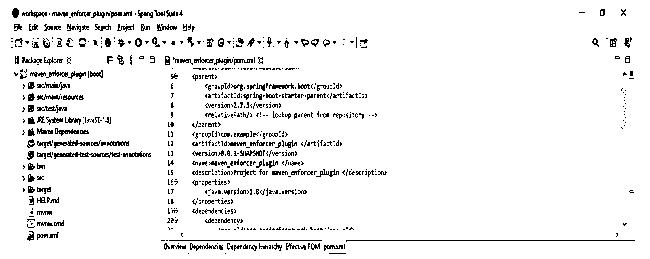


#### 5.其他和自定义规则

它还包含插件中使用的其他规则。

**代码:**

```
mvn enforcer:display-info
```

**输出:**

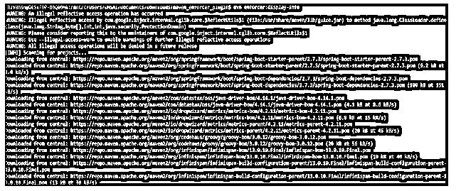


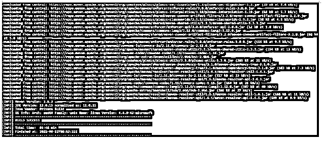


### 常见问题解答

下面是提到的常见问题:

#### Q1。maven enforcer 插件在 maven 项目中有什么用？

**回答:**基本上这个插件是用来控制在 maven 和 java 版本上提供带有一定约束的目标。

#### Q2。定义了多少种规则？

**答:**maven enforcer 登录中使用了两种类型的规则，即显示和强制。这两条规则在使用时都很重要。

#### Q3。在 maven 项目中添加 maven enforcer 插件需要使用哪些文件？

**回答:**我们需要使用 pom.xml 文件在 maven 的项目中添加 maven enforcer 插件。

### 结论

maven enforcer 插件目标绑定到生命周期阶段，它将在 pom.xml 中进行配置。它提供了控制特定环境约束的目标，Jdk 版本和操作系统系列包含用户创建的规则和内置规则。

### 推荐文章

这是一个 Maven Enforcer 插件指南。这里我们讨论介绍，以及如何使用 maven enforcer 插件。配置、规则和常见问题。您也可以看看以下文章，了解更多信息–

1.  [Maven 构建命令](https://www.educba.com/maven-build-command/)
2.  [Maven 战争插件](https://www.educba.com/maven-war-plugin/)
3.  [Maven 简介](https://www.educba.com/maven-profile/)
4.  [Maven 版本](https://www.educba.com/maven-versions/)