# Maven Javadoc 插件

> 原文：<https://www.educba.com/maven-javadoc-plugin/>

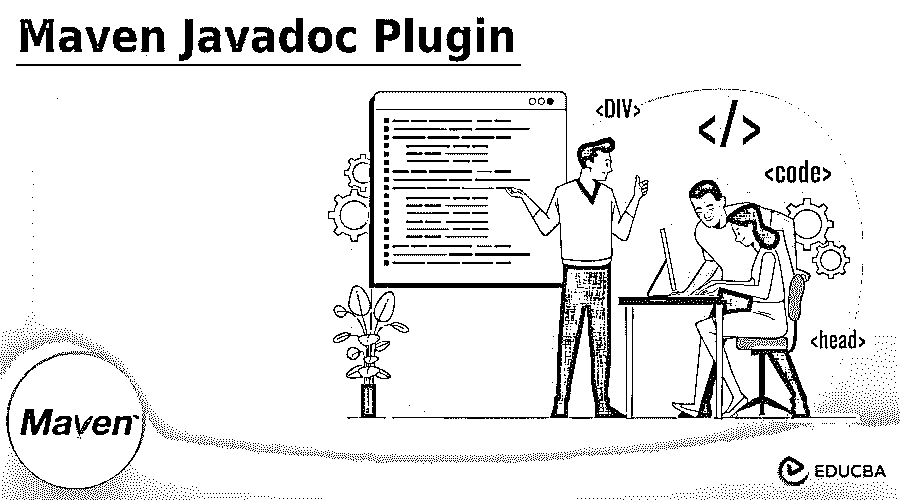


## Maven Javadoc 插件简介

Maven javadoc 插件用于为我们指定该插件的项目生成 javadoc 工具。maven javadoc 的插件从插件配置中使用的值中获取值，该值在 pom.xml 文件中指定。为了保存 javadoc 文件和包的所有参数，我们需要生成 javadoc 的插件，并且需要调用 javadoc 工具。

Maven 包含了我们在开发 maven 应用程序时使用的许多特性。maven 包含了在我们的项目中添加 javadoc 插件的良好特性。每个 java 开发人员都知道在我们的项目中包含代码文档是至关重要的。Maven 使用 maven-javadoc 的插件来生成 javadoc 的项目。它在内部使用 javadoc.exe 命令为我们的项目生成 javadoc。在使用 mvn install 部署项目时，它将为我们的项目生成 javadoc。

<small>网页开发、编程语言、软件测试&其他</small>

它是由 apache 设计的，Apache 使用 javadoc 工具为指定的项目生成文档。它用于为指定的项目生成 javadoc 的 jar 文件，该文件被部署到 remote maven 的存储库，因此开发人员将为我们的项目下载 java 文档。设置非常简单。我们只需要在 pom.xml 文件中为 maven javadoc 的插件添加一个条目，还需要定义构建 javadoc 的 jar 文件的目标。

### 关键要点

*   javadoc 插件用于生成我们项目的 java 文档。我们可以通过将插件代码添加到 pom.xml 文件来添加 maven javadoc 插件。
*   我们可以通过在 javadoc 的命令中将 javadoc skip 选项定义为 true 来禁用 javadoc 文件。

### 如何使用 Maven Javadoc 插件？

我们需要通过使用项目来创建项目模板。我们正在创建一个名为 maven_javadoc_plugin 的项目模板，如下所示。

1.第一步，我们在 spring 初始化器中创建模板。我们将项目模板的名称命名为 maven_javadoc_plugin。我们正在定义 jar 打包并选择 java 版本为 8。

group Name–com . example 工件–maven _ javadoc _ plugin
名称–maven _ javadoc _ plugin 打包–jar
Java 版本–8


2.创建模板后，我们现在将 javadoc 插件模板项目打开到 STS 中。

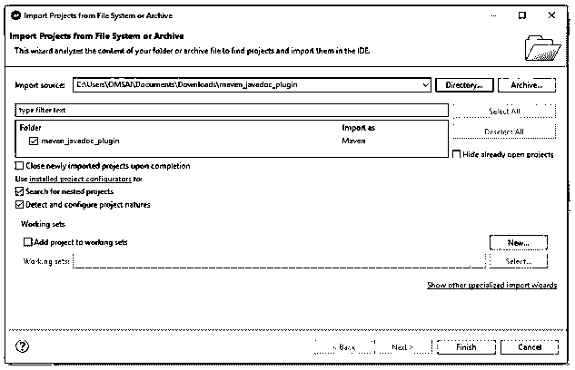


3.创建项目模板并在此步骤中打开模板后，我们将检查项目的结构，如下所示。

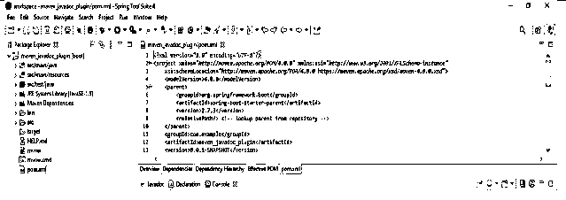


4.在本步骤中打开项目后，我们正在编辑 pom.xml 文件。我们添加 javadoc 插件如下。

**代码:**

```
<plugin>
<groupId> org.apache.maven.plugins </groupId>
<artifactId> maven-javadoc-plugin </artifactId>
<executions>
<execution>
<id> maven-javadocs </id>
<goals>
<goal> jar </goal>
</goals>
</execution>
</executions>
</plugin>
```

**输出:**

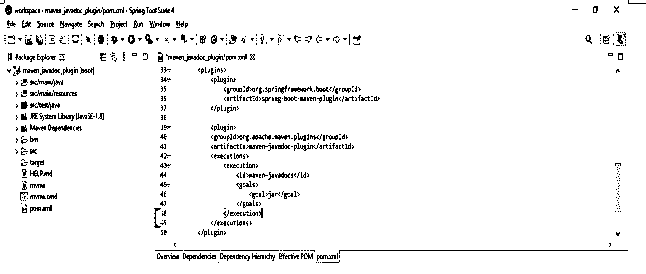


添加 javadoc 插件后，我们通过使用 mvn install 来运行项目，我们可以从控制台进行安装，也可以使用命令行工具进行安装。

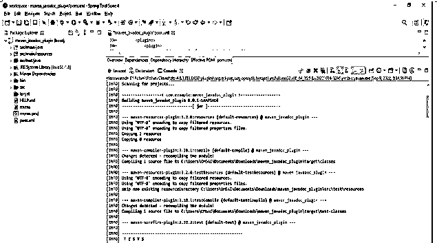


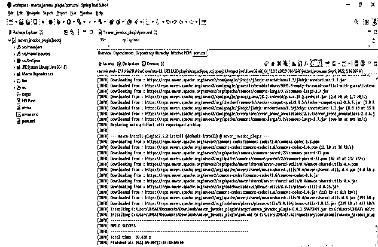


### 配置 Maven Javadoc 插件

我们正在为任何项目配置 javadoc 插件。要配置 javadoc 插件，我们需要将 pom.xml 文件编辑成 pom.xml，我们正在将 javadoc 插件添加到插件部分。我们可以根据需要向 pom.xml 文件添加多个插件。

下面的例子展示了我们如何配置 javadoc maven 插件。

**代码:**

```
<plugin>
<groupId>org.apache.maven.plugins</groupId>
<artifactId>maven-javadoc-plugin</artifactId>
<executions>
<execution>
<id>maven-javadocs</id>
<goals>
<goal>maven-plugin</goal>
</goals>
</execution>
</executions>
</plugin>
```

**输出:**

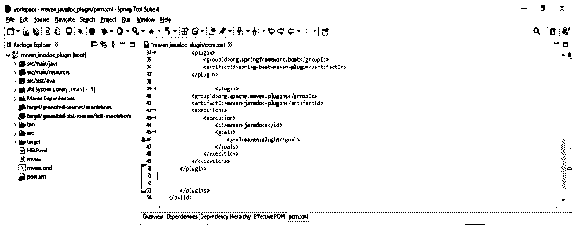


在将插件配置到 pom.xml 文件中之后，为了在我们的项目中实现相同的效果，我们需要运行 mvn install 命令。在下面的例子中，我们通过使用 spring 工具套件来运行相同的操作。

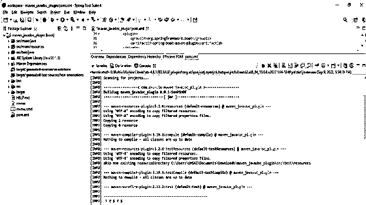


在下面的例子中，我们可以看到我们已经通过 spring 工具套件执行了 mvn install 命令。我们也可以使用命令行工具运行相同的命令。为了执行指定项目的 mvn 安装命令，我们需要执行 mvn 安装命令。

**代码:**

```
mvn install
```

**输出:**

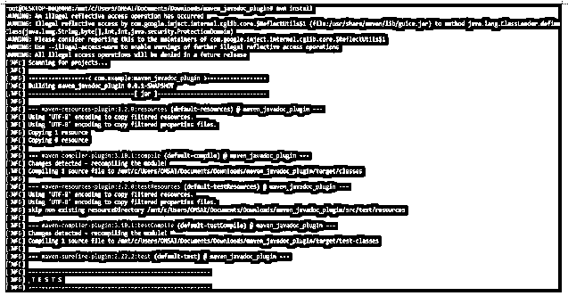


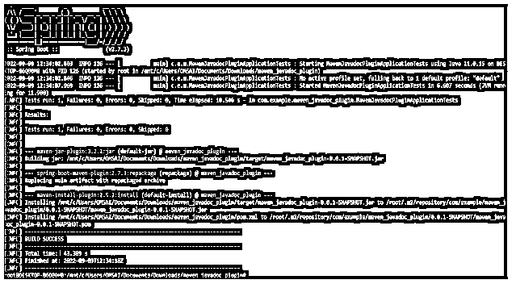


### 禁用 Maven Javadoc 插件

我们可以通过在 mvn clean install 命令中指定 skip 选项来禁用或跳过 javadoc 的插件。在创建项目时，maven 并没有构建 javadocs 来将值传递为 true。

下面的例子显示了我们如何跳过 javadoc 插件。

**代码:**

```
mvn clean install -Dmaven.javadoc.skip = true
```

**输出:**

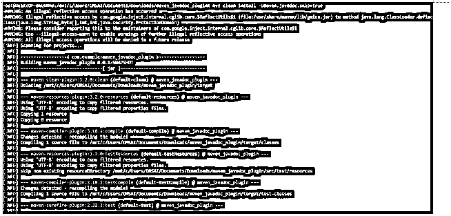


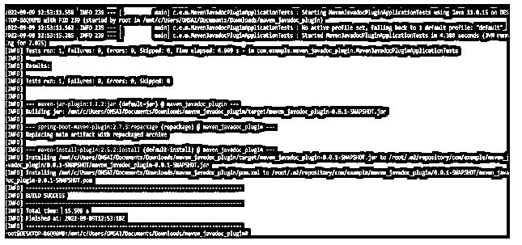


我们知道插件在发布管理中被广泛使用。我们也可以通过将代码放入 pom.xml 文件来跳过 javadoc 插件。要禁用 javadoc 插件，我们需要在 pom.xml 文件中添加如下代码。

**代码:**

```
<plugin>
<groupId>org.apache.maven.plugins</groupId>
<artifactId> maven-javadoc-plugin </artifactId>
<configuration>
<arguments> -Dmaven.javadoc.skip=true </arguments>
</configuration>
</plugin>
```

**输出:**

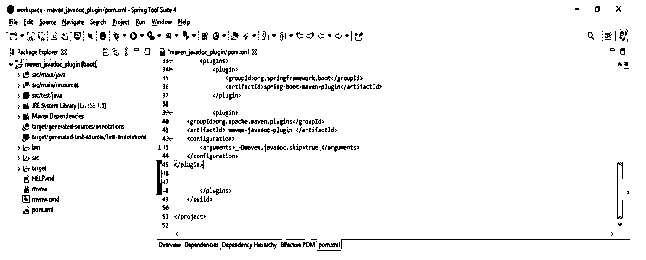


将插件添加到 pom.xml 文件后，我们现在运行 mvn install 命令来实现在 pom.xml 文件中完成的更改，如下所示。

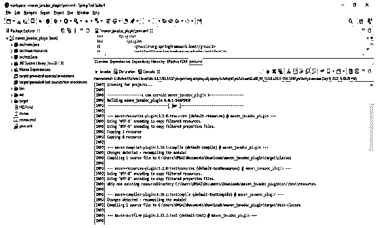


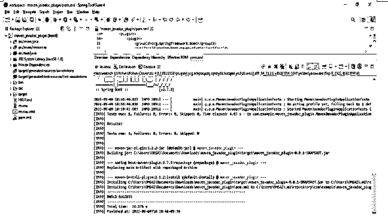


### 常见问题解答

下面是提到的常见问题:

#### Q1。javadoc 插件有什么用？

**答:**用于生成我们已经配置了 maven javadoc 插件的项目的 java 文档。

#### Q2。如何禁用 maven 项目中的 javadoc 插件？

**答:**我们正在使用 pom.xml 文件禁用 javadoc 插件，在该文件中，我们需要将 javadoc skip 定义为 true，我们也可以从命令行禁用它。

#### Q3。我们使用哪个配置文件来配置？

**回答:**我们正在使用 pom.xml 文件将 maven javadoc 插件配置到 java 的项目中。

### 结论

maven javadoc 的插件从插件配置中使用的值中获取值，该值在 pom.xml 文件中指定。它是由 apache 设计的，Apache 使用 javadoc 工具为指定的项目生成文档。

### 推荐文章

这是一个 Maven Javadoc 插件指南。这里我们讨论一下入门，以及如何使用 maven Javadoc 插件？配置和禁用。您也可以看看以下文章，了解更多信息–

1.  [Maven 构建命令](https://www.educba.com/maven-build-command/)
2.  [Maven 战争插件](https://www.educba.com/maven-war-plugin/)
3.  [Maven 简介](https://www.educba.com/maven-profile/)
4.  [Maven 版本](https://www.educba.com/maven-versions/)