# Maven 战争插件

> 原文：<https://www.educba.com/maven-war-plugin/>

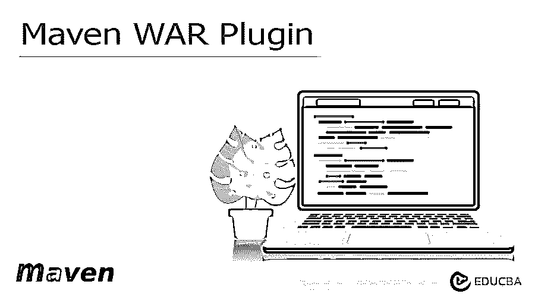


## Maven WAR 插件的定义

Maven war 插件负责收集 web 应用程序的类和工件的依赖关系，并需要将其打包到 web 应用程序的档案中。这是战争期间产品包装阶段调用的默认目标。War 插件用于在开发阶段加速测试。

### Maven WAR 插件简介

这个地方的战争是爆炸的变体，而我们的 web 应用程序是默认生成到 web 应用程序的源目录中的。共有四种类型的 war 插件目标，如下所示:

<small>网页开发、编程语言、软件测试&其他</small>

1.  **展开的**–该目标用于在指定的目录中创建一个展开的 web 应用程序。
2.  **Help**–这种类型的目标显示来自 war 插件的帮助信息。我们使用 mvn 命令来显示参数的细节。
3.  **就地**–该目标类型用于将 web 应用程序生成到 web 应用程序的源目录中。
4.  **War**–该目标类型用于构建 War 文件。

为了在 java 应用程序中使用 war 插件，我们要求 Jdk 版本为 1.7 及以上。我们需要 maven 版本作为 3.1.0。对于内存和磁盘的使用，我们没有最低要求；根据应用程序，我们可以增加或减少内存。

### 如何使用 Maven WAR 插件？

下面的例子显示了我们如何使用包阶段，如下所示。要定义包 war 插件，我们需要将下面的代码添加到 pom.xml 文件中，在这里我们需要将包定义为 war。
**代号:**

```
<groupId> com.example </groupId>
<artifactId> maven_war </artifactId>
<version> 0.0.1-SNAPSHOT </version>
<packaging> war </packaging>
<name> maven_war </name>
<description> Project for maven_war </description>
<properties>
<java.version> 1.8 </java.version>
</properties>
```

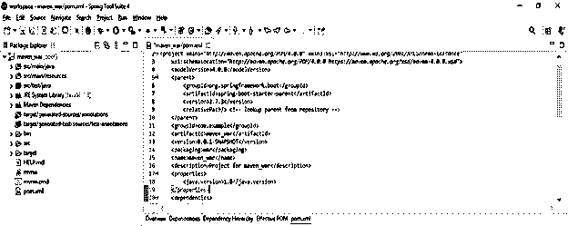


在下面的例子中，我们使用了 war.exploded 调用 war 插件的目标如下。在使用展开的目标时，我们使用插件目录将 war 插件定义到 pom.xml 文件中。

**代码:**

```
<plugin>
<groupId> org.apache.maven.plugins </groupId>
<artifactId> maven-war </artifactId>
<version> 3.3.2 </version>
<configuration>
<webappDirectory> /dir </webappDirectory>
</configuration>
</plugin>
```

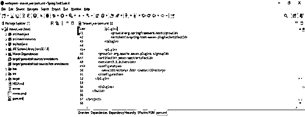


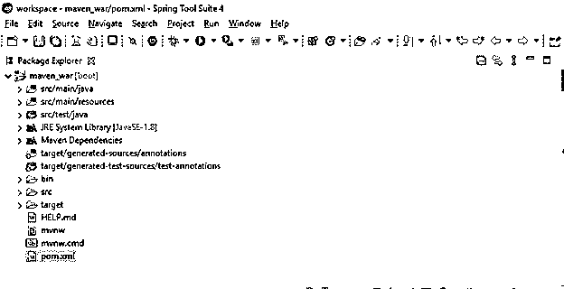


下面的例子展示了通过使用 war.inplace 来使用 war 插件。为了定义 inplace war 插件，我们使用了 mvn 命令，我们也可以使用 maven build 来运行我们的项目。

```
mvn compile war:inpace
```

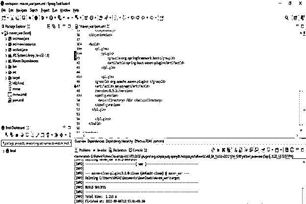


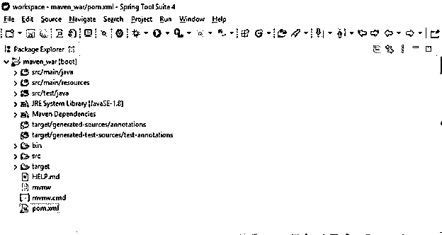


### Maven WAR Web 应用程序

下面的例子显示了如下的应用。在将应用程序开发成 maven war 插件时，我们首先需要创建模板。下面的步骤显示了我们如何创建一个 war 插件的应用程序，如下所示。

*   在这一步，我们将在 spring 初始化器中创建 war 插件项目模板。我们将 maven 项目命名为 maven_war。我们将打包定义为 war，并将 java 版本选择为 8。

group name–com . example 工件–maven _ war

名称–maven _ war 包装–war

Java 版本–8

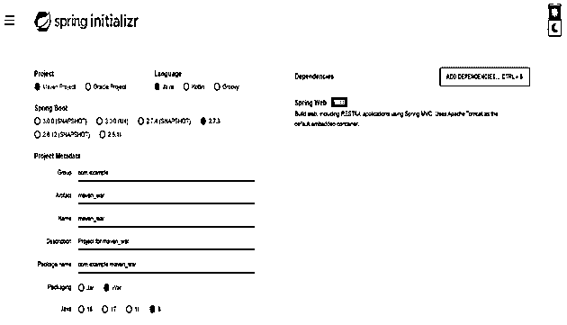


*   在创建 maven war 项目之后，在这一步中，我们将在 spring 工具套件中打开 war 插件应用程序项目。

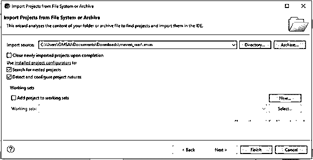


*   在创建了 war 插件的项目模板并在这一步打开项目后，我们将检查项目结构和文件。

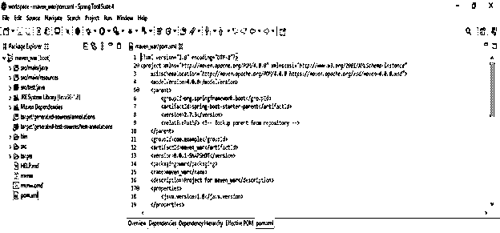


*   基本上在 java 应用程序中，有四种方法可以使用 war 插件。使用 war 插件的第一种方法是通过使用项目包类型作为 war 调用来使用包阶段，如下所示。在下面的例子中，我们将包名定义为 war，如下所示。

**代码:**

```
<groupId> com.example </groupId>
<artifactId> maven_war_plugin </artifactId>
<version> 0.0.1-SNAPSHOT </version>
<packaging> war </packaging>
<name> maven_war_plugin </name>
<description> Project for maven_war_plugin </description>
<properties>
<java.version> 1.8 </java.version>
</properties>
```

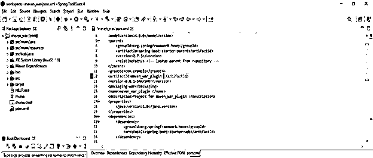


*   在下面的步骤中，我们使用 maven build 运行项目。我们同样使用 mvn 命令。

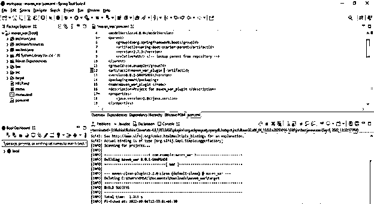


### Maven WAR 文件内容

maven 的 war 插件负责编译和收集 web 应用程序的依赖项、资源和类。我们在战争插件中定义了多个目标，即原地、战争和爆炸。在下面的例子中，我们将 maven war 插件添加到 pom.xml 文件中。添加 maven war 插件后，我们运行 maven install 命令。

**代码:**

```
<plugin>
<groupId> org.apache.maven.plugins </groupId>
<artifactId> maven-war </artifactId>
<version> 3.3.2 </version>
</plugin>
```

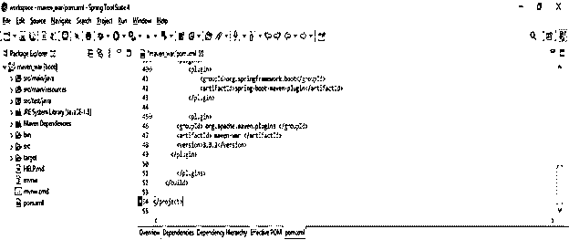


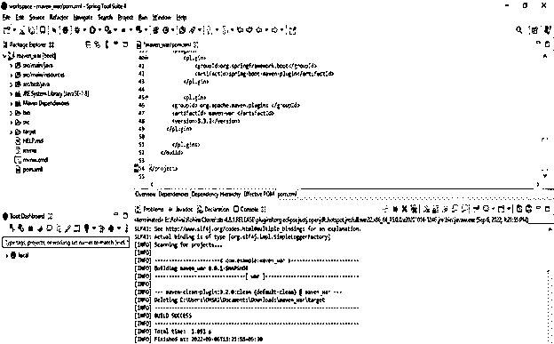


通过使用 exploded 命令，我们将 war 文件生成到目标目录内的目录中。在下面的例子中，我们包括或排除 war 文件的内容如下。通过使用 war 插件，我们过滤了一个 war 文件的内容，如下所示。

**代码:**

```
<plugin>
<artifactId> maven-war </artifactId>
<version> 3.3.1 </version>
<configuration>
<webResources>
<resource>
<directory> War resources </directory>
</resource>
</webResources>
</configuration>
</plugin>
```

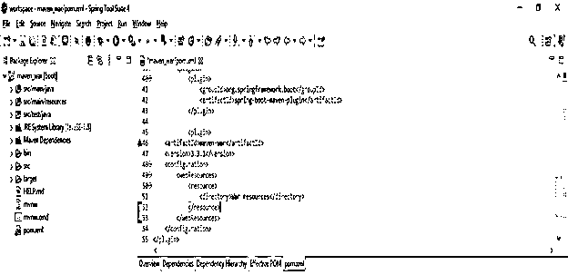


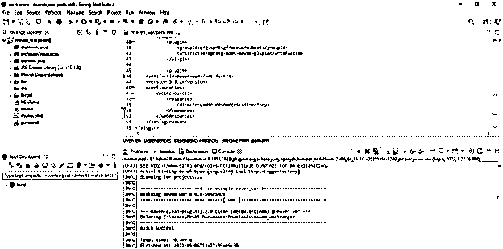


### Maven 战争设定

在 maven 应用程序中使用 war 插件时，我们使用了如下所需的参数。

*   输出目录
*   War 源目录
*   Web 应用程序目录
*   工作目录

此外，我们在 war 插件的应用程序中使用了多个可选参数。maven war 插件允许我们定制清单文件。我们正在将类路径添加到清单文件中。当 war 文件的结构更加复杂时，它非常有用；当我们需要将依赖项共享到多个模块中时，它也非常有用。在下面的例子中，我们使用 maven war 设置如下。

**代码:**

```
<plugin>
<artifactId> maven-war-plugin </artifactId>
<version> 3.3.1 </version>
<configuration>
<archive>
<manifest>
<addClasspath> true </addClasspath>
</manifest>
</archive>
</configuration>
</plugin>
```


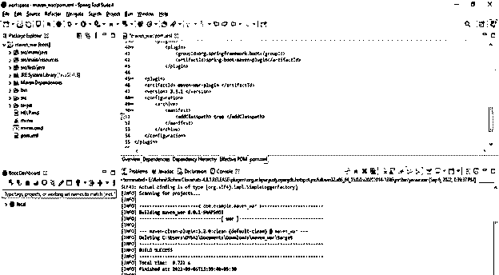


### 关键要点

*   war 插件不过是 web 应用资源的 web 应用档案。war 文件用于将 web 应用程序部署到应用服务器上。
*   在 war 文件中，web 组件被打包成一个单元，它包括 jar 文件。

### 常见问题解答

下面是提到的常见问题:

#### Q1。为什么我们在 maven 的应用中使用 maven war 插件？

**答案:** War 插件用于将 java 的应用部署到应用服务器中。Maven war 插件是用于构建管理的工具。

#### Q2。我们在 maven war 插件中使用了多少种类型的目标？

**回答:**我们在战争插件中使用了四种类型的目标，即战争爆炸、战争帮助、战争战争和战争地点。

#### Q3。在 web 应用程序中使用 war 插件时，我们需要哪个版本？

**答:**我们需要使用 maven 3 . 1 . 0 及以上版本，对于 java 我们需要使用 JDK 1.7 版本。

### 结论

为了在 java 应用程序中使用 maven war 插件，我们需要 1.7 及以上版本的 Jdk。Maven war 插件负责收集 web 应用程序的类和工件的依赖关系，并需要将其打包到 web 应用程序的档案中。

### 推荐文章

这是一个 Maven WAR 插件的指南。在这里，我们讨论介绍以及如何使用 Maven WAR 插件以及 web 应用程序、文件内容和设置。您也可以看看以下文章，了解更多信息–

1.  [Maven 本地存储库](https://www.educba.com/maven-local-repository/)
2.  [智能胃](https://www.educba.com/intellij-maven/)
3.  [Spring Boot 战争](https://www.educba.com/spring-boot-war/)
4.  [tomcat 部署战争](https://www.educba.com/tomcat-deploy-war/.)