# Maven Force 更新

> 原文：<https://www.educba.com/maven-force-update/>

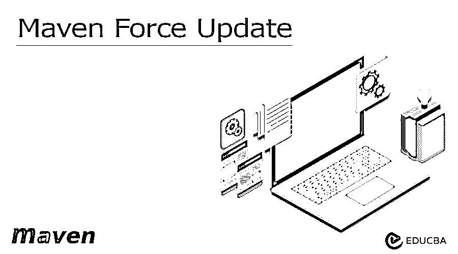


## Maven Force 更新简介

Maven force update 正在从远程存储库获取更新，而更新间隔将会过去。默认情况下，maven force 的更新间隔是每天一次，我们可以通过在 pom.xml 文件中配置更新的策略来配置更新间隔。Maven 没有获取依赖项更新或重新尝试从缓存的存储库中获取依赖项。我们可以强制 maven 在构建项目时从存储库中获取依赖项。

### 什么是 Maven Force 更新？

我们可以通过使用 mvn clean install 命令使用–U 选项在 maven 中强制更新。因为–U 表示强制更新快照的依赖关系。发布依赖关系被更新是假设先前没有被更新。在开发时，maven 在下载快照的同时进行安装，它将释放依赖项。不下载依赖项的原因是网络的延迟问题。Maven 正在从像 maven nexus 这样的仓库中下载依赖项，或者我们可以说它是中央的。我们的应用程序未能加载，因为依赖关系已正确更新。

<small>网页开发、编程语言、软件测试&其他</small>

### 关键要点

*   Maven 将所有项目依赖项保存在 m2 的文件夹中。此外，maven 正在下载存储库文件夹中的依赖项。
*   基本上，maven 正在处理 pom.xml 的配置，在执行 pom.xml 时，文件依赖关系从中央存储库下载。

### 如何使用 Force 选项更新 Maven？

在构建 maven 项目时，我们使用–U 的快照标志来强制 maven 从指定的远程存储库中下载依赖项。–U update snapshot s 标志将强制您从远程存储库中检查更新的快照和缺失的版本。

下面的例子显示了我们如何使用 force 选项更新 maven，如下所示。我们使用带有–U 选项的 mvn clean install 命令进行强制更新。如果假设我们没有使用 mvn clean install 命令的任何选项，那么它将构建文件夹中的项目，并且不会更新或下载任何依赖项。为了下载和更新新的依赖项，我们需要提供选项–U 和 mvn 全新安装命令，如下所示。在下面的示例中，我们将–U 选项与 mvn clean 命令一起使用，我们还将安装更新的依赖项，如下所示。

在下面的例子中，我们可以看到我们正在使用 maven_profile 项目来定义 maven force 更新。

```
mvn clean install –U
```

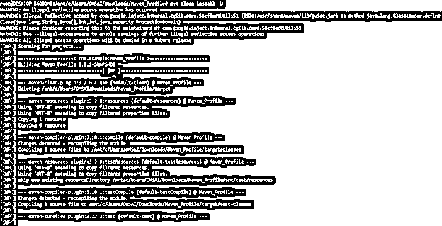


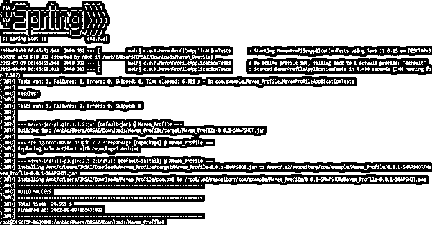


如果假设我们的本地存储库没有为快照使用正确的 release jar，那么我们需要使用以下命令清除存储库。在下面的例子中，我们正在清除本地存储库如下。在下面的例子中，我们可以看到我们已经定义了对本地存储库的依赖，以便通过 maven 更新它。

```
mvn dependency:purge-local-repository
```


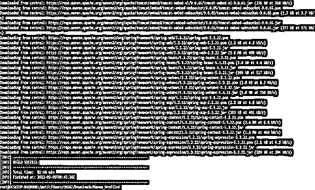


在本步骤中，通过本地存储库更新了依赖关系之后，我们将使用–U 选项清理并安装该依赖关系，如下所示。在下面的示例中，我们通过如下定义本地存储库来使用全新安装命令。在定义 clean install 命令时，它将首先从本地存储库下载所需的依赖项，然后使用 clean install 命令进行安装，如下所示。

```
mvn dependency:purge-local-repository clean install –U
```

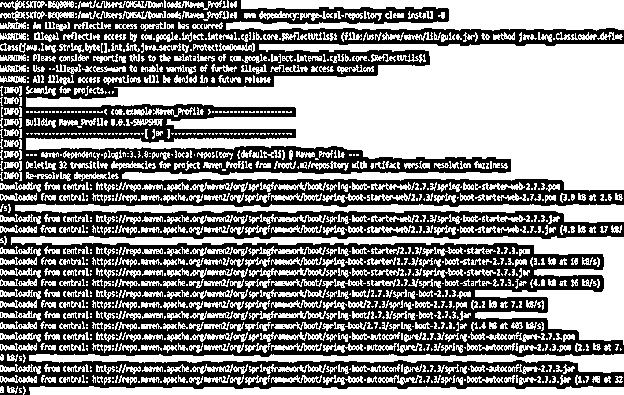


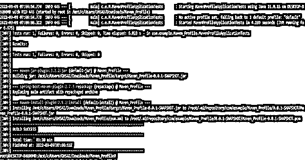


### Maven 强制更新项目命令行

Maven 命令行包含选项–U 或–update，通过使用所需的依赖项来更新快照。下面的步骤显示了使用项目命令行的 maven force 更新，如下所示。

*   在第一步中，我们使用–U 选项更新项目，方法是使用 clean install 命令，如下所示。

```
mvn clean install -U
```


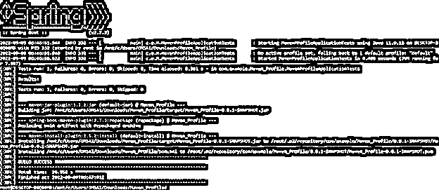


*   在第二步中，我们使用选项 as-update 更新快照，如下所示。

```
mvn clean install --update-snapshots
```

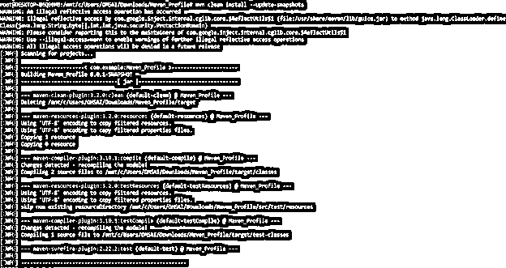


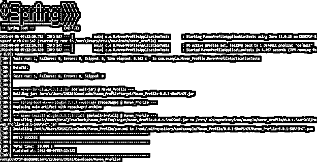


我们还可以通过更新本地存储库选项来更新插件目标，如下所示。

```
mvn dependency:purge-local-repository
```

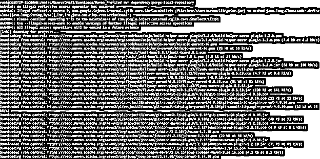


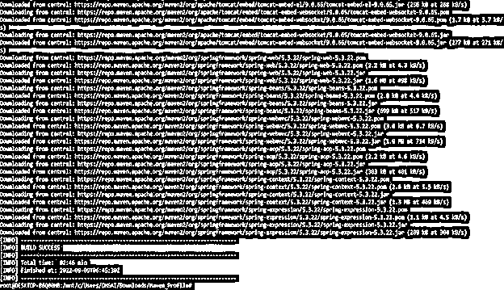


*   清理本地存储库后，我们运行以下命令来更新快照并释放依赖项，如下所示。

```
mvn dependency:purge-local-repository clean install
```

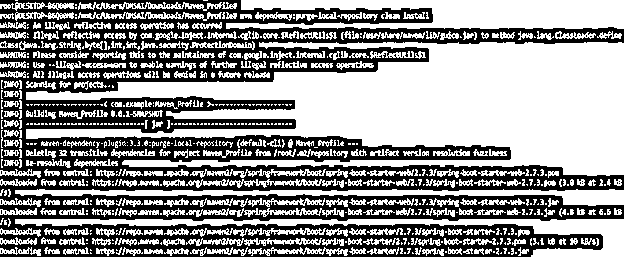


*   在以下示例中更新快照后，我们将更新用于解析目标的依赖关系，如下所示。

```
mvn dependency:resolve
```

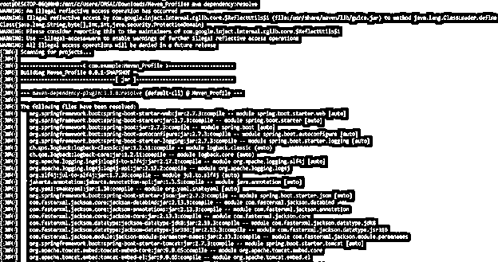


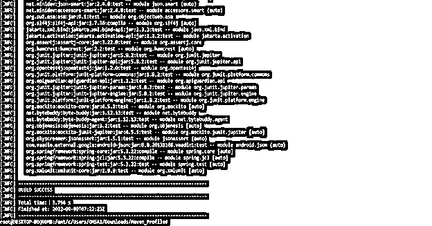


*   在下面的例子中，我们使用 mvn 命令更新单一依赖项，如下所示。

```
mvn dependency:get …
```

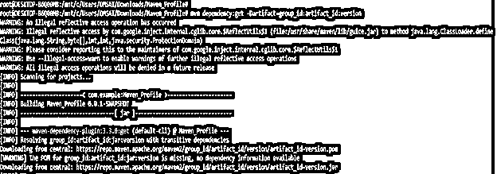


### Maven Force 更新 Eclipse

我们可以很容易地在 eclipse 中强制更新 maven 依赖项。下面的步骤展示了我们如何使用 eclipse 来更新它们。

*   第一步，我们使用 eclipse 打开 maven 项目，我们打开的项目名称是 maven_force_update。

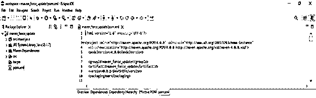


*   打开项目后，我们需要右键单击项目，右键单击项目后需要选择选项作为 maven，然后需要使用 eclipse 选择更新项目选项，如下所示。

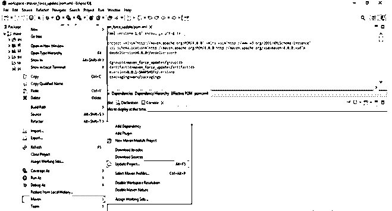


*   点击更新项目后，下面的窗口将出现，我们需要选择一个项目，我们正在更新如下。

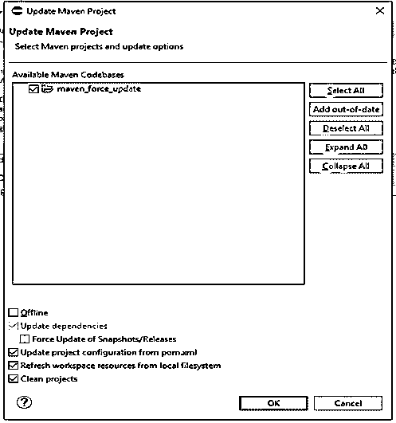


*   在点击 update project 之后，现在我们可以看到我们的项目将被更新为所需的依赖项，如下所示。

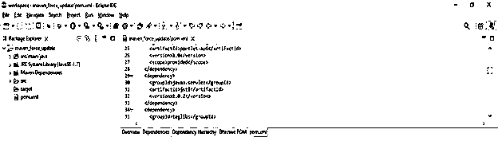


### Maven 强制更新不起作用

在某些情况下，在导入项目时，它将包含用于编译我们的代码的编译器设置，如果假设编译器设置没有正确配置，那么我们将遇到这种类型的问题。下面的消息显示编译失败，因为使用了一个内部 java 错误，如下所示。

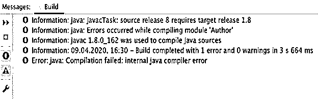


为了解决这个问题，我们需要挂起项目，并需要检查我们的项目设置如下。

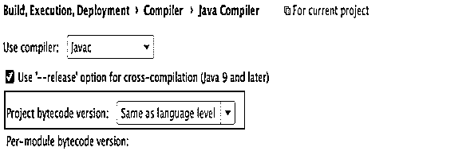


我们还可以更改 pom.xml 文件设置，以解决 maven 更新无法正常工作的问题，如下所示。

**代码:**

```
<plugin>
<groupId>org.apache.maven.plugins</groupId>
<artifactId>maven_force_update</artifactId>
<version> 2.3.0 </version>
<configuration>
<source> 1.7 </source>
<target> 1.7 </target>
<encoding> UTF-8 </encoding>
</configuration>
</plugin>
```

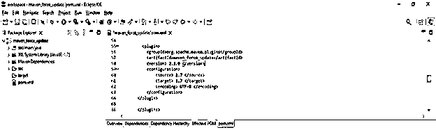


### 常见问题解答

下面是提到的常见问题:

#### Q1。maven force 更新在 maven 项目中有什么用？

**答:** Maven force update 用于强制更新运行我们项目所需的 Maven 的项目依赖项。

#### Q2。哪个命令用于强制更新 maven 依赖项？

**答:**我们正在使用带有–U 或–update 选项的 mvn clean install 命令来强制更新我们项目中所需的依赖项。

#### Q3。maven 中的依赖解析目标强制更新依赖有什么用？

**答:**maven 中的 Resolve goal 用于更新 maven 依赖项，更新快照，不使用 install 命令。

### 结论

maven force 更新间隔默认设置为每天，我们可以通过在 pom.xml 文件中配置更新策略来配置更新间隔。我们可以在 maven 中使用–U 选项，通过使用 mvn clean install 命令来强制更新。因为–U 表示强制更新快照的依赖项。

### 推荐文章

这是一个 Maven Force 更新的指南。这里我们讨论简介，以及如何使用 force option 更新 maven，并给出例子。您也可以看看以下文章，了解更多信息–

1.  [胃插件](https://www.educba.com/maven-plugins/)
2.  [智能胃](https://www.educba.com/intellij-maven/)
3.  [Maven 故障保护插件](https://www.educba.com/maven-failsafe-plugin/)
4.  [什么是 Maven？](https://www.educba.com/what-is-maven/)