# Maven 加密密码

> 原文：<https://www.educba.com/maven-encrypt-password/>

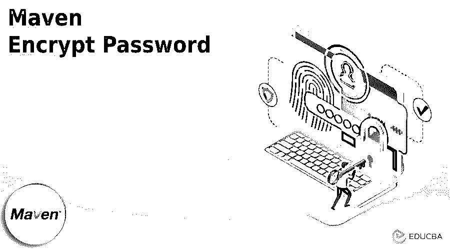


## Maven 加密密码简介

Maven encrypt password 用于加密密码，在使用 Maven 时，我们需要将软件部署到存储库中，以便与控制系统进行交互。我们可以从 maven 设置中连接密码的数量。该密码不包含任何加密机制。以纯文本格式恢复密码是有风险的，所以我们需要以加密格式存储它们。

Maven 2.1 版本在用户 Maven 设置中引入了加密密码功能。在 maven 中创建加密密码时，首先我们需要创建主密码，并将其存储到安全设置文件中。我们可以使用主密码对存储在 maven 设置中的密码进行加密。在说明该功能时，我们需要考虑在用户设置中显示的未加密服务器密码中检索 maven 的过程。用户使用 POM 项目标识符引用命名服务器。在我们寻找匹配服务器的元素时，Maven 正在寻找一个匹配 maven 设置的服务器。

<small>网页开发、编程语言、软件测试&其他</small>

### 关键要点

*   我们使用不同类型的命令在 maven 中创建加密密码。加密密码在每个应用中都很重要。
*   创建加密密码时，我们将其存储在 settings.xml 文件中。我们还使用安全文件来存储加密的密码。

### 如何加密 Maven 密码？

为了加密 maven 密码，我们需要创建并执行 maven 密码，如下所示。我们正在创建加密关键字的主密码，如下所示:

**代码:**

```
mvn --encrypt-master-password encrypt
```

**输出:**

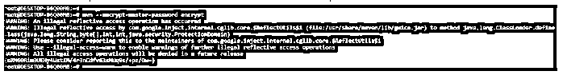


在上面的例子中，我们可以看到我们已经创建了主密码。现在，我们使用加密密码创建密码，如下所示。

**代码:**

```
mvn --encrypt-password encrypt
```

**输出:**

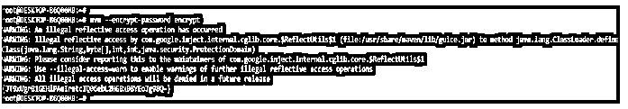


创建加密密码后，我们将它添加到 settings.xml 文件中，如下所示。

**代码:**

```
<server>
<id> encrypt.server </id>
<username> encrypt </user>
<password> {JT9xUgrB1GEHlPAeIretcIQ06ebL2HG8x08YEoJg98Q=} </password>
</server>
```

**输出:**


将密码添加到设置文件后，我们现在使用编辑后的文件部署应用程序，如下所示。

**代码:**

```
mvn deploy:deploy-file -Durl = https://encrypt_server.com/repo \ -DrepositoryId = encrypt.server \ -Dfile = artifact-1.0.jar \
```

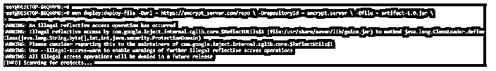


### 如何加密 Maven 密码并替换？

要在 maven 中加密密码，我们需要遵循以下步骤:

1.首先，我们需要使用 maven 方法创建加密的主密码。我们使用 maven 命令创建加密密码。为了创建一个加密的密码，我们需要使用下面的命令如下。我们创建 maven 关键字的主密码，如下所示。

**代码:**

```
mvn --encrypt-master-password maven
```

**输出:**

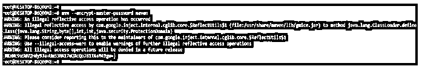


2.创建主密码后，我们现在将该密码存储在 settings-security.xml 文件中。我们将这个密码存储在主标签中。

**代码:**

```
<settingsSecurity>
<master> {RKxNc9aSWVQHdy9Ja+Um33NA17uQXcQoJ81TA+M49gw=} </master>
</settingsSecurity>
```

**输出:**


3.将密码存储在 settings-security.xml 文件中后，现在我们可以使用以下命令开始加密服务器密码。在下面的例子中，我们使用上面的文件创建加密的密码。

**代码:**

```
mvn --encrypt-password maven
```

**输出:**

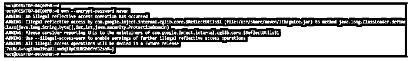


4.从 settings-security.xml 文件创建加密的密码后，在这一步中，我们将此密码添加到服务器部分的 settings xml 文件中，如下所示。我们需要添加以下代码来加密密码，如下所示。

**代码:**

```
<server>
<id> maven.server </id>
<username> maven </user>
<password> {7oUkLA+nugEHanl9zqNlLnm8qI8pCiUNSh06YfB2sbM=} </password>
</server>
```

**输出:**


5.在将 settings.xml 文件中的任何密码放入花括号外之后，该密码仍然如下工作。

**代码:**

```
<server>
<id> maven.server </id>
<username> maven </user>
<password> maven encrypt password {7oUkLA+nugEHanl9zqNlLnm8qI8pCiUNSh06YfB2sbM=} </password>
</server>
```

**输出:**

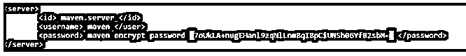


6.将密码添加到 settings.xml 文件后，我们现在部署该文件。在下面的例子中，我们将它部署到我们的项目中。

**代码:**

```
mvn deploy:deploy-file -Durl = https://maven_server.com/repo \ -DrepositoryId = maven.server \ -Dfile = artifact-1.0.jar \
```

**输出:**

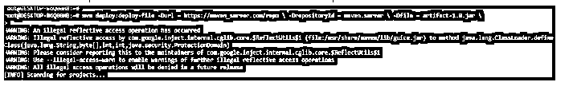


### Maven 加密密码安全. xml 文件

maven encrypt security.xml 文件用于存储加密的密码。该文件用于存储加密的密码。我们存储从 maven encrypt 命令生成的加密密码，如下所示。要编辑 security.xml 文件并添加加密密码，我们首先需要创建主密码。在下面的例子中，我们按如下方式创建主密码。

**代码:**

```
mvn --encrypt-master-password security
```

**输出:**

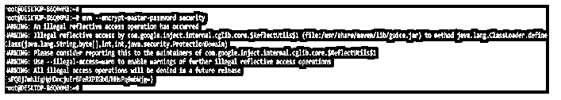


创建主密码后，我们将它添加到 security.xml 文件中。该密码以加密格式存储。此外，security.xml 文件是隐藏的。

**代码:**

```
<settingsSecurity>
<master> {sPQ8j7mhligHgHDncjuErBFeRXPIGb0/HHsPq0mbWjg=} </master>
</settingsSecurity>
```

**输出:**

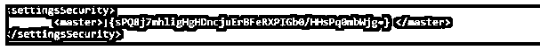


### 提示和技巧

Maven 用于支持加密密码。为了配置加密密码，我们需要通过运行以下命令来创建主密码，如下所示。

在下面的示例中，我们使用命令创建加密密码。

**代码:**

```
mvn -emp tips_tricks
```

**输出:**

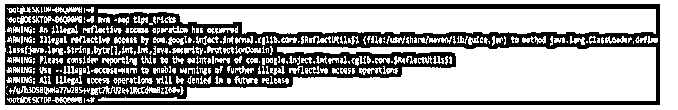


在下面的例子中，我们使用 maven 命令创建加密密码。我们对 tips_tricks 的密码加密如下。

**代码:**

```
mvn --encrypt-master-password tips_tricks
```

**输出:**

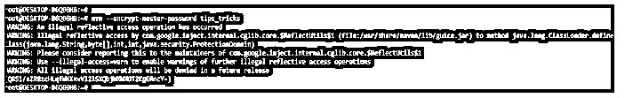


在下面的示例中，我们通过将选项定义为 ep 参数来创建加密密码..

**代码:**

```
mvn -ep tips_tricks
```

**输出:**


### 例子

下面是提到的例子:

#### 示例#1

在下面的示例中，我们使用 encrypt password 命令创建 maven 加密密码，如下所示。

**代码:**

```
mvn --encrypt-master-password maven_encrypt
```

**输出:**

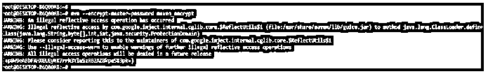


#### 实施例 2

在下面的示例中，我们将这个密码添加到 settings.xml 文件中，以便在 maven 应用程序中使用，如下所示。

**代码:**

```
<server>
<id> encrypt.server </id>
<username> maven_encrypt </user>
<password> {+p8W9eABbFAHXELEyNK7rrh3YlwSzRB2AZ8kpe583pk=} </password>
</server>
```

**输出:**


#### 实施例 3

在下面的例子中，我们将相同的加密密码部署到我们的应用程序中，如下所示。

**代码:**

```
mvn deploy:deploy-file -Durl = https://encrypt.com/repo \ -DrepositoryId = encrypt.server \ -Dfile = artifact-1.0.jar \
```

**输出:**

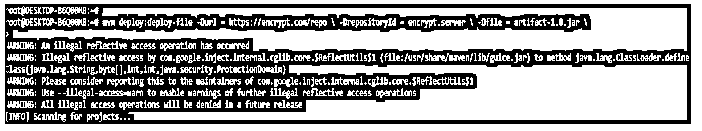


#### 实施例 4

在下面的示例中，我们使用 maven 命令和–EP 参数创建加密密码，如下所示。

**代码:**

```
mvn -ep maven_encrypt
```

**输出:**

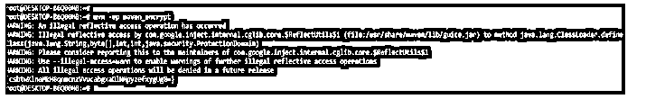


### 常见问题解答

下面是提到的常见问题:

#### Q1。maven 加密密码在 maven 应用中有什么用？

**回答:**众所周知，以明文格式存储密码存在风险，而以加密格式存储密码可以最大限度地降低安全风险。

#### Q2。maven 加密密码中 security.xml 文件有什么用？

**回答:**我们使用 security.xml 文件以加密格式存储密码。此文件是隐藏的，任何其他用户都不能访问此文件。

#### Q3。settings.xml 文件在里面有什么用？

**回答:**settings . XML 文件用于存储我们在 maven 应用程序中使用的用户信息。

### 结论

我们使用主密码对存储在 maven 设置中的密码进行加密。它用于加密密码，在开始使用 maven 时，我们需要将软件部署到存储库中，以便与控制系统进行交互。

### 推荐文章

这是一个 Maven 加密密码的指南。这里我们讨论一下入门，如何加密 maven 密码和替换？security.xml 文件、提示和技巧。您也可以看看以下文章，了解更多信息–

1.  [Maven 构建命令](https://www.educba.com/maven-build-command/)
2.  [Maven 战争插件](https://www.educba.com/maven-war-plugin/)
3.  [Maven 简介](https://www.educba.com/maven-profile/)
4.  [Maven 版本](https://www.educba.com/maven-versions/)