# 阿塞拉胃

> 原文：<https://www.educba.com/assertj-maven/>

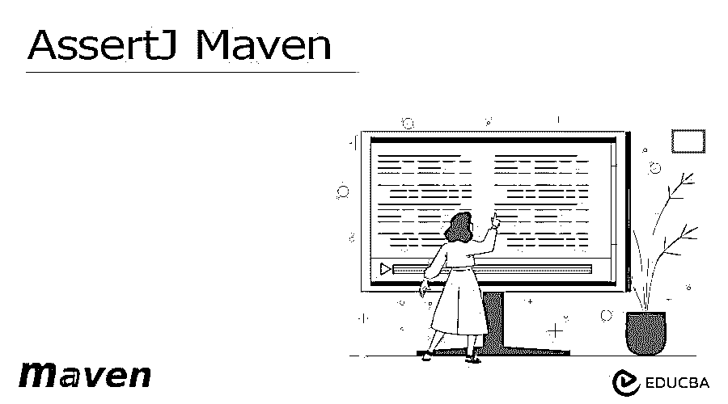


## AssertJ Maven 简介

AssertJ maven 是一个中央存储库，它提供了一组用于单元测试的直观而丰富的断言。maven assertj 的目标是提供单元测试。这种想法只不过是处理特定于单元测试中检查的对象类型的断言。如果假设我们正在检查字符串值，那么我们可以使用特定于字符串的断言。

为了检查映射值，我们使用特定于映射的断言来轻松检查映射的断言。assertj 断言非常容易使用，我们需要使用代码完成来显示可用的断言。Maven assertj 由在 Maven 断言中定义的几个模块组成。

<small>网页开发、编程语言、软件测试&其他</small>

maven 核心模块为 Jdk 类型提供断言，比如 iterable、string、path、file 和 stream。guava 模块提供了像 optional 和 multimap 这样的 guava 类型的断言。joda 时间模块提供 joda 类型的断言，如日期时间和本地日期时间。neo4j 模块提供 neo4j 类型的断言，如节点、路径和关系。

### 关键要点

*   为了编写一个 maven 断言，我们需要开始将对象传递给断言的方法，并且需要遵循指定的断言，这是实际的。
*   在使用它的时候，我们需要在 pom.xml 文件中添加 assertj 依赖项。

### 如何设置？

下面的步骤显示了我们如何设置如下。在下面的例子中，我们如下创建 assertj_maven 的项目。

1.在这一步中，我们使用 spring 初始化器创建 maven_test 项目。下面我们将项目的名称命名为 assertj_maven。

组名–com . example

工件–assertj _ maven

名称–assertj _ maven

包装–罐子

Java 版本–8

语言–Java

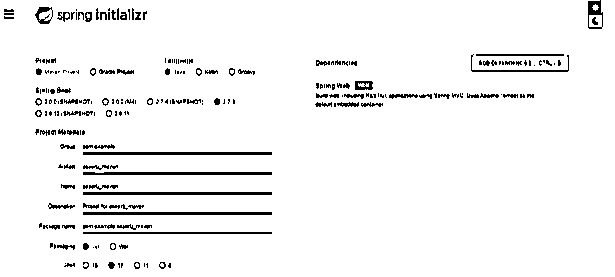


2.第二步，我们使用 spring 工具套件打开 maven assertj 项目的项目模板。

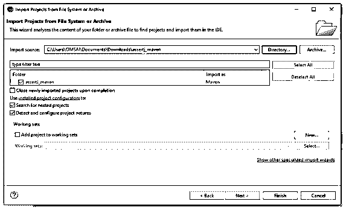


3.打开 maven assertj 项目后，在下面的例子中我们可以看到我们正在检查项目的结构。

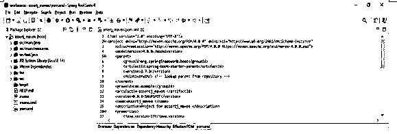


4.在检查了项目的结构之后，在这一步中，我们将在 maven 项目中添加 assertj 依赖项。

**代码:**

```
<dependency>
<groupId> org.assertj </groupId>
<artifactId> assertj-core </artifactId>
<version> 3.4.1 </version>
<scope> assertj </scope>
</dependency>
```

**输出:**

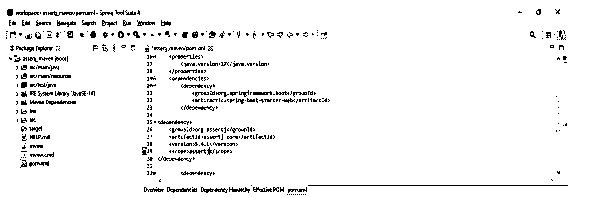


5.添加完依赖项后，我们现在正在创建定义 assertj maven 的类。

**代码:**

```
@DisplayName("Assertions bool")
class assertj {
@Nested
@DisplayName("boolean true")
class assertj1 {
   @Test
   @DisplayName("its true")
   void assertj2() {
   assertThat(true).isTrue();
   }  }
 }
```

**输出:**

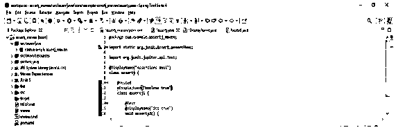


6.现在，在这一步中，我们通过使用 maven 测试来运行项目。

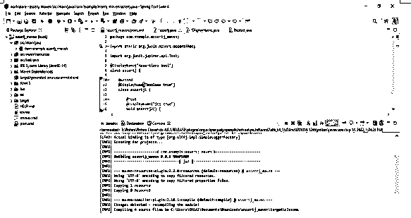


### AssertJ Maven 字符

字符类型断言涉及到用于从 Unicode 表中检查给定字符的比较。下面是一个断言的例子，它检查提供的字符不是 a 或者它小于 b，它用小写字母定义如下。

**代码:**

```
@DisplayName("Assertions bool")
class assertj {
@Nested
@DisplayName("boolean true")
class assertj1 {
@Test
@DisplayName("its true")
void assertj2() {
assertThat(char)
   .isNotEqualTo('a')
   .inUnicode()
   . islessThanOrEqualTo('b')
   .isLowerCase();
  } }
}
```

**输出:**

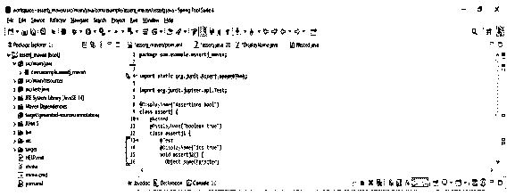


上面的例子表明我们已经提供了 a 和 b 字符的比较，所以在下面的例子中我们运行 maven assertj 测试如下。

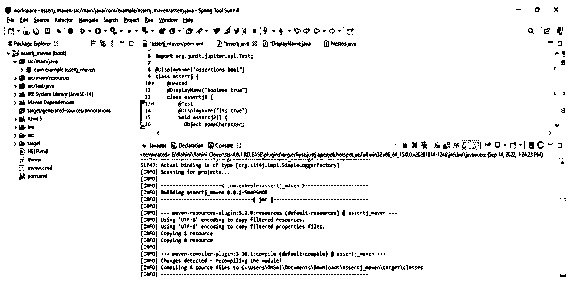


### AssertJ Maven 类

断言类类型只不过是检查字段、存在、类类型和通知类终结性的存在。如果假设我们需要使用接口断言可运行的类，那么我们需要编写如下的类。

**代码:**

```
class assertj {
@Nested
class assertj1 {
@Test
void assertj2() {
assertThat (….);
   } }
}
```

**输出:**

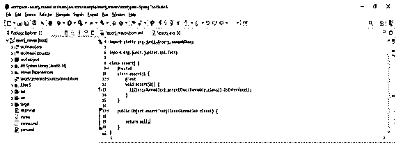


假设我们想检查一个可以从其他类赋值的类，那么我们使用下面的例子。

**代码:**

```
class assertj {
@Nested
class assertj1 {
@Test
void assertj2() {
assertThat (…);
   } }
}
```

**输出:**

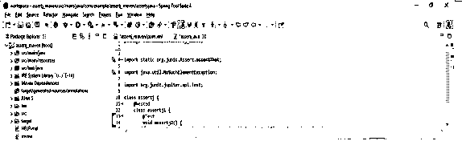


在上面的两个例子中，我们定义了 with class，在下面的例子中我们运行 assertj 测试。

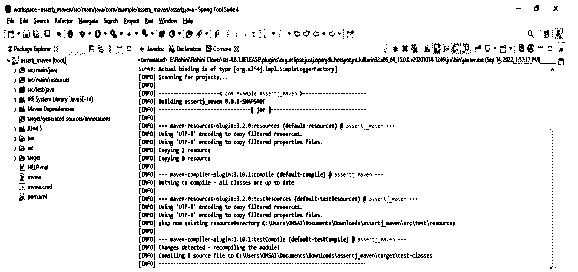


### AssertJ Maven 地图

Maven 映射断言将允许我们检查包含条目、键、值和映射断言中定义的条目集的映射。下面的例子显示了 maven map 断言，它检查给定的 map 不为空，并且它将包含作为 5 的数字键，它将不包含作为 15 的数字键，并且它将包含作为 5 的键和值作为 p。

**代码:**

```
class assertj {
@Nested
class assertj1 {
@Test
void assertj2() {
assertThat(map)
  .isNotEmpty()
  .containsKey(5)
  .doesNotContainKeys(15)
  .contains(entry(5, "p"));
  } }
}
```

**输出:**

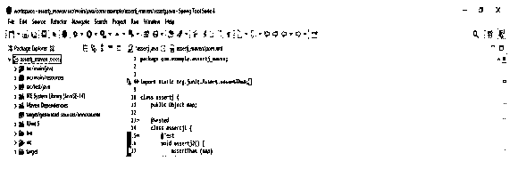


在上面的例子中，我们定义了 with map，在下面的例子中，我们运行 assertj 测试，如下所示。

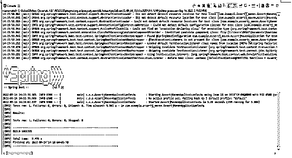


### AssertJ Maven 文件

Maven 文件断言就是检查文件实例是否存在。它包含目录中的文件。文件包含可读文件或包含指定的扩展名。下面是 maven 断言文件的例子，它检查给定的文件是否存在于指定的目录中。

**代码:**

```
class assertj {
@Nested
class assertj1 {
@Test
void assertj2() {
assertThat(assert_file)
   .exists()
   .isFile()
   .canRead()
   .canWrite();
  } }
}
```

**输出:**

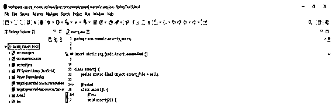


在上面的例子中，我们定义了 with file，在下面的例子中，我们运行 assertj 测试，如下所示。

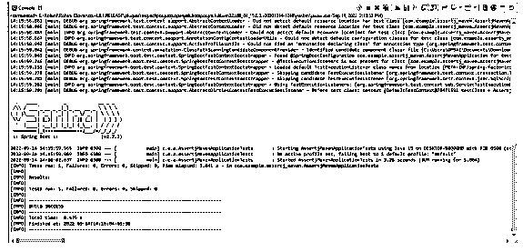


### 常见问题解答

下面是提到的常见问题:

#### Q1。assertj maven 有什么用？

**答:**它是一个中央存储库，提供了一组在单元测试中使用的直观而丰富的断言。

#### Q2。maven assertj 中有哪些字符断言？

**答:**字符类型断言涉及比较，这些比较从包含 Unicode 的表中检查字符。我们需要在 assertj maven 中定义指定的字符。

#### Q3。maven assertj 中的可迭代数组断言是什么？

**答** : Iterable 数组包含多种方式来断言存在的上下文。最常见的断言是 array 包含 iterable 元素。

### 结论

assertj maven neo4j 模块提供 neo4j 类型的断言，如节点。Maven assertj 断言非常容易使用，我们需要使用代码完成来显示可用的断言。Maven assertj 由 Maven 断言中定义的几个模块组成。

### 推荐文章

这是一个 AssertJ Maven 的指南。这里我们讨论一下简介、角色、职业、地图和文件。您也可以看看以下文章，了解更多信息–

1.  [Maven 构建命令](https://www.educba.com/maven-build-command/)
2.  [Maven 战争插件](https://www.educba.com/maven-war-plugin/)
3.  [Maven 简介](https://www.educba.com/maven-profile/)
4.  [Maven 版本](https://www.educba.com/maven-versions/)