# Maven 安装依赖项

> 原文：<https://www.educba.com/maven-install-dependencies/>


## Maven 安装依赖项介绍

Maven 项目中需要 maven 安装依赖项。Maven 包含了一个很好的机制，通过使用简单的 XML 元素来描述我们项目中的依赖关系。maven 的 pom.xml 文件用于下载依赖项。maven 在对编译器可用的直接依赖类进行代码编译时使用已安装的依赖项。运行 Maven 的项目需要 maven 依赖项。

### 关键要点

*   基本上，在 maven 中有两种类型的依赖可用，即传递和直接。直接依赖项只不过是明确包含在项目中的。
*   传递依赖项是直接依赖项中必需的，maven 自动包含在指定项目中传递的必需依赖项中。

### Maven 安装依赖项概述

为了安装 maven 的依赖项，我们需要执行 mvn dependency 命令来安装所有的依赖项。我们可以使用 maven 依赖插件来下载依赖项。我们可以通过设置输出目录的属性来更改目标位置。我们正在运行带有复制依赖项的 mvn 依赖项，以便下载所有依赖项。

<small>网页开发、编程语言、软件测试&其他</small>

我们还可以使用 intellij 思想在我们的项目中添加 maven 依赖项。Maven 很容易在我们的项目中包含第三方依赖项，这相当于 PHP 或 ruby 等其他语言。通过使用 maven，我们可以用这些类构建 java 项目。Maven 将期待来自 java 源代码的目录结构。

### 如何下载 Maven 安装依赖？

以下步骤显示了我们如何下载 maven 安装依赖项，如下所示:

1.在下载 maven 安装依赖项时，我们使用 spring 初始化器创建了项目的模板。下面我们使用 spring 初始化器创建 maven 安装依赖项的模板。

group Name–com . example
工件–maven _ dependencies
名称–maven _ dependencies
打包–jar
Java 版本–8
语言–Java

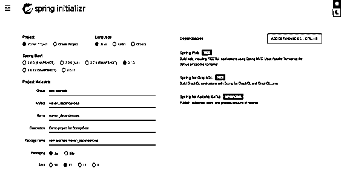


现在创建了 maven install dependencies 到 spring initializer 的模板后，我们需要下载并提取项目模板。

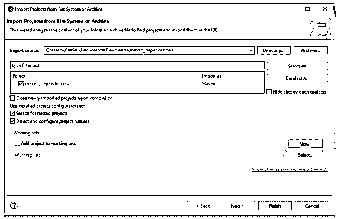


2.在这一步中，我们将检查项目结构和 pom.xml 文件。项目结构如下。

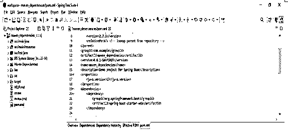


3.在下面的例子中，我们将项目中需要的 maven 依赖项添加到 pom.xml 文件中，如下所示。

**代码:**

```
<dependency>
  <groupId> org.springframework.boot </groupId>
  <artifactId> spring-boot-starter-web </artifactId>
</dependency>
<dependency>
  <groupId> org.springframework.boot </groupId>
  <artifactId> spring-boot-starter-test </artifactId>
<scope> test </scope>
</dependency>
<dependency>
  <groupId> junit </groupId>
  <artifactId> junit </artifactId>
  <version> 4.12 </version>
  <scope> test </scope>
</dependency>
```

**输出:**

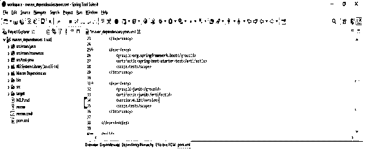


4.在下面的例子中添加了依赖项之后，我们打开了 pom.xml 文件所在的终端。打开终端后，我们执行如下命令。

**代码:**

```
mvn dependency:copy-dependencies
```

**输出:**

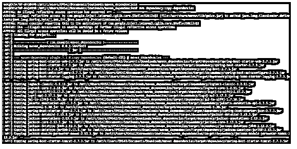


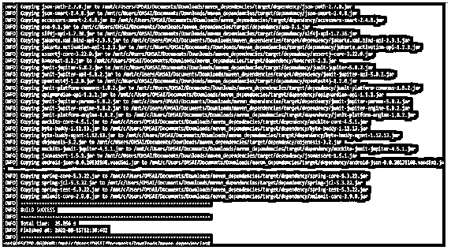


5.在上面的例子中，我们可以看到所有的依赖项都被下载并复制到目标文件夹中。执行上述命令后，我们可以看到所有的依赖项都被安装到了目标/依赖项文件夹中。在下面的例子中，我们可以看到所有的依赖项都被下载到指定的文件夹中，如下所示。

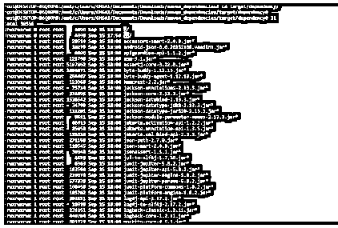


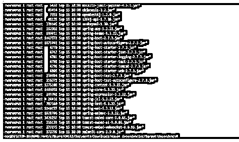


### 如何为 Maven 安装依赖项？

在下面的例子中，我们正在为 maven 安装 junit 依赖项，如下所示。为了安装 junit 依赖项，我们需要将依赖项添加到 pom.xml 文件中。我们将 junit 依赖项添加到 pom.xml 文件中，如下所示。

**代码:**

```
<dependency>
  <groupId> junit </groupId>
  <artifactId> junit-maven </artifactId>
  <version> 4.12 </version>
  <scope> maven-test </scope>
</dependency>
```

**输出:**

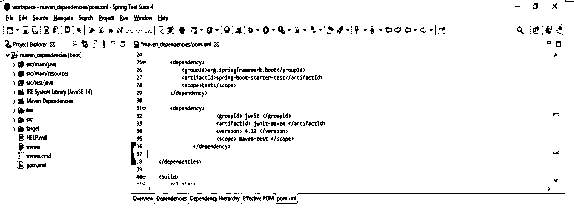


添加完依赖项后，我们执行下面的命令来安装 maven 的依赖项，如下所示。首先，它将下载依赖项，然后将所有依赖项复制到指定的目录。

**代码:**

```
mvn dependency:copy-dependencies
```

**输出:**

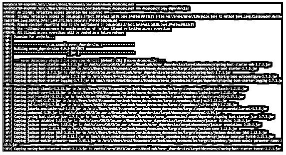


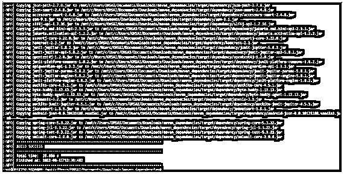


在下面的例子中，我们将依赖项下载并安装到指定的位置。我们可以看到，我们正在/mnt/c/dependency 位置下载依赖项，如下所示。

**代码:**

```
mvn dependency:copy-dependencies –DoutputDirectory = /mnt/c/dependency
```

**输出:**

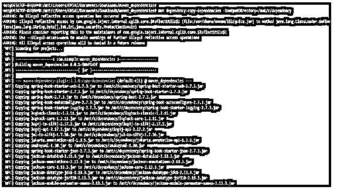


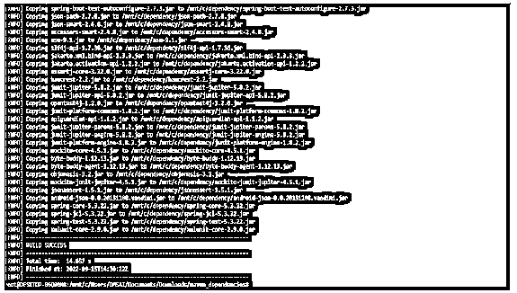


下载并安装依赖项后，我们可以检查生成依赖项文件的指定位置，如下所示。

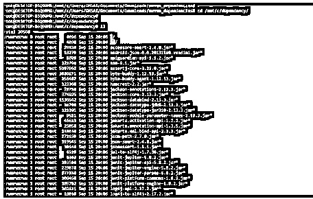


### 范围的 Maven 依赖项

依赖范围帮助我们限制传递依赖。它正在修改不同任务构建的类路径。下面是默认范围，没有提供其他范围。

**代码:**

```
<dependency>
  <groupId> commons-lang </groupId>
  <artifactId> commons-lang </artifactId>
  <version> 2.6 </version>
</dependency>
```

**输出:**

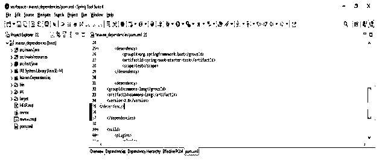


提供的作用域用于标记由 JDK 的容器在运行时提供的依赖关系。以下是所提供范围的示例。

**代码:**

```
<dependency>
  <groupId> javax.servlet </groupId>
  <artifactId> javax.servlet-api </artifactId>
  <version> 4.0.1 </version>
  <scope> provided </scope>
</dependency>
```

**输出:**

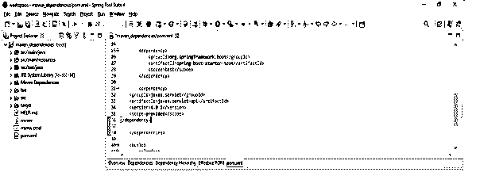


运行时需要运行时范围的依赖项。但是我们在编译时并不需要这样做，如下所示。

**代码:**

```
<dependency>
  <groupId> mysql </groupId>
  <artifactId> mysql-connector-java </artifactId>
  <version> 8.0.28 </version>
  <scope> runtime </scope>
</dependency>
```

**输出:**

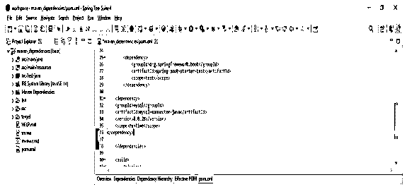


我们使用测试范围来表明在运行时不需要指定的依赖关系。

**代码:**

```
<dependency>
  <groupId> junit </groupId>
  <artifactId> junit </artifactId>
  <version> 4.12 </version>
  <scope> test </scope>
</dependency>
```

**输出:**

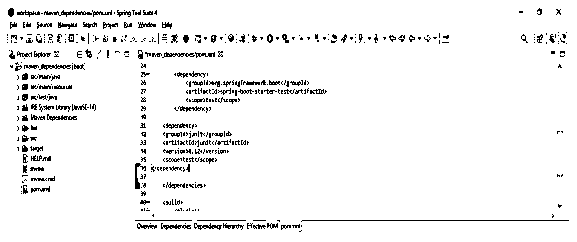


系统的范围与提供的范围相似。系统范围需要一个直接点。

**代码:**

```
<dependency>
  <groupId> com.baeldung </groupId>
  <artifactId> custom-dependency </artifactId>
  <version> 1.3.2 </version>
  <scope> system </scope>
  ……
</dependency>
```

**输出:**

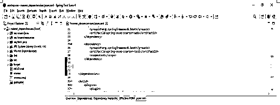


### 导入 Maven 依赖项

Import 将指示依赖项将被 POM 中声明的有效依赖项替换。在下面的示例中，我们将替换 pom.xml 文件中的自定义项目依赖项。

**代码:**

```
<dependency>
  <groupId> com.baeldung </groupId>
  <artifactId> custom-project </artifactId>
  <version> 1.3.2 </version>
  <type> pom </type>
  <scope> import </scope>
</dependency>
```

**输出:**

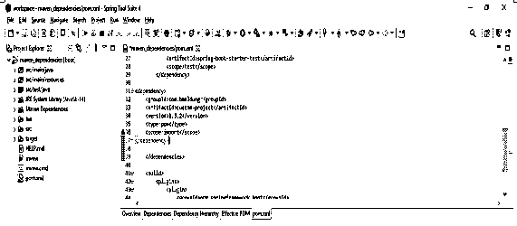


添加完依赖项后，我们需要进入项目文件夹，并执行 mvn clean install 命令来导入我们已经添加的依赖项。在下面的例子中，我们从命令行运行这个命令。

**代码:**

```
mvn clean install
```

**输出:**

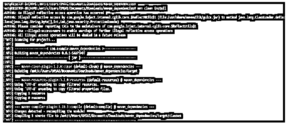


在下面的例子中，我们使用 spring 工具套件导入 maven 依赖项。

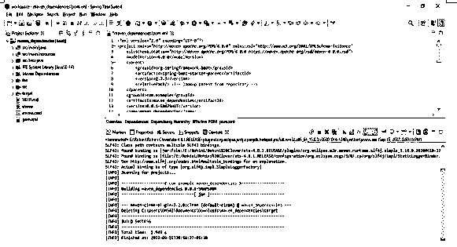


### 结论

为了安装 maven 的依赖项，我们需要执行 mvn dependency 命令来安装所有的依赖项。Maven 包含了一个很好的机制，通过使用简单的 XML 元素来描述我们项目中的依赖关系。maven 的 pom.xml 文件用于下载依赖项。

### 推荐文章

这是 Maven 安装依赖项的指南。这里我们讨论介绍，以及如何下载 maven 安装依赖项。和 maven 对范围的依赖性。您也可以看看以下文章，了解更多信息–

1.  [Maven 构建命令](https://www.educba.com/maven-build-command/)
2.  [Maven 战争插件](https://www.educba.com/maven-war-plugin/)
3.  [Maven 简介](https://www.educba.com/maven-profile/)
4.  [Maven 版本](https://www.educba.com/maven-versions/)


