# Maven XMLBeans

> 原文：<https://www.educba.com/maven-xmlbeans/>

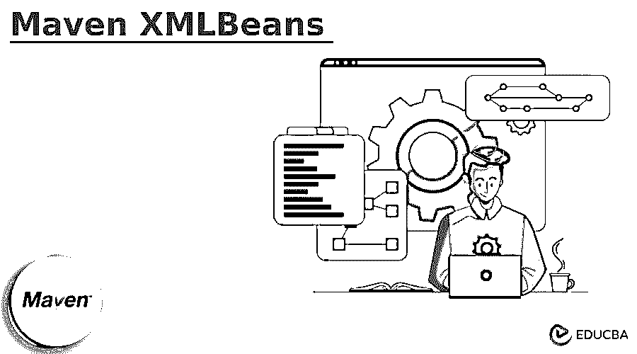


## Maven XMLBeans 简介

Maven xmlbeans 是 Maven 插件构件的一部分，它是从 XML bean 5.0 开始的。Maven xml beans 是一种用于在绑定 java 类型时访问 xml 的技术。Maven xmlbeans 提供了几种获取 xml 的方法。使用为生成 java 类型而编译的 xml 模式表示 maven 中定义的模式类型。

### 关键要点

*   Maven xmlbeans 只不过是用来访问 xml 全部功能的工具。xmlBeans 使用用于编译 java 接口的 XML 模式。
*   通过使用 xml beans，java 接口和类被用来访问和修改实例数据。

### Maven XMLBeans 是什么？

在创建 java 类型时，我们可以通过使用 java beans 样式的访问器 set foo 和 set foo 来访问 schema 的实例。xml beans 的 API 允许我们通过使用 xml 模式对象的模型来反映 xml 模式本身。光标的模型将遍历完整信息集的 xml。Maven xml beans 支持 xml DOM。要使用 maven xmlbeans，我们需要将 xmlbeans 插件添加到 pom.xml 配置文件中。

<small>网页开发、编程语言、软件测试&其他</small>

一个 maven xml beans 插件正在解析 xsd 文件，并基于 apache xml beans 的解析器生成相应的对象模型。maven 插件产生两组由生成的源和类引用的输出文件。前者被编译到输出编译目录中。maven xml beans 是一个允许访问 xml java 的工具。

### Maven XMLBeans 的使用

下面给出了 maven xmlbeans 的项目模板:

1.在使用项目模板的同时，我们也在分配项目的细节。

group Name–com . example
工件–maven _ xmlbeans
名称–maven _ xmlbeans
打包–jar
Java 版本–8
语言–Java

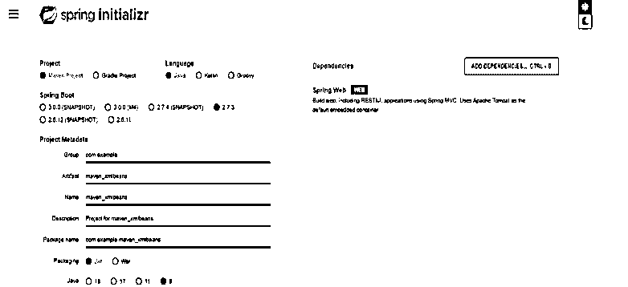


2.在这一步中，我们下载并提取项目，并使用 spring 工具套件打开它。

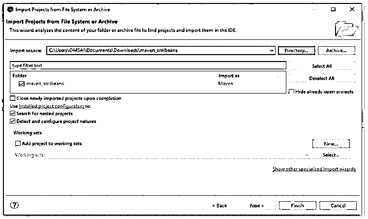


3.在这一步中，我们将检查 maven xmlbeans 项目的项目结构，并检查 pom.xml 文件。

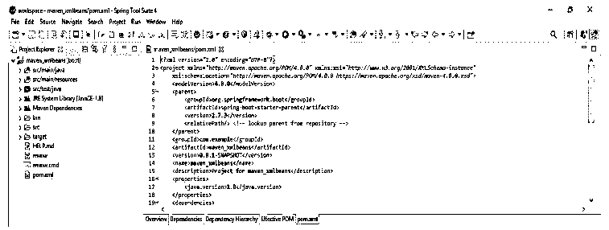


4.在 spring 工具套件中打开项目后，在这一步中，我们将在 pom.xml 文件中添加 xml beans 依赖项。我们正在 pom.xml 文件中添加这个依赖项。

**代码:**

```
<dependency>
  <groupId> org.apache.xmlbeans </groupId>
  <artifactId> xmlbeans </artifactId>
  <version> 2.3.0 </version>
</dependency>
```

**输出:**

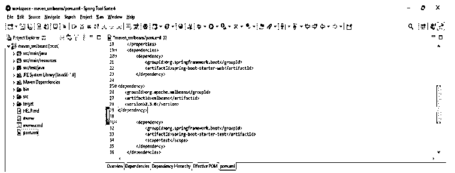


5.添加完依赖项后，我们现在执行 maven test 命令来运行项目的测试，如下所示。我们使用 GUI 终端执行测试，如下所示。

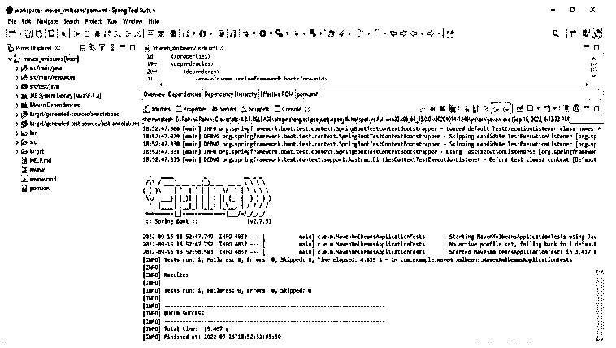


### Maven XMLBeans 插件

xml beans 的源文件是使用 basedir 生成的。类型 system holder 的类是通过使用 basedir 资源生成的。生成的资源和源被添加到项目资源中。

下面的例子展示了我们如何将 maven xml beans 插件添加到 maven 中。我们正在 pom.xml 文件中添加 maven xml beans 插件。

**代码:**

```
<plugin>
<groupId> org.codehaus.mojo </groupId>
<artifactId> xmlbeans-maven-plugin </artifactId>
<version> 2.3.3 </version>
<executions>
<execution>
<goals>
<goal> xmlbeans </goal>
</goals>
</execution>
</executions>
<configuration>
<schemaDirectory> path </schemaDirectory>
<xmlConfigs>
<xmlConfig implementation = "java.io.File">
path
</xmlConfig>
</xmlConfigs>
<noUpa> false </noUpa>
<sourceGenerationDirectory>
   path
</sourceGenerationDirectory>
  </configuration>
</plugin>
```

**输出:**

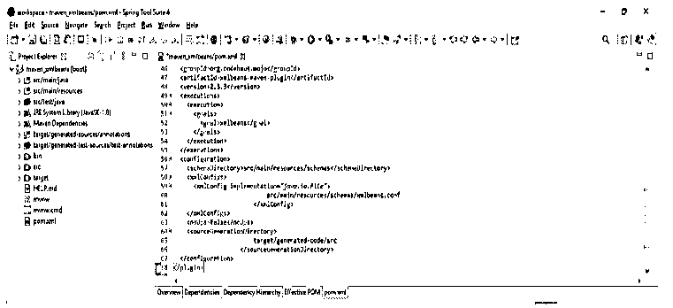


将 maven xml beans 的插件添加到 pom.xml 文件后。在这一步中，我们使用 maven test 命令运行 maven 应用程序，如下所示。在下面的例子中，我们使用 spring 工具套件来运行应用程序，如下所示。

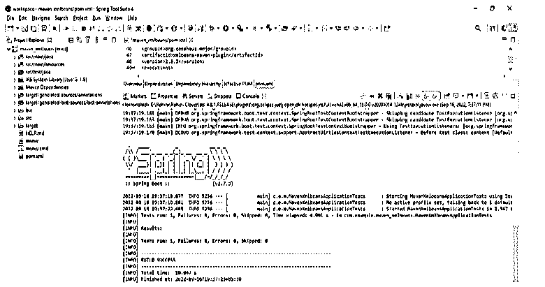


### Maven XMLBeans 配置文件

Maven xml beans 配置文件使用特殊的编译器将 xml 模式转换成我们定义的用于访问 xml 元素和其他内容的 java 类。通过使用 xml 模式，java 类的编译器是将我们的模式和编译器放到单独的 jar 文件中的最接近的方法。我们可以混合所有这些代码。为了创建 maven xmlbeans 配置文件，我们需要将插件代码添加到 pom.xml 文件中。在下面的例子中，我们在 pom.xml 文件中添加代码，如下所示。

**代码:**

```
<plugin>
<groupId> org.codehaus.mojo </groupId>
<artifactId> xmlbeans-maven-plugin </artifactId>
<version> 2.3.3 </version>
<configuration>
<schemaDirectory> configuration dir path </schemaDirectory>
<xmlConfigs>
<xmlConfig implementation="java.io.File">
  Configuration file path
</xmlConfig>
</xmlConfigs>
<noUpa> false </noUpa>
<sourceGenerationDirectory>
  Configuration file directory.
</sourceGenerationDirectory>
</configuration>
</plugin>
```

**输出:**


pom.xml 文件在 maven xml beans 中作为配置文件工作。我们正在配置存储实际文件的配置文件路径和配置文件的文件目录。

在配置了下例中的文件后，我们正在运行已经添加到 pom.xml 文件中的配置文件。

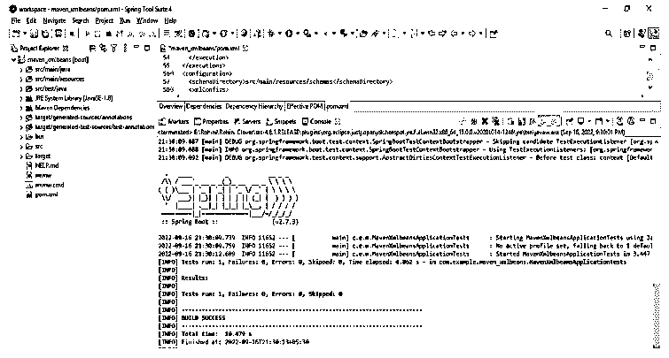


### Maven XMLBeans 的示例

下面的例子展示了如何将 maven xmlbeans 依赖项添加到 maven 的项目中。我们将依赖项添加到 pom.xml 文件中，如下所示。我们将在 pom.xml 文件的 dependency 部分添加这个依赖项。

**代码:**

```
<dependency>
  <groupId> org.apache.xmlbeans </groupId>
  <artifactId> xmlbeans </artifactId>
  <version> 2.3.0 </version>
</dependency>
```

**输出:**

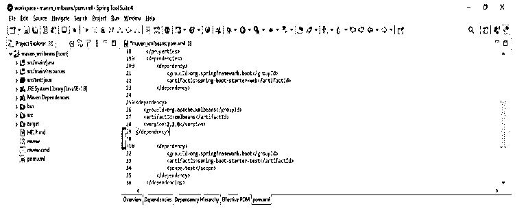


将配置添加到 pom.xml 文件后，我们现在测试 maven 项目。在下面的例子中，我们使用的是 spring 工具套件 GUI。

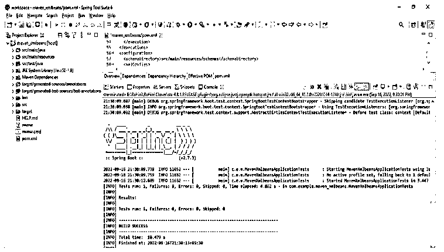


在 pom.xml 文件中添加配置之后，我们现在测试 maven 项目，如下所示。在下面的例子中，我们使用命令行。

**代码:**

```
mvn test
```

**输出:**

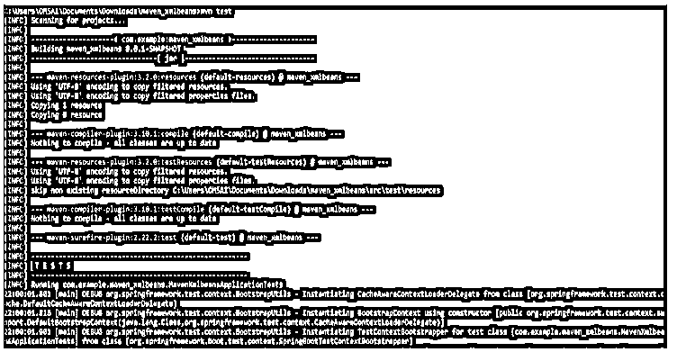


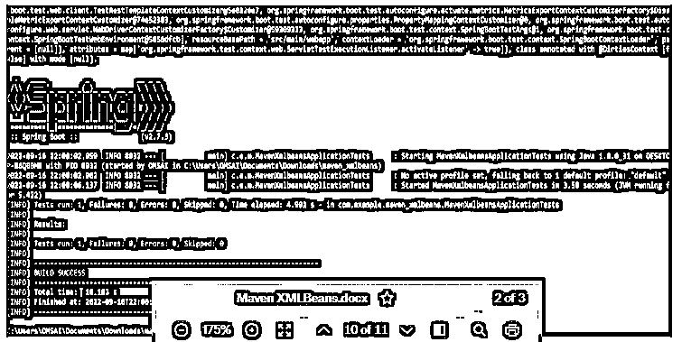


### 结论

通过使用为生成 java 类型而编译的 xml schema，这些 Java 类型表示 maven 中定义的模式类型。Maven xml beans 支持 xml DOM。要使用 maven xmlbeans，我们需要在 pom.xml 配置文件中添加 xmlbeans 插件。

### 推荐文章

这是 Maven XMLBeans 的指南。这里我们讨论介绍，maven XMLBeans 的使用，插件，配置文件，以及例子。您也可以看看以下文章，了解更多信息–

1.  [Maven kafka-clients](https://www.educba.com/maven-kafka-clients/)
2.  [Maven 安装依赖关系](https://www.educba.com/maven-install-dependencies/)
3.  [Maven 运行单项测试](https://www.educba.com/maven-run-single-test/)
4.  [Maven 快速入门原型](https://www.educba.com/maven-quickstart-archetype/)


