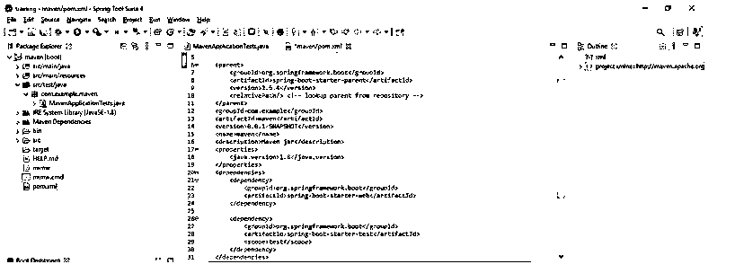
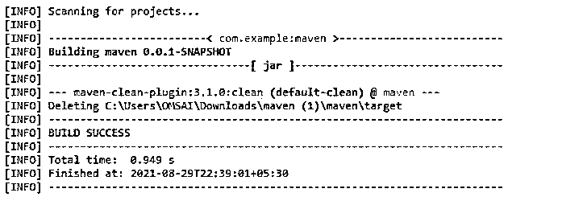
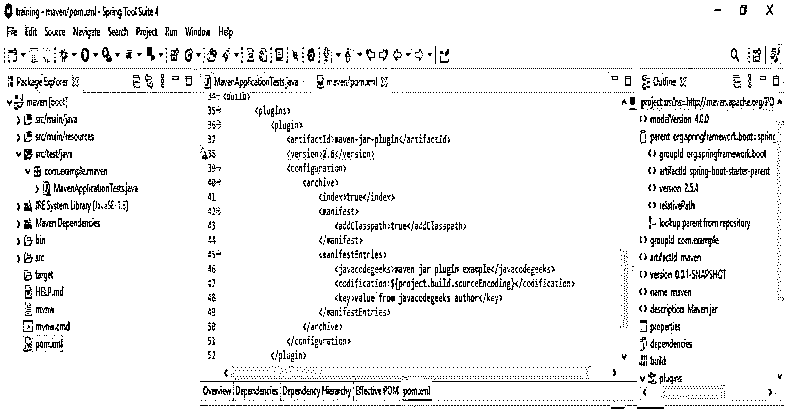
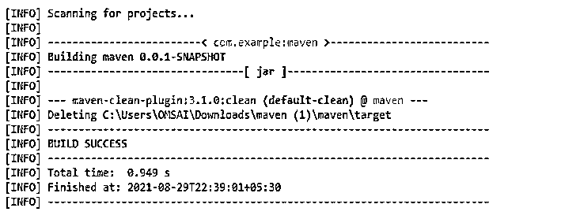

# Maven Jar 插件

> 原文：<https://www.educba.com/maven-jar-plugin/>

## Maven Jar 插件简介

Maven jar 插件用于构建 jar 文件，如果我们将我们的项目定义为 jar 文件，maven jar 项目将隐式调用它。我们不需要在 pom.xml 文件中定义它，这将在 maven 需要时下载。我们还可以将其定义到 pom.xml 文件中，以控制从 maven jar 文件生成的 jar 文件的指定特性。jar 插件定义了两个目标，即 jar 和 test-jar，jar 插件的默认目标是 jar。

### Maven Jar 插件如何工作？

基本上，maven jar 插件定义了两个目标，第一个是 jar，第二个是 test-jar。Jar 将允许包作为 jar 文件进入主类。测试 jar 将允许测试类包作为我们的 jar 文件。如果假设我们已经将默认目标定义为 jar，那么我们就不需要将目标定义到 pom.xml 文件中。当 Maven jar 需要这个文件时，它会自动获取或调用目标。

<small>网页开发、编程语言、软件测试&其他</small>

下面是可供一般使用的 apache maven 汇编插件版本。

*   2.0.x 版
*   2.1.x 版
*   2.2.x 版
*   2.3.x 版
*   2.4.x 版
*   2.5.x 版
*   2.6.x 版
*   3.0.x 版
*   3.1.x 版
*   3.2.x 版

它将允许我们使用默认的清单文件。我们将这个清单文件存储到项目目录路径中。apache 版 jar 插件将使用 maven Archiver 2.1，因此从这个版本开始，我们不需要将实现和规范细节添加到清单文件中。如果假设我们需要将这些细节添加到文件中，那么我们将手动定义这些细节。我们还可以通过使用归档配置的元素来改变清单文件的默认内容。基本上，maven jar 将提供构建 jar 功能。我们正在使用以下内容创建一个 maven jar 文件。

下面是创建 pom.xml 的基本文件语法。

`<project> -- Start of the project.
<modelVersion> /* start of model version section */ 4.0.0</modelVersion> -- start of model version section
<groupId> /* start of groupid section */ name of groupid </groupId> -- End of groupid section
<artifactId> /* start of artifactId section */ core</artifactId> -- End of artifactId section
<version> /* start of version section */ name of version</version> -- End of version section
<!-- <packaging>jar</packaging> -->
</project> -- End of the project`

使用它，jar 是需要设置的默认包。我们使用 mvn package 命令创建 jar 文件。包的阶段负责将文件捆绑成一个制品。使用 maven jar 文件，我们不需要任何额外的依赖来创建可执行的 jar。

下面是创建它时需要使用的重要参数。

*   调制解调器版本
*   groupId
*   artifactId
*   版本
*   包装

模型版本只不过是我们在使用它创建 pom.xml 文件时使用的版本号。GroupId 只不过是我们在创建 pom.xml 文件时使用的组名。ArtifactId 只不过是我们在使用它创建 pom.xml 文件时使用的工件名称。version 参数只是我们在使用它创建 pom.xml 文件时使用的快照版本。我们可以使用默认清单文件、自定义清单文件、排除文件、包含文件以及其他 jar 来创建 jar 文件。

### Maven Jar 插件的例子

下面是提到的例子:

#### 示例#1

使用 maven jar 插件使用默认清单文件创建项目。

*   以下示例显示了如何使用默认清单文件来创建项目。

**代码:**

`<project> -- Start of project section.
<parent> -- Start of parent section.
<groupId> /* Start of groupid section. */org.springframework.boot</groupId> -- -- end of groupid section.
<artifactId> /* Start of artifactid section. */ spring-boot-starter-parent</artifactId> -- -- end of artifactid section.
<version> /* Start of version section. */2.5.4</version>
<relativePath/> /* Start of relativepath section. */ <!-- lookup parent from repository -->
</parent> -- end of parent section.
<version> /* Start of version section. */ 0.0.1-SNAPSHOT</version>
<name> /* Start of name section. */ maven</name>
<description> /* Start of description section. */ Maven jar</description> -- -- end of description section.
<properties>
<java.version> /* Start of java version section. */ 1.8</java.version>
</properties>
<dependencies> -- Start of dependencies section.
<dependency> -- start of dependency section.
<groupId> /* Start of groupid section. */ org.springframework.boot</groupId> -- -- end of groupid section.
<artifactId> /* Start of artifactId section. */ spring-boot-starter-web</artifactId>
</dependency> -- end of dependency section.
</project> -- end of project section.
# maven package`

**输出:**

#### 实施例 2

使用 maven jar 插件使用自定义清单文件创建项目。

*   下面的示例显示了如何使用自定义清单文件来创建项目。

**代码:**

`<build> -- Start of build section.
<plugin> -- Start of second plugin section.
<artifactId>maven-jar-plugin</artifactId>
<version>2.6</version>
<configuration> -- Start of configuration section.
<archive> -- Start of archive section.
<index>true</index>
<manifest> -- Start of manifest section.
</manifest>
<manifestEntries> -- Start of manifestEntries section.
<javacodegeeks> /* Start of javacodegeeks section */ maven jar plugin example</javacodegeeks>
<codification> /* Start of codification section */ ${project.build.sourceEncoding}</codification> -- End of codification section.
<key>maven jar plugin </key>
</manifestEntries> -- End of manifestEntries section.
</archive> -- End of archive section.
</configuration> -- End of configuration section.
</plugin> -- End of plugin section.
</build> -- End of build section.
# maven package`

**输出:**

### 结论

它用于构建 jar 文件。如果假设我们已经将项目定义为 jar 文件，maven 项目将隐式调用这个插件。创建模型时，模型版本、groupId、artifactId、版本和打包是重要的参数。

### 推荐文章

这是一个 Maven Jar 插件的指南。这里我们讨论一下入门，maven jar 插件是如何工作的？和示例。您也可以看看以下文章，了解更多信息–

1.  [Maven 中央储存库](https://www.educba.com/maven-central-repository/)
2.  [Maven 展开](https://www.educba.com/maven-deploy/)
3.  [梅文十拿九稳](https://www.educba.com/maven-surefire/)
4.  [Jetty Maven 插件](https://www.educba.com/jetty-maven-plugin/)