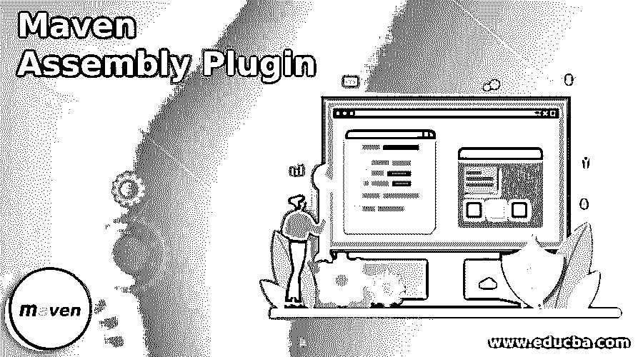
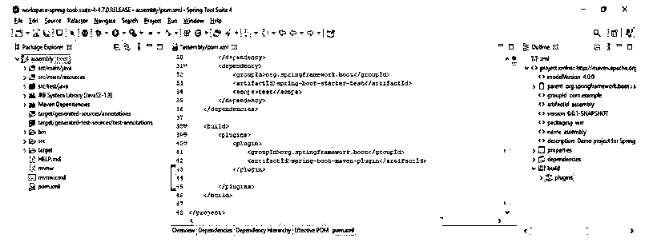
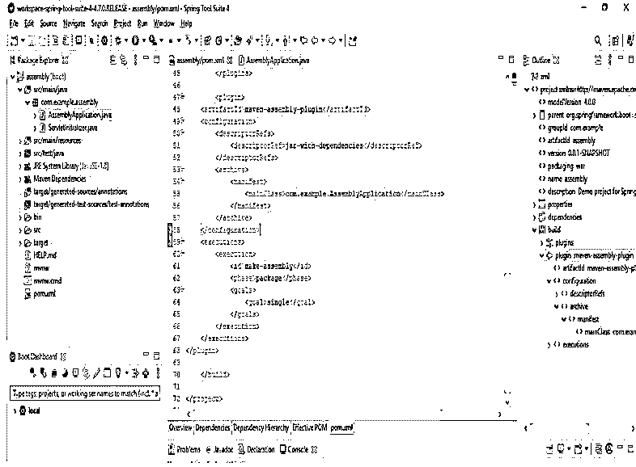
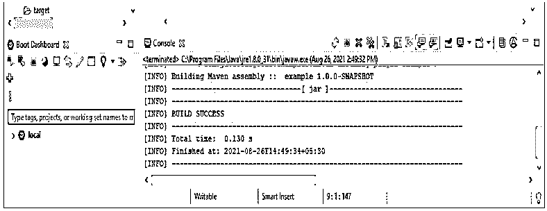
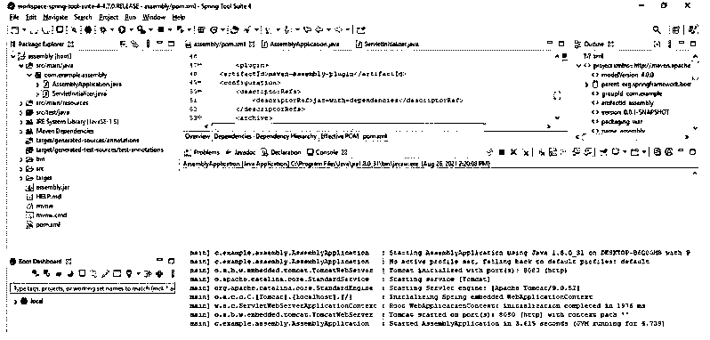

# Maven 汇编插件

> 原文：<https://www.educba.com/maven-assembly-plugin/>

## Maven 汇编插件简介

Maven assembly 插件用于将所有项目输出合并成一个单独的归档分布式文件，这个文件已经包含了文档、模块、依赖项和其他与项目相关的文件。我们可以很容易地构建我们项目的发行版，使用预制的组装描述符，我们可以很容易地构建我们的项目。maven assembly descriptors 处理许多与项目相关的操作，如项目人工制品、打包和在单个文件中生成文档。我们的项目提供了自己的描述符，我们假设它对依赖关系有很高的控制能力。

### 什么是 Maven 汇编插件？

它只不过是一组包含依赖项、项目目录和其他归档格式文件的文件。maven 项目只是一个包含 swing 应用程序和控制台应用程序的 JAR 文件。

<small>网页开发、编程语言、软件测试&其他</small>

下面是用来创建项目分布的格式。

*   **war:** 以 war 文件格式创建项目。
*   **dir:** 将创建项目目录格式。
*   **jar:** 它将创建 jar 文件格式的项目。
*   **tar.xz 或 txz:** 它将以 tar.xz 文件格式创建项目。
*   **Zip:** 它将以 Zip 文件格式创建项目。
*   **tar:** 它将以 tar 文件格式创建项目。
*   **tar.gz 或 tgz:** 它将创建 tar.gz 文件格式的项目。
*   **tar.snappy:** 它将以 tar.snappy 文件格式创建项目。
*   **tar.bz2 或 tbz2:** 它将创建 tar.bz2 文件格式的项目。
*   存档管理器格式。

为了在 maven 项目中使用汇编插件，我们需要选择写汇编描述符。在汇编中描述符将起到非常重要的作用。选择写装配描述符后，我们需要配置装配插件，即 pom.xml。配置装配插件后，我们需要在我们的项目中运行装配单 mvn。我们也可以为我们的项目生成我们自己的程序集。

下面是通用的 apache 版本。

*   2.0.x 版
*   2.1.x 版
*   2.2.x 版
*   2.3.x 版
*   2.4.x 版
*   2.5.x 版
*   2.6.x 版
*   3.0.x 版
*   3.1.x 版
*   3.2.x 版
*   3.3.x 版

在下面的例子中，我们可以看到如何配置现有的应用程序。在下面的例子中，我们将插件配置到现有的 assembly maven 项目中。

对于配置，我们需要遵循以下步骤。

1.打开现有的 maven 项目。

*   要进行配置，第一步是打开现有的 maven 项目。

在下面的例子中，我们正在打开装配项目。

文件->从文件系统打开项目->选择项目

2.打开 maven 项目后，我们需要打开 pom.xml 文件，需要向其中添加 assembly 插件。

**代码:**

`<plugin> --- start of assembly plugin section.
<artifactId> /* start of artifactid section.
maven-assembly-plugin /* name of plugin */ </artifactId> -- end of artifactid section.
<configuration> -- start of assembly configuration section.
<descriptorRefs> -- start of descriptorRefs section.
<descriptorRef>j/* start of second descriptorRefs. */ jar-with-dependencies /* descriptorRefs name */ </descriptorRef> -- end of descriptorRefs section.
</descriptorRefs> -- end of second descriptorRefs section.
<archive> -- start of archive section
<manifest> -- Start of manifest section
<mainClass> /* start of main class */ com.example.AssemblyApplication /* name of main class */ </mainClass> -- end of main class.
</manifest> -- end of manifest section
</archive> -- end of archive section
</configuration> -- end of configuration section.
<executions> -- start of executions section.
<execution> -- start of second execution section.
<id>make-assembly</id> -- Set the id name of maven assembly section.
<phase>package</phase> -- select the package.
<goals> -- start of goals section.
<goal>single</goal>
</goals> -- end of goal section.
</execution> -- end of execution section.
</executions> -- end of execution section.
</plugin> -- End of assembly plugin.`

**输出:**

3.添加组装插件代码后构建组装插件，构建组装插件后运行应用程序。

*   java 应用程序中组装的主要目标是单一的。单一目标用于创建所有程序集。
*   我们需要在创建组装插件时指定 id。ID 是非常重要的部分。

### Maven 汇编插件的优缺点

下面给出了提到的优点和缺点:

**优点:**

*   我们正在 pom.xml 中添加 maven assembly 插件，因此它将自动添加项目所需的所有依赖项。
*   在我们的项目中添加 maven assembly 插件后，我们可以轻松地将我们的项目构建成 jar、war 和 zip 文件。
*   在 maven 项目中使用 maven 组装插件，我们可以很容易地将我们的项目转换到不同的环境中。
*   在将 maven 项目转换到不同的环境后，我们不需要处理像构建、注入和处理这样的依赖。
*   实现它后，我们可以轻松地运行我们的项目后，建立相同的。
*   向我们的项目添加另一个依赖插件是很容易的。

**缺点**:

*   我们需要安装 maven 来运行 maven 组件的插件，没有安装 maven 我们就不能运行 maven 插件。
*   要使用这个插件，我们需要将代码添加到 pom.xml 文件中。
*   如果不将代码添加到 pom.xml 文件中，我们就无法运行应用程序。
*   要使用汇编插件运行 maven 应用程序，我们首先需要构建汇编插件。
*   如果不构建组装插件，我们就不能在我们的项目中使用。

### 结论

它用于将所有项目输出合并到一个分布式文件中。我们可以使用它将项目输出转换成 tar、zip 和 war 文件格式。将所有项目输出合并到一个文件中是非常有用和重要的。

### 推荐文章

这是一个 Maven 汇编插件的指南。这里我们讨论一下入门，它是如何工作的？优点和缺点。您也可以看看以下文章，了解更多信息–

1.  [Maven 中央储存库](https://www.educba.com/maven-central-repository/)
2.  [Maven 展开](https://www.educba.com/maven-deploy/)
3.  [梅文十拿九稳](https://www.educba.com/maven-surefire/)
4.  [Jetty Maven 插件](https://www.educba.com/jetty-maven-plugin/)