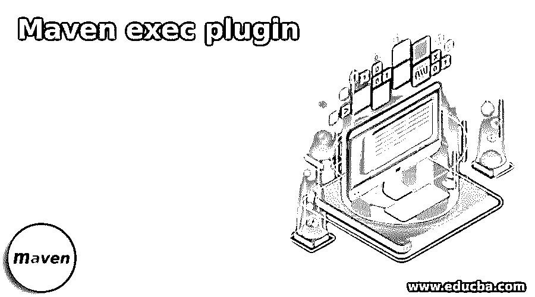
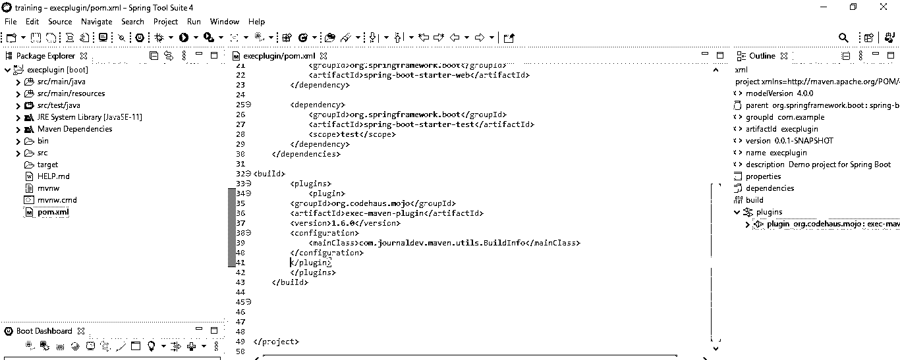
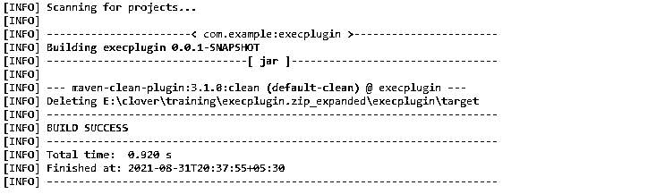
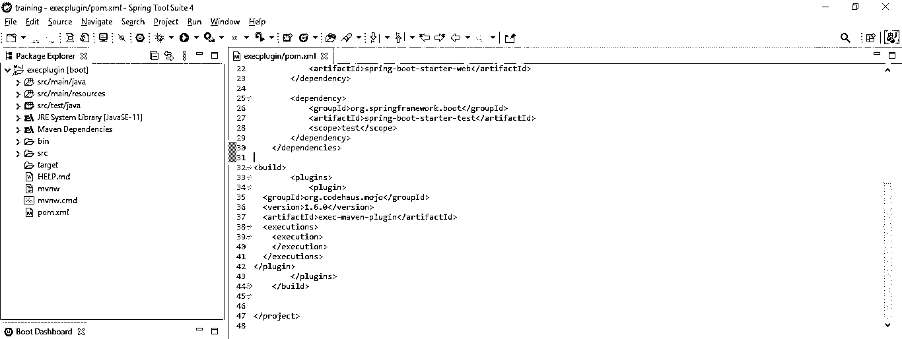
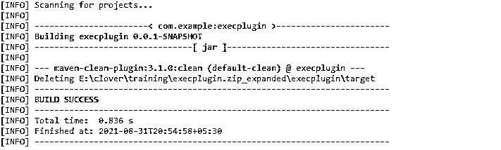

# Maven 执行插件

> 原文：<https://www.educba.com/maven-exec-plugin/>

## Maven exec 插件简介

它用于从 maven 命令执行 java 和系统代码，基本上有两个目标，即 exec: exec 和 exec: java。第一个目标是 exec: exec，用于执行不同进程中的任何程序，第二个目标是 exec: java，用于在同一服务器上执行 java 程序。要在 java 中使用任何 maven exec 插件，我们首先需要将它添加到 pom.xml 文件中。如果不将 exec 插件添加到 pom.xml 文件中，我们就不能在我们的项目中使用它。

### 它是如何工作的？

*   基本上，它定义了两个目标，第一个是 exec: exec，第二个是 exec: java。
*   第一个目标用于将任何代码执行到不同的进程中。第二个目标是在同一台服务器上运行 java 代码。
*   下面是可供一般使用的版本。

1.  版本 1.0
2.  版本 1.0.1
3.  版本 1.0.2
4.  版本 1.1
5.  版本 1.1.1
6.  版本 1.2
7.  版本 1.2.1
8.  版本 1.3
9.  版本 1.3.1
10.  版本 1.3.2
11.  版本 1.4.0
12.  版本 1.5.0
13.  版本 1.6.0
14.  版本 3.0.0

*   要使用 maven exec 插件执行 java 代码，我们需要将其配置到 pom.xml 文件的 build 部分。
*   我们需要在 pom.xml 文件中添加以下配置，以便在我们的项目中使用 maven exec 插件。

`<plugin>  -- Start of plugin section
<groupId> /* Start of groupId section */ name of groupid </groupId> -- end of groupid section.
<artifactId> /* Start of artifactId section */  exec-maven-plugin</artifactId> -- end of artifactId section.
<version> /* Start of version section */ version number </version> -- end of version section.
<configuration>
<mainClass> /* Start of mainClass section */ main class name </mainClass> -- end of mainClass section.
</configuration> -- -- end of configuration section.
</plugin>  -- end of plugin section.`

<small>网页开发、编程语言、软件测试&其他</small>

*   第一部分包含插件，maven exec 的执行从插件部分开始。我们需要结束已经开始的每一部分。
*   第二部分包含 groupid，这是 maven exec 插件中使用的 groupid 的名称。
*   第三部分包含 artifactid，这只是用于配置 maven exec 插件的 exec 插件的名称。
*   第四部分包含版本，这只是在 maven exec 插件的配置中使用的 exec 插件的实际版本号。
*   第五部分包含主类，这只是在 maven exec 插件的配置中使用的 exec 插件的主类的名称。
*   下面是我们在配置 maven exec 插件时需要用到的重要部分。

1.  Groupid
2.  ArtifactId
3.  版本
4.  主类

*   要在我们的项目中配置它，我们需要遵循以下步骤如下。
*   将这个插件配置添加到 pom.xml 文件中。
*   使用 exec: java 目标运行 Maven 构建。
*   将配置添加到 pom.xml 文件中非常重要。如果不将配置添加到 pom.xml 文件中，我们就无法构建 maven exec 插件。
*   配置中的 mainClass 元素是最值得注意的。在这一部分，我们必须定义由 exec: java 目标运行的 java 类。
*   在插件配置中，我们可以明确地提供所有必要的执行细节。此外，根据我们的用例，我们可以使用系统属性提供所有信息或一些信息。
*   以下是配置时使用的可选参数。

1.  addOutputToClasspath–此参数的类型为布尔型。
2.  addResourceToClasspath–此参数的类型为布尔型。
3.  arguments–该参数的类型是列表。
4.  async–该参数的类型为布尔型。
5.  asyncDestroyOnShutDown–此参数的类型为布尔型。
6.  class path scope–该参数的类型是 string。
7.  command line args–此参数的类型是字符串。
8.  environment ntscript–该参数的类型是 file。
9.  environment ntvariables–此参数的类型是 map。
10.  可执行–该参数的类型是字符串。
11.  executable dependency–该参数的类型是可执行依赖。
12.  long class path–该参数的类型为布尔型。
13.  longModulepath–该参数的类型为布尔型。
14.  output File–该参数的类型是 file。
15.  quiet logs–该参数的类型是布尔型。
16.  skip–该参数的类型为布尔型。
17.  source root–该参数的类型是 file。

### 例子

下面是例子如下。

#### 示例# 1–使用默认参数

**代码:**

`<plugin>  -- Start of plugin section
<groupId> /* Start of groupId section */ org.codehaus.mojo</groupId> -- end of groupid section.
<artifactId> /* Start of artifactId section */  exec-maven-plugin</artifactId> -- end of artifactId section.
<version> /* Start of version section */ 1.6.0 </version> -- end of version section.
<configuration>
<mainClass> /* Start of mainClass section */ com.journaldev.maven.utils.BuildInfo</mainClass> -- end of mainClass section.
</configuration> -- -- end of configuration section.
</plugin>  -- end of plugin section.`

**# mvn 执行:java**

#### 示例# 2–带有可选参数

**代码:**

`<plugin>  -- Start of plugin section
<groupId> /* Start of groupId section */ org.codehaus.mojo</groupId> -- end of groupid section.
<artifactId> /* Start of artifactId section */  exec-maven-plugin</artifactId> -- end of artifactId section.
<version> /* Start of version section */ 1.6.0 </version> -- end of version section.
<configuration>
<executions>
<execution>
</configuration> -- -- end of configuration section.
</execution>
</executions>
</plugin>  -- end of plugin section.`

**# mvn 执行:java**

### 结论

从 maven 命令执行 java 和系统代码是非常有用和重要的。使用了两个目标，即 exec: exec 和 exec: java。为了在项目中使用它，我们需要在 pom.xml 文件中进行同样的配置。

### 推荐文章

这是一个 Maven exec 插件的指南。在这里，我们将讨论 Maven exec 插件是如何工作的，以及示例和输出。您也可以看看以下文章，了解更多信息–

1.  [Maven 展开](https://www.educba.com/maven-deploy/)
2.  [Maven Eclipse 插件](https://www.educba.com/maven-eclipse-plugin/)
3.  [Maven 资源库 Spring](https://www.educba.com/maven-repository-spring/)
4.  [Maven POM 文件](https://www.educba.com/maven-pom-file/)