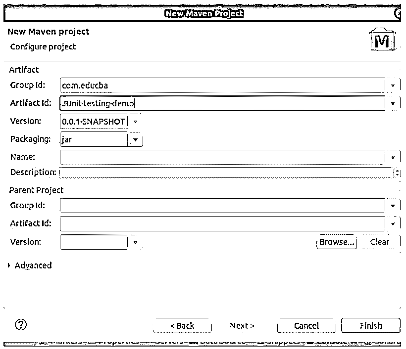
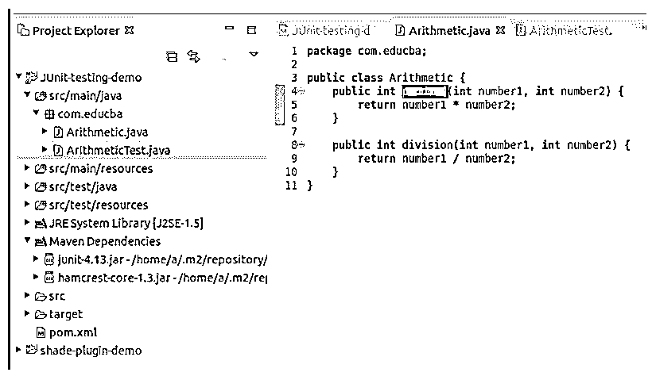
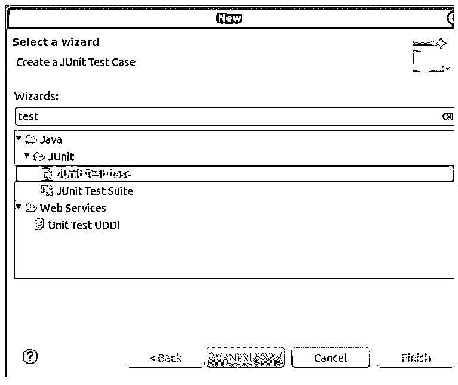
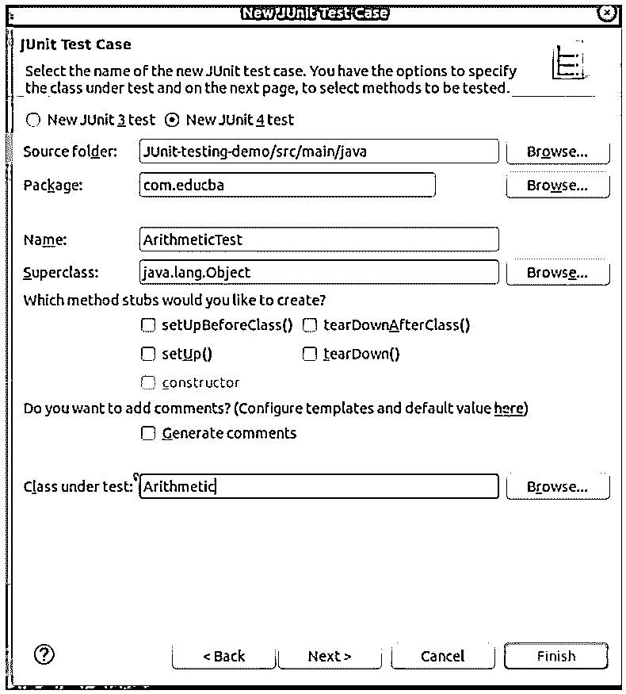
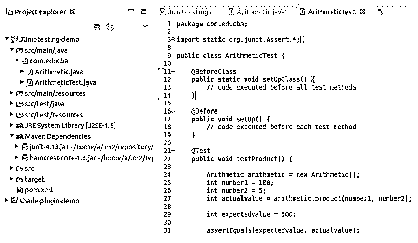
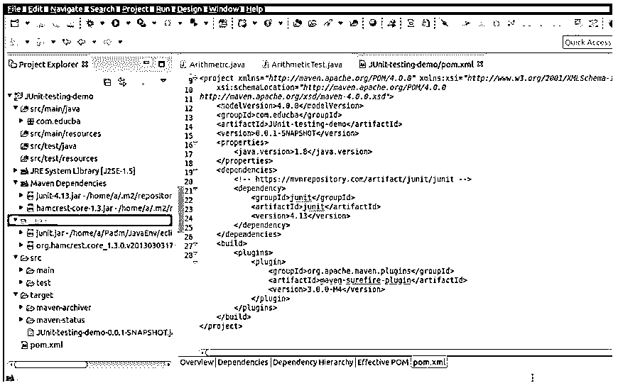
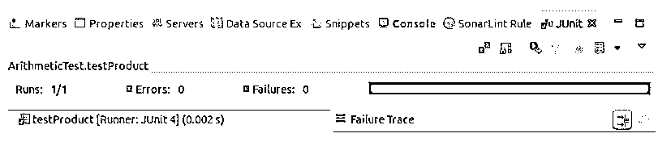
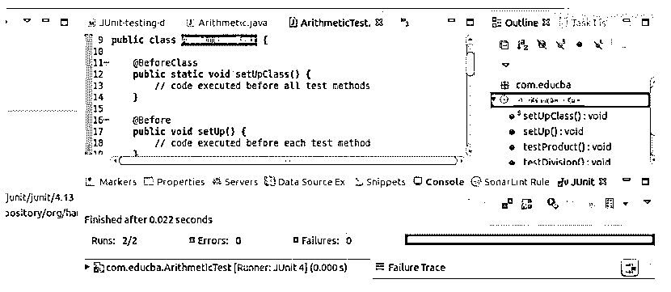

# Maven Surefire

> 原文：<https://www.educba.com/maven-surefire/>

## Maven Surefire 简介

Apache Maven 是一个构建工具，它还支持项目管理的其他操作，比如依赖管理、文档和单元测试。maven 的构建生命周期分为多个阶段，即验证、编译、测试、打包、验证、安装和部署。Maven surefire 是一个插件，用于 Maven 构建生命周期的测试阶段。该插件有助于执行 maven 项目或应用程序的单元测试用例，并在构建生命周期的测试阶段生成测试结果报告。这个插件创建了两种不同格式的报告，即普通测试文件。txt 扩展名和 XML 文件。xml 扩展。

### Surefire 测试框架的模块

下面给出了各个模块的框架:

<small>网页开发、编程语言、软件测试&其他</small>

*   可靠的记录者
*   SureFire API
*   Surefire 扩展
*   SureFireBooter
*   Maven Surefire 测试-分组支持
*   可靠的供应商
*   ShadeFire JUnit3 提供程序
*   Maven Surefire Common
*   Surefire 报告解析器
*   Maven Surefire 插件
*   Maven 故障保护插件
*   Maven Surefire 报告插件
*   Maven Surefire 集成测试
*   万全共享工具

### 先决条件

有许多版本的 surefire 插件都有 maven 的开发版本。然而，对于最新的 surefire 版本，它纠正了在 maven 3 . 1 . 0 之前的版本中不正确的控制台上的测试消息的格式，以下是建议的要求。

*   Maven 3.1.0 或以上 maven 3.x 版本。
*   JDK (Java 开发工具包)1.7 版或更高版本。

### 行为

*   surefire 插件有助于以纯文本或 XML 格式导出单元测试报告。
*   通过一些额外的努力，它也可以导出为 HTML 格式。
*   surefire 插件生成的报告的默认存储路径是/target/surefire-reports/any nameoffile-*(。xml/。txt)。
*   这个 surefire 插件为它定义了一个目标，即 surefire，test，指定运行 maven 项目/应用程序的单元测试。

### 与不同测试提供商的兼容性

Maven surefire 插件与测试源目录内容的以下任何组合都完全兼容。

*   Junit(5.x、3.8 或 4.x 版本)
*   POJO(普通旧 Java 对象)
*   测试

不需要任何额外的配置来指定 maven 项目中的测试用例使用哪个提供者。这是由您在 pom.xml 文件中添加的依赖项引起的。

例如，如果您使用 JUnit 5 进行测试，那么在项目的 pom.xml 文件的 dependencies 元素中，将会有一个带有 Junit 5 的组 id 工件 id 和版本的 dependency 标记。

### 怎么用？

使用该插件最常用和首选的方法之一是在 pom.xml 文件或 maven 项目的父 pom.xml 文件的 plugins 元素中指定该插件的版本。

**代码:**

`<plugin>
<groupId>org.apache.maven.plugins</groupId>
<artifactId>maven-surefire-plugin</artifactId>
<version>3.0.0-M4</version>
</plugin>`

这个插件标签应该添加到 pom.xml 的 pluginManagement 标签内的 plugins 元素中。3.0.0-M4 是 surefire 插件的最新版本。

使用 maven surefire 插件的另一种方法是调用 maven 构建生命周期的测试阶段，这将自动调用该插件。可以使用以下命令调用构建项目的 maven 生命周期的测试阶段:

**代码:**

`mvn test`

surefire maven 插件包括所有的测试类，这些测试类都是公共的，并且包含单词 test，不管这个单词是在类名的开头还是结尾。但是，这种行为可以在配置中的 excludes 和 includes 参数的帮助下以下列方式进行更改。

**代码:**

`<plugin>
<groupId>org.apache.maven.plugins</groupId>
<artifactId>maven-surefire-plugin</artifactId>
<version>3.0.0-M4</version>
<configuration>
<excludes>
<exclude>SampleTest.java</exclude>
</excludes>
<includes>
<include>NeedToVerify.java</include>
</includes>
</configuration>
</plugin>`

这将导致排除用于单元测试的 SampleTest 文件，并且将包括用于单元测试的 NeedToVerify 类文件，即使它的名称中不包含测试单词，因为在 pom.xml 文件的 configuration 元素的 include 元素中提到了它。

### Maven Surefire 示例

下面是提到的例子:

首先创建一个新的 maven 项目。

考虑下面的例子，我们有两个方法，一个用于计算乘积，另一个用于名为算术的类中的除法。创建一个名为算术的新 java 类文件。

**代码:**

`public class Arithmetic {
public intproduct(int number1, int number2) {
return number1 * number2;
}
public intdivision(int number1, int number2) {
return number1 / number2;
}
}`

这个类文件的结构和位置应该如下所示。

现在，我们将根据编码惯例创建一个名为 Arithmetictest 的测试类。测试类的名称应该是被测试的类的名称，后跟 Test 关键字。这将包含测试方法，这些方法的命名约定是被测试方法的名称，前面加上测试字。因此，这里有两个名为 testProduct 和 testDivision 的测试方法。

可以通过点击 new -> other，然后点击 JUnit 中的 test case 选项来创建测试类，如下所示。

然后选择您想要添加到测试类文件中的方法，并在下面的窗口中提到测试类文件和被测试文件的名称，以创建一个测试类文件。

**代码:**

`import org.junit.*;
public class ArithmeticTest {
@BeforeClass
public static void setUpClass() {
// This block is executed before all the methods of test
}
@Before
public void setUp() {
// This block is executed before each method of test
}
@Test
public void testProduct() {
// This block is executed for testing product method of Arithmetic class
Arithmetic arithmetic = new Arithmetic();
int number1 = 100;
int number2 = 5;
intactualvalue = arithmetic.product(number1, number2);
intexpectedvalue = 500;
assertEquals(expectedvalue, actualvalue);
}
@Test
public void testDivision() {
// This block is executed for testing division method of Arithmetic class
}
@After
public void tearDown() {
// This block is executed after each method of test
}
@AfterClass
public static void tearDownClass() {
// This block is executed after all the methods of test
}
}`

注意，上面所有用 BeforeClass、Before、After 和 AfterClass 注释的方法都是可选的。测试类中只需要测试方法。每种方法都有其特定的用途和执行时间。

这个 ArithmeticTest 类文件的结构和位置应该如下所示。

Maven 的 pom.xml 将包含。

**代码:**

`<project xmlns:xsi="http://www.w3.org/2001/XMLSchema-instance"
xsi:schemaLocation="http://maven.apache.org/POM/4.0.0
http://maven.apache.org/xsd/maven-4.0.0.xsd">
<modelVersion>4.0.0</modelVersion>
<groupId>com.educba</groupId>
<artifactId>JUnit-testing-demo</artifactId>
<version>0.0.1-SNAPSHOT</version>
<properties>
<java.version>1.8</java.version>
</properties>
<dependencies>
<!-- https://mvnrepository.com/artifact/junit/junit -->
<dependency>
<groupId>junit</groupId>
<artifactId>junit</artifactId>
<version>4.13</version>
</dependency>
</dependencies>
<build>
<plugins>
<plugin>
<groupId>org.apache.maven.plugins</groupId>
<artifactId>maven-surefire-plugin</artifactId>
<version>3.0.0-M4</version>
</plugin>
</plugins>
</build>
</project>`

该文件的结构和显示方式如下。

要检查测试用例并执行测试，从 window -> preferences -> outline 打开 outline 窗口，然后右键单击要执行的测试类文件的任何方法，并作为 JUnit 测试选项运行。在运行上述 ArithmeticTest 类的 testProduct 方法后，您将在 Junit 控制台上获得以下输出。

绿色条显示测试用例被成功执行，并且没有错误。要运行测试用例的整个类文件，您可以右键单击 ArithmeticClass 文件，并运行一个 Junit 测试，给出以下输出。

### 结论

我们可以在 surefire 插件的帮助下测试 maven 项目，我们可以对多个测试用例以及任何底层源目录内容(如 Junit、POJO(普通旧 Java 对象)、TestNG)执行单元测试。

### 推荐文章

这是一本关于 Maven Surefire 的指南。这里我们讨论 Maven Surefire 的介绍、先决条件、行为、与不同测试提供者的兼容性、模块框架和示例。您也可以看看以下文章，了解更多信息–

1.  [Maven 生命周期](https://www.educba.com/maven-life-cycle/)
2.  [Maven 知识库](https://www.educba.com/maven-repository/)
3.  [Maven POM 文件](https://www.educba.com/maven-pom-file/)
4.  [胃插件](https://www.educba.com/maven-plugins/)