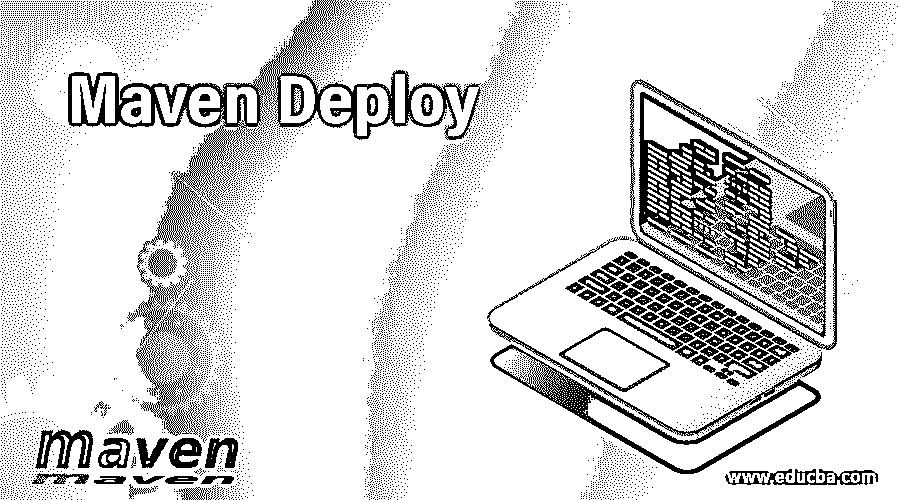

# Maven 部署

> 原文：<https://www.educba.com/maven-deploy/>

**

** 

## Maven Deploy 简介

Apache Maven 是一个构建工具，它也有助于执行其他项目管理任务，比如依赖管理和文档。maven 的构建生命周期分为多个阶段。验证、编译、测试、打包、验证、安装和部署。部署是 maven 生命周期的最后一个阶段。在这个阶段，构建完成，当前项目被复制到远程存储库。这使得构建的项目可供其他项目作为依赖项或开发人员添加。在这个主题中，我们将学习 Maven Deploy。

maven 中的部署插件用于构建生命周期的部署阶段。在本文中，我们将了解 maven deploy 插件，它在哪里使用，使用它的先决条件以及如何使用它。

<small>网页开发、编程语言、软件测试&其他</small>

### 部署 Maven 的插件

部署通常在完成项目集成和发布的环境中进行。它是将项目、工件以及所有相关信息添加到远程存储库所在的远程位置的操作，以便其他项目和开发人员可以使用和访问它。

存储库不仅仅由工件组成，它还包含各种元数据、MD5 和 SHA1 之类的散列文件、POM 文件等，当新的部署完成时，这些文件也需要更新，同时复制预期的工件。Maven deploy 插件确保所有这些任务都正确执行。

### 先决条件

如果您想要部署工件，那么在这样做之前，您需要做一些事情，如下所示

*   与存储库相关的信息，如存储库的位置、访问机制和传输方法，如 SFTP、SCP 和 FTP 或任何其他信息，以及有关用户帐户的信息，这些信息有时是必需的，也是可选的。
*   您希望部署的与工件相关的信息，例如打包、工件 id、组 id、分类器和其他内容。
*   部署者——这是执行工件部署的方法的实际策略。有许多方法可以做到这一点，如使用系统指定的方法或实施有助于跨平台的货车运输。

上述所有先决条件和信息都是从指定或暗示的命令行和 pom 文件中获得的。为了获得用户凭证，还可以解析 settings.xml。

### 部署插件的目标

部署插件定义了两个目标来执行部署，如下所示

*   **deploy:deploy–**它有助于自动安装工件及其相关信息，比如 pom 文件、附加到特定项目的工件。所有与部署相关的信息都存储在项目的 pom 文件中。
*   **deploy:deploy-file–**这个目标在单个工件及其 pom 的安装中非常有用。关于工件的信息可以从可选的指定 pom 文件或命令行中获得。

除了以上两个，还有一个目标是部署插件有帮助的，即 deploy:help，它帮助显示所有与 maven 部署插件相关的信息。可以通过使用以下命令显示参数的详细信息来调用此目标–

`mvn deploy:help -Ddetails=true -Dgoal=<goal-name>`

要使用 maven 的部署插件，您的系统应该满足的最低要求包括 maven 3.0 和 JDK 1.7。它没有提到插件正常工作所需的最小内存或磁盘空间。

### 使用 maven 部署插件

我们需要在 pom.xml 文件的<pluginmanagement>标签中指定版本和插件，以定义父 pom 中插件的版本，并在 pom 文件的插件部分中指定版本和插件，以使用您的项目或父项目的插件目标。</pluginmanagement>

您可以通过在 pom 文件中使用以下代码片段来实现这一点。

`<project>
<build>
<pluginManagement>
<plugins>
<plugin>
<groupId>org.apache.maven.plugins</groupId>
<artifactId>maven-deploy-plugin</artifactId>
<version>3.0.0-M1</version>
</plugin>
</plugins>
</pluginManagement>
<plugins>
<plugin>
<groupId>org.apache.maven.plugins</groupId>
<artifactId>maven-deploy-plugin</artifactId>
<version>3.0.0-M1</version>
</plugin>
</plugins>
</build>
</project>`

**语法—**

部署项目非常容易。您只需要发出以下命令——

`mvn deploy`

在大多数情况下，不需要在部署和发布项目时执行测试阶段，因为这是项目的最后一个阶段，并且很明显，如果需要的话，项目之前已经测试过了。因此，在部署时，您可以使用以下命令跳过 maven 构建生命周期的测试阶段

`mvn clean deploy -Dmaven.test.skip=true`

### 使用 FTP 方法进行工件部署的用法和示例

maven deploy 插件可用于将文件或项目部署到远程存储库，以便与其他开发人员和项目共享。通过使用 maven deploy 插件，有多种方法可以将您的工件部署到远程存储库。

其中最基本的一个是使用 FTP 在 maven 项目中部署工件，同时使用 deploy 插件。在这种情况下，您需要在 pom 文件的<distributionmanagement>标记中提到 FTP 服务器的使用，并且为了拉入工件，您还需要在 pom.xml 文件中的<build>元素的扩展标记中以如下方式提到它</build></distributionmanagement>

`<distributionManagement>
<repository>
<id>sample-ftp-educba-repository</id>
<url>ftp://repository.educba.com/samplerepository</url>
</repository>
</distributionManagement>
<build>
<extensions>
<extension>
<groupId>org.apache.maven.wagon</groupId>
<artifactId>wagon-ftp</artifactId>
</extension>
</extensions>
</build>`

除此之外，您还必须在 settings.xml 文件中提到用户详细信息和 id 以及 FTP 配置。这可以通过以下方式在 settings 元素的<servers>标记中指定，您将需要添加以下具有 server 标记的代码片段</servers>

`<server>
<id>sample-ftp-educba-repository</id>
<username>your_uname</username>
<password>your_passwd</password>
<configuration>
<endpointChecking>false</endpointChecking>
</configuration>
</server>`

请注意，您在 settings.xml 文件内的 server 元素中提到的 id 和 pom 文件中<distributionmanagement>元素内的 repository 标记中的 id 需要相同。</distributionmanagement>

### 结论

您可以轻松地将单个工件或多个工件部署到远程存储库，以便其他开发人员和项目可以借助 maven 项目中提供的 deploy 插件来使用它。

### 推荐文章

这是 Maven 部署指南。在这里，我们讨论 Maven 的 Deploy 插件，以及使用 FTP 方法进行工件部署的目标、用法和示例。您也可以阅读以下文章，了解更多信息——

1.  [胃插件](https://www.educba.com/maven-plugins/)
2.  [Maven 知识库](https://www.educba.com/maven-repository/)
3.  [什么是 Maven](https://www.educba.com/what-is-maven/)
4.  [Maven 命令](https://www.educba.com/maven-commands/)