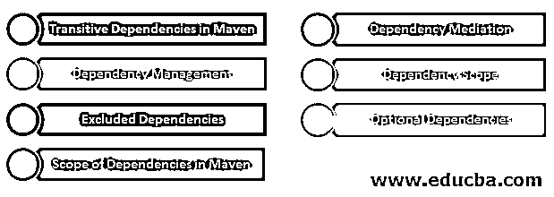
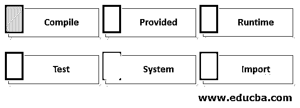

# Maven 依赖范围

> 原文：<https://www.educba.com/maven-dependency-scope/>

## Maven 依赖范围简介

Maven 是 java 项目中最常用的构建工具，用于定义和维护构建过程。除此之外，maven 为我们提供了完全可靠的依赖管理特性，有助于构建单模块和多模块的项目构建和部署。 [Maven 维护了](https://www.educba.com/what-is-maven/)一个中央存储库，所有的 jar 和 javadocs 都可以在其中使用，并且可以通过在 pom.xml 中添加与您的依赖项相对应的依赖项标签来添加。除此之外，还有一些您已经在 pom.xml 中添加的依赖项的依赖项。这被称为可传递依赖项，由 Maven 自动添加。在本文中，我们将讨论 maven 中的传递依赖和各种依赖范围。

### Maven 中依赖范围的类型

maven 中使用了六种不同的依赖范围，我们将在接下来的会话中逐一介绍。

<small>网页开发、编程语言、软件测试&其他</small>

#### 1.Maven 中的传递依赖

您在 pom.xml 中指定的依赖项所需的依赖项由 maven 自动包含，方法是从远程存储库中读取您的依赖项的所有项目文件并添加它们。这种可传递的依赖性添加可以进行到任何级别，这意味着在 pom 中添加指定依赖性的依赖性，然后进一步添加该依赖性的依赖性，等等，除非并且直到循环依赖性出现。这导致增加了大量的依赖项。为了最大限度地减少这种情况，以下一些策略有助于了解应该包括哪些依赖项

#### 2.依赖中介

在这种技术中，如果依赖关系中存在多个版本，那么最接近项目的依赖关系版本被添加到依赖关系树中。例如，如果 V、X、Y 和 Z 之间的依赖关系如下–V-> X-> Y-> Z 3.6 和 V -> W -> Z 2.3，则选择通过 W 从 V 到 Z 的最近路径，并将 Z 依赖关系的 2.3 版本添加到项目中。

#### 3.依赖性管理

在项目中添加依赖项时，作者可以直接提及将要使用的依赖项的版本。例如，如果在上面的例子中，作者在项目的 POM.xml 文件中提到了 Z 的 3.6 版本，那么将在项目中添加 Z 依赖的 3.6 版本，而不是 Z 的 2.3 版本。

#### 4.依赖范围

构建生命周期的当前阶段所需的依赖项仅添加到项目中。

#### 5.排除的依赖项

如果项目 A、B 和 C 存在这样的关系，即 A 依赖于 C 上的 B and B，则 A 项目可以通过使用排除元素来从依赖项中移除项目 C。

#### 6.可选依赖项

如果项目 A 依赖于项目 B，则名为 A 的项目可以将 B 项目依赖关系作为可选依赖关系。现在，如果任何其他项目 C 都依赖于 A，那么 C 项目只依赖于项目 A，而不依赖于项目 B。但是，如果需要，项目 C 可以在其项目中显式添加项目 B 的依赖关系。

#### 7.Maven 中的依赖范围

限制 maven 项目中可传递依赖关系的技术之一是依赖关系范围，它也有助于维护进一步用于多个构建任务的类路径。这些依赖范围是使用依赖标签中的<scope>标签提到的。除了导入依赖范围之外，它们中的每一个都有助于管理和限制项目中的传递性依赖添加。</scope>

### Maven 中的作用域类型

maven 项目中有六个不同的范围:

#### 1.编译依赖范围

这是在 dependency 标记中没有提到或指定任何范围时出现的默认范围。它是可传递的，也就是说，依赖关系也可用于依赖项目的子项目，并且可用于项目中的所有类路径。例如–

**代码:**

`<dependencies>
<dependency>
<groupId>org.springframework</groupId>
<artifactId>spring-context</artifactId>
<version>1.2.14</version>
<scope>compile</scope>
</dependency>
</dependencies>`

在上面的依赖关系标签中，即使没有添加<scope>标签，也没有提到编译，因为 maven 依赖关系的默认范围是编译。</scope>

#### 2.提供的依赖范围

这个作用域类似于编译时的作用域，但是您必须确保 JDK 容器在运行时提供了必要的依赖项。提供依赖关系的一个最常见的场景是，当您使用 JEE(Java 企业版)创建 web 应用程序时，您可以将 servlet API 的范围设置为 provided，因为它的相关类将由 web 容器提供。

这是不可传递的，只能用于测试和编译类路径。例如 servlet API 依赖关系的范围以如下方式提及——

**代码:**

`<dependency>
<groupId>javax.servlet</groupId>
<artifactId>servlet-api</artifactId>
<version>4.0.1</version>
<scope>provided</scope>
</dependency>`

#### 3.运行时依赖范围

此范围有助于指定当前依赖项将仅在执行期间使用，而不是在可用于测试和运行时类路径但不可用于编译类路径的编译期间使用。例如–

**代码:**

`<dependency>
<groupId>mysql</groupId>
<artifactId>mysql-connector-java</artifactId>
<version>4.0.6</version>
<scope>runtime</scope>
</dependency>`

#### 4.测试依赖范围

这个范围有助于说明依赖关系仅在测试时使用，并且仅在测试的编译和执行阶段可用，并且是不可传递的。此依赖范围不可传递，因此不可用于依赖项目。例如–

**代码:**

`<dependency>
<groupId>junit</groupId>
<artifactId>junit</artifactId>
<version>4.2</version>
<scope>test</scope>
</dependency>`

#### 5.系统依赖范围

这个依赖范围类似于所提供的范围，只是不同之处在于提到了系统上的 jar，而不是任何提供依赖的容器。例如，指向所需 jar 的系统路径应该在依赖标签中提到

**代码:**

`<dependency>
<groupId>sample-dependency</groupId>
<artifactId>sample-dependency</artifactId>
<scope>system</scope>
<version>1.0</version>
<systemPath>${myDirectory}\jars\MyFolder\var\sampleDependency.jar</systemPath>
</dependency>`

#### 6.导入依赖范围

这些依赖范围无助于限制传递性依赖添加问题。该依赖范围只能用于在<dependencymanagement>标记部分中具有 pom 类型的依赖。这个依赖项被 pom.xml 文件中名为<dependencymanagement>的部分中提到的依赖项列表所取代。例如</dependencymanagement></dependencymanagement>

**代码:**

`<dependency>
<groupId>educba.sampleImportScope</groupId>
<artifactId>sample-dependency</artifactId>
<type>pom</type>
<scope>import</scope>
<version>1.0</version>
</dependency>`

### 结论

我们可以在 pom.xml 文件中的依赖关系标记中使用依赖关系范围，这将有助于管理可传递的依赖关系，也有助于通过为依赖关系选择适当的依赖关系范围来为需要依赖关系的类路径提供服务。

### 推荐文章

这是关于 Maven 依赖范围的指南。在这里，我们讨论 Maven 依赖范围及其各种类型的介绍以及代码实现。您也可以浏览我们推荐的其他文章，了解更多信息——

1.  [Maven 生命周期](https://www.educba.com/maven-life-cycle/)
2.  [Maven 知识库](https://www.educba.com/maven-repository/)
3.  [胃插件](https://www.educba.com/maven-plugins/)
4.  【T0 度与腹部】T1