# Maven Shade 插件

> 原文：<https://www.educba.com/maven-shade-plugin/>

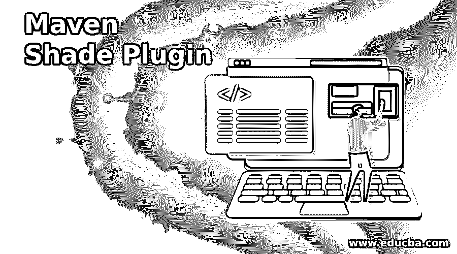

## Maven Shade 插件简介

maven 项目有很多可用的插件。插件的主要目的是提供将 maven 项目中的工件及其依赖项打包到一个 uber 或 fat jar 中的能力，并重命名某些包。优步是一个德语单词，代表高于，这意味着它是一个级别，不像其他普通的罐子。优步也称之为 fat jar，它足以独立运行项目，并包含所有依赖项和特定项目所需的 jar 及其项目文件。maven 的 Shade 插件为我们提供了创建这样一个超级 jar 的能力。还有其他可用的插件，如汇编插件。但是 shade 插件是最受欢迎的，因为它提供了重定位功能，有助于避免类路径中同名的类名冲突。Shade 插件只有一个目标，那就是它只能在打包阶段使用，主要目的是创建可以独立执行的 shaded jar。

### 我们如何使用 Shade 插件来构建 Jar？

通过 eclipse IDE 中的一个例子，让我们了解如何使用 shade 插件来构建 jar。

<small>网页开发、编程语言、软件测试&其他</small>

第一步:第一步是在您的 eclipse IDE 中创建一个新的 maven 项目，它包含如下所示的 maven 项目的通用格式。选择 create a simple project(skip archetype selection)选项，这对于大多数 java 应用程序来说已经足够了，甚至对于那些使用 spring framework 的应用程序也是如此。

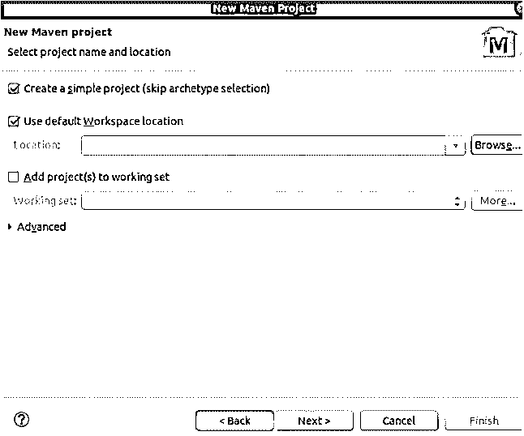

**第二步:**我们正在创建一个项目，group is as com.educba，artifact-id as shade-plugin-demo，规格如下图所示。

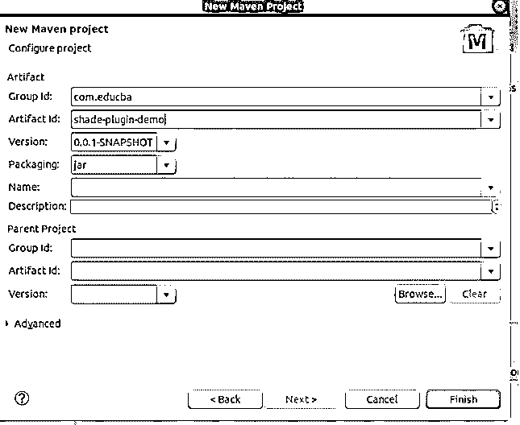

**步骤 3:** 成功创建 maven 项目后，您将看到下面的项目结构，其中包含 JRE 系统库中使用的 J2SE 1.5。

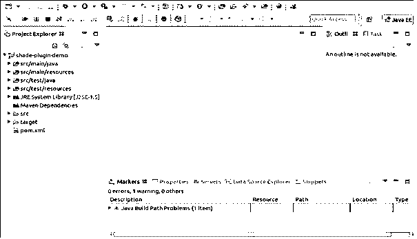

**第四步:**现在，打开 pom.xml 文件。它看起来会像这样:

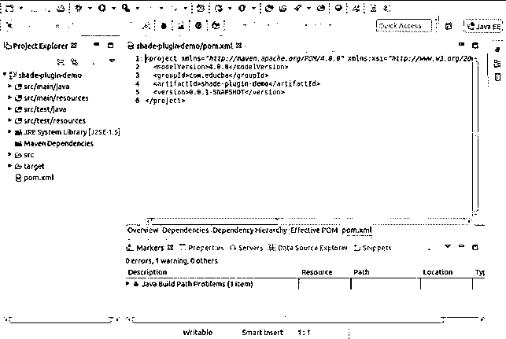

**第五步:**将 Java 版本改为 1.8。添加 plugins 标签，并在其中插入 maven 编译器插件，如图所示，然后保存文件。通过右击您的项目- > Maven - > Update 选项来查看反射，从而更新 Maven 项目。您将看到 JRE 系统库现在使用的 java 版本是 1.8。

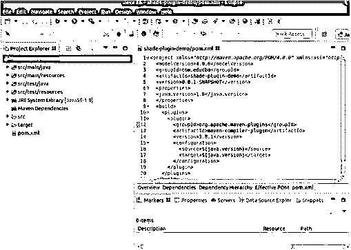

**第六步:**在 src/main/java/com/shadedemo 路径下添加一个新的类文件，命名为 MainDemo.java。这个文件将包含您的 main 方法。提及包的名称，因为不使用默认的包名称是一个好习惯。

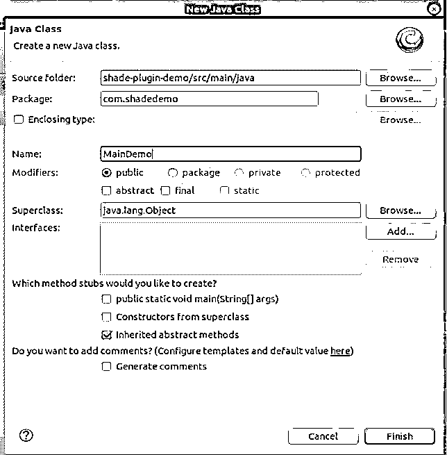

**第七步:**注意，到目前为止，maven 依赖目录是空的。在您的 pom.xml 文件中添加您的项目可能需要的依赖项，例如我们正在添加 google guava 和 JUnit 以供我使用。您可以通过使用中央 maven 存储库来添加依赖项，在这里您将获得在搜索完依赖项后需要添加到 pom 中的依赖项标记。这里是中央储存库的链接——【https://mvnrepository.com/repos/central】的[和搜索链接是——](https://mvnrepository.com/repos/central)[的 https://search.maven.org/](https://search.maven.org/)。添加后检查 maven 依赖项。

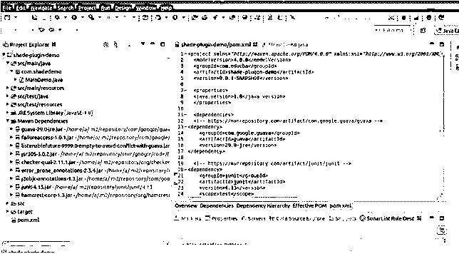

**步骤 8:** 在你的 main 方法中添加一些代码。我们将添加一个名为 sample name 的字符串并初始化它。使用 guava 方法 isNullOrEmpty，我们将检查它是否不为空，然后添加一个控制台来打印消息，如下所示。将它作为 java 应用程序运行后，您会在控制台上看到一条消息——耶！字符串有效，其值为:Payal

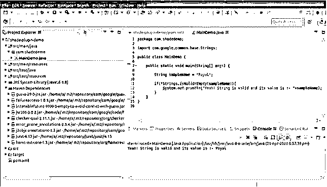

现在，我们的应用程序已经准备好了。让我们检查一下我们项目的罐子将在哪里存储。它们存储在名为 target 的文件夹中。打开将会看到 jar 的目标文件夹。在我的例子中，路径如下:

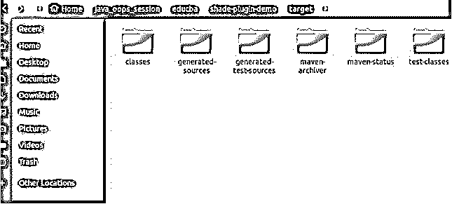

**步骤 10:** 将来自[https://maven . Apache . org/plugins/maven-shade-plugin/examples/executable-jar . html](https://maven.apache.org/plugins/maven-shade-plugin/examples/executable-jar.html)链接的 shade plugin 标签添加到您的 pom.xml 文件中，并在主类标签中提及您的主文件的全限定名称，例如在我的示例中的 com.shadedemo.MainDemo，如下所示:

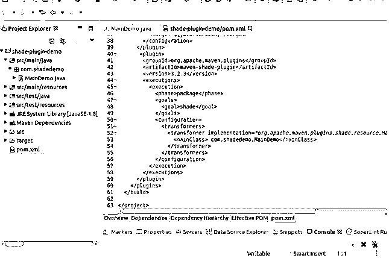

**步骤 11:** 右键单击您的 maven 项目，作为 maven build 运行，并提及一些常见的目标，比如使用 shade 插件为您的项目构建 jar 文件进行清理和安装。

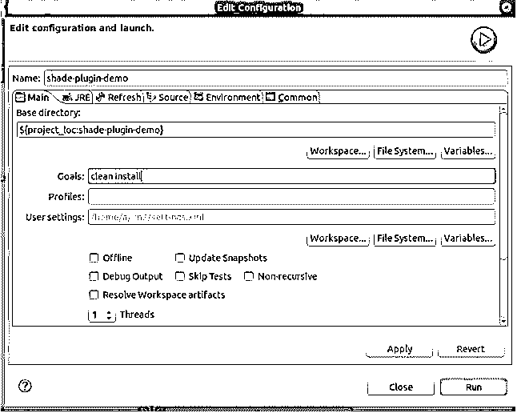

**第 12 步:**单击 run 按钮后，控制台将显示所有构建过程通知，如果一切顺利，将告知构建已成功完成。jar 文件所在的路径也会显示在控制台上。我们的情况如下:

[INFO] Installing /home/a/java_oops_session/educba/shade-plugin-demo/pom.xml to /home/a/.m2/repository/com/educate/shade-plugin-demo/0.0.1-SNAPSHOT/shade-plugin-demo-0.0.1-SNAPSHOT.pom

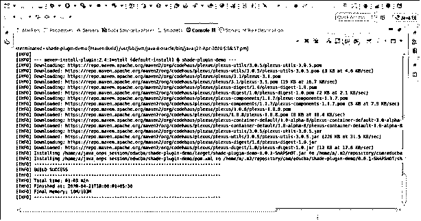

**步骤 13:** 构建成功后，打开创建 jar 的目标文件夹，并在该位置打开一个终端。要运行主文件，请在终端上执行以下命令:

`java -jar nameOfJar.jar`

在我们的例子中，我们可以看到在我的目标文件夹中创建了一个名为 shade-plugin-demo-0 . 0 . 1-snapshot . jar 的新 jar 文件，并执行命令–

`java -jar shade-plugin-demo-0.0.1-SNAPSHOT.jar`

给出以下输出:

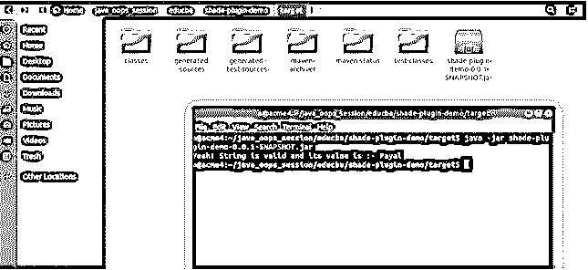

您可以更改使用 shade 插件构建的最终 jar 的名称，方法是在 build 标记中添加一个名为 final name 的标记，并在该标记中提到要创建的目标文件的名称。

**下面是我们的 pom.xml 文件的样子:**

`<project xmlns:xsi="http://www.w3.org/2001/XMLSchema-instance" xsi:schemaLocation="http://maven.apache.org/POM/4.0.0 [http://maven.apache.org/xsd/maven-4.0.0.xsd](https://maven.apache.org/xsd/maven-4.0.0.xsd)">
<modelVersion>4.0.0</modelVersion>
<groupId>com.educba</groupId>
<artifactId>shade-<u>plugin</u>-demo</artifactId>
<version>0.0.1-SNAPSHOT</version>
<properties>
<java.version>1.8</java.version>
</properties>
<dependencies>
<!-- [https://mvnrepository.com/artifact/com.google.guava/guava](https://mvnrepository.com/artifact/com.google.guava/guava) -->
<dependency>
<groupId>com.google.guava</groupId>
<artifactId><u>guava</u></artifactId>
<version>29.0-<u>jre</u></version>
</dependency>
<!-- [https://mvnrepository.com/artifact/junit/junit](https://mvnrepository.com/artifact/junit/junit) -->
<dependency>
<groupId><u>junit</u></groupId>
<artifactId><u>junit</u></artifactId>
<version>4.13</version>
<scope>test</scope>
</dependency>
</dependencies>
<build>
<plugins>
<plugin>
<groupId>org.apache.maven.plugins</groupId>
<artifactId><u>maven</u>-compiler-<u>plugin</u></artifactId>
<version>3.8.1</version>
<configuration>
<source>${java.version}</source>
<target>${java.version}</target>
</configuration>
</plugin>
<plugin>
<groupId>org.apache.maven.plugins</groupId>
<artifactId><u>maven</u>-shade-<u>plugin</u></artifactId>
<version>3.2.3</version>
<executions>
<execution>
<phase>package</phase>
<goals>
<goal>shade</goal>
</goals>
<configuration>
<transformers>
<transformer implementation="org.apache.maven.plugins.shade.resource.ManifestResourceTransformer">
<mainClass> com.shadedemo.MainDemo</mainClass>
</transformer>
</transformers>
</configuration>
</execution>
</executions>
</plugin>
</plugins>
</build>
</project>`

**主文件 MainDemo.java 包含以下内容:**

`package com.shadedemo;
import com.google.common.base.Strings;
public class MainDemo {
public static void main(String[] args) {
String sampleName = "Payal";
if(!Strings.isNullOrEmpty(sampleName)){
<u>System.</u><u>out</u>.println("Yeah! String is valid and its value is :- "+sampleName);
}
}
}`

### 结论

我们可以使用 maven 中的 shade 插件来获得单个 jar 文件，也称为 uber/fat jar 文件，它是自给自足的，可以独立运行，因为它包含所有的依赖项和项目代码。这可以通过简单地添加带有阴影插件相关信息的插件标签来完成，如上例所示。

### 推荐文章

这是一个关于 Maven Shade 插件的指南。在这里，我们讨论一个 Maven Shade 插件的介绍，我们如何使用它来构建带有代码和输出的 Jar。您也可以浏览我们的其他相关文章，了解更多信息——

1.  [什么是 Maven](https://www.educba.com/what-is-maven/)
2.  [Maven 生命周期](https://www.educba.com/maven-life-cycle/)
3.  [Maven POM 文件](https://www.educba.com/maven-pom-file/)
4.  [胃插件](https://www.educba.com/maven-plugins/)