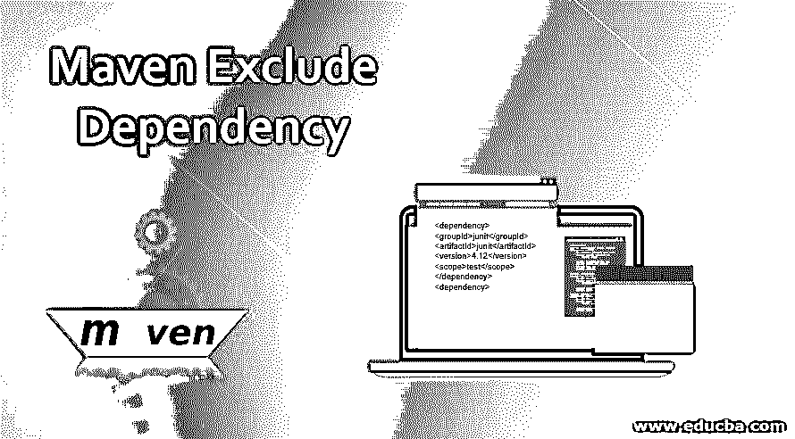

# Maven 排除依赖性

> 原文：<https://www.educba.com/maven-exclude-dependency/>

## Maven 排除依赖简介

Maven 是 java 项目中最常用的构建工具，用于定义和维护构建过程。除此之外，maven 还为我们提供了完全可靠的依赖管理特性，有助于构建单模块和多模块的项目构建和部署。Maven 维护了一个中央存储库，其中所有的 jar 和 Javadoc 都可用，并且可以通过在 pom.xml 中添加与您的依赖项相对应的依赖项标记来添加，这称为直接依赖项规范。除此之外，还有一些你在 pom.xml 中添加的依赖项的依赖项，这叫做传递性依赖项，由 maven 自动添加。在本文中，我们将讨论传递依赖和依赖的排除，并通过一个例子来看看如何在 maven 中排除某些依赖。

### Maven 中的传递依赖

您在 pom.xml 中指定的依赖项所需的依赖项由 maven 自动包含，方法是从远程存储库中读取您的依赖项的所有项目文件并添加它们。这种可传递的依赖性添加可以进行到任何级别，这意味着在 pom 中添加指定依赖性的依赖性，然后进一步添加该依赖性的依赖性，等等，除非并且直到循环依赖性出现。这被称为传递依赖。这导致增加了大量的依赖项。为了最大限度地减少这种情况，遵循的一些策略包括——依赖中介、依赖管理、依赖范围、排除的依赖、可选的依赖。传递性依赖管理策略之一是排除 maven 中的依赖。

<small>网页开发、编程语言、软件测试&其他</small>

### 排除相关性

每当过渡依赖出现时，工件的依赖之间可能会有版本不匹配的问题，或者我们的项目工件和部署平台工件的版本不匹配。这可以通过使用<exclusion>标签排除这种依赖性并打破传递依赖性来管理。为了确保依赖关系图和流是可预测的，依赖关系的排除是在每个依赖关系的基础上进行的，而不是在 pom 级别。当 maven 使用排除技术解决传递性依赖关系时，不需要的依赖关系将从项目的类路径中排除。根据声明要排除的依赖项的方式，排除的依赖项工件不会添加到项目的类路径中。对于有问题的 jar 和旧版本的 jar，以及与项目的 java 版本不兼容的 jar，或者与项目中任何其他依赖项不兼容的 jar，都可以这样做。</exclusion>

通过对您想要排除的每个依赖项使用<exclusion>标记，并将所有这些排除标记放在 pom.xml 的<exclusions>标记中，可以排除多个可传递的依赖项。您需要在排除标记中提到您想要排除的依赖项的组 id 和工件 id。让我们看看如何借助一个例子来排除我们想要的传递依赖。</exclusions></exclusion>

假设我们在 pom.xml 中将 Junit 4.12 和 dbunit 依赖项标记定义为直接依赖项。其中，dbunit 依赖项具有 JUnit 的传递性依赖项。因此，它将下载 JUnit 3.8.2 依赖项作为其可传递依赖项。为了在 pom.xml 中排除 JUnit 3.8.2 依赖项，您可以在您正在使用的 dbuint 依赖项标记内的 exclusions 标记内提到它，因为 JUnit 3.8.2 是传递依赖项，由于提到了 dbunit 的直接依赖项，它将到达并被下载。在这种情况下，pom.xml 应该包含以下代码片段:

**代码:**

`<dependency>
<groupId>junit</groupId>
<artifactId>junit</artifactId>
<version>4.12</version>
<scope>test</scope>
</dependency>
<dependency>
<groupId>org.dbunit</groupId>
<artifactId>dbunit</artifactId>
<version>${dbunit.version}</version>
<scope>test</scope>
<exclusions>
<exclusion>
<artifactId>junit</artifactId>
<groupId>junit</groupId>
</exclusion>
</exclusions>
</dependency>`

在上面的例子中，我们指定 JUnit 4.12 依赖项应该总是添加到您的 maven 项目中，并且将作为 dbunit 的可传递依赖项下载的 JUnit 版本将被排除，正如我们在 dbunit 依赖项标记中提到的那样，以排除将使用作为 JUnit 的 artifact id 和作为 JUnit 的 groupid 下载的可传递依赖项。

### 忽略 Pom 中的依赖关系

在 maven 的构建生命周期中，dependency:analyze-only 目标如果被绑定，那么 maven 会在生命周期的验证阶段执行依赖性分析。我们可以排除那些没有声明但是使用了的依赖或者使用了但是没有使用 maven 插件声明的依赖。当字节码分析失败时，通常当依赖项包含注释时，这些 jar 或依赖项通常会被忽略。通过在 pom.xml 的 plugin 标记的 execution 标记中的 configuration 标记内使用 ignoredDependencies、ignoredUsedUndeclaredDependencies 和 ignoredunuseddclareddependencies 标记，可以忽略或排除这些依赖关系。例如，考虑以下 pom.xml，其中 ignoredDependencies 标记用于在使用但未声明或声明但未使用 Junit 依赖关系的情况下排除依赖关系。jFormatString 依赖项在使用但未声明时被排除或忽略，而 junit-ui-runners 依赖项在声明但未使用时被排除或忽略。ignoredDependencies、ignoredUsedUndeclaredDependencies 和 ignoredUnusedDeclaredDependency 标记内的值以 groupid:artifactid 的格式声明。

**代码:**

`<project>
<build>
<plugins>
<plugin>
<groupId>org.apache.maven.plugins</groupId>
<artifactId>maven-dependency-plugin</artifactId>
<version>3.1.2</version>
<executions>
<execution>
<id>analyze</id>
<goals>
<goal>analyze-only</goal>
<!-- goal can be analyze or analyze-only depndending on the compilation way that you wish to perform. -->
</goals>
<configuration>
<failOnWarning>true</failOnWarning>
<ignoredDependencies>
<ignoredDependency>junit:junit</ignoredDependency>
</ignoredDependencies>
<ignoredUsedUndeclaredDependencies>
<ignoredUsedUndeclaredDependency>com.google.code.findbugs:jFormatString</ignoredUsedUndeclaredDependency>
</ignoredUsedUndeclaredDependencies>
<ignoredUnusedDeclaredDependencies>
<ignoredUnusedDeclaredDependency>junit:junit-ui-runners</ignoredUnusedDeclaredDependency>
</ignoredUnusedDeclaredDependencies>
</configuration>
</execution>
</executions>
</plugin>
</plugins>
</build>
...
</project>`

### 结论

可以使用 pom.xml 中的 ignoredDependencies、ignoredUsedUndeclaredDependencies 和 ignoredunuseddeclareddependencies 标记来排除或忽略 pom.xml 中指定的直接依赖关系。而 pom.xml 中的直接依赖关系所需的依赖关系和 maven 自动包括的传递依赖关系可以通过使用各种策略来管理。其中之一是借助于<exclusions>标签中的<exclusion>标签排除传递依赖。排除依赖性有助于减少在 maven 项目中增加的传递依赖性的数量，并减少传递依赖性增加的指数曲线。</exclusion></exclusions>

### 推荐文章

这是一个 Maven 排除依赖的指南。在这里，我们还讨论了传递依赖和排除依赖非传递依赖，并通过一个例子来看看如何在 maven 中排除某些依赖。您也可以看看以下文章，了解更多信息–

1.  [Maven 生命周期](https://www.educba.com/maven-life-cycle/)
2.  [Maven 知识库](https://www.educba.com/maven-repository/)
3.  [Maven POM 文件](https://www.educba.com/maven-pom-file/)
4.  [Maven 命令](https://www.educba.com/maven-commands/)