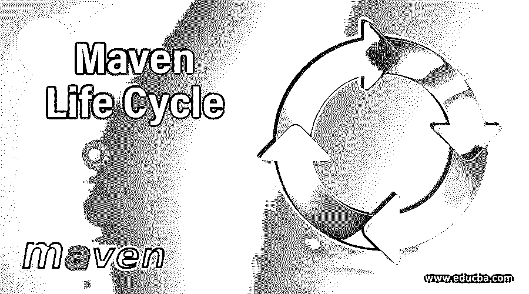
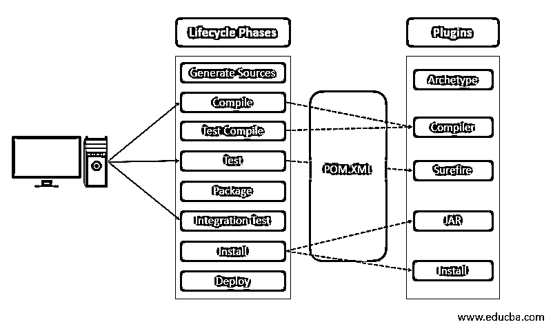
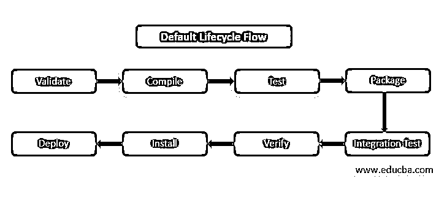
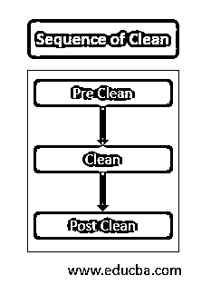

# Maven 生命周期

> 原文：<https://www.educba.com/maven-life-cycle/>

## Maven 生命周期简介

Maven 完全基于其构建生命周期的核心概念。这些构建生命周期是在每个阶段中明确定义的构建和分发特定项目的过程。

### Maven 生命周期

Maven 定义了 3 个构建生命周期

<small>网页开发、编程语言、软件测试&其他</small>

1.  默认生命周期
2.  干净的生命周期
3.  网站生命周期

Maven 允许一次执行多个生命周期阶段。每个生命周期都是相互独立的。如上所示，生命周期必须按顺序执行。完整的 maven 生命周期在核心模块的“component.xml”文件中定义。生命周期中的每个阶段都有一个独特的目标，

以下是生命周期阶段执行的目标/任务:

*   资源准备-将配置文件等资源复制到构建文件夹。
*   编译-编译源代码。
*   打包-将依赖关系 JAR 文件复制到构建文件夹。
*   运行单元测试。

Maven 生命周期的图形表示

#### 1.默认生命周期

这是 maven 最重要的生命周期之一。在这个生命周期中，Maven 构建、测试和分发。在这个生命周期阶段中执行 22 个阶段/任务。在下表中给出。

| **序列号** | **任务** | **描述** |
| **1** | 使生效 | 该阶段验证项目并收集所有与项目相关的信息。 |
| **2** | 初始化 | 这个阶段初始化或设置构建过程的属性。 |
| **3** | 生成来源 | 生成编译项目所需的源代码。 |
| **4** | 流程来源 | 此阶段将源复制并处理到目标目录和过滤器中。 |
| **5** | 生成资源 | 生成包中包含的资源。 |
| **6** | 流程资源 | 将资源复制并处理到打包过程所需的目标目录中。 |
| **7** | 编制 | 编译源代码。 |
| **8** | 流程类 | 这个阶段处理编译的源代码或类，以进行优化和字节码增强。 |
| **9** | 生成测试源 | 生成包含在编译阶段的测试源代码。 |
| **10** | 流程-测试-来源 | 测试程序的测试源代码和过滤值。 |
| **11** | 测试编译 | 测试编译后的源代码并复制到目标目录中。 |
| **12** | 过程测试类 | 处理测试编译阶段生成的文件。 |
| **13** | 试验 | 这个阶段使用合适的单元测试方法测试代码。 |
| **14** | 准备-包装 | 这是预包装过程。在实际包装过程之前执行必要的操作。 |
| **15** | 包裹 | 以指定的格式收集所有编译的文件和包。 |
| **16** | 预集成测试 | 此阶段执行实际集成(即环境设置)之前所需的流程。 |
| **17** | 集成测试 | 实际集成测试阶段。为集成测试部署必要的包。 |
| **18** | 集成后测试 | 在这一阶段，集成后测试过程像清理过程一样执行。 |
| **19** | 核实 | 这个阶段验证包的有效性和质量标准。 |
| **20** | 安装 | 这个阶段将包安装到本地存储库中。 |
| **21** | 部署 | 这个过程将最终的包部署到远程存储库中。 |
| **22** | 使生效 | 验证项目代码和包，以完成构建过程。 |

下图显示了默认生命周期中的流程流。

默认生命周期中的 Maven 命令示例

*   > mvn 编译
*   > mvn 验证
*   > mvn 干净编译
*   > mvn 包

#### 2.干净的生命周期

在清理生命周期阶段，它执行清理操作，删除构建目录名目标及其内容。要执行此操作，我们使用命令> mvn 清理。清理生命周期执行 3 种类型的清理操作-

1.  预清洗
2.  干净的
3.  后期清理

清理命令的执行顺序。

当我们调用任何 clean 命令时，maven 将执行当前的 clean 命令及其之前的 clean 进程。

**注:**

*   如果我们调用-command >mvn clean。Maven 将执行预清理和清理阶段。
*   以下是干净的命令序列-
*   > mvn 预清洗–它将仅执行预清洗。
*   > mvn clean–它将执行预清洗和清洗过程。
*   > mvn 后清洗–它将同时执行预清洗、清洗和后清洗。

#### 3.网站生命周期

网站生命周期主要处理项目网站文档的创建。

*   Maven 站点生命周期阶段。

1.  前置网站
2.  位置
3.  后期网站
4.  现场部署

站点生命周期执行的图形表示

| **Sr 号** | **名称** | **描述** |
| **1** | 前置网站 | 此阶段在实际站点之前执行流程。 |
| **2** | 位置 | 这个阶段执行实际的站点文档过程。 |
| **3** | 后期网站 | 此阶段执行最终确定站点生成和站点部署准备所需的过程。 |
| **4** | 现场部署 | 将特定站点生成的文档部署到 web 服务器中。 |

**注:**

*   执行站点生命周期中的一个阶段，导致执行该阶段之前的所有阶段。
*   如果我们调用站点命令> mvn 站点–它将执行站点前和站点阶段。
*   站点命令的顺序执行。
*   > mvn 前置-它将执行前置命令。
*   > mvn 站点–它将同时调用前站点和站点。
*   > mvn 后期站点–它将同时调用前期站点、站点和后期站点。
*   > mvn 站点部署–该命令执行站点前、站点、站点后和站点部署。
*   Maven 站点:站点目标通常被称为“站点”阶段。
*   Mavens 站点:部署目标被称为“站点:部署”目标。
*   通常> mvn clean site–用于清理和生成新文档。
*   > mvn clean site-deploy–通常用于清理项目站点并进行部署。

**Components.xml 文件**

`<Component-set>
<components>
<component>
<role>org.apache.maven.lifecycle.binding.LegacyLifecycleParsingTestComponent</role>
<implementation>org.apache.maven.lifecycle.binding.LegacyLifecycleParsingTestComponent</implementation>
<configuration>
<lifecycles>
<lifecycle>
<id>default</id>
<phases>
<phase>validate</phase>
<phase>initialize</phase>
<phase>generate-sources</phase>
<phase>process-sources</phase>
<phase>generate-resources</phase>
<phase>process-resources</phase>
<phase>compile</phase>
<phase>process-classes</phase>
<phase>generate-test-sources</phase>
<phase>process-test-sources</phase>
<phase>generate-test-resources</phase>
<phase>process-test-resources</phase>
<phase>test-compile</phase>
<phase>process-test-classes</phase>
<phase>test</phase>
<phase>prepare-package</phase>
<phase>package</phase>
<phase>pre-integration-test</phase>
<phase>integration-test</phase>
<phase>post-integration-test</phase>
<phase>verify</phase>
<phase>install</phase>
<phase>deploy</phase>
</phases>
</lifecycle>
<lifecycle>
<id>clean</id>
<phases>
<phase>pre-clean</phase>
<phase>clean</phase>
<phase>post-clean</phase>
</phases>
<default-phases>
<clean>org.apache.maven.plugins:maven-clean-plugin:clean</clean>
</default-phases>
</lifecycle>
<lifecycle>
<id>site</id>
<phases>
<phase>pre-site</phase>
<phase>site</phase>
<phase>post-site</phase>
<phase>site-deploy</phase>
</phases>
<default-phases>
<site>org.apache.maven.plugins:maven-site-plugin:site</site>
<site-deploy>org.apache.maven.plugins:maven-site-plugin:deploy</site-deploy>
</default-phases>
</lifecycle>
</lifecycles>
</configuration>
</component>
<component>
<role>org.apache.maven.lifecycle.mapping.LifecycleMapping</role>
<role-hint>test-mapping</role-hint>
<implementation>org.apache.maven.lifecycle.mapping.DefaultLifecycleMapping</implementation>
<configuration>
<lifecycles>
<lifecycle>
<id>default</id>
<phases>
<package>org.apache.maven.plugins………</package>
<install> org.apache.maven.plugins………</install>
<deploy> org.apache.maven.plugins………</deploy>
</phases>
</lifecycle>
</lifecycles>
</configuration>
</component>
<component>
<role>org.apache.maven.lifecycle.mapping.LifecycleMapping</role>
<implementation>org.apache.maven…….. </implementation>
<configuration>
<lifecycles>
<lifecycle>
<id>default</id>
<phases>
<package>
org.apache.maven.plugins………..
</package>
<install>org.apache.maven.plugins:maven-install-plugin:install</install>
<deploy>org.apache.maven.plugins:maven-deploy-plugin:deploy</deploy>
</phases>
</lifecycle>
</lifecycles>
</configuration>
</component>
</components>
</component-set>`

### 结论

Mavens 的默认插件和生命周期允许用户非常容易地执行构建操作。因为所有的生命周期配置都在 components.xml 中维护，所以它提供了更多的一致性和结构化的项目实现。使用配置文件，用户可以在初始阶段设置配置/目标，只是 pom.xml 文件中不需要更多的修改。考虑到配置文件中的所有三个生命周期，可以很容易地理解和区分各个生命周期阶段，而不会太复杂。

### 推荐文章

这是一本 Maven 生命周期指南。这里我们讨论一个简介，Maven 详细定义了 3 个构建生命周期缺省、清理和站点生命周期。您也可以浏览我们的其他相关文章，了解更多信息——

1.  [胃插件](https://www.educba.com/maven-plugins/)
2.  [Maven 面试问题](https://www.educba.com/maven-interview-questions/)
3.  [Maven 命令](https://www.educba.com/maven-commands/)
4.  [如何安装 Maven](https://www.educba.com/install-maven/)