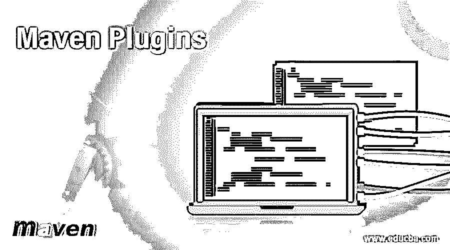

# 腹部插塞

> 原文：<https://www.educba.com/maven-plugins/>




## Maven 插件简介

Maven Plugins 是一个项目管理工具。Maven 基于项目对象模型，即 POM。maven 主要用作 Java 项目的构建自动化工具。Maven 可以和其他编程语言一起使用，例如:Ruby，scala 等等。插件是项目执行中真正发生动作的地方。

**例子**:编译代码、测试代码、创建 JAR/WAR 文件等…

<small>网页开发、编程语言、软件测试&其他</small>

### Maven 插件的类型

它提供两种类型的插件:

1.  **构建插件:**构建插件将在构建过程中执行，需要在 POM 文件的< build > < build/ >标签中配置。
2.  **报表插件**:报表插件将在站点生成时执行，需要配置在 POM 文件的<报表> <报表/ >标签中。

#### Maven 支持的不同插件

下面提到了 Maven 的一些不同的插件:

##### 1.Maven 的核心插件

引用默认阶段(即清理、编译)的插件也可能有多个目标。

| **Plugin Name** | **描述** |
| **安装** | 将构建工件安装到本地存储库中。 |
| **清洁** | 构建后清理。 |
| **编译器** | 编译 java 程序。 |
| **展开** | 将构建工件部署到远程存储库。 |
| **资源** | 将资源复制到输出目录，以便包含在 JAR 中 |
| **验证者** | 对集成测试有用-验证某些条件的存在。 |
| 万全之策 | 在独立的类加载器中运行 JUnit 单元测试。 |
| **故障保护** | 在独立的类加载器中运行 JUnit 集成测试。 |

##### 2.报告插件

这些插件生成报告并在生成生命周期下执行

| **Plugin Name** | **描述** |
| **Javadoc** | 为项目生成 Javadoc。 |
| **变更日志** | 从 SCM(软件配置管理)生成最近更改的列表。 |
| **变化** | 从问题跟踪器生成报告。 |
| **检查样式** | 生成检查样式报告。 |
| **停靠** | 文档检查器插件。 |
| **Doap** | 从 POM(项目对象模型)生成项目文件的描述。 |
| **Jdeps** | 在项目上运行 JDK 的 JDeps 工具。 |
| **JXR** | 生成源交叉引用。 |
| **PMD** | 生成 PMD 报告。 |
| **项目信息报告** | 生成标准项目报告。 |
| **万全之策——报告** | 基于单元测试的结果生成报告。 |
| **链接检查** | 生成项目文档的链接检查报告。 |

##### 3.包装工具/类型

这些与包装类型有关

| **Plugin Name** | **描述** |
| **耳朵** | 从当前项目生成一个 EAR(企业应用程序档案) |
| **EJB** | 从当前项目构建一个 EJB(企业 Java Bean)。 |
| **罐子** | 从当前项目构建一个 JAR (Java 归档文件)。 |
| **RAR** | 从当前项目构建一个 RAR (Roshal 档案)。 |
| **战争** | 从当前项目构建一个 WAR (Web 应用程序归档文件)。 |
| **来源** | 从当前项目构建一个 source-JAR。 |
| **Jlink** | 构建 Java 运行时映像。 |
| **App-客户端/acr** | 从当前项目构建 JavaEE 应用程序客户端。 |

##### 4.默认情况下，Maven 提供各种工具

默认情况下，这些工具可以通过 Maven 获得

| **Plugin Name** | **描述** |
| **Antrun** | 从构建的一个阶段运行一组 ant 任务。 |
| **组装** | 构建源代码或二进制文件的程序集。 |
| **原型** | 从原型生成一个框架项目结构。 |
| **依赖关系** | 依赖操纵和分析。 |
| **执行者** | 环境约束或用户自定义规则执行。 |
| 【t0”【gpg】t1 | 为文物和 POMS 创建签名。 |
| **帮助** | 获取有关项目工作环境的信息。 |
| **调用者** | 运行一组 Maven 项目并验证输出。 |
| **补丁** | 使用 gnu 补丁工具，将补丁文件应用于源代码。 |
| **PDF** | 生成 PDF 版本的项目文档。 |
| **插件** | 为源代码树中找到的任何 mojos 创建一个 Maven 插件描述符，以包含在 JAR 中。 |
| **发布** | 发布当前项目，更新 POM。 |
| **远程资源** | 将远程资源复制到输出目录，以包含在工件中。 |
| **单片机** | 为当前项目执行 SCM 命令。 |
| **阶段** | 协助发布筹备和推广。 |
| **工具链** | 允许在插件间共享配置。 |
| **供应链发布** | 将 Maven 网站发布到 scm 位置。 |

### Maven 插件的配置

插件的配置如下所示:

```
<project>
<groupId>com.org.educba.Example</groupId>
<artifactId>Jar_Name</artifactId>
<version>1.0-SNAPSHOT</version>
<packaging>Jar</packaging>
<name>Jar_Name</name>
<url>http://maven.apache.org</url>
<properties>
<project.build.sourceEncoding>UTF-8</project.build.sourceEncoding>
</properties>
<build>
<plugins>
<plugin>
<groupId>org.edu</groupId>
<artifactId>edu-maven-plugin</artifactId>
<version>1.2.4</version>
<executions>
<execution>
<goals>
<goal>bind</goal>
</goals>
</execution>
</executions>
</plugin>
</plugins>
</build&gt
<dependencies>
<dependency>
<groupId>junit</groupId>
<artifactId>junit</artifactId>
<version>3.8.1</version>
<scope>test</scope>
</dependency>
</dependencies>
</project>
```

*   在大多数情况下，插件应该添加在 build/plugin 部分。
*   在 build/plugins 部分直接添加插件是默认 maven 构建的一部分。
*   在构建/插件管理/插件中添加插件不是默认 maven 构建的一部分，它是一种管理。
*   pom.xml 中插件部分的排序在大多数情况下是不相关的。
*   构建/插件部分中的插件元素可能很重要。
*   Maven 3.0.3 版本的插件执行将按照它们在 pom.xml 文件中声明的顺序被调用，这个顺序是必需的，在这种情况下它可能会影响构建过程的行为。

### 结论

由于 [maven 是基于内置插件](https://www.educba.com/what-is-maven/)的架构；它使用户能够通过标准输入利用任何应用程序。插件是 Maven 的核心特性，允许在多个项目中重用公共构建逻辑。插件行为可以通过每个插件目标描述所展示的唯一插件参数来定制。

maven 最重要的特性之一是依赖管理，即自动更新和依赖关闭。它还能够同时处理多个项目。依赖项和存储库是项目存储库所需的外部 java 文件，即 JAR 文件，maven 会自动从中央 Maven 存储库下载存储库，并在缺少存储库时放入本地存储库。

### 推荐文章

这是一本关于 Maven 插件的指南。在这里，我们讨论了 Maven 中插件的基本概念和类型，配置插件以及 Maven 支持的一些不同的插件。您也可以浏览我们推荐的其他文章，了解更多信息——

1.  [Maven 生命周期](https://www.educba.com/maven-life-cycle/)
2.  [Maven 排除依赖关系](https://www.educba.com/maven-exclude-dependency/)
3.  [Maven Eclipse 插件](https://www.educba.com/maven-eclipse-plugin/)
4.  [梅文十拿九稳](https://www.educba.com/maven-surefire/)