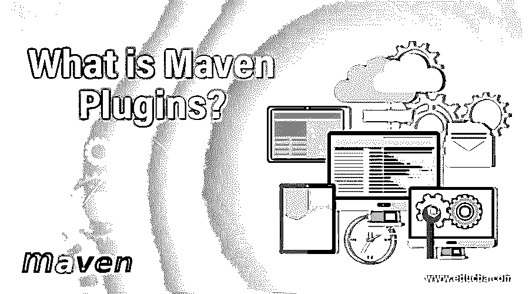

# 什么是 Maven 插件？

> 原文：<https://www.educba.com/what-is-maven-plugins/>

## 什么是 Maven 插件？

在本主题中，我们将了解什么是 Maven 插件，以及项目生命周期的不同方面，如报告、文档等，都可以通过一个名为 Apache Maven 的综合工具来管理，该工具基于主要的信息来源。

为了确保项目定义、开发和资源共享的清晰性，需要对项目进行标准化，这导致了 Maven 的出现。Apache Maven 的出现无疑简化了 Java 开发人员的工作，使他们的生活更加轻松。

<small>网页开发、编程语言、软件测试&其他</small>

在 Apache 许可下构建， [Maven 仓库由各种库组成](https://www.educba.com/maven-repository/)。它还确保避免任何与获取正确的 JAR 文件相关的冲突，因为它拥有所有必需的依赖项，如 Hibernate、spring 等。在它的仓库里。

在 Apace Maven 中，pom.xml 文件是最重要的文件，其中需要提到项目所需的依赖项，如[Hibernate](https://www.educba.com/hibernate-interview-questions/)。接下来是 ArtifactId 或 GroupId，它确保 Maven 中的每个项目都是唯一的。用于项目的包由 ArtifactId 和 GroupId 的组合来描述。

构建工具是 Maven 中的第一个子集，其中的构件被部署在服务器中，并支持构建工具的自动化和集成。接下来的任务是管理项目中的资源、插件和依赖关系，这是由依赖关系管理完成的。应该预先知道依赖关系的范围，以避免在为特定实例使用依赖关系时出现任何冲突。项目管理是 Apache Maven 的第三个子集，由 pom.xml 文件组成。适当的代码文档和关于各方面的信息，如缺少的任务、版本等。可以维持在这个阶段。在 Maven 中，不同项目之间保持一致性，因为每个项目都维护一个标准化的目录。

到目前为止，我们已经简要了解了 Maven 及其功能。接下来，我们将详细研究 Apache Maven 的插件。

### 腹部插塞

正如前面所看到的，Maven 提供了一种标准化的方法来维护每个项目，方法是证明所有必需的 JAR 文件，以及其存储库中的依赖项，并通过惟一的 id 将一个项目与另一个项目分开。

现在，Apache Maven 中的所有工作都是由插件完成的，因此通常被称为插件执行框架。插件分为:-

*   **构建插件**——在构建过程中，构建插件被执行，需要在 pom.xml 文件中的< build/ >元素中进行配置。
*   **报表插件—**POM . XML 文件有<报表/ >元素标签，需要在其中配置报表插件。在站点生成阶段，执行报告插件，因此插件被本地化和国际化。

[本地化是在网站生成阶段通过翻译一些下载的属性文件并翻译这些文件中的文本来适应不同语言的过程](https://www.educba.com/localization-vs-internationalization/)。

Apache Maven 插件是最新的，保存在 org/apache/maven/plugins/子文件夹中。包的组织遵循一个标准的目录结构，类似于 Java 包的命名约定。

以下是 Apache Maven 中的一些核心插件，它们主要用于清理、编译等阶段。

*   **清理**–一旦构建完成，这些插件会清理它。
*   **编译器**–Java 源文件由编译器插件编译。
*   **deploy**–构建的工件通过 deploy 插件部署到远程存储库。
*   **故障安全–**在一个独立的类加载器中，故障安全插件用于运行 JUnit 集成。
*   **install–**在这个插件的帮助下，构建的工件被安装到本地存储库中。
*   **resources–**JAR 的包含是通过使用这个插件将资源复制到输出目录来完成的。
*   **站点–**项目站点的生成是通过站点插件完成的。
*   **verifier–**为了验证某些条件，并确保集成测试，verifier 插件是有用的。

也有一些插件涉及到打包。

*   **ear**–当前项目通过 EAR 插件生成一个 EAR。
*   **ejb**–当前项目通过 EJB 插件构建一个 EJB。
*   **jar**–当前项目通过 JAR 插件构建一个 JAR。
*   当前项目通过 rar 插件构建了一个 RAR。
*   当前项目通过 war 插件构建了一个战争。
*   当前项目通过 war 插件构建了一个优步罐
*   **jlink–**Java 运行时映像就是由这个插件构建的。
*   **JMod—**Java JMod 文件就是由这个插件构建的。

除了构建和打包插件，还有报告插件。

*   **changelog**–一个项目可以有多个最近的变更，这些变更由 SCM 的 changelog 插件生成。
*   **变更**–用于从变更文档生成报告。
*   **doap**–项目描述对于确保工作的清晰非常重要。doap 插件允许从 pom.xml 文件生成它。
*   **docck**–使用 docck 插件检查所有文档。
*   javadoc–项目的 Java 文档是通过 javadoc 插件完成的。
*   **jxr–**源的交叉引用由 jxr 插件生成。
*   **linkcheck–**项目文档中有使用该插件生成的 link check 报告。
*   **pmd—**PMD 报告由 PMD 插件生成。
*   **项目信息报告**–标准格式的项目报告由此生成。

Maven 中还提供了几个默认的杂项工具。

*   **ant**–项目的 ant 构建文件由 Ant 插件生成。
*   **原型–**根据原型生成的框架格式的项目结构。
*   **依赖关系–**依赖关系通过依赖关系插件进行操作和分析。
*   **补丁–**使用 gnu 补丁工具将补丁文件应用于源代码
*   **release—**POM . XML 文件被更新，SCM 在项目发布后被标记。
*   **pdf–**项目的文档可以通过这个插件转换成 pdf 版本。
*   **scm-publish–**用这个插件将 Maven 构建的网站发布到一个 SCM 位置。
*   **stage—**确保发布后的试运行和推广。

### 结论

Apache Maven 有许多不同种类的插件，这些插件会及时更新，以确保手头任务的简易性。官方[网站](https://maven.apache.org/index.html)有一个丰富的列表，列出了所有插件和[它们的 GitHub 链接](https://www.educba.com/github-commands/)。

### 推荐文章

这是一个什么是 Maven 插件的指南。在这里，我们讨论了 Maven 插件的基本概念和一些常见插件及其功能的列表。您也可以浏览我们推荐的其他文章，了解更多信息——

1.  [什么是阿帕奇 Flink？](https://www.educba.com/what-is-apache-flink/)
2.  [Java 中的设计模式是什么？](https://www.educba.com/what-is-design-pattern-in-java/)
3.  [胃插件](https://www.educba.com/maven-plugins/)
4.  [Maven 生命周期](https://www.educba.com/maven-life-cycle/)