# Maven 标志

> 原文：<https://www.educba.com/maven-flags/>

## Maven 标志简介

Maven 标志是我们在 maven 命令中使用的命令行选项。根据我们的需求，我们可以使用 maven 命令来使用多个命令行选项。在使用 maven 命令时，运行 maven 最流行的方式是指定目标。Maven 提供了多个命令行选项来定制我们在项目中使用的 maven 命令的行为。

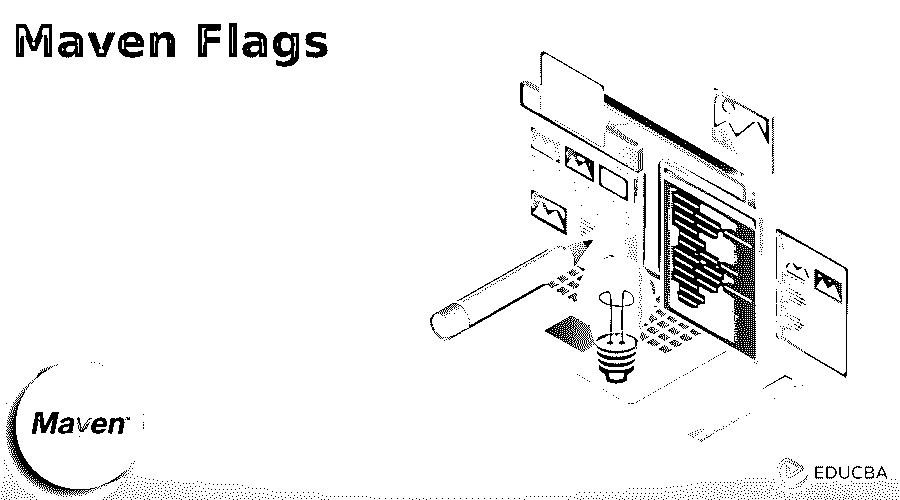


### 关键要点

*   在使用 maven 项目时，我们使用了多个命令行选项。Maven 包含多个我们可以在 maven 项目中使用的命令。
*   使用 maven 命令，我们还可以使用选项来管理任何系统中的 maven 应用程序。

### 什么是 Maven 标志？

maven 标志将从指定的属性或值开始变化，以改变 maven 输出或其详细程度。maven 有助于了解用于解决 maven 中出现的问题的多个参数。在使用 maven 标志时，我们需要打开终端并执行带有标志的 maven 命令。

<small>网页开发、编程语言、软件测试&其他</small>

如果假设我们还没有在我们的系统中安装 maven，那么首先我们需要在我们的系统中安装同样的东西。我们可以从官网下载 maven 包。我们可以使用 maven 标志更新应用程序配置、资源和源代码。执行 maven 命令后，应用程序的更改会自动执行。这在开发 UI 和数据库时很有帮助；这些变化会立即反映出来。Dev 模式通过使用后台编译来启用部署，我们可以说，当我们修改资源中的 java 文件时，更改会自动生效。

### Maven 标志是如何工作的？

在处理 maven 标志时，我们必须在系统中安装 maven。在下面的例子中，我们已经在系统中安装了 maven，所以我们不需要再次安装它。我们可以使用下面的命令检查我们的系统中是否安装了 maven。此外，我们可以使用如下相同的命令来检查 maven 版本。

**命令:**

```
mvn –version
```

**输出:**

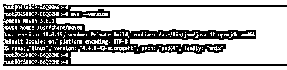


maven 将按照我们在项目中执行的命令工作。为了使用 maven 标志，首先，我们需要如下创建 maven 项目。我们使用命令行构建一个 maven 项目，如下所示。原型生成命令用于创建新项目，如下所示。

**命令:**

```
mvn archetype:generate
```

**输出:**

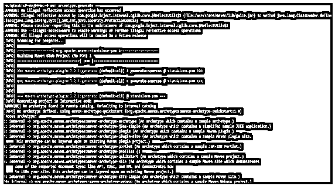


在上面的例子中，我们可以看到我们已经使用 maven 原型创建了一个项目；在创建项目的时候，我们需要提供关于创建项目的细节。在下面的例子中，我们运行 mvn clean 命令来检查这个命令是如何工作的。

**代码:**

```
mvn clean
```

**输出:**

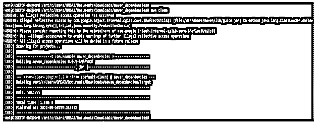


### Maven 标志–命令行选项

下面是我们在 maven 项目中使用的 maven flags 命令行选项。

#### 1.mvn 编译器:编译

这个命令行选项用于编译 maven 项目中 java 的源类。

**命令:**

```
mvn compiler:compile
```

**输出:**

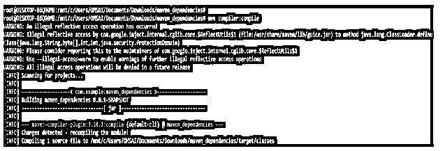


#### 2.mvn 编译器:测试编译

这个命令行选项用于编译 maven 项目中 java 的测试类。

**命令:**

```
mvn compiler:testcompile
```

**输出:**

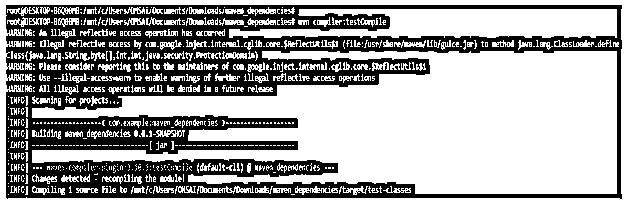


#### 3.mvn 包

这个命令行选项用于从 jar 或 war 文件构建 maven 包。

**命令:**

```
mvn package
```

**输出:**

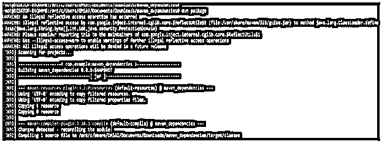


#### 4.mvn 安装

这些命令行选项用于构建 maven 项目并安装 jar 或 war 文件。

**代码:**

```
mvn install
```

**输出:**

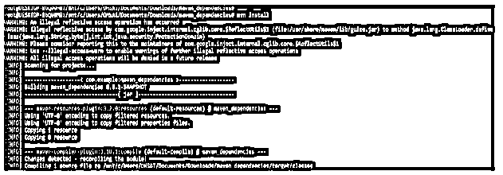


#### 5.mvn 部署

此命令行选项用于部署远程存储库。

**代码:**

```
mvn deploy
```

**输出:**

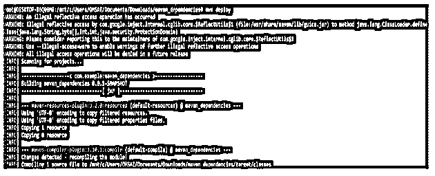


#### 6.mvn 验证

这个命令行选项用于验证 maven 项目。

**代码:**

```
mvn validate
```

**输出:**

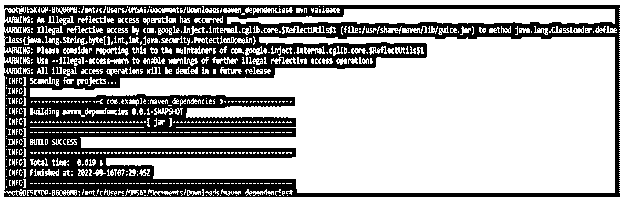


#### 7.mvn 相关性:树

该命令生成依赖关系树。

**代码:**

```
mvn dependency:tree
```

**输出:**

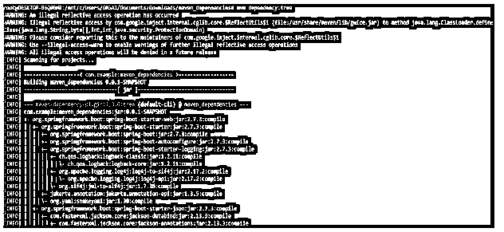


#### 8.mvn 相关性:分析

该命令将分析已使用和未使用的依赖项。

**代码:**

```
mvn dependency:analyze
```

**输出:**

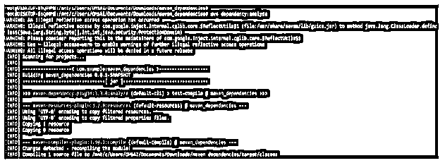


#### 9.mvn 试验

这个命令使用 surefire 插件运行项目的测试用例。

**代码:**

```
mvn test
```

**输出:**

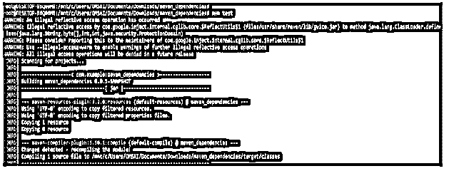


#### 10.mvn 编译

该命令用于编译 java 项目的源类。

**代码:**

```
mvn compile
```

**输出:**

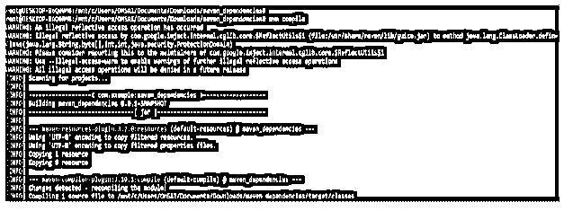


### Maven 标志命令

下面是我们在开发 maven 应用程序时使用的 maven flag 命令，如下所示:

#### 1.mvn 验证

该命令用于构建项目并用于运行测试用例。

**代码:**

```
mvn verify
```

**输出:**

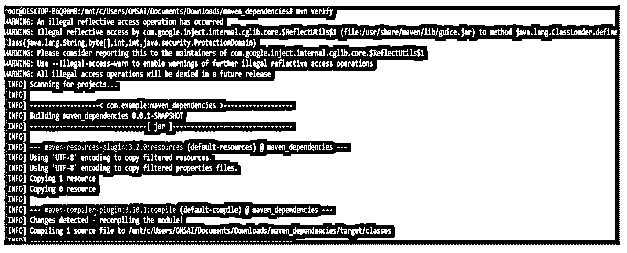


#### 2.mvn-帮助

该命令打印所有 maven 用法和所有可用选项。

**代码:**

```
mvn –help
```

**输出:**


#### 3.mvn–o 包

这个命令离线运行 maven 构建。

**命令:**

```
mvn –o package
```

**输出:**

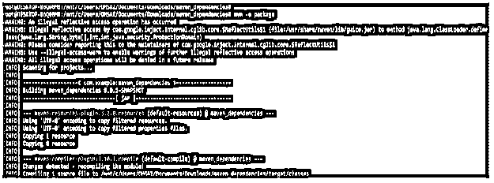


#### 4.mvn–X 包

该命令用于构建测试用例结果的安静模式。

**命令:**

```
mvn –q package
```

**输出:**

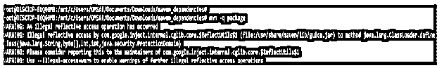


#### 5.mvn–v

这个命令打印 maven 版本信息。

**代码:**

```
mvn –v
```

**输出:**

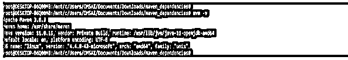


#### 6.mvn–X 包

这个命令打印 maven 版本，并使用调试模式运行构建。

**代码:**

```
mvn –X package
```

**输出:**

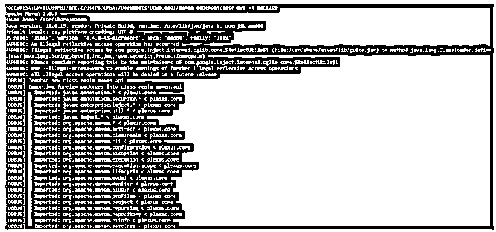


#### 7.mvn–o 全新安装

该命令用于检查依赖项是否在线更改。

**命令:**

```
mvn –o clean install
```

**输出:**

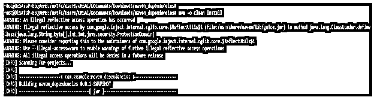


#### 8.全新安装-T4

这个命令用于指示 maven 我们正在执行并行构建，T4 意味着有四个过程可用。

**代码:**

```
mvn clean install –T4
```

**输出:**

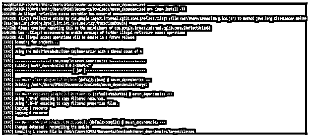


### Maven 标志的示例

下面提到了不同的例子:

#### 示例#1

下面是一个 maven 标志的例子。在下面的例子中，我们定义了如何使用 maven 标志。在下面的例子中，我们正在创建一个新项目。

**命令:**

```
mvn archetype:generate
```

**输出:**

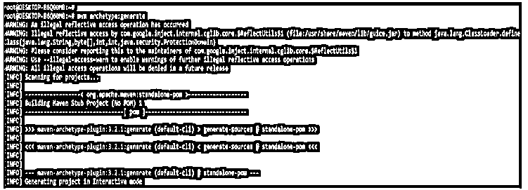


#### 实施例 2

在下面的例子中，我们正在执行 maven 的 help 命令。它将显示如下所有可用的选项。

**命令:**

```
mvn –help
```

**输出:**

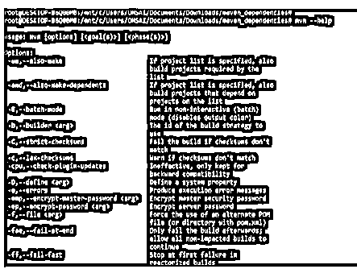


#### 实施例 3

在下面的例子中，我们使用 maven 命令检查 maven 版本。

**命令:**

```
mvn -version
mvn -v
```

**输出:**

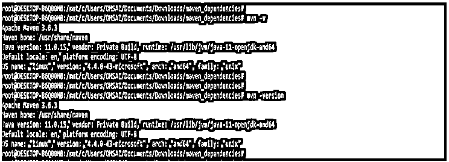


#### 实施例 4

下面的示例显示了用于构建 maven 项目的 clean install 命令。

**命令:**

```
mvn clean install
```

**输出:**

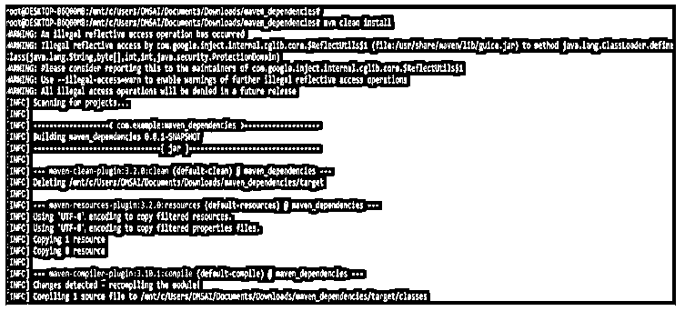


#### 实施例 5

以下示例显示了用于验证所有项目依赖项的 verify 命令。

**命令:**

```
mvn verify
```

**输出:**


### 结论

maven 标志将从指定的属性或值开始变化，以改变 maven 输出或其详细程度。Maven 标志是我们在 maven 命令中使用的命令行选项。根据我们的需求，我们可以使用 maven 命令来使用多个命令行选项。

### 推荐文章

这是一本关于 Maven Flags 的指南。这里我们讨论简介、工作、maven 标志——命令行选项、示例和常见问题。您也可以看看以下文章，了解更多信息–

1.  [Maven 构建命令](https://www.educba.com/maven-build-command/)
2.  [Maven 战争插件](https://www.educba.com/maven-war-plugin/)
3.  [Maven 简介](https://www.educba.com/maven-profile/)
4.  [Maven 版本](https://www.educba.com/maven-versions/)


