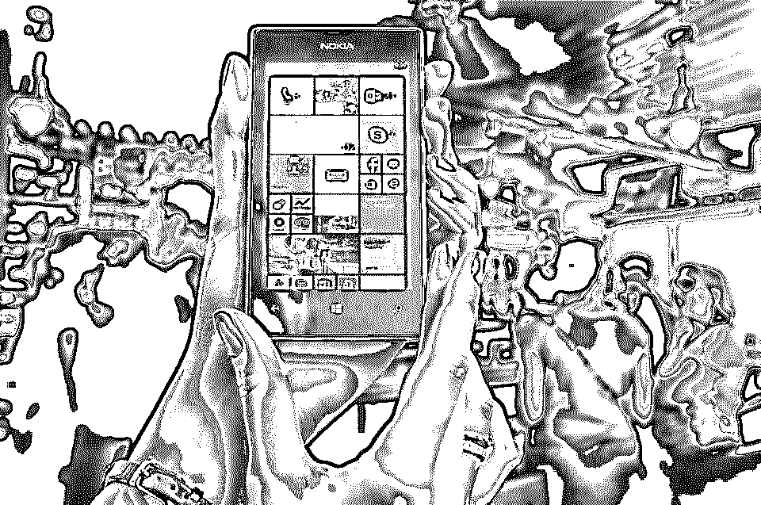
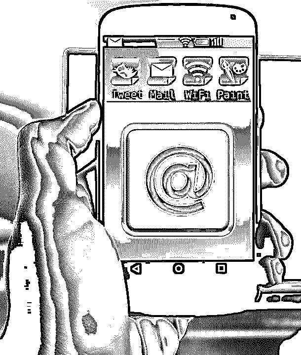
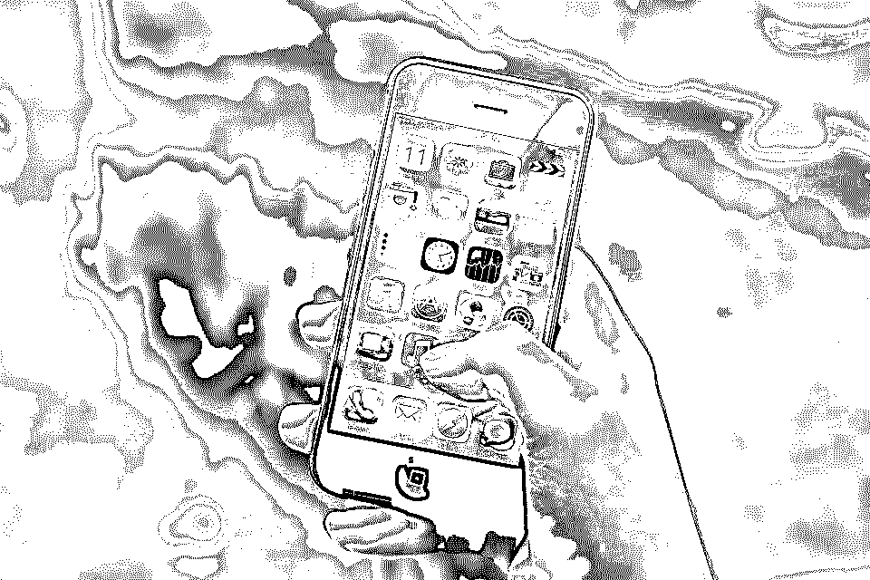
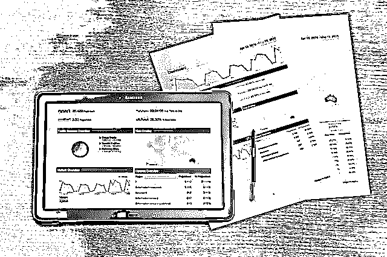

# 关注 32 个最棒的移动应用博客

> 原文：<https://www.educba.com/mobile-app-blogs-to-follow/>

## 最佳移动应用博客介绍

得益于为移动应用开发提供的令人惊叹的博客，跟上移动世界的趋势和发展是很容易的。根据易用性和适用性进行排名，这些移动应用博客是开发人员、软件专业人员和应用程序开发者的真正乐趣。请继续阅读，了解所有值得关注的最佳移动应用博客。

### 前 32 名阅读关于移动应用开发的博客

以下是阅读关于移动应用开发的博客:

<small>网页开发、编程语言、软件测试&其他</small>

#### [1。The Verge:](https://www.theverge.com/) 伟大的科技博客

这是一个很棒的技术博客，但他们的移动部分胜过一切。无论你考虑的是评论、特写、讨论还是业务。还有一个高质量的博客直播团队，负责 iPhone 发布会和其他科技世界活动。因此，您可以随时了解移动应用程序世界的最新发展。

#### [2。Engadget](https://www.engadget.com/) :全能

这个博客是一个技术全才。从演示和预览到应用程序和不同类型设备的评论，您可以使用 Engadget 轻松地将应用程序放在上下文中。

#### [3。生活黑客](https://lifehacker.com/):应用世界

LifeHacker 确保技术爱好者的生活变得更加轻松。就移动应用程序而言，LifeHacker 测试了所有的第一手资料，并对其进行了全面的评估。您可以更深入地了解如何在日常环境中利用应用程序来提高效率和生产力。

#### 4.连线:关注技术的视觉方面

如果你对技术的设计和视觉方面感兴趣，Wired 是适合你的博客。你可以深入到最喜欢的应用程序和与之相关的公司的幕后。如果你想了解更多关于移动应用的细节，这是一个可以访问的完美博客。

#### 5.了解你的手机:深度信息

这个博客包含了你需要知道的关于手机的一切。像平板电脑、[手机应用程序](https://www.educba.com/top-6-best-iphone-apps-of-all-time/)和联网设备。您还可以访问该网站在线销售的不同手机和平板电脑。

#### [6。Mashable](https://mashable.com/?geo=GB) :科技博客

如果你想什么都要一点，Mashable 是你正确的选择。从突发新闻到技术评论、应用程序系列和独特的一般特性，Mashable 为精通技术的用户提供了各种体验。

#### 7 .[。疾风](https://www.flurry.com/blog/):数字游戏

如果你喜欢统计学，Flurry 应该是最佳选择。每当关于移动应用统计的研究发布时，你都可以访问 Flurry 来了解真相。他们的总结也非常好的措辞和非常合理。

#### 8.GigaOm:信息手机频道

这是一个信息丰富、内容全面的移动频道，揭示了运营商、设备和应用的真实复杂性。您可以在此获得大量关于规格、应用功能和设计内容的信息。

从移动设备到运营商和应用程序，这一移动渠道涵盖了大量的技术创新。

#### 9.AppAdvice:应用程序的最新数据

所有最新的手机应用程序都可以在这个博客网站上找到。您可以在手机、平板电脑、电视或游戏应用程序上获取最新信息。热门应用列表和应用评论以及您可以访问的免费应用也可以共享。如果你想要最新的应用程序信息，这是最适合你的网站。

#### 10.所有技术考虑:高水平的技术新闻

所有技术都名副其实。你可以在网上获得关于网络应用和移动文化的最新信息。用户还可以通过技术播客了解最新的新闻、观点和趋势。

#### 11.Yapp:首席通信技术

Yapp 让用户随时表达他们对所有移动事物的看法。从展示流行和喜爱的应用程序到展示和重新想象应用程序世界，这个博客在许多方面都是不寻常的，其最独特的功能是为技术人员提供发言权和分享新应用程序的功能。

#### 12.下一个网络:全球技术视角

Next Web 是一个大型在线出版物。它专门研究 It、文化、商业和移动领域的技术观点。TNW 拥有每月 5100 万次访问和 700 万次页面浏览的庞大网络。这种全球技术视角的最大好处是，人们能够表达他们的感受，并在技术协同中团结起来，没有缺乏清晰度的空间。

#### 13.TechCrunch Mobile:剖析新技术产品

通用 TechCrunch 网站的移动部分主要介绍移动技术领域的技术产品和公司。用户不仅促进新兴和现有的网络技术，他们还采用新的趋势，并利用技术来提高工作生产率和效率。

#### 14.Intomobile:发布最新科技新闻

如果你想要手机和技术方面的最新新闻、信息和分析，这个技术网站是你的最佳选择。该网站非常适合技术驱动的消费者和爱好者，以及专业人士和早期采用者。这个移动应用程序博客网站迎合了来自不同网站的大量用户，他们长期以来一直在努力寻找移动应用程序技术信息的一站式商店。

#### 15.移动营销观察:密切关注技术

这是一家位于洛杉矶的通信公司，雇佣独立作家的员工，通过读者互动和内容编辑自由来完成编辑自由。你可以触及移动生态系统的不同领域，从广告到技术和医疗保健。

#### 16.谷歌移动博客:搜索技术答案变得简单

这是来自全球最大的搜索引擎巨头谷歌移动团队的官方新闻和笔记部分。只期待能创造奇迹的高质量信息和提示。

#### 17.移动新闻在线-领先的移动行业来源

移动在线新闻是一个基于英国的移动应用博客。它提供了行业新闻和观点的主要来源。专注于移动技术应用的社交商，这个英国博客网站提供了一个与众不同的视角。

#### 18.文本:技术博客的入口点

这是面向覆盖手机和移动内容所有方面的 4 个博客的入口点。从关注短信到跟踪手机使用情况以及技术的社会学和心理学影响，对于希望从不同角度看待技术的用户来说，这是一个不寻常的博客。

#### 19.移动趋势:移动媒体世界

这个博客关注移动媒体的生活方式，以及关于任何移动事物的趋势、观点和想法。对于那些想要深入研究移动媒体世界和社区的人来说，这是一款完美的应用。

#### 20.Techdirt Wireless:不同寻常的见解

本博客分析并提供对标志着影响公司创新和发展能力的政府政策、法律和技术问题变化的新闻故事的见解。这个移动应用博客已经成为福布斯等领先期刊的许多奖项的主题。

#### 21.企业移动论坛:过多的数据

企业移动基金会是与企业移动论坛相关的组织。该基金会成立于 2010 年，为用户提供了大量关于移动行业和企业移动性的信息。该网站还涵盖了战略网络。

#### 22.99Designs:首屈一指的移动应用程序设计网站

这是获得有创意的移动应用程序设计者的完美网站。设计技巧和深入的教程可以指导你关于商业运作以及创造性的灵感。

#### 23.产品搜索:推广移动应用

成功开发移动应用的下一步是推广这些应用。产品搜索可以被认为是令人惊叹的产品和创业公司的 Reddit。对推出的最佳移动应用进行审查，以确保对反馈和流量的关注。

#### 24.下一步发布:建立应用宣传

如果您想在发布之前推广或建立移动应用程序，请考虑通过发布 Next 来提交应用程序以供审查。大量的应用程序被提交，你有一群愿意冒险上钩的观众。

#### 25.Springwise:为了突破性的应用

Springwise 只与最好的应用程序相关联，你可以肯定这个产品移动应用程序发布网站旨在获得对该产品的支持。那些发布移动应用程序的人拥有大量懂技术的受众。

#### 26.创业推介——试用该应用的受众

要想在创业推介中脱颖而出，你需要能够在移动应用博客网站上销售你的应用。它为你提供了一个公平的视角，让你了解如何销售和营销应用程序，以获得潜在买家或用户的最大回应。

#### 27.网络应用曝光率

Netted 不仅仅是面向消费者的应用。这个移动应用博客网站也有一个时事通讯，介绍所有被选中的应用，并为它们提供报道。它还提供定期的简讯综述，这样就可以通过网络来审查在不同方面具有可比性的应用程序。

#### 28.Startuplist:构建应用程序如下

这个移动应用博客以只展示最新应用而闻名。除了简短的描述，链接可以包含所有社交媒体链接，你甚至可以参与围绕该应用程序的讨论。

#### 29.SuS:创业公司使用创业公司

这是一个很棒的网站，为创业公司提供有用的应用。作为开发人员，您可以提交已经创建和使用的应用程序。Startups 使用 Startups 提供了一个令人印象深刻的应用列表，你可以在上面破解。

#### 30.Betalist:推广应用的好地方

拥有近数百名订阅者和一个不同寻常的邮件列表，你可以加快你的应用程序的推广速度。注册是免费的，你可以使用这个网站的精彩功能开发和启动应用程序。

#### 31.AppStorm:致力于移动平台

这个移动应用程序网站涵盖了不同类型的移动平台的不同部分，应用程序可以进入特定的平台。如果你想获得应用评论，AppStorm 是一个完美的网站。它亲自审查申请，并定期向不断增加的邮件列表发送综述通讯。

#### 32.评价我的创业:应用社区

评价我的创业公司是独一无二的，因为你的应用程序在社区中很受欢迎，并投票决定他们有多喜欢你的应用程序。你也可以让你的应用程序成为特色，提交的内容会严格按照价值来考虑。

### 结论——移动应用博客

基于移动应用程序开发生命周期的不同阶段，有很多网站可以帮助开发者。但是把干草和谷壳分开是一项艰巨的任务。如果你准备好迎接挑战，网上有如此多的选择，找到一个完美的网站就像大海捞针。但是，如果你想抓住时机，开发销售和推广自己的应用程序，这些移动应用程序博客提供了联网和发布产品的绝佳机会。设计移动应用程序本身也是一门艺术。一个 app 卖得好的原因有很多，线上推广只是其中之一。如果产品的特点不符合标准，它就卖不出去。免费的移动应用也是如此——用户只有在满足所有需求和要求的情况下才会依赖它们。

在线移动应用博客分为不同类别。这包括推广博客网站以及评论博客网站。这样的网站对用户和开发者都有巨大的潜力。在线网站也有助于加深对应用程序背后的编程的理解。如果你精通软件，并希望赶上应用程序的潮流，这些网站可以为用户提供全面和权威的指南。

开发者只有具备技术知识和创造力，才能在开发应用程序的艺术上出类拔萃。这就是为什么在线移动应用博客网站受到青睐的原因，因为它们提供了对高效应用开发、推广和使用至关重要的社区和资源的访问。总而言之，这些博客对提升你的幸福指数大有帮助！

### 推荐文章

因此，这里有一些相关的文章，这将有助于您获得更多关于 Android 手机应用程序的细节，所以只需浏览下面给出的链接

1.  [移动营销协会](https://www.educba.com/mobile-marketing-association/)
2.  [手机应用博客关注](https://www.educba.com/mobile-app-blogs-to-follow/)
3.  [安卓生产力](https://www.educba.com/android-productivity/)
4.  [面向每个博客作者的安卓谷歌应用](https://www.educba.com/android-google-apps-for-every-blogger/)

