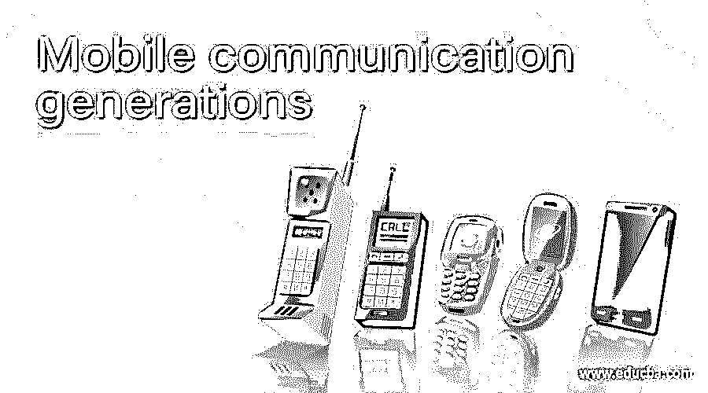
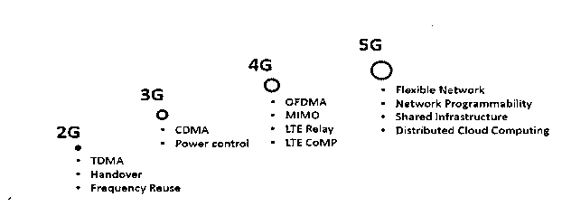
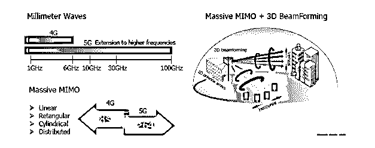

# 移动通信世代

> 原文：<https://www.educba.com/mobile-communication-generations/>

## 移动通信世代介绍

移动电话通信设置中最近的任何变化都被称为代。移动电话的变化包括创建允许电信网络运营商提供服务的电子网络所需的系统、功能、特性和互连，这些变化被称为移动通信代。在移动通信系统中，数据传输和接收、信息路由和数据管理是移动电话的几个方面。

### 移动通信世代

1983 年推出了第一款用于商业用途的消费手机。从那以后，移动技术在功能上经历了许多变化和改进。这种进步大部分可以归功于工程技术的改进。这种技术已经被证明是稳定、准确、制造成本低廉且易于维护的。

<small>网页开发、编程语言、软件测试&其他</small>

移动电话服务的变化和宽带接入服务的变化在经济方面都发生了全面的变化，包括对宽带市场竞争的影响。

让我们详细讨论已经发布并用于商业目的的不同代。

#### 第一代(1G)技术

在这一代技术中，移动通信仅通过用于传输用户数据的模拟信号来完成。无线行业已经经历了一个数字化的阶段，在这个阶段中，用户今天通过有线 PC 使用的许多设备都连接到互联网。1G 技术主要用于和设计用于语音通信目的。美国陆军在 20 世纪 80 年代末开始使用 VoIP(IP 语音)技术，为战时的士兵创造了一种新的通信方式，这种第一代 VoIP 系统可以被认为是通信领域的突破。然而，这些系统并不实用，因为许多语音通话不可用，包括政府通信。它是一个模拟语音通信系统，由两个麦克风、一个放大器和一个信号发生器/调制器组成，称为互联网协议语音。这种数据传输方法只需使用电话线就能与任何其它设备进行通信。当用户通过电话连接他的设备时，他将通过电话线连接到其他人。这种联系为双方提供了相同的信息。因此，接收器和发送器共享信息。

#### 第二代(2G)技术

第一次在移动电话中使用数字信号传输信号是在第二代移动通信时代。这一代的手机能够传输音频和视频。该技术已在 60 多个国家使用，并已在北美和欧洲得到广泛应用。2G 在某种程度上彻底改变了移动通信行业，尽管网络速度仅限于 64kbps，但大量数字信息正在共享。

引入了 GPRS 技术，它在通过电子邮件和其他使用稍高网络速度的网络服务传输更多数据方面变得非常有用。2G 技术中的文本消息 SMS 特征在当时被广泛使用并且非常流行，并且它允许许多用户占用频带，这使得它更加有效。

#### 第三代技术

在这项技术中，真正的革命发生了，网络速度提高到 2 兆兆位/秒，这使得高速浏览、游戏、电子邮件和其他网络服务成为可能。3G 技术创造了一个场景，在这个场景中，新的移动电话被开发并销售，具有主要的广告功能。这使得用户成为一个核心人群，对于移动服务提供商来说非常重要。由于所有现有的移动网络现在都必须运行最新的操作系统和硬件，移动电话的数量从 1998 年的约 6 亿部增加到今天的近 100 亿部。数量庞大的手机正在改变电信的面貌。如今，移动运营商每年只需销售 100 万部智能手机，即移动行业总销售额的 1%。这给技术带来了一些负面影响，移动塔和服务的基础设施设置变得很高，移动电话变得昂贵，大多数人都买不起。

#### 第四代(4G)技术

在 3G 过渡之后，下一次演进随着 2011 年移动宽带和移动数据的引入而发生，在这一年引入了 4G。4G 比被认为是一场革命的 3G 高了一步。有了 4G，运营商可以创建一个“超高速”网络，这样即使在 2G 速度下，也能在 30 秒内提供快速、可靠的下载。4G 的网速已经提升到了 100Mpbs。这项技术使得高速游戏、高清移动电视、数字流媒体、高清电视服务、云计算等成为可能。4G 在竞争对手服务不足的地区以更低的价格提供更快的数据速度，并提供更广泛的蜂窝网络。4G 推出后，智能手机的发展变得非常受欢迎，2013 年后生产的所有设备都支持 4G 功能，这使得 4G 技术覆盖了更广泛的受众。4G 技术正越来越多地在 3G 和 3G-LTE 网络中推广。随着技术的成熟，支持 4G 发展的设备和应用数量将大幅增加，从今天的大约 1 亿台设备增加到 2020 年的超过 15 亿台设备。

4G 为用户提供了许多功能特性，例如多任务处理、丰富内容浏览和即时通话等高级用户功能。一种新的无线多媒体接入方式。一种直接从内存上传照片和视频的新方法。能够与朋友分享和查看在线内容。能够从移动设备传输内容并在旅途中使用，等等。

#### 第五代(5G)技术

5G 的无线演进正在通过合作和协调的方式解决资源分配的问题。基本上，5G 是无线蜂窝技术的标准，由 3GPP 开发。5G 正在追随 3G 和 4G 技术的脚步。5G 网络基于连接无线路由器、智能手机和其他通信设备的标准。5G 在延迟、传输速度和灵活部署方面都有很大改善。与 4G 无线网络相比，5G 提供了额外的功能。下图显示了从 2G 到 5G 网络的变革是如何完成的。

5G 支持多种技术。为了满足即将到来的应用需求，这一雄心勃勃的规范意味着在 4G 基础上的性能显著提高。5G 的吞吐量是 10Gbps，比 4G 快 100 倍。在下面的例子中，我们可以看到 5G 与 4G 相比的网络分布。

实施新网络需要完整的 5G 网络。运营商的投资和对耗时的考虑将使全面推广成为可能。5G 革命使得 5G 服务可以由现有的 LTE 基础设施提供。在 5G 革命中，我们预计现有的商业模式和经济将发生重大转变，特别是在垂直行业。5G 包含定制和可扩展的网络。与 4G 相比，它将包含较高的 KPI。5G 网络包含可靠性、区域流量容量、延迟和可用性方面的高级 KPI。

### 结论

我们已经详细讨论了一般的移动通信代和已经推出的用于商业目的的不同代。从第一代到最新的第四代到第三代，移动电话在向用户提供的功能和服务方面有了很大的发展。只有通过移动通信技术的这些革命性变化，我们今天看到的世界才有可能实现。

### 推荐文章

这是一个移动通信代指南。在这里，我们讨论了一般的移动通信代和不同的代。您也可以看看以下文章，了解更多信息–

1.  [手机应用软件](https://www.educba.com/mobile-application-software/)
2.  [移动自动化测试](https://www.educba.com/mobile-automation-testing/)
3.  [手机应用开发工具](https://www.educba.com/mobile-app-development-tools/)
4.  [手机 SEO](https://www.educba.com/mobile-seo/)

