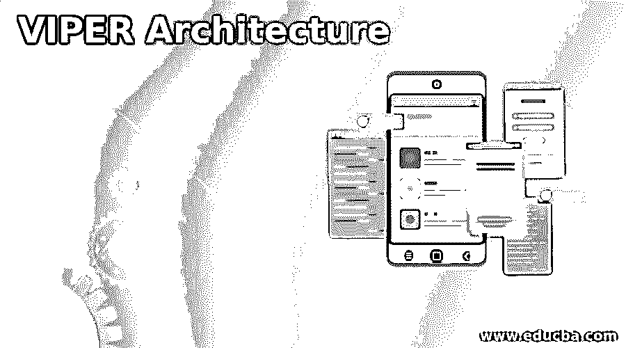
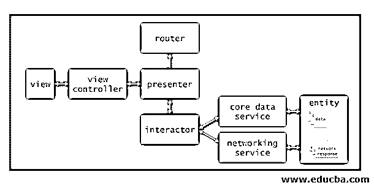

# 毒蛇建筑

> 原文：<https://www.educba.com/viper-architecture/>

## VIPER 架构简介

下面的文章提供了 VIPER 架构的概要。用于解决任何特定问题或情况的通用模板是基于软件设计模式的。这些架构模式对整个代码有巨大的影响，这些代码是完全通用的。VIPER 是 iOS 设计模式和可靠基础设施之一。这种方法对设计代码很重要，但是它有一些内置的逻辑，这些逻辑合并起来形成一个逻辑方法，输入到一个架构中。VIPER 用于开发许多大型项目和应用程序。

### 带有图表的 VIPER 架构

在构建 iOS 应用程序时，测试并不是那么重要。但是在应用中进行测试是困难的。因此开发 VIPER 是为了在应用程序架构中增加测试软件的方法。VIPER 为所有移动和软件组件中的 iOS 应用程序提供了定义的架构。VIPER 被扩展为视图、交互器、表示器、实体和路由。VIPER 的这种已定义的体系结构将应用程序的逻辑结构分离到不同的层中，并内置了各自的职责。

<small>网页开发、编程语言、软件测试&其他</small>

因此，它使得应用程序和进程在每一层之间的边界上划分依赖性和跟踪通信。VIPER 的独特层通过提供精确的位置和逻辑上的应用程序以及导航的相关代码来支持。随着 VIPER 的应用，示例中的视图控制器是 mean、lean 和 display 控制机器。代码易于测试和理解；它用于定期维护。VIPER 的体系结构依赖于单一责任原则，该原则被用作构建干净体系结构的定理。

### VIPER 架构的组件

VIPER 体系结构的重要核心元素如下所示:

*   视图是坚持 UIKit 文件的接口部分，ui kit 文件位于 UIVIEW 控制器和所有其他调度的子类中。组件视图不执行任何与业务逻辑相关的事情。它是提交者实现的转发部分和表示层。因为视图用于管理基于 MVVM 原则的控制器或数据管理员，以更简洁地增强项目和应用。
*   interactor 是一个负责任的组件，用于从模型层撤销数据，其实现过程不依赖于用户界面。重要的是，数据库、网络和传感器上的所有数据执行程序都不是 VIPER 部分的一部分，而是被视为单独的组件，这些组件是从外部组件接收到 VIPER 模块的服务，它们可以作为交互器的附加组件插入。交互器可以制定从服务层接收的数据。它可用于在任何传入的网络服务保存数据之前过滤或排序数据。工具交互者对数据的准备和演示者的责任没有概念。
*   presenter 是 VIPER 模块的核心类。在这里，UIKit 独立类以视图和对来自视图的 UI 事件的决策所需的适当格式来制定数据。它被称为事件管理器。它与交互器进行交互，并要求路由器为路由目的对线路进行成帧。演示者的重要角色是与来自类的所有组件进行交互并完成任务。它不能控制 UIKit 或最低级别的数据模型。然而，它是应用程序的关键部分，所有的业务逻辑都在这里实现。
*   实体被定义为由交互器执行的简单模型类。例如，VIPER 模块的外部是一个实体，它是分布在整个系统中的服务层。但是它没有把模块分开，模块不能在一个地方生成。相反，它类似于核心数据模型可以生成的虚张声势的概念。
*   路由器是用于 UIKit 类中导航逻辑的组件。如果用户在两个应用程序上使用相同的 iPad 和 iPhone 视图，这会改变路由器的结构。它使用户能够在不干扰路由器的情况下维护一切。它引导演示者的导航流程，并显示所需的正确屏幕。如果需要选择任何外部链接，则调用 URL 以内部调用路由器。它是 routing action 的一部分，在社交媒体上实现了类似的逻辑来共享 UIactivityviewcontroller 的功能。如果用户必须在 VIPER 模块之间共享数据，那么它是在路由器中执行的合适位置。所以它一般是一个代表团之间交流的模式。因此，代理功能在路由器中实现。
*   Builder 习惯于通过为外部服务注入依赖来开发整个模块。因为很少有管理员将路由器用于建筑目的。因此，开发一个相关模块来构建和模拟特定模块的另一个版本。此外，生成器支持单元测试，这有助于提高流程和应用程序的生产率。

### 优势

以下是 VIPER 架构的优势:

*   尽管 VIPER 因其复杂性而受到批评，但它还有许多其他显著的优点。所以实现 VIPER 来设计我们的软件工具有很多好处。
*   它为更高维的团队和复杂的项目提供了简单性。
*   VIPER 的可伸缩性是线性的，并且持续工作以执行许多并行操作。
*   VIPER 的代码是可重用的，并且根据组件的职责分解成许多组件。
*   VIPER 的清晰性和一致性被用于模块的分离。
*   VIPER 提供了简单的错误修复、可测试性和源代码控制。因为代码块很小，所以调试容易且更快。模块是用描述良好的接口范围构建的。具有纯代码的简单源代码控制具有较少的用于跟踪问题和 bug 位置的冲突。

### 推荐文章

这是一个蝰蛇架构的指南。这里我们分别用图表、组件和优点来讨论 Viper 架构。您也可以看看以下文章，了解更多信息–

1.  [安卓 VPN 应用](https://www.educba.com/vpn-applications-for-android/)
2.  [安卓生产力](https://www.educba.com/android-productivity/)
3.  [安卓是什么？](https://www.educba.com/what-is-android/)
4.  [安卓版 mob dro](https://www.educba.com/mobdro-for-android/)

