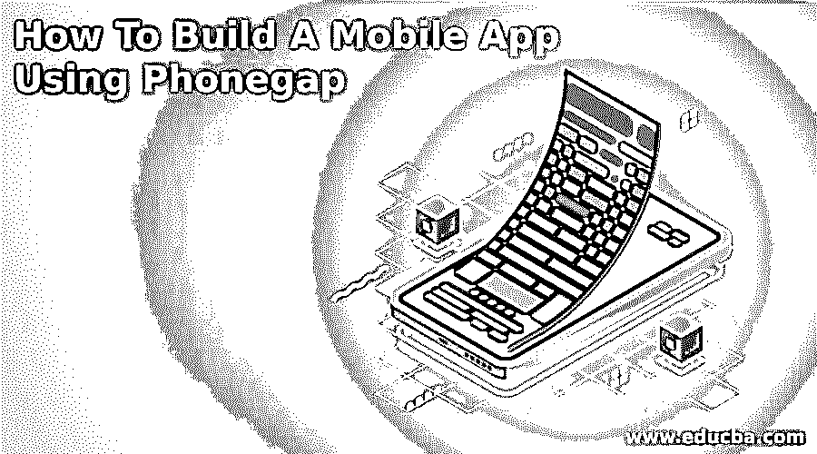
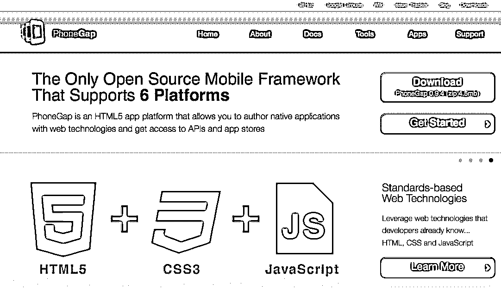
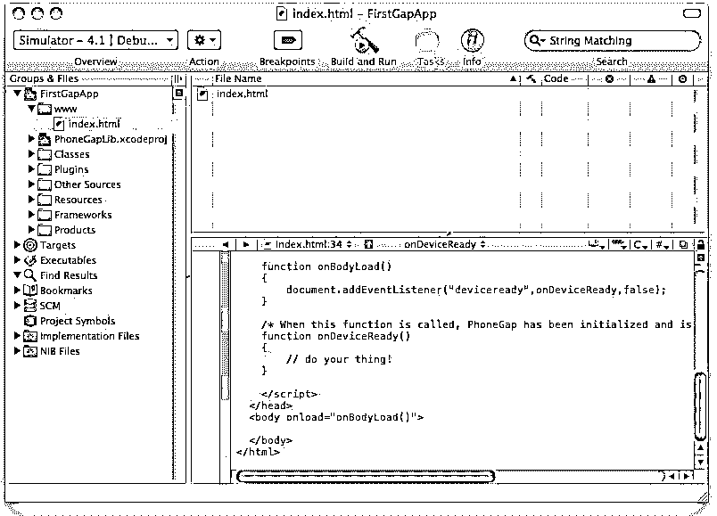
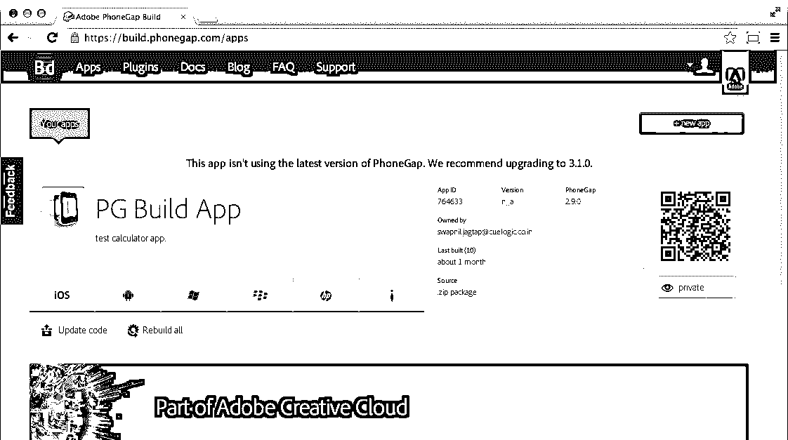
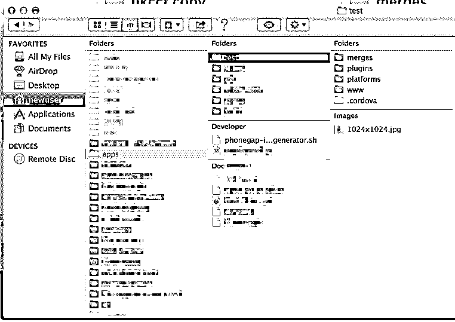
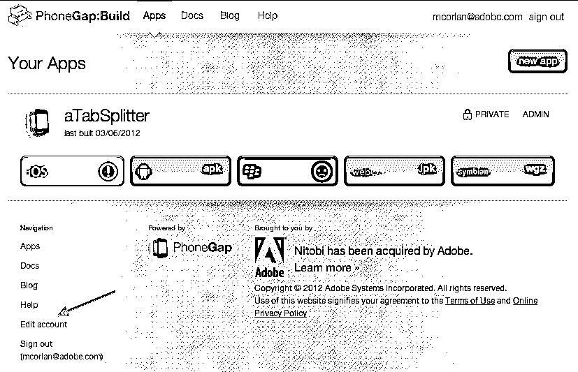

# 如何使用 Phonegap 构建移动应用程序

> 原文：<https://www.educba.com/how-to-build-a-mobile-app-using-phonegap/>

## 如何用 Phonegap 搭建手机 App？

PhoneGap 是一种主要用于构建移动应用程序的软件。Adobe System 设计了这个软件。该软件的一个优点是应用开发者不需要任何关于[移动编程语言](https://www.educba.com/mobile-app-programming-language/ "8 Best Mobile App Programming Language")的知识。你只需要了解各种 [web 开发语言](https://www.educba.com/web-development-software/ "Career as a Web Development Professional")，比如 HTML、CSS 和 JavaScript。事实上，它还提供了一个好处。您可以使用 PhoneGap 为所有广泛使用的移动操作系统开发移动应用程序，包括 Windows、 [Android](https://www.educba.com/google-android-services/ "10 Best Features in Google Android") 、 [iOS](https://www.educba.com/5-tips-of-ios-8-every-apple-fan-should-know/ "5 tips of iOS 8 every Apple fan should know") 和 Blackberry。以下文章提供了通过 Phonegap 开发移动应用程序的简单而全面的技术。

所有想在线和离线访问他们的网站的程序开发人员都可以阅读这个有用的指南。它为你提供了一个借助 PhoneGap 搭建 app 的简单流程。因此，如果你正在寻找开发一个新的用户友好的移动应用程序，那么请继续阅读。

<small>网页开发、编程语言、软件测试&其他</small>

### 需要哪些东西？

为了使用 Phonegap 开发一个应用程序，首要的要求是 HTML、CSS 和 JScript 的知识。这将有助于设计一个可以安装应用程序的网站。除此之外，使用 PhoneGap 不需要任何编程。

 

随着软件工程行业的蓬勃发展，程序员正在寻求设计有效的应用程序，这些应用程序可以在高级编程语言的帮助下高效运行。这些移动应用程序既方便又友好。它们可以随时随地使用。重要的是要记住，移动电话和个人电脑的架构应用几乎是相同的。两者都有定制的硬件和固件，并在操作系统的帮助下运行。

### 从程序开始

Phonegap 是开发应用软件的重要且广泛使用的软件。这些程序基本上获得了一个框架，通过使用标准的 web APIs 来帮助它们完成任务。您可以在所有操作系统中构建应用程序。此外，你可以免费下载该软件。您需要应用您的 HTML、CSS 和 JavaScript 知识，剩下的交给 Phonegap。这将有助于为应用程序提供复杂的外观，并关注不同操作系统的可移植性。

 

在 PhoneGap 的帮助下，你可以为所有主要的操作系统开发移动应用程序，无论是 Android、苹果 iOS、Windows 还是黑莓。你不需要成为专家，也不需要对所有这些操作系统有很好的了解。你也不需要从一开始就知道任何关于编程的知识。事实上，这个任务在这里变得容易多了。你只需要在网站上上传数据信息，它就会自动转换成不同的应用程序文件。

然而，为了首先在线构建任何操作系统的应用程序，你必须创建一个基本设置，以便应用程序开发变得容易。虽然你可以通过使用 Cordova 命令行界面和 Github 存储库程序等离线工具来制作应用程序，但最好选择简单的过程。由于 PhoneGap 支持 HTML、CSS 和 JavaScript，所以你必须选择这些技术。

### 为 Android 操作系统构建应用程序

如果你想为 Android 操作系统开发一个应用程序，必须确保该设备支持安装在谷歌 Play 商店以外的应用程序。只需遵循以下程序

*   转到设置。
*   打开 PhoneGap 安全页面，然后允许来自未知来源的应用程序。

如果你想在 Google Play 商店出售你创建的移动应用程序，你必须签署一份证书，该证书将提交给 Android Market。然而，测试过程并不容易。

 

### 苹果 iOS

如果你试图使用 PhoneGap 为苹果 iOS 移动版开发一款应用，那么首先需要一个开发者账户。你将不得不购买它，这将花费你每年约 99 美元。然而，你需要等待一两天，因为该帐户将首先被审查，然后才被苹果公司批准。但是如果没有账号，会耽误测试进程。一旦您获得帐户，您需要创建一个临时的基础上的个人资料，然后签署证书。这很简单。你只需要按照说明去做。

### PhoneGap For Windows

如果你试图为 Windows 操作系统开发一个应用程序，与 Android 和苹果 iOS 相比，这个过程相当复杂。这里你必须使用最新的 Windows 安装程序。然后遇到 PhoneGap 桌面设置向导。完成该过程并继续安装 PhoneGap 开发人员应用程序。

有了临时配置文件和证书后，下一步就是将它们上传到 PhoneGap Build。这需要在点击您的个人资料后完成。你可以在右手的上侧找到它。现在导航到编辑帐户并选择“签名密钥”。上传个人资料时，您必须提供密码。根据新的规则，每次你想打开钥匙时都必须输入密码。

需要记住的是，任何移动应用程序都应该具有以下功能，包括-

### 配置

基于网络的应用程序只需要一个足够精确的配置文件来配置设置。它包含组装应用程序所需的所有信息。它可以通过给定的小部件来说明。

### 小工具

所有配置内容都包含在<widget>标签中。让我们简单讨论一下</widget>

**<widget id = " app _ id ">**

该 id 保留在不同的应用商店中。

**< widget 版本= "x.y.z" >**

这就是应用程序的版本号。这里 x.y.z 是格式，也是正整数，如 1.0.0。它表示主要-次要-修补程序版本系统。

**<名称> App 名称</名称>**

这表示正在开发的应用程序的名称，该名称位于手机屏幕上的应用程序图标下方。任何使用手机的人都可以通过输入这个名字找到这个应用。

**<描述>我的第一个 Web App</描述>**

它提供了应用程序的描述，并告知应用程序是什么。

**<作者>作者 _ 姓名</作者>**

显而易见，它讲述了应用程序的创建者或开发者。在大多数情况下，用户通常会找到推出该应用程序的公司或组织的名称。

**<首选项 name = "权限" value = "无">**

首选项标签在很多方面都很有用。它用于设置应用程序的功能，包括全屏、背景颜色以及方向。您可以在名称和值对中找到这些选项。这里你也不需要任何高级设置。

**<图标>**

在应用程序中添加图标非常重要。你可以用多种方式编码。的。src 路径正在通知图标图像。另一方面，gap: platform 表示操作系统的平台。差距:限定词决定了 android 操作手机的密度，而 iOS 使用宽度和高度。

### 核标准情报中心

你已经很熟悉各种手机的尺寸各不相同，即使它们使用相同的操作系统。不同的手机消费者对应用程序的选择有不同的选择，所以你必须提供各种手机的所有图标。另一个重要因素是根据操作系统创建图标的形状和大小。为了更好地解释这一点，让我们举一个例子

**RES/icon/IOs Andres/icon/Android/drawable-xxxx..**

如果你想提高你的任务的速度，那么最好开发一个尺寸为 1024×1024 的标志，然后访问网站 makeappicon.com。通过这个网站，你可以为 iOS 和 Android 操作系统设计徽标。前面已经提到，大多数移动应用软件版本都是由旗舰组织和个人开发人员开发的。

 

显而易见，最流行和最广泛使用的移动操作系统包括-

*   Windows 操作系统
*   机器人
*   黑莓
*   苹果手机操作（iOS：iPhone OS 的缩写）

此外，除了这些，还有许多其他操作系统目前可用。所有这些操作系统在市场上都很容易买到。但是，它们在移动应用程序中的用法可以通过图形表示来解释。

每个操作系统都提供了自己的一套工具和软件，程序员可以用它们来构建一个应用程序并成功运行它。但是，有些移动应用程序是专门为特定操作系统创建的，无法在其他平台上运行。例如，你一定见过许多不能在 Windows 手机上运行的 android 应用程序。

开发一个可以成功运行所有类型操作系统的应用程序通常是一项艰难而又忙乱的任务。另一个具有挑战性的任务是为应用程序提供复杂的外观和感觉。如果您对所有类型的操作系统及其特定工具有足够的了解，您将永远处于有利的地位。

在所有的操作系统中，Android 是最受欢迎的。其中一个好处是，你可以用电子邮件发送 zip 格式的所有标志。

实际上，您可以将一个离线网站复制到本地硬盘上，以后再访问它。不需要互联网连接。这个离线 PhoneGap 应用程序帮助开发一个也可以在手机上访问的应用程序。它包括一个应用程序，其中有不同的故事集、简短的教程或任何其他离线内容。用户可以离线阅读所有内容。

### 离线应用

离线应用程序由 PhoneGap 文件夹结构组成。它在根目录中只有两个文件。

config.xml 包含应用程序配置设置，index.html 包含网页内容的主页。然而，在这里重要的是要记住所有与 HTML 文件相关的链接都应该有一个相对路径。没有这样的绝对路径或基本标记。

### 在线应用程序

对于在线应用程序，数据文件夹不存在。主要原因是所有的文件都在实际的服务器上，你可以通过互联网访问它。您已经知道，index.html 由包含 web 服务器的实际链接组成。一旦应用程序的模式被决定，其文件被组织，文件必须使用标准的压缩工具压缩，然后保存它。

### 签署您的应用程序

**** 

网站开发者或相关组织必须签署应用程序并维护秩序。这就是为什么你必须签署该应用程序。这里重要的需求是关键工具，它是 java 发行版的一部分。

以下命令将有助于生成 my_keystore-PhoneGap 密钥库文件:

**keytool-genkey-v-keystore my _ keystore . keystore-alias TutorialsPoint-keyalg RSA-keysize 2048-validity 10000**

接下来，是时候组装第一个基于 web API 的快速模式 app 了。你也应该知道网页内容转换成 app 格式的流程。你可以从在线应用商店上传。这里需要注意的是，PhoneGap 只接受在 Github 或 AdobeID 上开发的登录。Github 被定义为一个仓库，用户在其中上传内容，并通过 URL 引用来使用它们。

### 如何制作 Adobe ID？

为了创建一个 ID，你只需要遵循简单的步骤-

*   登录到**构建。[phonegap.com](https://phonegap.com/)T3】点击注册，进入新窗口。**
*   提供您的所有详细信息，然后单击注册。使用相同的用户 id，您也可以使用 PhoneGap。
*   现在单击 Upload a .zip 文件并上传。包含 web 内容和配置的 zip 文件。
*   所有操作系统，除了你正在开发的应用程序，将无法进一步处理，因为你没有给一个签名的密钥。
*   单击操作系统的图标，然后添加一个密钥。

然而，在上传应用程序之前，它需要在虚拟或真实设备上进行彻底的测试。

### 推荐文章

这是如何使用 Phonegap 构建移动应用程序的指南。这里我们已经讨论了基本概念，离线和在线应用程序，以及如何分别制作 adobe ID。您可以阅读以下文章了解更多信息——

1.  [iOS 8 每个苹果粉丝都应该知道](https://www.educba.com/5-tips-of-ios-8-every-apple-fan-should-know/)
2.  [如何使用 Phonegap 构建移动应用](https://www.educba.com/how-to-build-a-mobile-app-using-phonegap/)
3.  [手机应用分析工具](https://www.educba.com/mobile-app-analytics-tools/)
4.  [移动设备管理软件](https://www.educba.com/mobile-device-management-software/)

