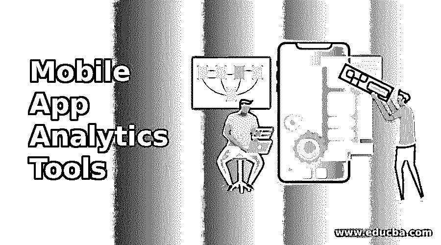
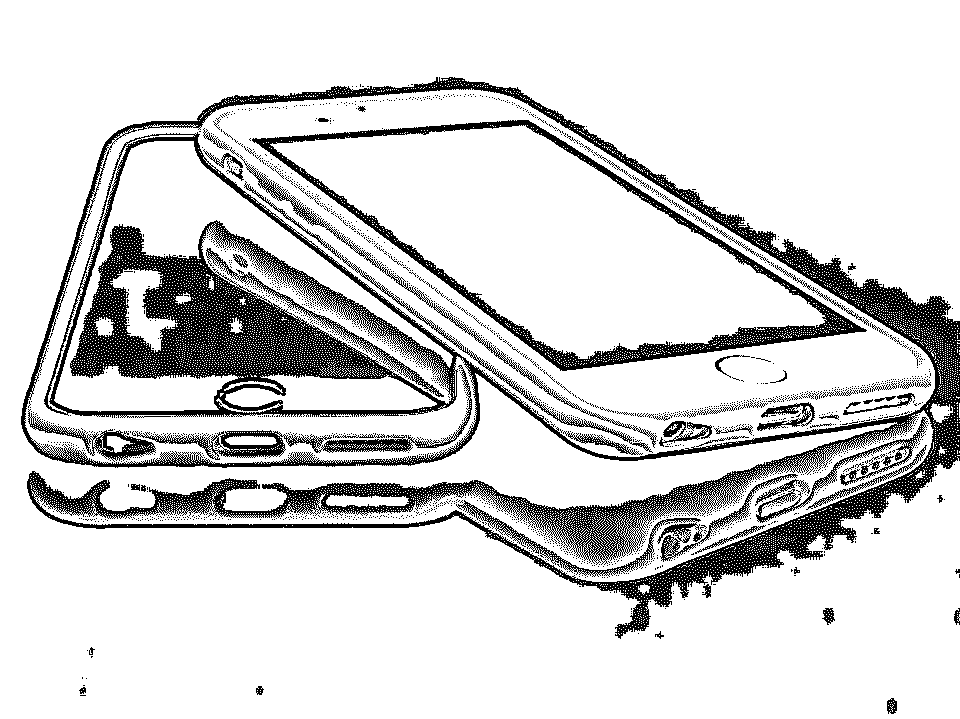

# 移动应用分析工具

> 原文：<https://www.educba.com/mobile-app-analytics-tools/>

## 移动应用分析工具简介

随着新发明和创新的出现，移动行业正在飞速发展。每周都有新品牌的手机推出，现有的移动通信每年都在发生重大变化。获得高回报和可观的利润是这里的目标。在该领域投资的企业家可以获得不错的回报。制作应用程序是应用程序开发最重要的方面之一。下面讨论一些最重要的移动应用分析工具，它们可以帮助你在行业中产生巨大的影响。

### 行业移动应用分析工具

以下是一些行业移动应用分析工具——详细对比:

<small>网页开发、编程语言、软件测试&其他</small>

#### 1.AppsGeyser

这是一款移动应用分析工具，对于 Android 应用环境下的移动应用开发至关重要。这是一个构建应用程序和发布应用程序的工具。它运行良好，并与谷歌 Play 商店同步。一旦应用程序被创建出来，它就可以被推向市场，并从中获得金钱利益。这个应用程序开发工具非常适合开发应用程序和文档程序。

#### 2.AppGyver

这些移动应用程序分析工具配备了有利于应用程序开发的双重功能，即原型和类固醇。虽然 prototyper 有助于上传线框和定义点击完成后的动作(这是面向通信的应用程序的一个主要优点)，但第二个功能是用于制作 HTML5 应用程序。该应用程序的这两个功能确保了优秀的移动应用程序开发。

#### 3.卡普里萨

这款移动应用分析工具是 Mozilla Firefox 的插件，名为 Capriza Designer。它是一个完全与浏览器相关联的应用程序，因此包含一个附加组件。这确保了该过程变得无缝，因为来自其他网站的想法和公式在使应用程序工作中起着关键作用。Capriza 消除压力，确保有效的功能。

#### 4.阿佩尔。超正析象管(Image Orthicon)

这是一个完美的移动应用程序分析工具，适合那些想要开发复杂和错综复杂的应用程序的人。这很容易实现，并且整个包可以应用到软件开发中。这既容易使用又容易学习。这是制作应用程序的完美工作，以质量、性能和设计而闻名。

#### 5.科罗纳实验室

这是一个移动应用程序分析工具，用于推广制作游戏应用程序的二维技术。Corona Labs 是市场上价格最合理的移动应用分析工具之一。

#### 6.阿萨纳

这是一个新的项目管理工具，该应用程序通过将对话和任务结合在一起，使团队能够在没有电子邮件的情况下工作。每个任务的进度通过一个移动设备分配给团队成员，而且是免费的。

#### 7.收获

这是最好的客户可以选择，以保持跟踪费用。Harvest 不仅有助于时间跟踪，还有助于跟踪客户支出。它还为理解在众多任务上花费的本质提供了更多的空间。

#### 

8。崇高文本 3

这是目前处于测试阶段，是最令人惊讶的应用程序开发工具，具有光滑的界面和令人敬畏的功能，使编辑代码和标记变得简单快捷。这个 app 工具有什么了不起的？它适用于 Linux、Windows 和 Mac，也可以免费下载和使用。

#### 9.代码套件

Code Kit 是一个强大的应用程序开发工具，它与 Stylus、Jade、Haml、JavaScript 和 Markdown 文件兼容。代码工具包有助于创建惊人的网站真的很快。

#### 10.图像优化

使用这款应用程序开发工具，可以更轻松地压缩和保存图像。图像质量保持一流，移动应用程序的速度和功能也有所改善。

#### 11.UXPin

这是顶级的应用程序设计和开发工具之一。它非常适合创建手机和网络应用程序的原型，也可以用草图和 Photoshop 文件创建。拖放功能可以处理任何大小或分辨率的图像。这个应用程序开发工具的另一个优势是，图像可以即时共享，并为从自由职业者到小企业主的每个人创建完美的一揽子交易。

#### 12.Adobe XD

这曾被称为彗星计划。它是一个旨在设计和构建移动应用程序以及网站的工具。这些创新的移动应用程序设计工具非常适合那些想要通过点击鼠标从设计切换到原型的人。团队成员还可以查看和提供重要的反馈。

#### 13.视觉

这是一个设计协作移动应用程序工具，可用于原型网站以及移动应用程序。有一个完整的评论系统，人们可以了解项目的状态。有两种用户——设计师和利益相关者或者客户。虽然设计者可以查看和编辑，但客户只能查看。但是，如果应用程序创建过程是一个交互式的过程，这种应用程序开发和设计工具有许多好处。

那些有原型链接的人可以进入并讨论设计的各个方面，这个应用程序开发工具最棒的部分是它提供了版本控制，可以撤销初始阶段不需要的更改。

#### 14.奇迹

这是一个网络开发工具，用户可以将纸上草图转化为交互式原型，用于演示应用程序。原型也可以与相关的个人分享，漫威与他们合作得很好。pds 文件也是如此。协作允许设计师在屏幕上发表评论，并了解设计环境中发生了什么。

#### 15.PopApp

那些有工作原型的人最好选择 PopApp。设计师和应用程序开发人员可以充分利用这个应用程序开发工具。原型制作可以在没有网页设计专业学位的情况下开始。这个平台简单而强大，并提供有趣的功能，如用于将草图链接在一起的设备。通过 PopApp，草图和小组讨论变得很容易，每个变化都可以在这种背景下进行讨论。

#### 16.加速器

这是一个支持跨平台原生移动应用开发的移动参与平台。JavaScript 是这里使用的 MBaaS，以及崩溃检测和移动测试自动化以及性能处理。

#### 17.PhoneGap

这是一个了不起的移动应用程序分析工具，用于将 HTML5 应用程序包装在本机容器中，使其成为课程开发人员和具有 web 开发技能的人的首选。目前的技能可以用来制作跨平台或 HTML、CSS 以及 JavaScript 混合应用程序。移动应用程序也可以通过设备连接到开发机器，以查看其他平台(如 Sencha)的应用程序的变化。这些移动应用分析工具可以跨 Mac、Windows 和 Linux 平台使用。

#### 18\. Xamarin

这是一个本地应用程序创建者。Android 开发者可以使用 Tamarin 创建他们最好的产品。它的原生用户界面、原生 API 访问以及跨不同平台(不仅仅是 Android)的原生性能都有很好的记录。可以使用 Xamarin 创建本地应用，Xamarin 为整个平台的用户提供了一个交互式仪表板。这款开发工具允许应用程序开发人员测试应用程序，发现错误，并在应用程序运行时获得实时崩溃报告和用户反馈。

#### 19.建筑火灾

这是一个非常棒的应用程序制作工具，因为它允许应用程序开发人员在几分钟内开发出专业的应用程序。这个自己动手的应用程序开发工具甚至不需要应用程序创建的技术技能。第一步包括选择应用程序的外观和感觉，以便用户可以从预先制作的布局和背景颜色以及图像中进行选择。从品牌到颜色和字体以及图标风格的一切都可以选择。也可以从该工具上的列表中选择小部件，并且稍后可以修改设置。

#### 20.Mobincube

Mobincube 是一款价格合理的 app 开发工具。这些计划允许用户进行本地化，并将作品上传到应用商店。HTML5 模块也可以添加到应用程序中，移动应用程序构建工具以有竞争力的价格购买，这是一笔不错的交易。

#### 21.好理发师

使用这些移动应用程序设计工具来构建应用程序简直是小菜一碟。它用于设计应用程序、添加内容、检查结果和发布应用程序。这是一个经过时间考验的平台，用于为手机和平板电脑创建最佳应用，该工具的一个优势是可以实时进行原生应用测试。开发人员也可以编辑后端并快速查看结果。

#### 22.应用你自己

这是一个非常贴切的应用程序开发工具的名字，它让用户可以创建智能手机应用程序以及移动和桌面网站。应用程序开发人员可以以非常低的价格使用这个工具。这个应用开发者提供了多达 30 种不同类型的模块来创建应用。还有许多模板…应用程序创建过程不需要编码。在这个平台上，Web 和本地应用可以轻松地结合在一起。

#### 23.本地化

这是一个移动应用程序分析工具，提供实时参与和分析，还提供终身跟踪。漏斗管理也可以通过这个应用程序创建工具来实现，它提供了智能定位、用户洞察和市场自动化。

#### 24.科恰瓦

这是一个领先的应用程序获取和数据跟踪工具。应用程序属性实时跟踪和报告是通过这个应用程序完成的。它是专门为游戏应用程序创建的，显示了移动广告网络的投资回报。这是一个简单、灵活、稳定的工具。

#### 25.谷歌分析

这是跟踪网站和应用程序的完美移动应用程序分析工具。谷歌分析是使用最广泛的分析服务，通过网站、离线渠道和移动应用程序收集数据。这些移动应用程序分析工具可以免费使用，并允许跨平台链接，而不是谷歌产品。定制的仪表板可以基于需要首先看到的数据，可以识别最佳用户，也可以检测人们从哪里搜索你的网站或使用你的应用程序的区域。

#### 26.优化

通过 Apptimize，可以轻松完成应用程序的移动测试。不需要编码，应用程序可以根据特定子集即时发布和推广。除了可视化过程和获得反馈外，这款移动应用构建工具还为用户提供了一个免费开始的机会。

#### 27.机器人工厂

这是一个用于 Android 应用程序灰盒测试的开源框架。主要目的是找出无效使用或应用程序结构不良导致的缺陷。

#### 28.维生素

这些移动应用构建工具优化了专业应用营销活动的创建。有一个无限的应用程序视频库可供选择，Apptamin 对游戏来说也很棒。

#### 29.阿佩里

这是一个基于云的移动应用构建器。它可以在 iOS、Windows 和 Android 手机上使用，包括 Apache Cordoba，可以访问内置的组件。插件和移动云平台提供了易用性和便利性。

#### 30.移动道路管理员

这个应用程序创建者允许用户管理他们的 iOS 或 Android 应用程序，并且该平台支持不同的媒体类型。RSS、Google News 或 Twitter 关键字的自动导入和粉丝聊天平台使其成为完美的应用开发工具。它可用于准确预览应用程序，并在提交过程中获得指导。API 是语言不可知的，所以可以使用不同公司的数据，包括 JSON、HTML 和 PHP。

#### 31.应用构建器

此应用程序创建移动应用程序构建工具提供了一套适合员工和客户的应用程序，您可以使用在线工具包和提供的培训，也可以使用 App Builder 自动构建应用程序并填充初始内容。通过应用程序库，用户可以了解多个应用程序，并对它们进行定制。您还可以使用此应用程序开发工具在不同的移动平台上发布。

#### 32.苹果馅饼

这是一个基于云的 DIY 移动应用程序创建工具，允许用户在没有编程技能的情况下工作，但能够跨平台创建应用程序，并在 Google Play 或 iTunes 上发布这些应用程序。不需要安装或下载。修订是实时的，你可以得到从全球定位系统到实时分析的一切。社交媒体源、博客、音频、广播和网站也可以通过这种方式进行整合。

### 结论

因此，如果您想增加和增加移动应用程序开发，您可以使用这些设计、跟踪和移动应用程序构建工具来创建自己的获奖作品。移动应用程序开发是一个相当漫长的过程，但这些令人惊叹的移动应用程序构建工具不仅可以帮助您缩短这个过程，还可以确保您创建的应用程序在独特性、效率和生产力方面是万里挑一的。

### 推荐文章

这是这篇文章的指导，我们讨论了一些最重要的移动应用分析工具，它们可以帮助你在行业中产生巨大的影响。以下是与移动应用分析工具相关的外部链接。

1.  [手机应用开发工具](https://www.educba.com/mobile-app-development-tool/)
2.  [手机 App 设计软件](https://www.educba.com/mobile-app-design-software/)
3.  [谷歌营销工具](https://www.educba.com/google-marketing-tools/)
4.  [商业分析技术](https://www.educba.com/business-analytics-techniques/)

