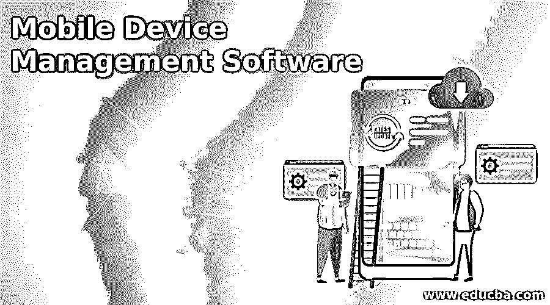

# 移动设备管理软件

> 原文：<https://www.educba.com/mobile-device-management-software/>

## 移动设备管理软件简介

以下文章提供了移动设备管理软件的概述。移动设备管理工具基于云安全工具，云安全工具旨在保护移动设备，因为它们提供了广泛的安全功能，因此对企业也很有用。移动设备管理工具保护移动设备免受恶意软件、病毒、蠕虫等攻击。，并保护存储在移动设备和特定应用程序上的数据。组织使用移动设备管理工具来保护员工的设备，因此他们可以存储业务应用程序和数据。

### 移动设备管理的功能

*   应用程序和数据保护。
*   它提供设备供应和反欺诈保护。
*   它还有助于身份管理。
*   它限制了数据丢失的风险。
*   它也有恶意软件和反病毒保护。
*   它可以阻止未经用户批准的软件安装。
*   它还可以防止未经授权的访问。

#### 1.AirWatch

AirWatch MDM 由 VMware 构建，VMware 是最受欢迎和使用最广泛的技术解决方案提供商之一。AirWatch 是一款移动设备管理工具，允许用户在本地和远程管理、配置和支持移动设备。有了 AirWatch，配置所需的等待时间减少了，因为它易于登录和快速配置设置。

<small>网页开发、编程语言、软件测试&其他</small>

**特性:**

*   它具有易于使用的架构以及可扩展的系统。
*   它提供数据加密、设备级加密以及硬件安全策略。
*   自动升级和支持。
*   它通过复制/粘贴限制、应用程序共享权限、地理围栏策略等来防止数据丢失。
*   它支持实时移动设备管理部署和灵活集成。

#### 2.IBM MaaS360

IBM MaaS360 是最常用的商业移动设备管理工具之一。它由沃森引擎提供动力。它允许通过易于使用的交互式用户界面来了解和控制 Android、macOS、iOS 和 Windows 设备，从而避免复杂性。它允许无线(OTA)设备注册，因此用户可以轻松快速地管理设备，无需安装硬件。它从一个控制台提供对多个操作系统的支持，独立于设备平台高效安全地覆盖端点。

**特性:**

*   MaaS360 提供多种操作系统和平台安全性。
*   它为物联网设备以及加固的 Android 设备和应用提供支持。
*   它有一个安全的容器，可以安全地存储公司数据。

#### 3.思科·梅拉奇

Cisco Meraki 也是一款流行的 MDM 软件，它通过一个集中的仪表板对移动设备、PC、MAC 以及整个网络进行统一管理。它允许用户设置设备安全策略，执行远程和实时故障排除，在众多受管设备上部署应用和软件。它对移动设备进行 OTA 集中监控、诊断和管理。它使用自动报告来分析网络活动。

它有一个系统管理器，可以监控组织的每台设备，并显示重要的指标，如最近的位置、客户端硬件或软件信息。它通过对移动设备实施安全策略来提供强大的安全性，保护设备和数据，使用强密码策略控制其使用，并限制对敏感数据、应用商店和游戏的访问。

**特性:**

*   它提供了可扩展的端点配置。
*   它为 BYOD(自带设备)计划提供支持。
*   它具有自动设备分类功能。
*   它会根据设备类型自动应用网络策略。
*   它提供设备上和远程数据管理。

#### 4.ManageEngine 移动设备管理器增强版

manage engine Mobile Device Manager Plus 是一款领先的 MDM 工具，通过直观的仪表板帮助管理多个移动平台。它确保所有设备都符合所需的策略，并提供设备的实时故障排除。

**特性:**

*   它提供自动设备注册。
*   它提供应用程序、电子邮件以及档案管理。
*   它通过多种策略管理资产和数据安全。
*   它提供及时的审计和报告。

#### 5.Intune

Intune 由微软开发，因此它与不同的微软 Azure 安全和身份管理解决方案相结合，提供了更新的门户体验。它允许用户或组织根据他们的需求设置移动管理策略。他们还可以对灵活的移动设备和应用程序管理进行控制，以保护数据。Intune 支持各种平台，如 Android、macOS、iOS、Windows，以及来自单一统一移动解决方案的设备。

**特性:**

*   它提供了高级的 Microsoft Office 365 数据保护。
*   它提供集成的 PC 和内部管理。
*   它提供身份和访问管理以及身份驱动的安全性。

### 结论

在本文中，我们已经了解了什么是移动设备管理软件及其各种功能。您可以根据自己的需求选择任何软件。

### 推荐文章

这是一个移动设备管理软件指南。在这里，我们讨论移动设备管理软件和功能的介绍。您也可以看看以下文章，了解更多信息–

1.  [手机应用开发工具](https://www.educba.com/mobile-app-development-tools/)
2.  [移动测试工具](https://www.educba.com/mobile-testing-tools/)
3.  [移动云计算](https://www.educba.com/mobile-cloud-computing/)
4.  [移动安全应用](https://www.educba.com/mobile-security-apps/)

