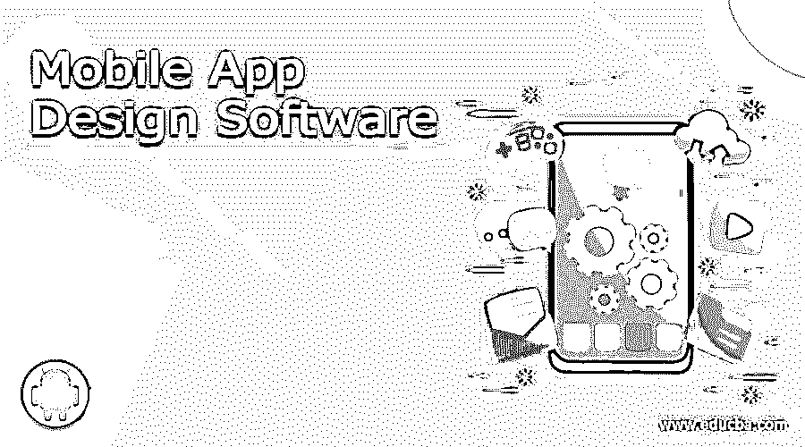

# 移动应用程序设计软件

> 原文：<https://www.educba.com/mobile-app-design-software/>

## 手机应用设计软件介绍

在手机和智能手机时代，“手机应用设计软件”是一个常见的术语。移动应用程序设计软件是一种运行在手机或其他移动设备上的小型软件应用程序，提供一些特定的功能或提供特定主题的信息。通常每个智能手机都预装了一些移动应用程序，例如:日历、计算器、电子邮件、时钟和天气信息。其他移动应用程序可以通过手机操作系统自带的移动应用程序商店下载到手机上，如苹果的 app store、Google Play、Windows Phone Store 和黑莓 App World，它们是这些应用程序的分发平台。

### 手机 App 设计软件的流行

2014 年，36%的智能手机用户和 45%的平板电脑用户至少购买了一款应用。
截至 2015 年 6 月，从苹果应用商店下载的移动应用设计软件超过 1000 亿个。
在过去的十年里，我们看到手机越来越受欢迎。手机现在已经被充满应用程序的智能手机所取代。一个应用程序有能力直接针对其实际用户群，并有能力吸收消费者。因此，在过去几年中，对各种应用程序的需求不断上升。

<small>网页开发、编程语言、软件测试&其他</small>

### 应用程序让你的手机成为多功能设备

移动通讯应用 WhatsApp 号称每月拥有超过 9 亿活跃用户！手机的趋势已经赶上了消费者，因为手机上的各种应用程序使其成为一个多用途的设备。这个小玩意可以单独充当电话、相机、组织者、通知你日程安排和约会的个人助理、即时信使、指导你旅行的导航员、告诉你需要多少额外锻炼才能燃烧特定量的卡路里以保持健康的私人教练、字典、音乐播放器、电影播放器、游戏区和许多其他实用工具。

### 应用开发工具

通常，像你我这样的外行人甚至认为自己不可能开发一个应用程序。毕竟手机 app 设计软件不是每个人都喜欢的。它需要一定的工程知识以及大量的工作时间和试验。但是现在，像你我这样的业余爱好者有可能开发我们自己的应用程序。现在有大量的移动应用开发工具可以指导你完成移动应用开发的每一步。

### 应用开发工具的特性

这些软件或移动应用程序工具是可以帮助你在几秒钟内创建或设计自己的应用程序的平台，只需很少的成本，有时甚至没有任何成本。

移动应用程序设计软件可以具有以下特征:

*   他们拥有设计应用程序所需的所有工具:-集成通知、各种编程语言的功能、内置高分辨率图像图库、位置感知 GeoRSS、自定义 CSS 和个性化品牌和设计等。
*   不用再为同一个应用付出双倍的努力。一个单独的应用程序开发工具可以让你为 Android 开发一个移动应用程序，就像苹果开发它的跨功能特性一样。
*   这些工具允许您直接将应用程序发布到 google play 商店，以及将 iPhone 应用程序版本发布到 iTunes 应用程序商店——只需轻轻一点。
*   您可以开发和发布的应用数量没有限制
*   它们为雄心勃勃的开发者提供了一个极好的平台来展示他们的才华并锁定合适的受众

现在，让我们了解一些最流行、最有效的工具，它们可以帮助您开发自己的应用程序。

#### 1.RhoMobile

RhoMobile 提供 Rhodes，一个基于编程语言 Ruby 的开源框架。

你可以在各种移动操作系统上创建应用，包括 Android、Windows Mobile、iPhone、Symbian 以及 RIM。这个工具可以从[http://rhomobile.com/download/](https://www.heroku.com/home)下载

**特性**

*   你可以在 Rhomobile 上用 Java、HTML5 和 CSS3 等编码和编程语言编写应用程序。
*   Rhomobile 上开发的原生应用程序完全兼容现有硬件，为您提供出色的速度和精度。

**美国邮政局**

*   你只需要在 Rho mobile framework 中编写一次代码，就可以使用相同的代码来创建应用程序。
*   它有很棒的小部件、效果和样式库，可以帮助改善应用程序的实用性和外观
*   它有 RhoHub，一个托管的开发环境，和 RhoSync，一个单独的服务器，以便用户可以方便地访问所有的应用程序数据。

#### 2.加速器

Appcelerator 每月支持 1，000 多个本地应用。

Appcelerator 是最受欢迎的应用程序开发工具之一，它提供了一个 Titanium 开发平台，可以帮助开发智能手机、平板电脑和台式机的原生应用程序。它使用 HTML、PHP、JavaScript、Ruby 和 Python 等 web 编程语言。
你可以在[http://www.appcelerator.com/signup/](https://platform.axway.com/#/signup)注册使用 Appcelerator

**主要特点**

*   它允许跨平台的原生移动应用程序设计软件
*   您可以使用编程语言 JavaScript 在 Appcelerator 上编写您的应用程序。
*   您会发现移动应用程序设计软件，如移动后端即服务(MBaaS)、移动测试自动化、崩溃检测、性能管理和移动分析。

**美国邮政局**

*   您可以访问 300 多个 API 和位置信息。
*   通过基于硬件的应用进行开发。
*   您可以将应用数据存储在虚拟私有云或设备上

**不足之处**

#### 3.AppMakr

这是一个神奇的工具，可以帮助你为 iPhone、Android 或 Windows 开发自己的应用程序，还可以让你创建 HTML5 移动格式的网站，并允许你与更多的观众分享你的内容。

这个工具是免费的，可以从 http://appmaker.en.softonic.com/.下载。但是，如果你每月花 79 美元购买一个高级版本，你还可以访问其他高级功能。

**主要特点**

**美国邮政局**

*   使用 Appmakr 最大的好处是移动应用开发不需要编码。
*   它遵循 DIY(自己动手)的方法，即使用户是第一次设计应用程序，也会感到非常舒适和完全放松。
*   它允许你使用任何你可能有的内容，甚至是社交网络订阅源，这样你就可以创建你的应用程序的各个方面。
*   出色的用户界面抽象，没有强迫 LCD 设计。

**不足之处**

#### 4\. Xamarin

Xamarin web 开发工具帮助您在 iPhone、Android 和 Windows 平台上使用 API 和数据框架，使用微软的 Visual Studio 开发 C#应用程序。它还支持跨平台的移动应用程序开发。

**主要特点**

*   您将在 Xamarin 中找到类库、C#编译器和虚拟机
*   Xamarin 使用基于 Mono 的工具链。

**美国邮政局**

*   卓越的本机性能质量和性能

**弱点**

#### 5.PhoneGap

PhoneGap 获得了“旧金山 2009 年 Web 2.0 博览会 LaunchPad 活动”奖。

PhoneGap 提供自由/开源软件环境，并使用分布式系统技术，帮助为 Android、Palm、Symbian、BlackBerry 以及最重要的 iOS 开发活跃的移动应用分析。这个移动应用平台使用常规的 web 编程语言，如 HTML、CSS3 和 JavaScript。

它允许应用程序开发人员设计原生移动应用程序分析，并提供对原生 API 的无障碍访问。您可以通过 PhoneGap 开发的应用程序轻松使用手机上的其他硬件功能，如 GPS/定位、摄像头、加速度计。

这个工具可以从[https://phonegap.com/](https://phonegap.com/)下载

**主要特点**

*   它为 Android、iOS 和其他平台使用标准化的 web APIs
*   它是一个开源平台，可以免费下载。

PhoneGap 现在归 Adobe 所有

**美国邮政局**

*   您可以参加 Adobe AIR 应用程序的在线培训课程，指导开发人员使用原生 API 并在 PhoneGap 上设计移动应用程序分析。

#### 6.WidgetPad

WidgetPad 的推出归功于中岛聪，

WidgetPad 是一个免费的基于 web 的开源移动开发环境。它允许你使用 HTML5 CSS 和 Javascript web 技术为 iPhone、Android 和 WebOS 创建自己的应用程序。

这个工具也是免费的，可以从[http://widgetpad.soft112.com/](https://widgetpad.soft112.com/)下载

**主要特点**

*   WidgetPad 使用托管 SaaS(软件即服务)模型。
*   你会发现源代码编辑、协作、调试、项目管理等 App 开发工具。
*   WidgetPad 允许您将应用程序分发到应用程序商店。

**美国邮政局**

*   它允许您轻松地将这些应用程序移植到智能手机设备，如 Palm Pre 和 Blackberry。

#### 7.同步

就像 PhoneGap 一样，MoSync 也是 FOSS 多平台移动应用程序设计软件，可以帮助您使用标准 web 编程语言(即 C/C++，用于 Windows Mobile、Android、Symbian、iPhone OS、BlackBerry 和 Moblin 的 HTML5)创建移动应用程序分析。

**主要特点**

*   它有应用程序开发工具，如集成编译器、库、运行时、设备配置文件等。

**美国邮政局**

*   MoSync 包括基于 Eclipse 的 C/C++编程 IDE。

#### 8.森查

你可以借助 Sencha Animator 和 Sencha Architect 等内含资源在 Sencha 上开发 HTML5 应用。在 Sencha 上开发的应用程序也兼容各种平台。

**主要特点**

*   它拥有独特的工具，如布局引擎、流畅的动画和平滑的滚动，以快速响应时间开发移动应用程序。

**美国邮政局**

*   拖放插入不同的智能手机平台，即:iPhone，黑莓，Kindle 和微软也是一个独特的功能。
*   它有超过 50 个内置的 UI 组件和主题，看起来很自然。
*   它的触摸功能使得移动应用工具的创建变得轻而易举。

#### 9.米平

Mippin 已经向各种应用商店发布了超过 100，000 个应用

Mippin App Factory 是一款跨设备的应用构建工具，可帮助您设计能够使用 iOS、Windows 和 Android 设备所有属性的实时原型。这些原型可以发布到 iTunes、Google play 商店或 Windows 商店，也可以发布到亚马逊。它是一个独立于平台的引擎。

Mippin 对小型企业来说是一个福音，他们可以为所有类型的智能手机开发自己的应用程序。这是一个极其快速和简单的 3 步过程，不需要任何技术技能。点击[http://www.mippin.com/appfactory/](http://appsme.com/)开始创建你自己的应用程序。

**主要特点**

*   Mippin 以高速著称。
*   它不需要编码，因此不需要开发技能来创建您的移动应用程序工具。
*   这是免费的。然而，你可以以每年 99 美元的价格购买他们的应用包来改善你的体验。此外，您可以每年支付 999 美元进行升级。对于每一个原生 App。
*   它有自动更新。

**美国邮政局**

*   Mippin 的用户友好特性为创建 iPhone 和 Android 应用程序提供了灵活性。

**不足之处**

*   它的高成本绝对是它的弱点。你可能需要每年为原生应用支付高达 999 美元。

#### 10.GENWI

又一个平台，帮助您开发、发布和管理 iPhone、Android 智能手机和平板电脑上的 HTML5 应用和其他应用。它提供卓越的媒体，如图形、照片、音频和视频。

使用三个月的免费试用期

**主要特点**

*   它也是一个跨平台的工具，这意味着，你只需创建一次移动应用工具，它就可以完美地复制到所有其他平台。
*   你可以无限制地编辑你的应用程序
*   它不需要编码。
*   有多种选择可以帮助你的应用获得收入。你可以使用广告、优惠券和订阅。
*   定期更新以改进您的应用。为

**美国邮政局**

*   它使用基于云的技术，既安全又一致
*   GenWi 提供关于消费者行为的可靠数据，帮助您改进应用程序。

也可以看看这些手机 app 工具。

**MyAppBuilder:**

不需要技术诀窍。无故障上传到应用商店

**shootem**:

非常适合博客作者、学生、体育爱好者、新闻网站和当地出版商。不需要编码。还提供向应用商店的无障碍上传

科尼:

它使用 JavaScript，并有拖放部件。它还有一个功能，可以帮助您导入现有的或第三方库。

### 结论

上述工具只是数十种其他应用程序开发工具中的几种，其中一些用于创建特定类型的应用程序。一个这样的例子是 **Mobicart** ，它可以帮助你创建一个电子购物应用。另一个名为**的工具 MobBase 为用户提供赛事信息，并帮助他们购买门票。**

类似的，还有创建博客应用、音乐应用、推广业务应用、发布应用等应用。简而言之，你可以为任何你想和很多人分享的东西创建移动应用工具。

为您的企业创建移动应用工具可以让您的产品或品牌拥有自己的身份，增加您的客户群，还可以增加您的收入渠道。这的确是让你的客户触手可及的最佳方式。

### 推荐文章

这是一个移动应用程序设计软件的指南。在这里，我们讨论了运行在手机上的不同应用程序，它们提供一些特定的功能或提供特定主题的信息。以下是与手机 app 设计软件相关的外部链接。

1.  [面向每个博客作者的安卓谷歌应用](https://www.educba.com/android-google-apps-for-every-blogger/)
2.  [手机应用开发工具](https://www.educba.com/mobile-app-development-tool/)
3.  [手机 App 开发软件](https://www.educba.com/mobile-app-development-software/)
4.  [手机应用开发培训和认证](https://www.educba.com/mobile-app-development-training-and-certification/)

