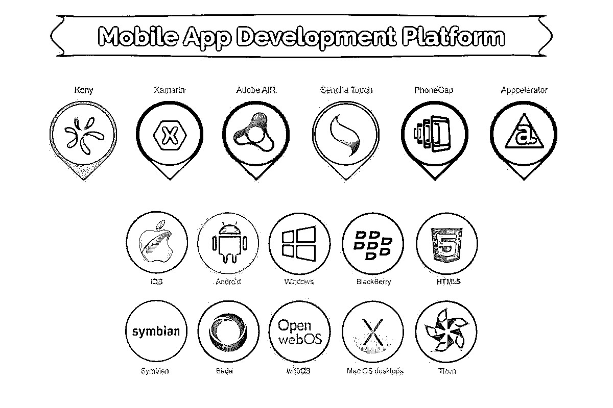

# 移动应用

> 原文：<https://www.educba.com/mobile-applications/>

## 什么是移动应用

智能手机在我们日常生活中的出现改变了每个方面的维度。随着新创新的加入，数字基准不断升级。智能手机的功能越来越多，其用途也越来越广。它就像一个被电子设备包围的小而紧凑的世界。通过访问互联网，整个知识库就在我们的指尖。通过引入智能移动应用程序，访问知识库和组织日常生活活动变得轻而易举。移动应用在几乎所有的活动领域都有巨大的用途，无论是娱乐还是商业。

### 移动应用对日常生活的影响

移动应用改变了智能手机的使用。智能手机被认为是不必要奢侈品的日子已经一去不复返了。技术基准的幸福影响着每一天。现在很难想象没有移动应用的日子。应用程序革命正在让世界变得更小，每个人都可以接触到。应用程序开发的目的是创造一些人们可以找到的有用和方便的东西，这重新定义了我们以前看待同一事物的方式。

<small>网页开发、编程语言、软件测试&其他</small>

#### 1.社会冲击

社交媒体应用帮助我们与我们亲近的人保持联系。不可能总是给每个人打电话。社交媒体应用提醒我们朋友和家人的当前活动，让我们保持一致。我们与每个人分享我们的经历、快照和视频。事实上，有了这些社交 app，沟通变得更快、更有效。

#### 2.学习影响

这个世界上最强大的东西就是信息。它可以是任何事情。无穷无尽的知识以电子奇迹的形式装进了我们的口袋。我们可以很容易地了解我们的兴趣，跟踪一个事件，了解最新的趋势或搜索任何我们不知道的东西。基于知识的应用程序的引入改变了消费信息的整个图景。通过应用程序学习维度的前景是无限的。

#### 3.对航行的影响

该应用程序的另一个额外优势是，在导航应用程序的帮助下，我们可以去任何我们想去的地方，而不用担心迷路。事实上，通过基于旅行的应用程序，了解一个地点的事实是非常容易的。评论和反馈告诉我们一个地方的优点和缺点，这有助于我们做出决定。卫星导航使它更加顺畅，语音导航就像一个指南针，使旅程更加轻松。

#### 4.安全影响

手机的应用程序越智能，个人信息被窃取的风险就越大。安全应用程序保护智能手机中的敏感数据。这些信息可能与银行交易、电子邮件信息和密码有关。这些应用程序通过对数据进行适当的加密来阻止试图窃取信息的间谍软件的非法侵入。其他应用程序允许用户在摄像机或音频设备的帮助下远程监控。

#### 5.娱乐影响

这个袖珍娱乐设备让我们可以随时随地访问我们最喜欢的音频、视频和游戏。我们可以借助应用程序访问娱乐平台的庞大数据库。

### 商务移动应用

移动应用在商业中的使用呈指数级增长。为了智能手机用户的利益，每天都有具有创新思想的新应用推出。这个平台作为商业上的移动应用是非常有前景的。但是在沉迷于开发一个之前，您需要考虑某些参数，以确保适当的可用性和以富有成效的方式投资资源。

#### 1.控制的问题

企业中的移动应用程序可以由内部开发团队开发，也可以外包给应用程序开发公司。但是存在对应用程序开发过程和开发后管理的控制因素。在开发和管理阶段，外包方式比内部生产更具成本效益。但是在外部实体的情况下，对开发过程的控制程度较低。你只能监督过程的进展，但不能一直干预或控制理由。这在将来也会成为一个问题。

为了更好地方便业务中的[移动应用](https://www.educba.com/mobile-application-software/)，团队可以给你更大的自由度来控制结果并适当地管理开发后阶段。答案在于预算问题和您想要开发的应用程序的可行性。当项目在同一屋檐下时，可以很容易地监控进度的方向。更好的控制会有更好的结果，这取决于你所掌握的专业知识。而且，内部团队知道你要开发什么。利弊可以相应涵盖。向外部实体解释整个计划也很困难。为了双方的利益，该计划必须是透明的。它还确保项目的正确执行。

#### 2.预算问题和成本关联

我想到的第二个问题是为支持应用程序开发计划而设定的预算。应用程序开发部分不同于其他业务，因为事先得到一个估计是非常困难的。随着与过程相关的变量数量的增加，难度也随之增加。事实上，变量的数量是动态的，随着时间的推移而变化。因此，进行评估比看起来要困难。但是从另一方面来说，了解与开发相关的成本有助于你优先考虑需要考虑的重要因素。开发人员也可以相应地使用给定的预算格式，并根据要涵盖的变量的重要程度指导您直到项目结束。

关键的特性可以在平稳的开发过程的开始阶段得到关注。重要的项目将首先完成，优先考虑的理由也将包括在内。只有当项目信息被充分研究和清晰时，估计才是准确的。

另一方面，你决定好是否向用户收费了吗？毕竟，开发是你想要繁荣的业务的一部分。这取决于你想遵循的策略。你必须决定你的应用程序是否可以免费下载，是否需要订阅才能使用，是否可以通过付费、应用内购买或整合应用广告来解锁。货币化计划必须准备好，然后发展必须滚动，使风险投资富有成效。

#### 3.哪个移动应用平台？竞争有多激烈？

智能手机和平板电脑用户的数量每天都在呈指数级增长，移动应用市场也是如此。在选择合适的移动应用程序平台时，多级应用程序开发选择非常令人困惑。为了隔离目标卷，必须首先解决初始阶段的设备碎片问题。必须对流量进行分析，以检查他们对设备和移动应用平台的偏好，然后才能开发相应的应用。你在目标细分市场的流量越多，获得良好回报的机会就越大。关于移动应用平台、设备类型、开发语言和功能的决策应该谨慎，以便为受众提供更多价值。随着竞争越来越激烈，任何可能降低应用程序受欢迎程度的缺陷都是可以容忍的。

这方面的第二个问题是关于比赛的。在沉迷于任何类型的投资之前，聪明点，做好你的功课。在你的应用程序开发的目标市场中，检查你将要面对的竞争水平。了解现有应用程序提供的功能，并找出关键的功能。用户总是寻求不同的、更好的应用。计划添加更好的创新功能，并与用户进行更多的互动。对最流行的平台和竞争对手进行适当的研究，并为用户的问题添加更多的解决方案。

#### 4.功能、流量处理和面向客户部分的问题

焦点是设置应用程序功能的主要关键。在确定了开发流程和应用程序的移动应用程序平台之后，团队必须考虑应用程序将为用户带来多大程度的功能。应用程序的功能是根据企业的类型决定的。太多的功能会破坏可用性并使用户界面复杂化。你必须决定为了更好的可导航性和用户友好的氛围而加入哪些特性。当计划很复杂时，最好进行一个以上的应用程序开发，而不是把情况搞得一团糟。

一个应用程序可以处理多少通信量需要提前设置。随着受欢迎程度的提高，数量将会增加，应用程序必须能够处理这种压力。该应用程序必须有后端系统和集成的现有基础设施，以防止用户过载的瓶颈情况的可能性。如果应用程序是电子商务类型的，那么访问量必须谨慎处理。额外的流量流入对于应用来说是至关重要的。此外，系统必须非常安全，才能以适当的方式处理交易量。

每个应用程序必须包含一个部分，在那里客户可以与支持系统进行交互，以获得更好的可用性。事实上，有一个反馈平台可以帮助应用程序的改进过程。当用户看到他们的请求被记录和处理时，他们会发现它更具互动性。用户交互界面不仅增加了品牌的价值，也是了解用户需求的媒介。

#### 5.可视化移动应用设计和线框准备好了吗？

线框是决定用户与应用程序的体验和交互的方式。与线框相关的东西必须由技术强大的专家进行审查，以确保用户获得良好的体验。您必须检查线框是否与启动应用程序的目标移动应用程序平台兼容。

用户与应用程序的交互问题是需要考虑的最重要的问题。可视化移动应用程序设计是应用程序用户在他们各自的平台上使用它时所看到的。事实上，应用程序将正确运行，没有任何故障或变形，必须在启动前得到保证。开发必须以这样的方式进行，即试运行显示良好的结果和有前途的未来。视觉传达是用户第一眼看到的东西。移动应用程序设计应该具有吸引力和交互性。视觉移动应用程序设计将相应地选择颜色和设计，以增加视觉传达因素，从而更多地吸引用户。

移动应用程序的设计代表了你对用户的服务。这就是为什么恰当的标志、颜色和优雅的字体对品牌形象非常重要。在用户心目中建立品牌非常重要。移动应用程序设计您的徽标时，请记住您为该应用程序想到的名称。移动应用程序设计是一个吸引人的名字，有利可图的颜色会在用户的脑海中留下印象，使促销更加容易和有效。

### 总结上下文

开发一个 app 之前，必须问的五个问题。应用程序是客户了解您的服务的媒介。它就像一个商店，需要更好的展示和护理。这些方程很简单。站在目标客户的角度，找出你想要的应用程序功能。你能提供的更好的特性增加了在尖端竞争中成功的机会。

### 相关文章

这是一个改变了智能手机使用的移动应用指南。这里我们讨论了商业中的移动应用以及设计和平台。

1.  [移动应用测试基础知识](https://www.educba.com/mobile-application-testing-basics/)
2.  [移动自组织网络](https://www.educba.com/mobile-ad-hoc-network/)
3.  [移动应用测试](https://www.educba.com/testing-of-mobile-application/)
4.  [移动应用的类型](https://www.educba.com/types-of-mobile-applications/)

