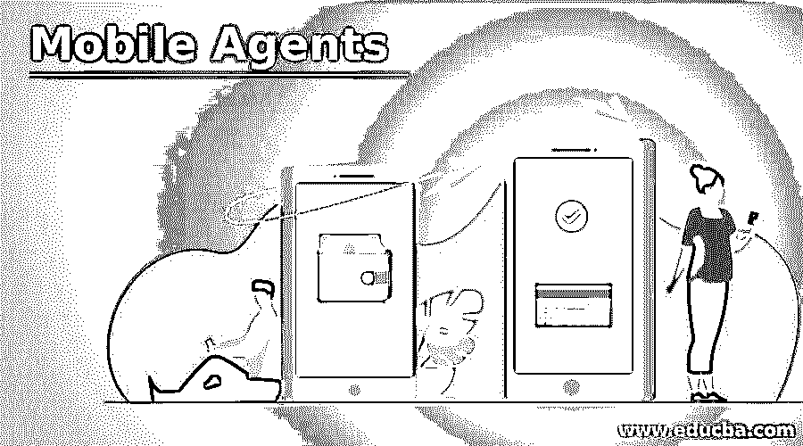
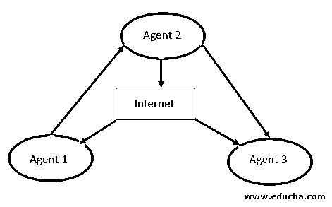

# 移动代理

> 原文：<https://www.educba.com/mobile-agents/>

## 移动代理简介

移动代理是一种通过移动计算出现的技术，它的影响如此之大，以至于简化了设计、实现和分发系统。它允许您减少通过网络的流量，并通过有效的方法帮助您消除网络延迟问题。更重要的是，它们帮助您构建一个高度健壮的容错系统。他们通过创造他们的过程独立运作的能力来创造它。这间接有利于使用它们的最终用户。

### 什么是移动代理？

移动代理是一种代理软件(更准确地说是一段代码),它具有自主性、社交能力、自学能力，最重要的是具有移动性，这种移动性与计算机软件和数据相结合，只要两台计算机在同一个网络中，它们就可以自己从一台计算机移动到另一台计算机，即它们不需要通信节点，即使用户没有连接到网络也可以工作。

<small>网页开发、编程语言、软件测试&其他</small>

### 移动代理是如何工作的？

移动代理只是从一个系统移动到另一个系统。这类似于访问一个网页(我们使用的浏览器下载并向我们展示该网页的副本。在多个版本的情况下，它下载并向我们呈现该网页的一个版本)。移动代理从数据本身的各种版本移动。移动代理在移动时保存其状态的一个版本(处理图像的副本)，然后将其传送到新的系统或主机，然后从先前的检查点开始执行到新的系统或主机。这种方法暴露用户数据的威胁最小，因此既安全又受欢迎。

他们通常被称为可移动代理。这背后更合乎逻辑的原因是，它们可以在没有相应通信节点的情况下将数据从一个系统传输到另一个系统。

它们分为两种类型，如下所述:

*   **具有预定义路径的移动代理:**这些类型的移动代理具有预定义的静态路径，它们在迁移时遵循该路径。
*   **没有预定义路径的移动代理或自由漫游的移动代理:**这些类型的移动代理选择它们自己的路径，因为它们有动态迁移路径可循。我们可以说他们自己决定迁移路径(基于网络强度)。

### 移动代理的特征

移动代理具有多种显著特征，其中移动性最为突出。它们是可移动的，独立工作，具有自主搜索其移动或转移路径的智能，并且即使用户从一个系统注销，从一个系统到另一个系统的通信也更频繁。他们从离开的同一点开始访问数据。这些特点使它们在分销系统中更加方便。

#### 1.流动性

它们不限于它们的源代码。它们能够从一个节点自由移动到另一个节点。此外，它们还携带了前一个节点的数据，这使得它们更加有用，因为用户可以从原来的地方开始工作。而且，它还有另一个优点；即使用户离线，移动代理仍然可以完成迁移工作或正常工作。这些功能使他们可以在移动设备上工作。

#### 2.智力

移动代理是智能的，并且具有增强其关于主机节点的知识的能力。当迁移到新主机时，它们会智能地工作，既保护旧主机的知识，又开放获取新主机的知识。这就是为什么他们被认为是聪明的。

#### 3.自治的

他们是自主的，可以独立工作。它们的工作受到用户命令或动作的限制，有时，当用户离线时，移动代理仍然可以独立工作或选择自己的路径。

#### 4.爱说话的

移动代理是可通信的。它们不断地与主节点和它们传送到的节点通信；他们与不同的用户、不同的系统进行交流。你认为在无法建立安全通信的情况下，这一切都是可能的吗？

下图显示了移动代理的工作方式。

在这里，我们可以看到，来自一个代理的数据被发送到互联网，相同的数据从互联网传输到代理 1 和代理 3，这是代理 1 发送到代理 2 的相同数据。也就是说，数据包可以通过不同的代理从一个地方转移到另一个地方。这减少了网络流量。

### 移动代理的优势

*   通过从主机服务器携带数据(可重定位的数据包)来减少网络负载。
*   自主地在服务器之间移动。
*   可以同时在多个网络上工作(并行处理)，从而提高效率。
*   它们易于维护，而且据说易于维护。
*   它们高度容忍网络故障，因为即使用户断开连接或注销，代理仍然可以活动或运行。
*   它们是智能的，因为它们可以区分代理的动作和主机环境采取的动作，这使得它们具有动态适应性。

### 移动代理的缺点

*   它们有时会对从一台主机传输到另一台主机的数据构成安全威胁。

### 应用程序

下面给出了移动代理的应用:

*   移动代理通常活跃于电子商务、物流、网络管理、交通控制、机器人应用等领域。
*   它们在移动计算、网格计算、并行计算等方面也很有用。

### 结论

移动代理很有用，因为它们可以从一个系统移动到另一个系统，并自己传输数据。即使用户断开连接，它们也可以建立与主机节点的连接。它们有两种类型:一种有固定的静态行进路径，另一种是动态智能的，可以自己决定行进路径。

### 推荐文章

这是一个移动代理指南。这里我们分别讨论了它们的介绍、工作原理、特点、优点、缺点和应用。您也可以看看以下文章，了解更多信息–

1.  [手机 IP](https://www.educba.com/mobile-ip/)
2.  [移动测试工具](https://www.educba.com/mobile-testing-tools/)
3.  [移动应用的类型](https://www.educba.com/types-of-mobile-applications/)
4.  [移动自组织网络](https://www.educba.com/mobile-ad-hoc-network/)

