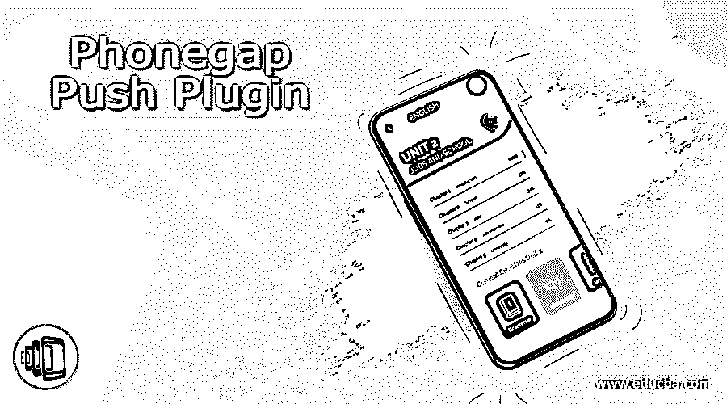

# Phonegap 推送插件

> 原文：<https://www.educba.com/phonegap-push-plugin/>

## Phonegap 推送插件简介

Phonegap 推送插件支持使用单一 API 接收和处理原生推送通知。这并不意味着用户能够发送单个推送消息并到达运行不同操作系统的设备。Android 使用 FCM，Firebase 云消息，iOS 默认使用 APNS，有效载荷不同。即使用户尝试在 iOS 和 Android 上使用 FCM，插件所需的有效负载也会有所不同。在这里，我们将看到什么是 Phonegap 推送插件，以及发生了哪些更新，并简要介绍了推送插件或通知。

Phonegap 有一个基于插件的架构，每个特定的特性都被认为是一个由 JavaScript 和 Native 组成的插件。JavaScript 被认为是跨平台的，而本机只在一个设备上实现一次。

<small>网页开发、编程语言、软件测试&其他</small>

Phonegap 由总部位于加拿大温哥华的 Nitobi 公司开发，并于 2011 年被 Adobe 公司收购。201 年 Adobe 公司收购 Nitobi 后，Adobe 发布了 Phonegap 技术，作为 Apache Cordova 下的开源技术。

### Phonegap 推送插件如何工作？

*   Phonegap 推送插件是一个用于注册和接收推送通知的 Cordova 插件。
*   插件没有提供一种方法来确定平台，以及使用属性设备的最佳平台。Cordova-plugin-device 提供的平台。
*   Phonegap 的架构是一个基于插件的架构，每个特定于设备的功能都是一个插件，由 JavaScript 和本地区域组成。
*   架构和开源不仅允许开发者修复代码中的错误，还允许用户根据需要调整插件。
*   开发者可以构建自己的插件，支持用户选择的平台。
*   要向 Cordova 应用程序发送推送通知，第一步是获取特定于每个设备和项目的设备令牌。
*   先决条件:有一个谷歌云消息项目编号和类型服务器的 API 密钥。
*   然后将 Cordova Push 插件添加到我们的项目中，Cordova 插件中的 sender id。
*   在 Android 或 iOS 设备上运行代码时，会给出设备令牌，该令牌会生成真实设备，而不是虚拟设备。
*   对于 iOS 用户来说，APN 认证密钥或 APN 证书是必不可少的，要在 iOS 调试版本上创建 APN 证书，用户应该拥有苹果开发者计划，要创建开发者 APN 证书，在创建 APN 证书时需要启用推送通知的应用 ID
*   推送通知需要应用 ID 和显式 ID，它们必须是唯一的。
*   在应用程序服务下，推送通知选项将被选择，需要确认和注册。
*   创建应用程序 ID 后，转到 iOS 应用程序，从下拉列表中选择已注册的应用程序 ID，然后编辑。
*   在编辑时，点击"创建证书"按钮，选择 CSR 文件。这个文件可以从 Monaca Cloud IDE 中获取。这将有助于产生 CSR 和 key
*   下载这两个文件并上传到 iOS 构建设置中，因为 Firebase 配置需要这些文件
*   在 Firebase 推送通知下，创建一个项目，在项目设置下，转到添加 APP，选择操作系统，如 iOS(此处)。
*   输入 iOS 捆绑包 ID 并注册。下载显示的。应该放在注册项目的根文件夹中的 plist 文件。
*   在 Firebase 概述页面上，转到项目设置，并选择云消息以添加 APN 证书。在这里，上传 APN 认证密钥或 APN 证书。
*   因此，iOS 配置已经完成，Phonegap 推送插件可以工作了。
*   Phonegap 支持其他平台，如黑莓、Web OS、Windows Phone、Tizen、Bada 和 Symbian。

**Phonegap 推送插件的优势，**

1.基于开放标准，用户可以重用现有的 web 开发人员技能。
2。单一代码库可用于多个平台，发展更快。
3。它有一个强大的背景，由 Apache 支持，由 Apache Cordova 提供支持。

**Phonegap 推送插件的局限性或缺点，**

1.PhoneGap 的 API 不太支持对大量原生功能 API 的访问。
2。使用高级图形的应用可以通过第三方库访问，可以在本机完成
3。在数据处理方面，与 JavaScript 相比，本地语言速度更快。
4。随着业务逻辑复杂性的增加，使用本机代码可以更好地访问应用程序。
5。由于大量应用程序依赖于后台，而 Phonegap API 是基于 JavaScript 构建的，因此不支持多线程，因此不支持后台处理。

### 结论

至此，我们将结束主题“Phonegap 推送插件”。我们已经看到了 Phonegap 推送插件是什么意思，以及它是如何在 iOS 和 Android 操作系统中实现的。我们还看到了 Cordova 插件，因为 Phonegap 推送插件现在已经被弃用了。列出了 Phonegap 推送插件的一些优点和局限性。

### 推荐文章

这是 Phonegap 推送插件指南。这里我们讨论一下简介，Phonegap 推送插件是如何工作的？优势，局限性，分别。您也可以看看以下文章，了解更多信息–

1.  [草图插件](https://www.educba.com/sketch-plugins/)
2.  [Pro Tools 插件](https://www.educba.com/pro-tools-plugins/)
3.  [Figma 插件](https://www.educba.com/figma-plugins/)
4.  [Inkscape 插件](https://www.educba.com/inkscape-plugins/)

