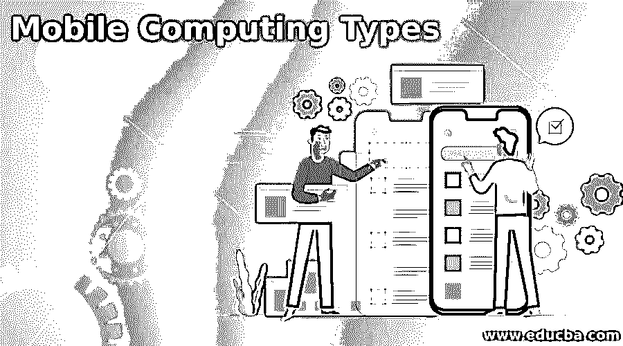

# 移动计算类型

> 原文：<https://www.educba.com/mobile-computing-types/>

## 移动计算简介

移动计算是两种类型的移动计算，即便携式计算和移动性计算。移动计算是一种技术，它提供了一种环境，使用户能够在不使用任何物理电缆或链路的情况下将数据从一个设备传输到另一个设备。移动计算允许通过任何支持无线的设备或计算机进行数据转换、视频和语音。总的来说，计算被视为手机、笔记本电脑、平板电脑等使用的技术。以及支持移动性的其他此类设备。在这里，我们将看到移动计算的类型以及移动计算背后的概念。

### 移动计算背后的概念

移动计算基于以下概念:

<small>网页开发、编程语言、软件测试&其他</small>

*   移动通信
*   移动硬件
*   移动软件

#### 1.移动通信

移动通信是指确保与无线设备进行无缝、可靠和无障碍通信的基础设施。它包括特设和基础设施网络、协议和数据格式。数据格式确保不会与其他系统冲突。无线电波基础设施用于在空中发送信号的地方。

#### 2.移动硬件

移动硬件包括移动设备或设备组件。它是指可以访问移动服务的移动设备，包括笔记本电脑、平板电脑、智能手表和智能手机以及其他 PDA(个人数字助理)。在这种装置中，安装了感受器来感知和接收信号。这些设备可以同时发送和接收信号，这就是所谓的全双工。

#### 3.移动软件

移动软件是一种程序，可以用于移动硬件，也可以调用移动操作系统。它处理移动应用程序的需求，并负责称为设备引擎的设备中的所有功能。

### 不同类型的计算

我们有两种类型的移动计算:

*   **便携计算:**需要有线通信。所有用户都有随时随地移动设备的自由，但他们需要在网络线路内进行连接。
*   **移动计算:**指无线通信，也称“移动计算”。它为用户提供了一个更好的环境，用户可以使用这些移动计算设备随时将数据从一个位置发送到另一个位置，而无需任何物理连接。

下面列出了一些移动计算设备:

*   **平板:**是一款无线便携电脑，有触控界面。它比笔记本小，但比智能手机大。
*   笔记本电脑:它是一种通常用电池充电的便携式电脑。
*   **智能手机:**它基本上执行计算机的许多功能，具有触摸屏界面、网络接入和能够访问或下载应用程序的操作系统。
*   **个人数字助理(PDA):** 它是一台袖珍计算机，能够将数据从一个终端同步传输到另一个终端。在 PDA，用户可以使用视频通话、语音通话、日历、时钟等。如今，PDA 因操作系统而异。
*   **iPad:** 它是苹果公司设计的一款平板个人电脑，拥有 9.7 英寸的触摸屏，用于浏览网页、听音频、看视频、玩游戏等。
*   **便携式游戏设备:**这是一款视频游戏控制台，内置屏幕、鼠标、游戏控制器和扬声器。与家用视频控制台相比，它们的尺寸很小。
*   电子阅读器:这是一种便携式电子设备，用于阅读电子书、电子报纸等数字内容。，也称为电子书阅读器。
*   **图形计算器:**是一种特殊类型的硬件计算设备，显示绘制的图形，用于求解复杂的方程，如抛物线等。
*   **上网本:**它是一种移动计算设备，重量轻，处理能力相对较低，功耗也较低。它主要用于文字处理和在网络浏览器上访问互联网。
*   **Pocket PC 的:**这些也称为微软 windows classic 设备，它不同于 PDA，能够运行 Windows mobile 操作系统，并且能够执行类似于现代 PC 的任务
*   **超便携电脑:**这是一种便携式硬件设备，能够运行 Windows 操作系统，与笔记本电脑相比具有良好的功能。它的屏幕尺寸为 5-7 英寸，重量为 2 磅。
*   PlayStation Portable (PSP): 它是索尼娱乐公司发布的一款超薄游戏主机。
*   **Atari Lynx:** 它是一款 8 位或 16 位便携式游戏设备，由 Atari Lynx 于 1989 年开发。
*   **Gizmondo:** 它是由 Tiger Telematics 设计的一款手持硬件游戏主机。
*   **N–Gage:**这是一款塞班智能手机，由诺基亚于 2002 年推出的手持游戏系统组合而成。
*   **GamePark 32:** 是一款视频游戏的便携式硬件设备，由 GamePark 公司于 2001 年发布。
*   **PC Engine GT:** 它是 PC Engine 的便携版，由日本人在 1990 年推出，随后美国以 TurboExpress 的名字发布。

### 移动计算的优势和劣势

下面给出了提到的优点和缺点:

#### 优势:

*   这些设备可以节省时间，当用户在旅行或有紧急情况时，可以通过移动设备完成工作。
*   用户具有位置灵活性，可以在一天中的任何时间、任何地点工作。
*   这些设备提高了工作效率，也方便了研究。
*   移动设备也可以用于娱乐目的，并通过社交应用程序与世界各地的人联系。

#### 缺点:

*   用户也可能面临安全问题，因为许多移动计算设备可能被黑客攻击。
*   即使有更好的电池，这些设备也会消耗更多的电能。
*   成本也是对用户不利的一个主要因素，随着新技术的出现，这些成本也会增加，用户很难购买。

### 结论

至此，我们将结束“移动计算类型”这一主题。我们已经了解了什么是移动计算，以及当今世界使用的移动计算设备的类型。我们还看到了移动计算背后的概念，它由三个要点组成。我们还列出了一些移动计算设备及其规格。经历了移动计算设备的一些优点和缺点。

### 推荐文章

这是一个移动计算类型的指南。这里我们讨论介绍，概念，不同类型的计算，优点和缺点。您也可以看看以下文章，了解更多信息–

1.  [移动计算特性](https://www.educba.com/mobile-computing-features/)
2.  [移动计算](https://www.educba.com/course/mobile-computing/)
3.  [移动渗透测试](https://www.educba.com/mobile-penetration-testing/)
4.  [移动安全应用](https://www.educba.com/mobile-security-apps/)

