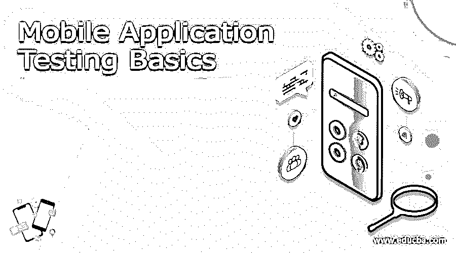
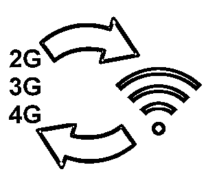
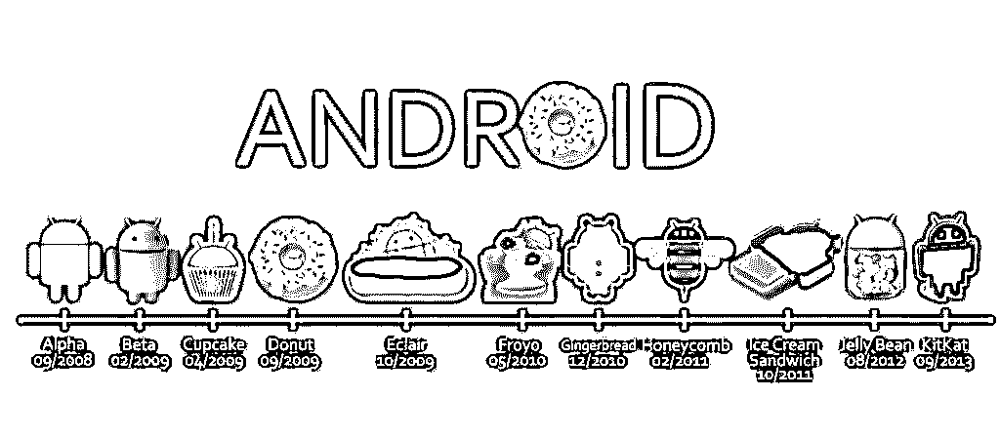
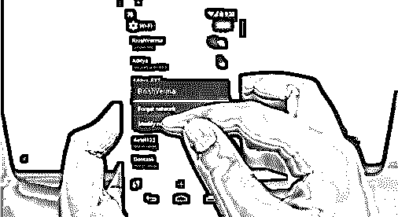
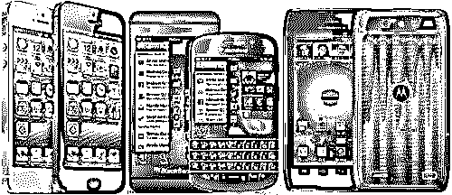
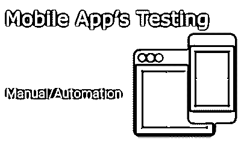
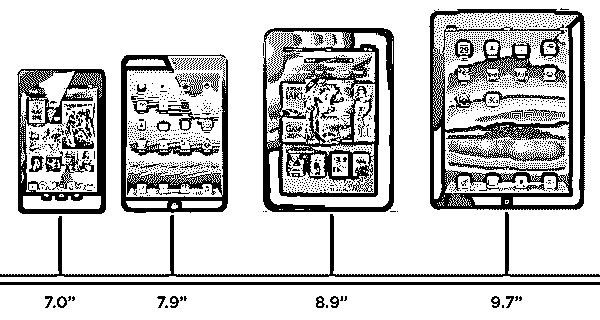

# 移动应用测试基础

> 原文：<https://www.educba.com/mobile-application-testing-basics/>

## 移动应用测试基础知识介绍

智能手机和移动应用正在快速发展，已经成为我们日常生活中不可或缺的一部分。新一代喜欢使用移动应用来完成各种大小任务。移动应用测试基础知识已经改变了我们生活的方方面面。随着移动应用程序测试基础的现代化，每个人都对这些应用程序有很高的期望，甚至一个小的错误都是不可接受的。[每天都有数以千计的新应用诞生](https://www.educba.com/android-productivity-apps/ "Best Android Productivity Apps")。在测试移动应用程序的准确性时，技术团队面临着各种挑战。

让我们详细解释一下这些技术挑战。我们开始吧:

<small>网页开发、编程语言、软件测试&其他</small>

### 移动应用测试基础和挑战

以下是移动应用测试基础和挑战:

#### 网络连接

2G、3G、4G、5G 或 Wi-Fi 等移动数据应用有多种标准。不同的移动应用需要特定的带宽来充分执行任务。消费者从一个地方移动到另一个地方，因此网络连接随着移动而改变，应用程序性能也随着网络变化而改变。有时，在使用任何移动应用程序功能时，设备上可能没有连接，因此有必要在网络连接较少的情况下测试应用程序的性能。

 

#### 操作系统版本

市场上有不同类型的操作系统。每个操作系统都有自己的工作方式和不同的限制。在具有不同操作系统的各种设备上测试每个应用程序是测试人员面临的一个非常复杂的挑战。设备碎片是[手机应用测试](https://www.educba.com/testing-of-mobile-application/ "Mobile Application Testing Strategies and Tactics")中最复杂的部分。操作系统版本快速升级到最新版本。开发移动应用测试基础知识时，一定要考虑到操作系统的升级。以便移动应用将能够向具有各种 OS 平台的用户提供流畅的体验。

 

#### 不同类型的移动应用测试基础

主要有三种类型的移动应用程序，如 web 应用程序、原生应用程序或混合应用程序。每个应用程序的功能和实现技术互不相同。从安装到每个不同类型的应用程序的功能，测试应用程序的性能是非常复杂的。

 

#### 应用程序使用

在移动应用程序测试基础中，关注应用程序功能的所有关键领域非常重要。通常，移动屏幕很小，应用程序需要同时显示大量信息。以清晰的分辨率在屏幕上显示每个功能是非常典型的。字体大小和点击区域需要额外的关注，以确保应用程序的顺利运行。点击区域必须有合适的大小，并且所有的文本都是易读的。用所有这些具有挑战性的可用性因素来测试应用程序并不是一件容易的事情。

 

#### 功能测试

应用程序需要针对各种类型的功能和用户需求测试适当的工作机制。用户界面驱动各种类型的测试，以检查各种设备上的应用程序的正常运行。

#### 设备机制的多样性

基于屏幕尺寸、硬件系统和输入方法，移动设备互不相同。市场上有各种各样的手机、平板电脑、智能手机和 iPads。[移动应用](https://www.educba.com/bundle/mobile-apps-full-courses-bundle/ "Mobile Apps Full Courses – Bundle!")不得不面对技术环境的巨大多样性。所有的手机和设备都有自己的工作机制。测试人员必须检查所有兼容设备的移动应用功能的性能和适应性。如果一个应用程序在一部手机上成功运行，那么它在另一部设备上也能很好地运行是没有必要的。Quality tester 永远无法 100%保证移动应用程序与所有设备的兼容性。

 

#### 各种测试工具的使用

市场上有各种各样的移动测试工具。不同的工具用于测试不同类型的应用程序，就像本地和混合应用程序一样，测试人员必须使用不同的工具。主要有两种类型的自动化工具用于[应用测试](https://www.educba.com/application-testing/)基于图像和基于对象。在图像基础法测试中的应用都是基于屏幕坐标。在这种方法中，对于设备屏幕尺寸的每一种变化，都需要编写一个测试脚本。在对象基础工具中，屏幕元素被映射到对象上进行操作。因此，根据移动自动机的需求选择和实现完美的自动化工具是一项复杂的任务。

 

#### 设备屏幕尺寸的差异

每种设备都有不同的显示尺寸和像素密度。移动应用测试基础需要调整设备屏幕的设计。不同的长宽比和各种各样的像素密度是一个不可避免的困难。应用程序必须具有所有屏幕元素的同等可访问性。为此，该应用程序需要在具有不同屏幕显示的各种不同设备上进行测试。

 

#### 通用用法

随着移动应用需求的增加和普及，需要对应用进行通用测试。今天，大多数流行的移动应用程序都是根据国际市场的使用情况设计的。每个地区都有自己的语言和书写模式，如在一些语言中遵循从右到左的模式，而在另一些语言中遵循从左到右的模式。所以根据所有语言和书写模式开发应用程序是非常困难的。测试人员必须额外注意区域设置、时区、语言设置和其他关键因素等功能，以使应用程序兼容国际水平的使用。

 

#### 设备电池容量的变化

每个手机应用程序需要不同的[电池电量](https://www.educba.com/14-easy-ways-to-get-more-battery-life-with-ios-8/ "14 Easy ways to get more battery life with iOS 8")才能正常工作。一些应用程序会消耗全部电量，而其他应用程序则需要较低的电量。功耗是移动应用测试基础的一个重要方面。没有人想使用这种消耗高功率电池消耗的应用。无论这些应用程序是否高效，它永远不会在用户中流行起来。电池消耗总是成为 app 可用性面前的一道屏障。应用程序需要针对不同类型的中断进行测试，这是测试各种应用程序的主要复杂性。

### 推荐文章

这是一个移动应用测试基础的指南。在这里，我们详细讨论了移动应用测试基础和挑战的基本概述。您也可以看看以下课程，了解更多信息——

1.  [市场调研](https://www.educba.com/marketing-research/)
2.  [移动应用](https://www.educba.com/mobile-applications/)
3.  [应用软件开发商](https://www.educba.com/applications-software-developer/)
4.  [安卓生产力](https://www.educba.com/android-productivity/)

