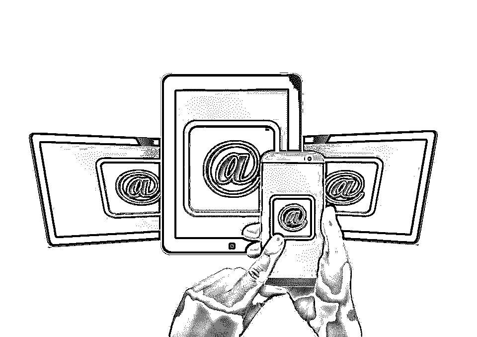

# 什么是移动计算:最佳应用和服务(OS)

> 原文：<https://www.educba.com/mobile-computing-applications-and-services/>

 

**什么是移动计算？**–在 20 世纪 90 年代，手机基本上是用来打语音电话和发短信的。我们这些早期采用这种[技术](https://www.educba.com/app-development-tool/ "Choose Best Technology for App Development")的人只使用固定线路或传真进行交流，但在成本方面很难支付呼入和呼出的费用。

在接下来的十年或更长的时间里，移动电话基本上意味着在移动中进行通信，并且还提供多媒体消息(MMS)。此后，许多手机确实增加了消费设备的功能，如照相机、手电筒、时钟和闹钟、日历，使其成为日常使用的多用途设备。然而，智能手机的出现为手机的各种应用带来了一场革命，包括数据、软件、游戏和商业应用。

<small>网页开发、编程语言、软件测试&其他</small>

## 每一个电脑应用，一个手机应用

移动电话在各阶层人群中的迅速普及为商业带来了新的趋势。对于每个计算应用程序，同时还开发了一个[移动应用程序](https://www.educba.com/bundle/mobile-apps-full-courses-bundle/ "Mobile Apps Full Courses – Bundle!")。桌面网站总是需要移动网站。现在许多人通过手机上网，网站已经进入垂直滚动模式，而不是水平模式。

移动应用大多是网络应用和计算机应用的淡化版本。然而，知名市场分析师本尼迪克特·埃文斯(Benedict Evans)在 11 月份举行的一次网络峰会上表示，随着智能手机可能提供更多功能、功能更全的互联网应用套件，情况即将发生逆转。

早些时候，有人说软件正在吞噬世界(两年前的马克·安德森)，现在埃文斯认为手机将会吞噬世界。

### 移动运营

正如 Windows、Unix、Linux 等电脑有操作系统一样，智能手机也是由操作系统运行的。流行的有安卓、iOS、黑莓、Windows、RIM 等等。Android 占据了市场的大部分份额，其次是 iOS。操作系统支持用户友好的菜单驱动的应用程序和程序。

电子商务、在线预订业务和金融服务全球化的快速发展，使得用户需要随时登录网络，访问数据、更新信息或远程管理系统。这反过来又有利于移动计算的发展。在硬件方面，市场上大量的平板电脑、智能手机、掌上数字助理(PDA)引发的革命有助于创造对移动应用和移动计算解决方案的巨大需求。

随着老年群体比例的上升，人口结构的变化提出了一个新的要求，即他们应该快乐并保持联系。事实上，根据一位 IBM 分析师为《福布斯》撰写的文章，随着用户友好的智能手机和移动应用的出现，年轻人和老年人之间的代沟已经被弥合了。

移动通信从 2G、3G 到现在的 4G 的快速发展确保了各种行业和应用可以进行数据、应用和信息交换。例如，在公司中实现交易的计算系统的核心是企业资源规划(ERP)系统。移动性的发展确保了移动中的销售人员和[营销](https://www.educba.com/courses/all/marketing/ "Sales and Marketing")团队能够实时向他们的总部和分支机构更新数据和相关信息。这种数据更新将使管理层能够根据公司设定的目标和指标，更好地协调或改变市场的[战略。](https://www.educba.com/marketing-strategies-plan/ "How to Develop Marketing Strategies")

移动性确保了通过[社交媒体](https://www.educba.com/social-media-marketing-tips/ "10 Effective Social Media Marketing Tips 2016")、互联网、[在线交易活动](https://www.educba.com/free-online-trading-with-non-conventional-techniques-training/ "Free Online Trading with Non-conventional Techniques Training")、通过移动应用程序预订从市场中获取更多数据，这反过来有助于行业分析交易数据以帮助营销工作。

### 移动技术领先于 Gartner 趋势

根据 Gartner 的概述，移动技术处于 2016 年将对 IT 行业产生影响的战略性技术趋势的顶端。

根据副总裁兼 Gartner 研究员 David Cearley 的说法，设计移动应用程序仍然是企业的核心战略。Gartner 的报告称，除了移动设备，其他几种常用的可以存储和传输数据的设备也正在成为“设备网”的一部分。可穿戴消费和电子设备、汽车设备和环境设备、物联网(IoT)中的传感器都在增加连接网络。

### 移动计算结构

正如在任何互联网络中一样，移动计算也涉及三个不同且相互关联的组件-

1)移动硬件，2)包括发射塔在内的通信设备，3) [移动软件和应用](https://www.educba.com/mobile-app-development-software/ "Top Mobile App Development Software")。

移动硬件包括智能手机、PDA、平板电脑、平板电脑等。过去的每一年都见证了几款具有越来越先进功能的新机型的推出。存储、处理能力和屏幕分辨率迅速提高，使移动设备成为数据捕捉、存储、处理和通信的核心。

移动通信包括大量的协议、发射塔、带宽、卫星系统和网络。数据系统被定义为不会与发送或接收相似类型数据的现有系统发生冲突。

覆盖基础设施是无线电波导向的，因为媒体是无导向的或无边界的。这意味着信号通过空中传送到接收和发送类似信号的目标设备。

在移动计算中，传输不是通过物理连接进行的，而是主要通过卫星或无线通信网络进行的。

### 移动计算的优势

 

<address>Image source: pixabay.com</address>

毫无疑问，移动技术已被证明是人类的福音，就像个人电脑革命在 20 世纪 80 年代帮助我们通过菜单驱动的 Windows 系统以用户友好的方式组织、存储和处理数据一样。

以下是移动计算的一些优势:

*   没有位置限制:移动计算将用户从位置束缚中解放出来，增加的带宽和传输速度使移动工作成为可能。
*   它节省了时间，提高了生产率，带来了更好的投资回报(RoI)
*   它通过流式数据、视频和音频在移动中提供娱乐、新闻和信息
*   简化业务流程:移动性简化了业务流程、繁琐的电子邮件、纸张处理、通信和传输中的延迟。
*   IT 专业人员的新工作机会已经出现，IT 企业现在的产品组合中增加了一项服务，这项服务只会随着指示性移动计算趋势而不断增长。

### 移动计算领域的职业机会

移动计算的发展催生了一些新的职业选择，从硬件服务到软件、操作系统、移动计算应用程序(apps)开发。这方面的主要受益者是工程毕业生、研究生、文凭持有者、获得计算机应用学士学位(BCA)或计算机应用硕士学位(MCA)的计算机应用专业人员。一些热门职位空缺是:
游戏开发人员、移动硬件技术人员、IPAD 开发人员、移动应用程序测试专家、Android、Blackberry、iPhone、Windows 开发人员、网络塔式安装和维护人员、移动计算安全专家、设备机械师、移动架构师、客户服务、营销支持、技术支持、关键绩效指标(KPI)工程师。

虽然每个工作职能所需的技术要求和能力各不相同，但一般来说，他们需要具备 HTML5、Javascript、Jquery、蓝牙设备、WLAN、GSM、CDMA、WiMAX、Microsoft Share Point 2007/2010、Info Path 等方面的能力。

### 行业机遇

除了工程师和 IT 专业人员的就业机会，移动计算领域的服务提供商也面临着巨大的机遇。移动计算的巨大市场确实在美国。Statista 估计，超过 1.8 亿美国人将拥有智能手机，到 2016 年，这一数字将增长 10%，达到近 2 亿。《福布斯》杂志撰稿人吉姆·布拉辛盖姆说，年龄在 16 岁到 80 岁之间的每个美国人都是工业的潜在客户或顾客。他是获奖书籍《顾客时代:为相关时刻做好准备》的作者。

他认为，如果企业没有做好移动准备，它们很快就会像恐龙一样灭绝。

### 移动计算的未来

据[researchandmarkets.com](https://www.researchandmarkets.com/ "Research and Markets")报道，全球企业移动解决方案市场预计在未来三年内将以 35.43%的复合年增长率(CAGR)增长。企业移动解决方案的移动计算应用是管理移动计算设备、无线网络和相关服务。这是一种基于[云](https://www.educba.com/data-science/courses/cloud-computing-training-course/ "Cloud Computing 101")的技术，支持持续连接。该报告称，通过软件许可和订阅费产生的收入已被用作未来增长估计的衡量标准。

> 根据 Zion Research 的报告，全球企业移动市场预计将从 2014 年的 850 亿美元增长到 2020 年的 5000 亿美元，2015 年至 2020 年的复合年增长率为 24%。该报告涵盖了智能手机、平板电脑和笔记本电脑的发展。

如前所述，企业和零售用户越来越多地利用移动性进行支付和其他交易。

> 根据卡巴斯基实验室和 B2B 国际公司最近的联合调查，30%的公司使用移动计算设备访问公司银行账户和进行金融交易。甚至中小企业也越来越多地使用移动应用进行金融交易。

### 增强安全性

像微软这样的 IT 巨头已经承诺扩大技术规模并投资于网络安全，然而，在这些安全问题中，如果英国的行业观点可信，移动计算似乎相对不受安全威胁。

> 根据 VMware 的一项研究，53%的英国和 EMEA 受访者声称安全性的提高是企业适应移动模式的关键驱动因素，而 38%的受访者认为移动办公效率是一个触发因素，35%的受访者认为最终用户体验得到了改善。

在上个月成为新闻的移动性公告中，微软在其企业移动套件中的新安全功能成为新闻。新系统引入了遥测数据作为其移动套件的一部分。它使企业能够查看访问文档的设备的详细信息。它能够显示在哪里，什么时候，谁在什么设备上访问了一个文件。

支持该设施和 Azure Active Directory 的移动套件中的遥测数据向客户交付数据，并报告用户对企业数据的访问和活动。

据专家介绍，只要有一点点谨慎和保护措施，就可以抵御移动安全威胁。反病毒软件现已广泛使用，赛门铁克、迈克菲和 Lookout 都提供了有用的工具。投资反恶意软件和反病毒软件是值得的。恶意软件库保持最新也很重要。

[企业](https://www.educba.com/enterprise-value-calculation/ "Enterprise Value")可以使用移动设备管理和移动应用管理来防止入侵和数据窃取，从而管理和实施安全容器。英语字母表的第 24 个字母

许多组织现在都在移动设备管理软件中采用双重角色方法。在这里，企业数据和个人数据将与最终用户无法访问的企业应用和数据分开，以便进行更改。装有企业应用程序的虚拟盒子将受到保护，最终用户不能将未受管理的应用程序放入此盒子。
设备中的个人内容将单独存储在文件系统中，而不是存储在盒子中。我们采取了预防措施，以防止机箱内的公司数据与机箱外的应用程序共享。然而，在工作和个人应用程序之间共享个人和公司数据是可能的，因为 MAM 和 MDM 工具可以指定哪些可以共享，哪些不可以。

### 可穿戴移动设备& 5 G

继 2G、3G 和 4G 之后，人们已经在谈论 5G 网络，它将把传输速度提高 100 倍。此外，随着更大的电源组和更持久的电池，当前关于[电池电荷保持](https://www.educba.com/14-easy-ways-to-get-more-battery-life-with-ios-8/ "14 Easy ways to get more battery life with iOS 8")的问题可能会成为过去。

可穿戴移动技术已经到来，可能会带来一些与健康、健身、疾病和营销相关的新应用。

摩托罗拉移动公司拥有一项移动系统的专利，该系统能够识别用户是否在说谎。它被植入颈部下方，能够捕捉人的声音。据报道，谷歌已经开发了几个移动生物识别应用程序，能够控制血糖水平，这对糖尿病患者来说是一个福音。

移动性的未来确实很有希望，越快赶上潮流的企业可以获得越多的回报。

第一张图片来源:pixabay.com

### 推荐文章

这里有一些文章可以帮助你获得更多关于移动计算的细节，所以只要浏览链接就可以了。

1.  [2016 年手机 App 开发认证](https://www.educba.com/mobile-app-development-training-and-certification/)
2.  [移动应用测试](https://www.educba.com/mobile-application-testing-basics/)
3.  [移动应用](https://www.educba.com/mobile-applications/)
4.  [手机应用博客关注](https://www.educba.com/mobile-app-blogs-to-follow/)

