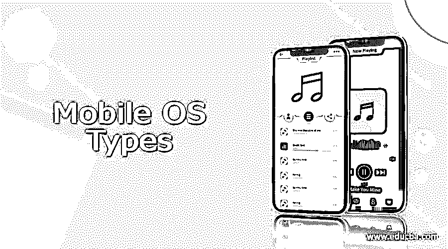

# 移动操作系统类型

> 原文：<https://www.educba.com/mobile-os-types/>

## 移动操作系统类型介绍

手机操作系统类型是手机上的操作系统类型。操作系统是负责管理和操作硬件单元的软件接口。在以前，手机只是一种用来打电话和发短信的设备。如今，手机接近于掌上电脑，使他们能够发送电子邮件，看新闻，打视频电话，玩游戏等等。OS，也称为操作系统，是运行在台式机和笔记本电脑上的软件，用于多任务处理时管理内存和资源。大多数移动操作系统都在特定的硬件上运行，比如摩托罗拉在 Android 上运行，而 iPhone 在 iOS 上运行。当你购买一部手机时，制造商已经为它设计了特定的操作系统。在购买手机之前，最好了解所有的操作系统类型，以确保设备兼容性和对要使用的应用程序的支持。

### 移动操作系统的类型

我们将介绍最流行的操作系统平台，

<small>网页开发、编程语言、软件测试&其他</small>

#### 1.Symbian 操作系统:

正是操作系统提供了高层次的集成和通信。它由 Symbian 有限公司于 1998 年开发，基于 Java 编程语言。诺基亚制造商是第一个使用 Symbian 操作系统的制造商。它是无线通信和个人信息管理(即 PIM)的结合，包括日程和联系人。诺基亚将此作为一种开放和直接的模式，与其他原始设备制造商合作。它由多个层组成，如应用引擎、MKV、操作系统库、基本内核、服务器和硬件接口层。它主要被日本制造商用于在日本销售的手机，这个操作系统也可以在索尼爱立信的一些手机上找到。

#### 2.黑莓操作系统:

这是由 Research in Motion(即 RIM)开发的操作系统，将用于流行的黑莓(BlackBerry)手持设备。它以通过 MIDP 对公司邮件的本地支持而闻名，从而允许与 Lotus Domino 和 Microsoft Exchange 进行无线激活和同步。根据研究，在本文发表时，大约 45%的移动开发者正在使用黑莓操作系统。BlackBerry 为开发人员提供 API 类来编写应用程序。它只能在 Curve、Perl、BlackBerry bold 和 Storm 等黑莓手机上运行。黑莓下的所有应用程序都是用 Java 编写的，应用程序只能通过黑莓桌面管理器从黑莓应用程序世界安装。

#### 3.Android 操作系统:

它是谷歌在 2008 年开发的最常见的操作系统。它是一个免费的开源操作系统，基于 Linux 内核。Android 拥有大量编写应用程序和扩展设备功能的开发人员。Android 操作系统的名称随着每个版本不断变化，如 Donut、clair、Oreo 等。基于广泛的用户群，Android 相对于其他操作系统处于主导地位。用户能够使用有用的小部件定制多个屏幕，并快速、轻松地访问用户关心的功能和内容。它有多任务的能力，并且有一个相当于 iOS 苹果商店的 Android 市场。

#### 4.苹果 iOS:

它是苹果公司为 iPhone 开发的操作系统。然后，又扩展为 iPad，iPad Touch，Apple Touch 等。这是一个安全的操作系统，只适用于苹果公司的产品，因为该公司没有授权给第三方硬件。iOS 对用户的触摸作出反应，在屏幕上轻点即可打开程序，合拢手指放大或缩小图像，在屏幕上滑动手指即可翻页。用户可以将苹果应用商店上的数百万个应用程序直接下载到任何运行 iOS 的设备上。苹果 iOS 是第二大最畅销的手机操作系统。自 2007 年开发第一款 iOS mobile 以来，iOS 用户界面一直没有改变。Android 和 iOS 的主要区别在于，iOS 只在苹果产品上运行。

#### 5.Windows 操作系统:

它是由微软开发的操作系统，主要是为袖珍个人电脑和手机设计的。它具有基于计算机的 Windows 操作系统功能和一些智能手机的附加功能。这款移动操作系统基于 Windows CE Kernel 5.2，并配有一个移动优化版的 IE 浏览器，支持企业邮件账户。2010 年，当其软件落后于 iOS 和 Android 时，Windows 发布了其 Windows 平台的改进版本。它可以很容易地通过基于磁贴的界面识别出来，其特点是在主屏幕上有可移动和可更换的部分，以服务于自己的目的。它有一个单独的角落给孩子们，这样他们就不会接触到任何个人数据和误用。

### 结论

至此，我们将结束“移动操作系统类型”这一主题。我们已经了解了移动操作系统类型的含义以及它们是如何分类的。我们已经看到了从 Android 到 iOS、Windows、BlackBerry 和 Symbian 的操作系统类型。每个操作系统都有自己的目的来服务于智能手机，并且每个操作系统都有自己的特性、规范等。还有更多的操作系统被列出来，如鸿蒙系统，Palm OS，Bada，Web OS(惠普)，MeeGo OS，Kai OS，Plasma OS，Sailfish OS 等。，还有很多。希望这个主题已经清楚地展示了智能手机所基于的各种操作系统。谢谢！快乐学习！!

### 推荐文章

这是移动操作系统类型指南。在这里，我们讨论介绍，流行的移动操作系统类型列表。您也可以看看以下文章，了解更多信息–

1.  [移动通信技术](https://www.educba.com/mobile-communication-technology/)
2.  [移动计算特性](https://www.educba.com/mobile-computing-features/)
3.  [移动安全应用](https://www.educba.com/mobile-security-apps/)
4.  [移动渗透测试](https://www.educba.com/mobile-penetration-testing/)

