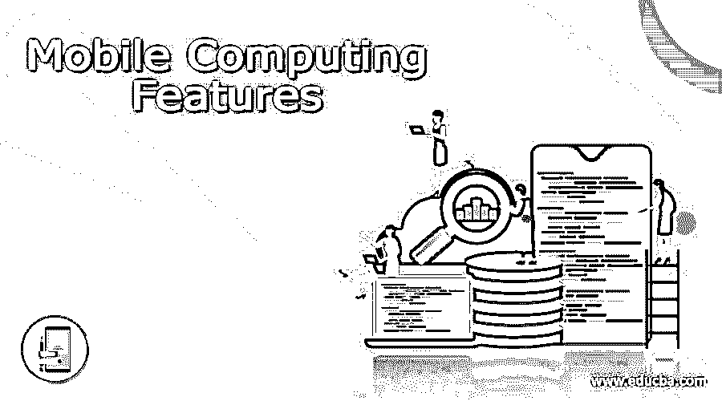

# 移动计算功能

> 原文：<https://www.educba.com/mobile-computing-features/>

## 移动计算功能简介

移动计算功能使计算机用户能够在移动中保持与服务器的连接，而不管他们当前的地理位置，并从服务器访问信息以及在其中提交事务；这些功能，加上互联网，给我们的业务、银行、政府交易、社交网络、官方合作、朋友/家庭成员之间的互动带来了巨大的变化；它还能够开发创新的使用案例和业务案例，以提高生产率和降低成本；这些特征有助于以可承受的成本在普通公众中普及计算设备，并提高了人们的总体生活水平。

### 移动计算简述

移动计算的成功可能是由于以下五个因素

<small>网页开发、编程语言、软件测试&其他</small>

1.更小、更易携带的终端用户设备的发明
2。开发设备和服务器之间的新通信协议
3。在设备和服务器之间传输数据和语音的无线网络的发展
4。发明全球定位系统(GPS)来跟踪移动设备的位置。
5。发展新的软件平台，开发利用新硬件和移动技术的应用

如上所述，让我们通过将移动计算特性分成五组来分析它们的特性。

**移动计算的特点**

移动设备

对于老一代人来说，移动计算的第一个外观是笔记本电脑，因为它虽然通过有线连接，但可以在办公桌和办公室之间移动。随着对讲机、寻呼机、数据助理、平板电脑(如 iPad/ Tablet)等更轻薄、更便携的终端用户计算设备的发明，以及手机和电脑作为智能手机的最终融合，移动设备的发展仍在继续。

**设备的特点是:**

尺寸应尽可能小，便于随身携带，重量应尽可能轻。它应该有足够的处理能力来快速生成号码。
应支持所有通信协议
应支持所有网络，并应在全球任何地方工作而不会出现任何网络故障
显示屏应非常清晰，并能对环境变化做出响应
电池应具有尽可能长的寿命
应支持近场通信器(NFC)协议，向附近的设备发出信号，以完成支付交易，取代借记卡/信用卡。
它应该有足够的存储空间
应该有一个现代化的摄像头来拍摄照片，并将其与应用程序无缝连接。
应具有指纹传感器，以整合安全锁定功能
。应具有快速充电设施

**通信协议**

移动计算主要使用无线网络协议来连接外部网络和设备，并在通信中使用无线电波频谱。这些协议采用多路复用技术，在发送之前将数字信号与模拟信号组合在一个通道中，并在目的地进行多路分解。多路复用优化了稀缺资源的利用。

在频分复用(FDMA)中，每个用户被分配不同的频率，在时分复用(TDMA)中，用户共享频率，在码分复用(CDMA)中，用户共享相同的频率，但是由唯一的代码来标识。

全球移动通信系统(GSM)是 20 世纪 80 年代采用最多的无线系统之一。它使用 TDMA 协议，在很大程度上帮助了移动电话的普及。无线本地环路(WLL)在本地提供电话服务，它有一个基本系统和用于语音通信的手机。

通用分组无线业务(GPRS)通过网络以分组的形式传输语音数据。用户只为传输的数据量付费，不为使用时间付费。

使用模拟信号传输数据的第一代(1G)移动通信于 20 世纪 80 年代在美国推出。1G 的缺陷是低速 2.4kbps，语音传输质量差，手机体积大，电池寿命低。

第二代(2G)移动通信使用 GSM 技术上的数字信号，改善了语音质量，并将速度提高到 64kps，并支持消息传递。2G 有几个安全问题。

3G 提供高达 2Mbps 的速度，并支持互联网浏览、音频/视频文件传输、电子邮件服务和游戏。它为数据技术与电话系统的融合铺平了道路，并实现了移动和移动优先概念中的一切。

4G 将移动用户体验提升到了巅峰水平，速度达到了 1Gbps。它让高清电视具备了直播、云计算、数据网络电话等功能。

**无线网络**

移动设备使用电信服务提供商提供的语音和数据网络服务。用户利用电信运营商提供的数据服务，进入互联网，做他们想做的任何事情。这项服务的唯一缺点是数据网络的带宽有限，用户不能下载大文件，也不能使用数据密集型应用程序。

移动设备可以作为台式机、笔记本电脑，通过无线连接连接到任何组织的局域网或广域网，继续进行正常活动。这些设备可以通过家中或公共场所的本地 Wi-fi 网络连接到互联网。

**全球定位系统**

移动设备能够利用卫星服务来了解其当前位置。虽然互联网不涉及 GPS 定位服务，但它增加了许多额外的功能，为用户提供独特的服务，例如

与地图集成，以图形方式了解当前位置
；导航应用程序，以了解前往某地的路线。
到达您所在位置的出租车和其他送货服务
基于位置的上下文信息访问

**手机软件**

移动设备的尺寸各不相同，开发程序来显示与尺寸相匹配的内容是一个挑战。几个应用平台提供的响应式 web 设计工具解决了这个问题。

这种软件开发的另一个问题是，太多的内容必须显示在太少的地方，并迅速引起用户的注意。它是通过使用简单网页设计的创新方法来解决的。

开发人员需要管理安全问题，并在编码阶段处理任何违规行为。

### 结论

移动计算极大地改变了我们的生活，手机是许多年轻人的第一台电脑。幼儿园和小学的课程是通过手机进行的。由于移动计算的影响，随着我们的发展，许多人会更加关注移动计算。

### 推荐文章

这是关于移动计算功能的指南。这里我们详细讨论定义、简介、特征。您也可以看看以下文章，了解更多信息–

1.  [移动云计算](https://www.educba.com/mobile-cloud-computing/)
2.  [边缘计算架构](https://www.educba.com/edge-computing-architecture/)
3.  [什么是效用计算？](https://www.educba.com/what-is-utility-computing/)
4.  [手机应用软件](https://www.educba.com/mobile-application-software/)

