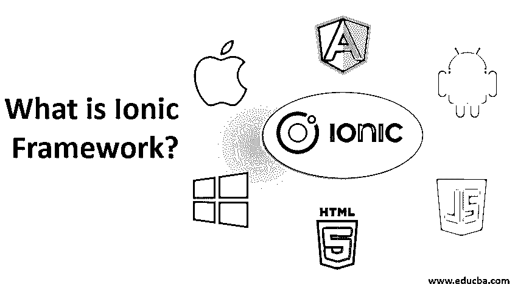

# 什么是离子框架？

> 原文：<https://www.educba.com/what-is-ionic-framework/>

## 什么是离子框架？

Ionic Framework 是一个开源 UI 工具包，允许使用 web 技术开发高质量的移动和桌面应用程序。Ionic 架构基于应用程序的界面或用户体验。它易于学习，易于集成，或者使用一个简单的脚本，包括其他库或框架，如 Angle，在没有前端框架的情况下独立使用。这个框架目前有官方的 Angular 和 React 集成，对 Vue 的支持也在酝酿中。我们制作了一个视频来指导你在潜水前了解离子框架的基础知识。

### 为什么要用离子框架？

*   ionic 框架没有引入任何现成的东西。网络技术是熟悉的。因此，用户的时间不会浪费在学习新技术或语言上。
*   这些应用可以部署在任何地方，甚至是使用 Ionic 框架的虚拟环境中。
*   代码只需编写一次，无论是 android、Windows 还是 iOS。因此，在开发过程中可以节省时间来消除错误。
*   ionic 框架有助于快速构建应用程序，并使其变得非常简单。
*   Ionic 在它的[网页开发](https://www.educba.com/web-development-frameworks/)中使用了所有简单的[技术，比如 HTML](https://www.educba.com/versions-of-html/) 和 CSS，使得框架 UI 对开发者来说很容易，因为它被很多人所熟知。
*   Ionic 的逻辑层是用 Angular 做的，这是大多数开发者都知道的。因此，Ionic 简化了移动应用程序的开发。
*   Ionic 有合适的桌面布局，这使得它对桌面友好。它有一个网格和灵活的类似窗格的结构来布局应用程序，这是桌面版本。
*   它拥有开放的 web 技术，并且不与使用单一平台技术的框架竞争。
*   Ionic 框架中使用的 web 应用程序已更新，可在 play store 中获得。因此它对开发者是有用的。
*   Ionic 框架的社区非常强大，这有助于开发人员提出问题并及时收到反馈。
*   此外，有许多关于 Ionic 框架的教程、书籍和视频可以帮助开发人员从头开始。
*   Ionic 中的 web 组件有助于比任何其他框架更快地构建用户界面。
*   因为 Ionic 不需要二进制修改，所以部署速度更快。
*   该框架与 web 技术一起工作。
*   Ionic 支持渐进式网络应用程序(PWA ),因此它是独立于平台的。此外，它还有许多其他框架没有的特性，比如通知、硬件访问、离线工作等。
*   Ionic 有一个稳定的版本，支持 Angular 下的多种编程语言。
*   通过添加脚本标签，Ionic 框架可以处理任何 JavaScript。
*   我们可以称 Ionic 为混合组合，因为它是原生组件和 web 组件的组合。

### 离子框架的优缺点

这里我们讨论离子框架的优点和缺点

<small>网页开发、编程语言、软件测试&其他</small>

#### 优势

其优点如下:

1.  Ionic 是开发者的首选，因为它支持所有平台，如 android、Windows、iOS。
2.  大多数开发人员都知道 HTML、CSS、JavaScript，因此开发框架对他们来说很容易。
3.  Angular 被集成到 Ionic 中，这是一个很好的与 JavaScript 一起使用的框架。对于那些不想使用 Angular 的开发人员来说，还有其他的选择。
4.  为了配合它所支持的平台的外观，Ionic 可以改变自己的外观。
5.  在 Ionic 中，桌面应用可以完全转变为移动应用。
6.  它使用插件，如果它在原生环境中不工作，插件将帮助管理框架。
7.  它对移动设备中的所有操作系统只使用一种编程语言。
8.  Ionic 擅长开发系统的服务器端，因为使用了大多数众所周知的 web 技术。
9.  Ionic 框架中使用了插件。
10.  爱奥尼亚质量好，保养的好。
11.  使用的图形[是 iOS 的](https://www.educba.com/install-ios/)。因此，对于那些喜欢这种风格的人来说，这些图形是不错的。另一方面，材料设计可供不喜欢 iOS 风格的人参考。
12.  这些应用程序在 Ionic 框架中进行图形化编辑。
13.  Ionic 提供了许多额外的功能，如推送通知、PWA 支持。
14.  每个应用程序都有主题，因此这些应用程序看起来并不相似。
15.  与其他框架相比，Ionic 的速度更快。
16.  使用 Ionic 构建应用程序更容易，因为每个应用程序都不需要 API，并且发布应用程序也不需要单独的功能。
17.  离子骨架的成本更低。在框架中使用了 Ionic 命令行。

#### 不足之处

缺点如下:

1.  由于所有平台都使用一个代码服务器，所以框架可能会处于两者之间。
2.  在 Ionic 框架中，过渡到每个平台很困难，因为每个平台需要不同的处理。
3.  在本机平台上调试应用程序有点困难，因为一些插件只在 web 组件中受支持。
4.  如果应用程序使用从未使用过插件的硬件，Ionic 对于当前平台将毫无用处。
5.  图形性能达不到水平，因为它只使用 CSS3。这可能是 iPhone 4 以上手机的一个问题。
6.  Ionic 在 3D 或开发视频游戏方面并不擅长。
7.  插件不是万能的，因此开发者应该为操作系统编写类似插件的代码。
8.  当比较 Ionic 和原生 app 的性能时，Ionic 的性能不如原生 app。
9.  Ionic 内置的应用程序的安全性是一个问题，尤其是对银行或金融来说，因为它并不完全可靠。
10.  应用程序内的集成可能不会比应用程序执行的预期速度更快。
11.  与本地应用程序相比，Ionic 启动应用程序需要时间。

应用程序在 Ionic 框架中以优雅舒适的风格构建。跨平台设施有助于 Ionic 用单一代码库管理所有平台。在 Ionic 中，用户界面和主题管理得非常好。

### 推荐文章

这是一个什么是离子框架的指南？.在这里，我们讨论为什么我们使用离子框架以及它的优点和缺点。您也可以阅读以下文章，了解更多信息——

1.  [角度与自举之间的差异](https://www.educba.com/angular-vs-bootstrap/)
2.  [App 开发工具的特点](https://www.educba.com/mobile-app-design-software/)
3.  [ReactJS 与 Angular2 对照表](https://www.educba.com/reactjs-vs-angular2/)
4.  [数据仓库的特点](https://www.educba.com/oracle-data-warehousing/)

