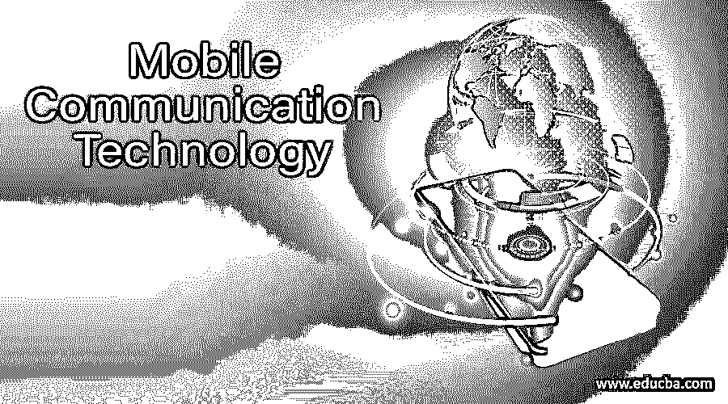

# 移动通信技术

> 原文：<https://www.educba.com/mobile-communication-technology/>

## 移动通信技术导论

移动连接支持从计算机或移动设备传输语音和多媒体数据，而无需连接任何物理或固定链路。移动交互日益完善，已经成为每个人的必备品。移动通信同时也是独立于任何物理连接，通过通信基础设施交换语音和数据。移动网络基础设施使组织能够更有效地工作，并提高人类的生活水平。移动网络和移动计算只是两个独立的名称，是指在独立位置或环境中发现的能够在驾驶时使用移动技术的最紧凑的机器和计算设备。在这个话题中，我们将学习移动通信技术。

### 移动通信技术的重要性

随着人口的增长，人们迫切需要互联互通。人们仍在忙于建立最简单快捷的联系方式。一个这样的例子是技术的进步，如电话的发明。未来的每一代人都会有一个前进的标志。在第一部手机问世之前，更大的手机一直在更新换代。从 90 年代末到第一代智能手机技术，到第三代智能手机，通信方式已经完全转变。

<small>网页开发、编程语言、软件测试&其他</small>

第三世纪的移动电话缩小了地球村中几乎遥远的地方。从 20 世纪 90 年代中期的手持技术开始，有太多类型的个人计算机，如笔记本、PDA 和其他移动机器。我们必须使用最好的技术使这种形式的移动设备更加安全可靠。

虽然我们在谈论移动技术，但我们现在可以依赖许多可用的移动技术，如 WiMAX、2G、3G、4G、EDGE、Wibro、GPRS 等等。移动或移动消息技术侧重于各种保护原则及其背后的协议。在本节中，我们深入探讨了各种移动技术和移动通信网络。与电子网络或移动计算的其他有线和无线技术有什么不同。

让我们来看看通信技术。

自 1983 年摩托罗拉第一部商用手机问世以来，移动技术已经取得了长足的进步。无论是在技术、协议、提供的服务还是速度方面，移动电话的发展都是为移动通信而记录的。这里我们将讨论这几代人区别于前几代人的基本特征。

#### 1.1G 技术

1G 指的是第一世纪使用模拟信号的蜂窝电话网络。它于 20 世纪 80 年代初在美国首次开发，并专门为语音通信而开发。1G 技术的速度是 2.4 KBPS。此外，在 1G 技术中，大手机的电池寿命较短，语音质量较差。

#### 2.2G 技术

2G 是指第二代手机中最早使用数字信号。它于 1991 年引入芬兰，采用 GSM 技术。某些有影响力的 2G 连接功能正在实施 GPRS 技术，支持在线冲浪、电子邮件和快速上传/下载。落后于下一代智能手机的 2G GPRS 有时被称为 2.5G。在 2G 技术中，数据速度为 64 kbps，具有多媒体和 messenger 等强大功能，语音质量优于 1G 技术

#### 3.3G 技术

蜂窝电话的第三代(3G)始于新千年之初，与前几年相比带来了巨大的变化。中间一代 3.5G 融合了各种移动电话和数据系统，为下一代移动通信铺平了道路。昂贵的手机高昂的维护费用，如执照费和移动塔建设基础设施需要合格的工人。

#### 4.4G 技术

2011 年，推出了第四代(4G)移动连接，延续了每十年新一代移动的模式。4G 的主要功能包括 100 mbpst0 1 GBPS 的速度，以及一些高级功能，如云计算、移动网络访问等

### 移动通信的特点

以下是下面提到的特性

#### 1.高容量负载平衡

负载平衡应该集成到每个有线或无线基础设施中。高负载平衡可确保当一个连接点因可用电量不足而不堪重负时，设备可将用户从一个接触点动态切换到另一个接触点。

#### 2.网络管理系统

无线网络现在变得更加复杂，有数百甚至数千个接入点、防火墙、交换机、监控电源和其他部件。蜂窝网络具有集中控制整个网络的更智能的手段。

#### 3.可量测性

新的无线设备每天都在不断普及。不需要大修或创建一个全新的网络，网络将开始微小，如果必要的话，但增加覆盖面和容量。

### 推荐文章

这是一本移动通信技术指南。在这里，我们讨论什么是移动通信技术，它是我们日常生活的重要组成部分。我们希望这篇文章对您有所帮助。您也可以看看以下文章，了解更多信息–

1.  [移动安全应用](https://www.educba.com/mobile-security-apps/)
2.  [移动测试工具](https://www.educba.com/mobile-testing-tools/)
3.  [移动云计算](https://www.educba.com/mobile-cloud-computing/)
4.  [手机应用软件](https://www.educba.com/mobile-application-software/)

