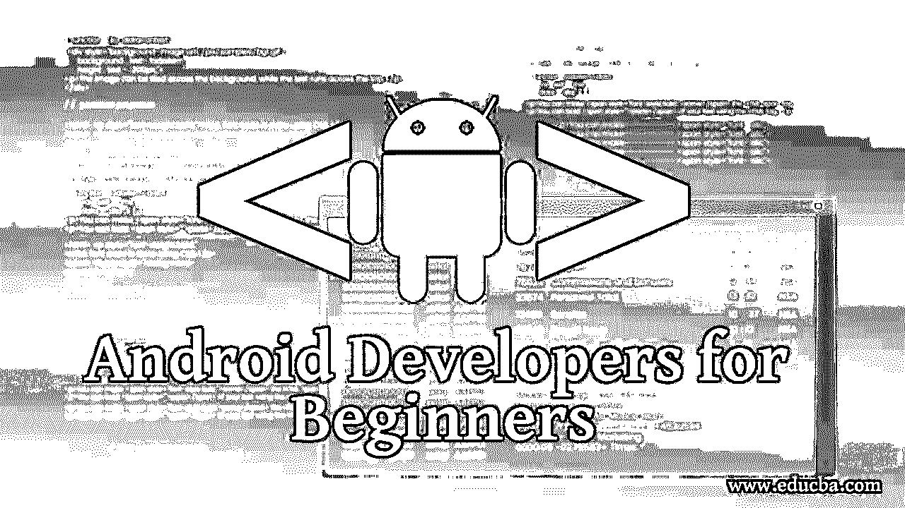

# 面向初学者的 Android 开发人员

> 原文：<https://www.educba.com/android-developers-for-beginners/>

## 面向初学者的 Android 开发者入门

技术可能会令人伤脑筋，但最终它会成为你所有辛苦努力的抚慰剂。因此，无论如何，令人窒息的技术可以得到，你必须在一天结束的时候找到一个简单的方法来完成你的工作。科技已经侵入了我们生活的方方面面，如果在使用中受到阻碍，你将一事无成。我自己有点(是的…有点)害怕技术，更害怕它是如何工作的，但我决心克服我的恐惧，以便充分利用它。因此，在这个主题中，我们将向初学者介绍 Android 开发人员

手机——它们的使用可能是小菜一碟，但有了各种应用程序的 Android 开发工具，我会完全避开它。然而，我常常意识到永远不要对任何事情说不。也许这就是为什么我决定全面了解 Android 开发者如何为初学者开发应用软件。我已经意识到基础知识是必须的，因此在这篇文章中，我实际上写下了我作为 Android 开发者对于初学者必须知道的事情。

<small>网页开发、编程语言、软件测试&其他</small>

### 面向初学者的 Android 开发者指南

android 开发者新手指南如下:

#### 什么是智能手机？

(我告诉过你，我将带你到基础水平，以确保你精通每个水平的想法)

智能手机是一种手机，它实际上执行电话和计算机的功能。简而言之，我们可以说智能手机是两种设备的结合，一种是手机(帮助打电话、发信息),另一种是电脑(收发电子邮件、上网冲浪、办公文档、记录等等)。这是我能为 Android 开发者向初学者呈现的最简化的定义。

智能手机的一些功能使其在使用方面非常独特。智能手机就像电脑一样由操作系统运行。现在电脑的操作系统是 Windows、Ubuntu、DOS，手机的操作系统有 iOS、Android、BlackberryOS、惠普的 WebOS 和 Windows。

iOS 运行苹果的 iPhone，BlackberryOS 运行黑莓手机，Windows 运行微软手机，其余的运行谷歌的 Android 操作系统和惠普的 WebOS，运行这些操作系统的智能手机允许你运行应用程序，通过 GPS 访问方向，播放各种音乐，拍照并用图形编辑它们，下载文件，并在你忙碌的时候使用它们。简而言之，你的智能手机是一个功能强大的数字助手，在你随心所欲的时候帮你完成任务。

如果没有网络接入，或者简单地说是互联网，上述所有这些都是不可能的。随着 3G 和 4G 网络的出现，使用智能手机访问互联网变得非常容易。此外，几乎所有地方都支持 Wifi 接入；你的家、办公室、机场到你去购物的商场。

既然我们智能手机的基本知识已经很清楚了，现在让我们来讨论我们的 Android 操作系统，这将是我们的主要关注点。

#### 安卓是什么？

Android 是我们基于 Linux 的手机操作软件。Android 是由谷歌和其他公司领导的开放手机联盟开发的。它是一个开源软件，用户可以下载源代码，并可以对其进行调整，使其发展成为自己使用的应用程序。Google 一直在 Apache 许可证 2.0 版本下发布源代码。Linux 内核的变化已经在 GNU 通用公共许可证版本 2 下发布。

要创建一个 Android run 应用程序，对 Java 编程语言的必备知识可以确保对 Android 编程有一个基本的理解，并使工作变得相对有趣。

#### 什么是软糖，凯特？

虽然第一次听到它们的名字时，听起来像是儿童的糖果和巧克力，但它们离手机用户的糖果并不远。简单来说，KitKat 和 Jelly Bean 都是 Android OS(操作软件)的软件版本。虽然 KitKat 是最新技术，但尽管推出了升级软件，Jelly Bean 仍在市场上运行。果冻豆 4.3 是从果冻豆 4.1 版本升级而来，经过了大量的额外功能和前一版本的整改；Kitkat 4.4 成为最新推出的版本。

KitKat 绝对是一个高级版本，在你同一部手机的硬件上运行效率更高。增加了很多功能，让 Android 开发者新手也能享受到更好的功能。KitKat 更轻，因此在 512 MB 的内存上工作。

最新加入这个团队的是 5.0 和 5.1.1 版本的[安卓棒棒糖](https://www.educba.com/android-lollipop/)。棒棒糖已经推出，界面上的变化集中在被称为“材料设计”的设计语言上。棒棒糖之后是 6.0 版本的[安卓棉花糖](https://www.educba.com/android-marshmallow-features/ "Android Marshmallow Update Features")。

#### Android SDK 是什么？

android 软件开发的目的是为初学者创建新的 Android 开发人员，并在最新的界面或 Android 操作系统上高效地运行他们。可以使用 Android 软件开发工具包(SDK)构建 Android 应用程序。Android SDK 包括开发 Android 开发者工具，如 da bugger、库、基于 QEMU 的手机仿真器、教程、样本代码和文档。SDK 可以在 Linux、Mac OS X 10.5.8 及其升级版本、Windows XP 及其升级版本中的最新产品等平台上使用。

Android Studio 由 Google 开发，由 IntelliJ 提供支持，是一个 IDE(集成开发环境),它是官方开发的 IDE，但是 Google 允许 Android 开发人员自由使用其他工具。SDK 支持旧版本的界面，因此对于初学者来说，Android 开发人员可以很容易地向广大用户推销他们的应用程序。面向初学者的 Android 开发人员可以在。apk 格式。

### 面向初学者的 Android 开发人员工具入门

考虑到我们非常基础的知识已经清楚了，现在让我们转到对初学者来说更难的 Android 开发者部分，以及如何使用它来创建我们自己的 Android 开发者工具。

#### 安装 SDK

后谷歌时代，生活变得容易多了。这是一个真实的事实，下载 Android SDK 已经变得轻而易举，这要感谢我们自己的谷歌，谷歌推出了一个新的包，根据这个包，一次下载就可以让你准备好使用像 ADB 和 fastboot 这样的 Android 开发工具。

从谷歌下载 SDK。下载的文件是压缩的，需要解压缩到

*   Windows: C: drive
*   OS X:个人文件夹和
*   Linux:主文件夹

SDK 组件需要 Oracle 提供的 Sun Java 的工作版本。如果你没有安装 Java，如果你不能做到这一点，我很抱歉，我不能回到根本。你还没准备好。要从终端或命令行运行命令，计算机操作系统中的 PATH 变量是必需的。您将无法在 autoexec.bat 文件或 autoexec.nt 文件中设置路径，因此您需要更新您的系统，以便在编辑框中添加 Android SDK 工具和文件夹的完整路径，用分号分隔。现在你只需要保存文件并重启电脑。文件已经安装。

#### 设置操场

在我们进入面向初学者的 android 开发者设计和界面以及冗长的清单之前，让我们确保你已经准备好了玩下一个级别的基本东西。让我用更简单的方式告诉你，

*   下载 Android Studio
*   使用 SDK 管理器下载最新的 SDK 工具和平台

#### 创建项目

从欢迎屏幕创建一个新项目，并填写字段以进入下一步。填写应用程序名称、公司域和包名称，并将其保存在您选择的位置。

需要选中一个名为“选择您的应用程序将在其上运行的外形规格”的选项。无论你想在哪里为初学者运行你的 android 开发者，比如手机和平板电脑，选择它们。

为了确保面向初学者的 android 开发人员得到最大数量设备的支持，请选择适用于 SDK- API 8 的最低级别:Android 2.2 (Froyo)。

由于我们正在为初学者创建一个非常基本的 android 开发人员，因此无需选择电视、穿戴和眼镜等选项。

选择空白活动，然后单击下一步。在自定义选项下更改活动名称。

单击 Finish 完成创建项目的过程。

这个项目是所有项目中最基本的，包含默认文件。

#### 开发应用程序

你需要创建一个 XML 格式的 Android 开发者应用程序的布局，包括一个文本字段和按钮。当按钮被按下时，应用程序做出响应，文本字段的内容被发送到另一个活动。

*   **创建线性布局**

当您打开布局文件时，首先会看到预览窗格。点击这个页面，你会在设计窗格中看到所见即所得的 android 开发者工具。

线性布局按照 Android 开发人员工具的指定来布置垂直或水平布局。布局应该填满整个屏幕区域。

*   **添加文本字段**

为了标识具有某些 XML 属性的项目，应用程序代码的引用代码的唯一标识符是必要的。

*   **添加字符串资源**

默认情况下，Android 开发人员为初学者的项目提供了一个字符串资源文件。字符串资源允许您在单个位置处理 UI 文本，从而使您能够轻松地找到并处理它。

*   **添加一个按钮**

这其实是布局过程的一部分。按钮是作为小部件添加的，以确保 Android 开发者工具中的内容适合和包装 Android 开发者的初学者设计。

*   **制作输入框，填写屏幕宽度**

要保证你的安卓开发者新手用安卓开发者的 app 设计看起来很有美感，从而保证屏幕的高度和宽度与内容的比例是在这个阶段制定出来的。

#### 运行应用程序…

android 开发者应用的运行取决于两个因素。

1.  你用的是 Android Studio 吗？
2.  你有运行 Android 的真实设备吗？

考虑到以上两个是检查你的 Android 开发者的主要方法，让我们两个都学一学。

从 Android Studio 运行 Android 开发人员应用程序

选择项目文件，然后单击工具栏上的“运行”。

出现“选择设备”窗口，您需要选择正在运行的设备，然后单击“确定”。Android studio 将安装该应用程序，您可以运行您的基本检查。

通过命令行运行 android 开发者应用

您需要打开命令行并转到项目目录的根目录。您必须使用 Gradle 在调试模式下构建您的项目。创建完项目后，将找到模块中的输出 APK。

在设备上找到应用程序并打开它。

### 推荐文章

在本文中，我们讨论了面向初学者的 Android 开发人员及其工具，以提高他们在 Android 开发生涯中的知识。你也可以看看下面的课程来学习 Android 开发者的初学者

1.  [安卓棉花糖功能](https://www.educba.com/android-marshmallow-features/)
2.  [面向初学者的 Android 应用开发](https://www.educba.com/android-app-development-for-beginners/)
3.  [安卓电子邮件应用](https://www.educba.com/email-apps-for-android/)
4.  [扎根安卓应用](https://www.educba.com/rooting-android-apps/)

