# Android 安全应用

> 原文：<https://www.educba.com/android-security-applications/>

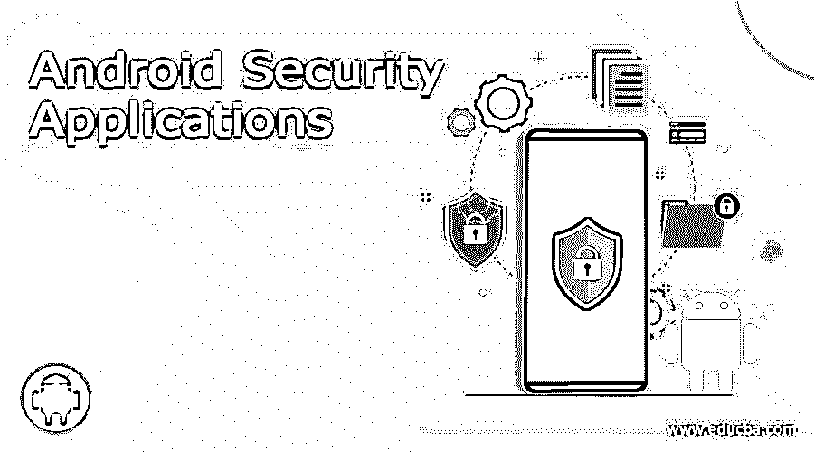

## Android 安全应用简介

以下文章提供了 Android 安全应用程序的概要。在 21 世纪，我们都完全依赖于技术，比方说，即使是几分钟，如果我们的手机停止工作，或者发生了一些奇怪的事情，你会觉得自己残废了，这将成为地球上最艰难的时刻。这可能是由多种原因造成的，其中一个原因可能是病毒。我们都在这里和那里传输大量数据，因为这是一个数字世界，我们觉得在移动时传输数据非常容易，因为它为我们节省了大量时间。现在在这个数字世界中，有如此多的应用程序帮助我们进行数据传输，并试图使我们的生活变得简单。

然而，这是有代价的，在传输数据的同时，病毒也有可能随之传播，从而使我们的生活变得痛苦不堪。现在，最好的部分是市场上有如此多的 Android 安全应用程序可以解决这个问题。那么，今天，我们将看到最有效的 android 安全应用程序。

现在，为什么是 Android？根据市场调查，Android 是手机中使用最广泛的[操作系统，这是大部分数据传输发生的地方，我们可以保护我们的手机，反过来也保护数据。](https://www.educba.com/applications-software-developer/ "Mobile Operating Systems to Build Applications")

让我们来看看可供我们使用的有效的 Android 安全应用，让我们的生活变得更加轻松，这些应用是免费和付费 Android 安全应用的结合。

### 不同的 Android 安全应用

以下是不同的 android 安全应用程序:

#### 1.360 安全–防病毒增强

[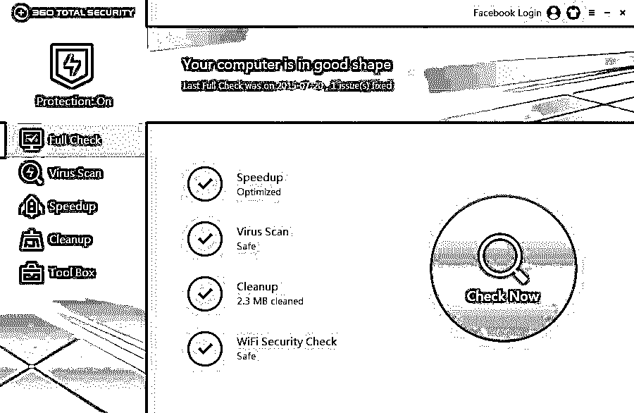

](https://cdn.educba.com/academy/wp-content/uploads/2016/01/360-security.jpg) 

根据市场研究和现有数据，它是 android 安全应用 360 用户中最受欢迎的产品。该产品在 Android 用户中注册了最大下载量。该应用程序具有许多功能，如扫描任何恶意软件的能力，扫描您的应用程序和游戏的能力，防盗功能，实时保护功能等。这个应用程序也有一个内置的清洁和助推器应用程序。其中一个真正有趣的功能是它的应用锁定功能，你可以用它来锁定任何应用。现在，这个产品最好的部分是它是完全免费的，你不用从口袋里掏出一分钱来使用所有的功能。

#### 2.Avira 防病毒安全

[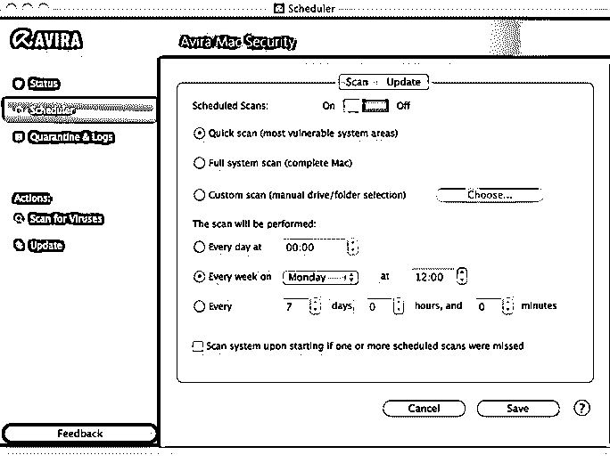

](https://cdn.educba.com/academy/wp-content/uploads/2016/01/avira-antivirus.jpg) 

该应用程序是市场上的新产品，但也是自推出以来增长最快的应用程序。它具有实时保护、设备扫描等功能，还能够扫描外部 SD 卡。它还具有其他现代功能，如防盗保护、黑名单功能等。该应用程序的最佳功能是 Stagefright Advisor，它可以帮助您解决任何潜入您设备的漏洞。它是免费的，或者象征性地收取每年 11.99 美元的费用。

#### 3.Avast 移动安全

[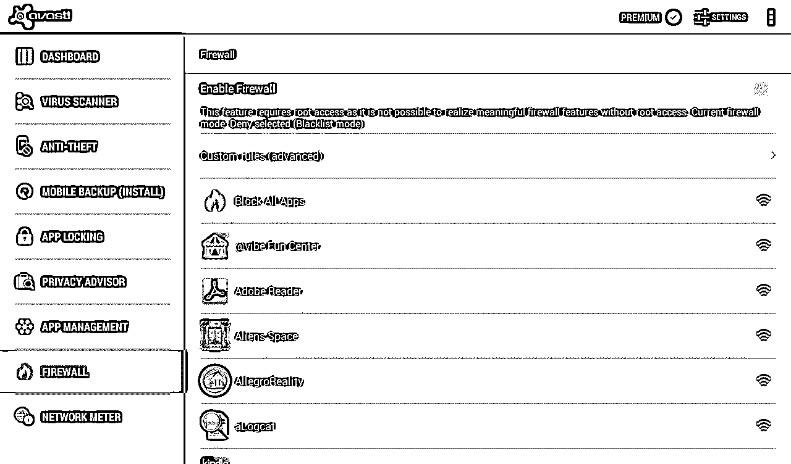

](https://cdn.educba.com/academy/wp-content/uploads/2016/01/avast-mobile-security.png) 

这个应用程序是所有用户的最爱之一。人们知道这是最值得信赖的应用程序。它提供了设备扫描、实时防护、应用程序扫描等基本功能。它还带有防盗保护和远程锁定您的应用程序。该应用程序最好的部分是它提供了应用程序的实时数据库更新，以保持其最新，以便它可以使恶意软件远离您的设备。这是最重要的应用程序之一，因为它有如此多的功能。该产品是免费的，也有每月 1.99 美元或 14.99 美元的付费支持。

#### 4.AVG 防病毒安全

[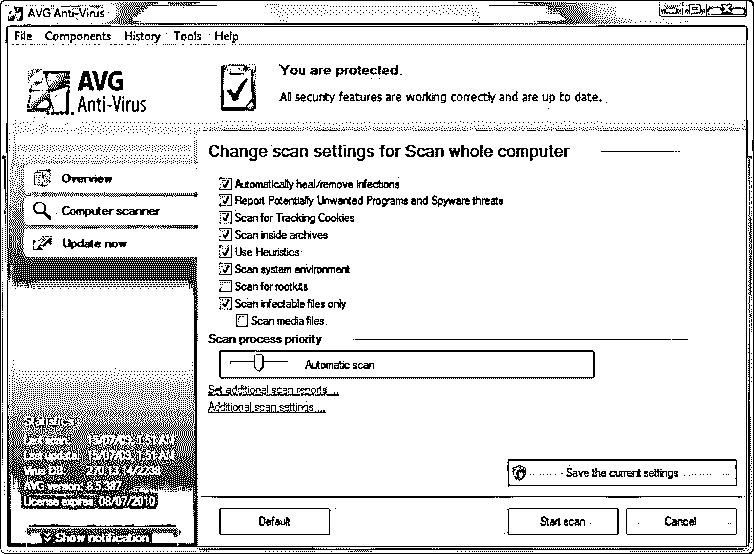

](https://cdn.educba.com/academy/wp-content/uploads/2016/01/AVG.jpg) 

嗯，你们都知道这个防病毒软件，因为你们一直在使用电脑。现在，这已经被提升到安卓手机安全应用了。这是市场上其他应用程序的精简版。它具有设备扫描、应用程序扫描、防盗保护和定期数据库更新防病毒等功能。这有一个叫做任务杀手的功能，可以用来杀死任何不必要的任务。这个杀毒软件的界面也不错。杀毒软件是免费的，如果你选择付费版本，价格为 3.99 美元/月或 14.99 美元/年，你可以获得呼叫阻止、应用锁定等功能。,

#### 5.CM 安全性

[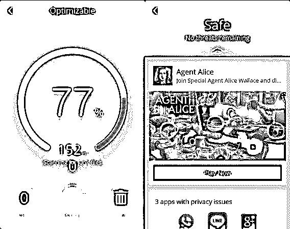

](https://cdn.educba.com/academy/wp-content/uploads/2016/01/Android-security.jpg) 

这是 Google play 商店中较早发布的反病毒应用程序之一，当时只有少数应用程序可用于移动设备，与同类应用程序相比，它也是一个精简应用程序。多年来，它一直被列为顶级防病毒和反恶意软件产品之一。它具有设备扫描、应用程序扫描和防盗保护等基本功能。这个应用程序最好的功能是它提供的应用程序锁，应用程序锁不仅可以锁定应用程序，还可以拍摄试图访问它们的人的自拍。你可以免费获得所有这些出色的功能。

#### 6.Bitdefender 防病毒软件

[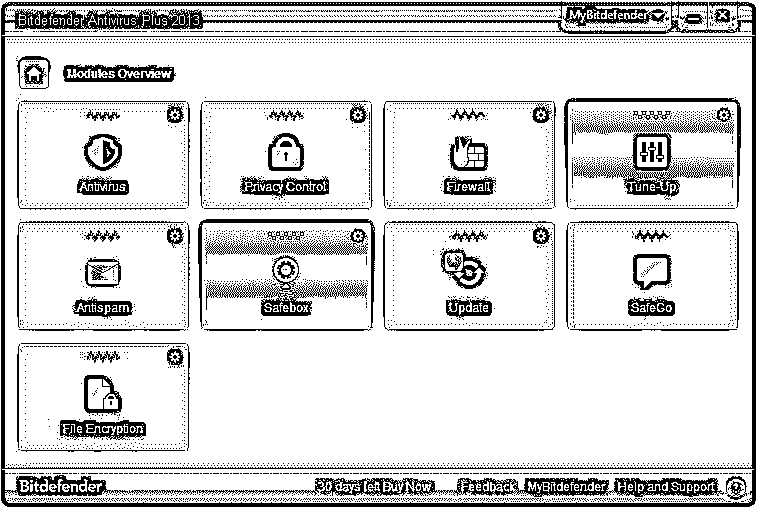

](https://cdn.educba.com/academy/wp-content/uploads/2016/01/bitdefender.jpg) 

这个杀毒软件是如此精简，它需要这个应用程序所需的零配置。这个防病毒软件没有任何复杂的功能。它的工作是扫描应用程序和清理你的设备。它还提供实时数据库应用程序，并且还支持其他应用程序。我们所有人都可以免费获得这款杀毒软件，而不用从你的口袋里掏一分钱。

#### 7.Eset 移动安全和防病毒

[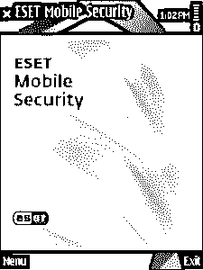

](https://cdn.educba.com/academy/wp-content/uploads/2016/01/Eset.png) 

这款杀毒软件在统治了个人电脑领域 10 年之后，也在移动领域占据了一席之地。它在 PC 领域以 Nod32 而闻名。根据市场调查，2015 年检测率达到 100%。除了扫描和为设备提供实时保护，这款杀毒软件最好的部分是它有一个平板电脑界面，这在 Android 杀毒市场上很少见。杀毒软件是免费的，如果你选择 9.99 美元/年的订阅，你还可以得到防盗保护。

#### 8.卡巴斯基互联网安全部队

[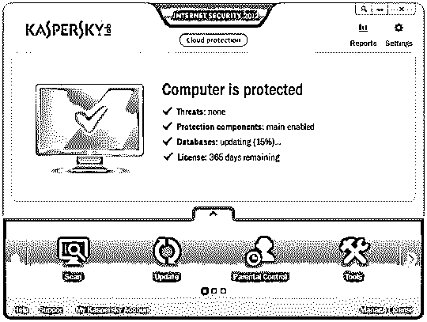

](https://cdn.educba.com/academy/wp-content/uploads/2016/01/kaspersky.jpg) 

这个应用程序也因一群特殊的人而出名，他们都不喜欢使用这个应用程序。免费的 Android 安全应用程序版本提供了基本的功能，如扫描设备上的任何恶意软件，扫描应用程序，其中付费版本的费用为 9.99 美元/年或 14.95 美元/年，用于两台设备，提供了额外的选项，如实时保护、防盗保护和其他一些功能。唯一的缺点是，对于低端手机来说，这是一个重度应用。

#### 9.恶意软件字节防恶意软件

[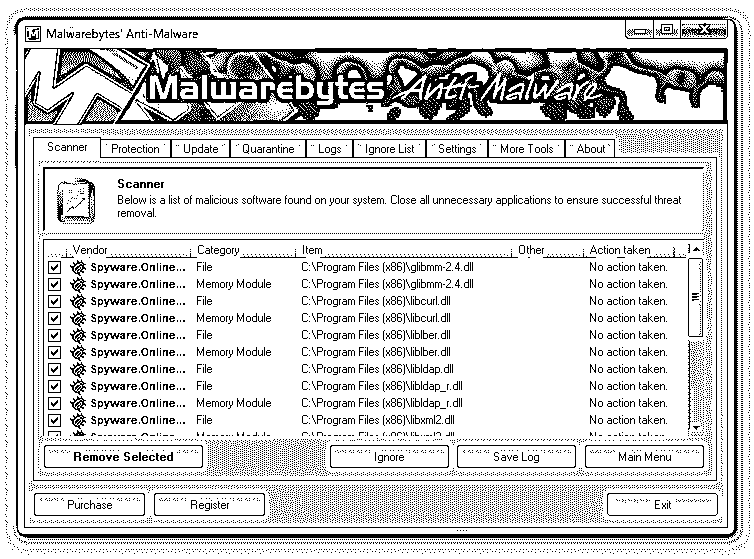

](https://cdn.educba.com/academy/wp-content/uploads/2016/01/Malwarebytes.png) 

这个应用程序已经被证明是一个非常好的 PC 反恶意软件，它在 android 移动安全应用程序中表现良好。这是一个非常精简的反恶意软件，只专注于恶意软件，间谍软件或病毒的删除和设备的实时保护。这个应用程序对用户来说是完全免费的。

#### 10.McAfee Security and Power Booster

[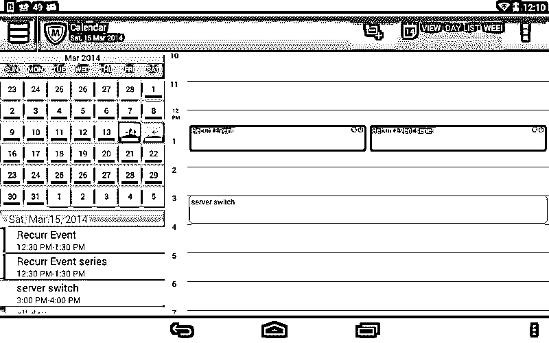

](https://cdn.educba.com/academy/wp-content/uploads/2016/01/McAfee.png) 

McAfee 是反病毒市场上最著名和最受欢迎的品牌之一。作为一个 Android 工具，它在 PC 领域和移动领域都可用。McAfee 的免费版本提供基本功能，如扫描设备、应用程序扫描和许多其他功能。McAfee 的付费版本每年花费 29.99 美元，为您提供防盗保护和一些备份服务。

#### 11.诺顿安全和防病毒软件

[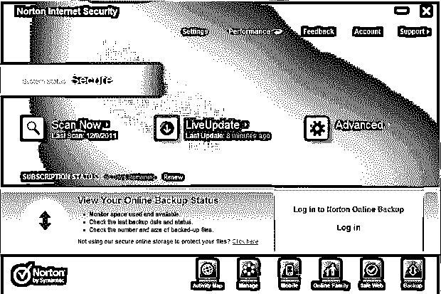

](https://cdn.educba.com/academy/wp-content/uploads/2016/01/Norton.png) 

这款杀毒也是杀毒市场上比较老的玩家之一。该应用程序的免费版本有助于扫描设备及其应用程序。这个防病毒软件是一个繁重的应用程序。诺顿的付费版本每年 29.99 美元，提供了一些附加功能。

#### 12.安卓移动安全

[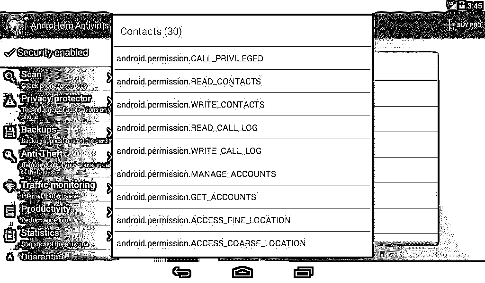

](https://cdn.educba.com/academy/wp-content/uploads/2016/01/androhelm.jpg) 

这个应用较少被人们使用和知晓。该应用程序的主要功能是实时保护设备免受病毒、恶意软件或间谍软件的侵害，频繁更新数据库、应用程序备份、隔离模式等。这个应用程序最有用的功能是，你可以远程阻止你的设备，帮助你找到你的设备，以防它丢失，从手机上删除东西。这种设计也不是用户友好的，但它也是免费的，或者你可以选择许可版本，价格为 2.59 美元/月，23.17 美元/年或 119.85 美元/年。

#### 13.TrustGo 提供的防病毒和移动安全服务

[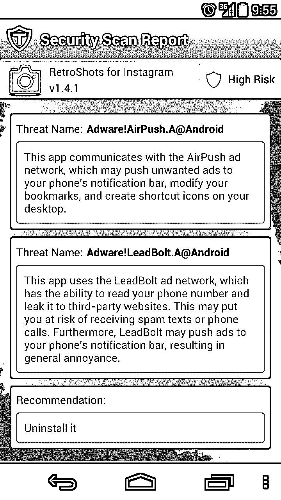

](https://cdn.educba.com/academy/wp-content/uploads/2016/01/TrustGo.png) 

TrustGo 的另一款中量级应用，顾名思义，是 Android 安全应用市场上的一款新应用。Android 安全开发者称这款应用是一款有哲学的应用。该应用程序的主要功能是实时保护，扫描设备现有的威胁，系统管理器，数据备份(如果需要)，找到我的手机等等。这个应用程序的良好功能是隐私保护，它是绝对免费使用。

#### 14.网络安全博士空间

[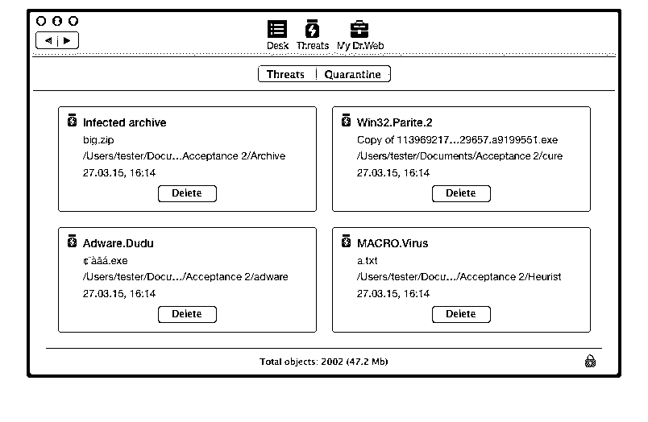

](https://cdn.educba.com/academy/wp-content/uploads/2016/01/DrWeb.png) 

这种防病毒软件在过去几年中不断发展。它开始是一个普通的应用程序，现在它已经成为广泛使用的抗病毒药物之一。这种防病毒软件具有系统扫描、快速和全面系统扫描等功能。因此，根据您的时间，您可以在您的设备上执行扫描。它还具有针对自动运行功能和其他杂项功能扫描外部 SD 卡的功能，这些功能可能会影响带有病毒的设备，并且它还提供设备上的实时更新。它有很多防盗和反垃圾邮件的功能。它还具有防火墙支持和云检查功能。这款杀毒软件可以免费获得，也可以付费获得支持。付费支持的费用非常低，每年 9.90 美元，两年 18.80 美元，终身支持 75 美元。

#### 15.前景

[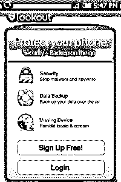

](https://cdn.educba.com/academy/wp-content/uploads/2016/01/lookout.jpg) 

许多 Android 用户都可以使用这个反病毒应用程序，因为它预装在许多移动设备上。该设备的免费订阅提供了防病毒、防盗和防恶意软件的部分功能。这种防病毒软件的付费支持费用为 2.99 美元/月或 29.99 美元/年，并提供完整的反恶意软件、防病毒、防盗、实时网页浏览保护、少量数据备份和其他一些功能。这个应用程序可以被认为是一个中等规模的应用程序。

#### 16.AVL

[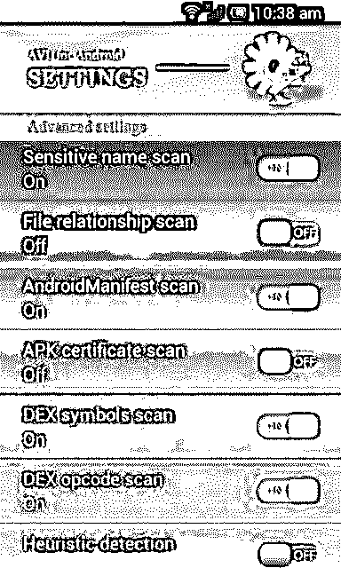

](https://cdn.educba.com/academy/wp-content/uploads/2016/01/AVL.jpg) 

如果你不想在你的防病毒软件中加入任何花哨的功能，如防盗、数据备份等。，那么这就是你要找的应用。此应用程序只有一个恶意软件保护功能。它只扫描您设备上的恶意软件或间谍软件并将其清除，保护您的设备免受任何攻击。这是一个轻量级的应用程序，根据市场调查，它获得了 100%的检测率。这款杀毒软件最棒的地方在于它可以扫描各种文件格式，而且完全免费。

### 结论

上述所有杀毒应用都是 Google play 中最好的，您可以根据自己的需要和要求选择其中任何一个。每个应用程序都有不同的特性，有不同的风格，面向不同的受众。在谷歌的公开市场上还有许多其他的应用程序，你可以使用这里没有列出的任何一个。

但是，你必须记住的一件事是，当你选择任何应用程序时，你需要首先研究该应用程序，然后再做出决定。你还必须看你选择的应用程序是否符合你的目的。因为如果任何应用程序没有达到您希望它达到的目的，那么这个应用程序的目的就没有达到。

在这个数字市场，这个地球上没有一个应用能给你一个安卓应用 100%安全的应用保证。对于每一个与 Android 安全应用程序相关的应用程序，都会有这样或那样的方法找到进入该应用程序的后门，并控制您的设备和数据。上述应用程序更好，因为它们的功能和 Android 安全应用程序级别不会发现后门。在这些应用程序的设计中投入了大量艰苦的工作，并且有安全测试人员不断检查可能导致该应用程序失败的漏洞。因此，这些应用程序的数据库更新的唯一原因是保持最新，与漏洞作斗争，并保护您的数据和设备免受地球上任何人的劫持，这些人可以出于自己的目的滥用您的数据。

因此，最后可以说，你选择什么样的应用完全取决于你自己，因为你比任何人都了解你自己和你的数据，知道它对你有多重要。因此，明智地选择您的应用程序，以备将来使用，并继续享受数字世界，没有任何打嗝。

### 推荐文章

这是一个 Android 安全应用的指南。这里我们分别讨论简介和不同的 android 安全应用。您也可以浏览我们推荐的其他文章，了解更多信息——

1.  [免费的 Android 模拟器](https://www.educba.com/free-android-emulators-for-pc/)
2.  [办公套件应用](https://www.educba.com/office-suite-applications/)
3.  [生根安卓](https://www.educba.com/rooting-android/)
4.  [安卓用户界面](https://www.educba.com/android-user-interface/)

