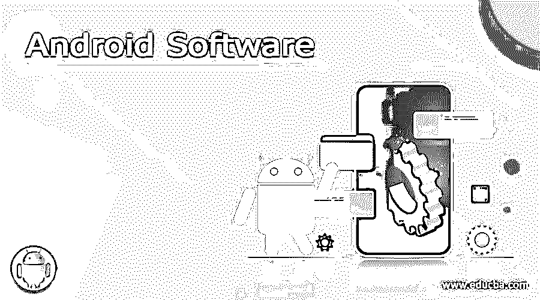

# 安卓软件

> 原文：<https://www.educba.com/android-software/>

## 适用于 PC 套件的 Android 软件

智能手机似乎是今天的流行语。手机通话只是这款手机众多功能中的一项。不仅仅是一部电话，它还是一台移动电脑，让我们可以上网浏览和玩游戏；它是照相机和导航仪；一个组织者和计算器，一个音乐播放器和档案库，等等。对不同的人有不同的意义。

| 最初由安迪·鲁宾于 2003 年推出的安卓系统在 2005 年被谷歌收购 |

是什么让手机可以像电脑一样工作？是的，你是对的！正是其先进的移动操作系统创造了手机、智能手机、

<small>网页开发、编程语言、软件测试&其他</small>

| 谷歌的智能手机操作系统驱动着全球 80%的设备 |

智能手机、平板电脑和笔记本电脑最受欢迎的移动操作系统是 Android。Android 是一个基于 Linux 的操作系统，有多种型号。

它声称占有很大一块市场份额和消费者基础。除了具有竞争力的价格，另一个增加其受欢迎程度的重要因素是它是一个开源软件，使第三方制造商能够向他们的客户介绍最新的技术进步。

### 管理您的 android 智能手机–Android PC 套件

由于我们一切都依赖于智能手机，因此管理好智能手机势在必行。这包括备份手机内容和媒体，下载和上传内容到电脑，并保持手机有条理。

这可以在有益的 Android PC 套件程序的帮助下快速完成。这款 android 软件通过 USB 端口将您的智能手机连接到 PC，并允许您使用和管理所有设备功能。

我们可以说，这些是设备管理器应用程序或 android 软件，使用户能够通过 PC 访问 Android 手机/平板电脑。

### 适用于 PC 套件的 Android 软件的优势

PC 套件可以作为应用程序下载到 Android 设备上，也可以作为 PC 软件下载到计算机上。它增强了手机性能，并帮助您管理手机上的各种 android 软件应用程序。

当作为 android 软件安装在您的 PC 上时，它有助于在您的 Android 设备上上传和下载文件。

### 在 Windows PC 上使用 Android——Android 模拟器

| Google Play 商店中有 140 万个 Android 应用程序。 |

Android 软件的另一个有益类别是 Android 模拟器。仿真器使您能够在您的计算机上运行 Android，即使您没有将智能手机或 tab 物理连接到它。

通过这种方式，您可以从 Google Play 商店下载数百个 Android 应用程序，享受聊天、游戏和更多内容，而无需 Android 设备。

模拟器显示一个虚拟设备，您可以在其中安装移动应用程序，并像使用 Android 设备一样使用它们。在 Android 模拟器的帮助下，您可以在 PC 上同时运行 Android 和 Windows，并通过更大的显示器和 Android 软件键盘获得更多令人敬畏的乐趣。

### 仿真器的优势

安装 Android 模拟器可以让你在购买 Android 设备之前试用 Android。它还允许你设计 Android 应用程序，并在你的电脑上运行。

一个模拟器可以让你增加 Windows 上下载的应用程序的数量，还可以将你的 Android 手机上的各种应用程序和 Android 软件与你的电脑同步。

因此，我们可以说，有两种类型的安卓软件的 PC 安卓软件 PC 套件和安卓模拟器。在下一节中，我们将讨论市场上提供的各种 PC 套件和仿真器程序。

### 安卓软件

以下是不同的 android 软件:

#### 1.移动电话

由 [Wondershare](https://drfone.wondershare.com/?utm_source=mobilego&utm_medium=redirect "Wondershare") 开发的 MobileGo 是 PC 套件中最引人注目的 Android 软件之一，具有独特的功能、强大的工具和[用户友好界面](https://www.educba.com/android-user-interface/ "Android User Interface Guidelines for Android Developers")。

你可以在主屏幕上看到手机和 SD 卡的总存储容量和所有存储内容。它还显示各种文件使用的空间和可用的工作空间。

它是一个清理大师和增强器，具有有效的文件管理器特性。它可以在 Windows 和 Mac 操作系统上轻松运行。

MobileGo 允许您将 Android 设备与计算机集成，以备份您的所有数据，包括联系人列表、消息和通话记录，并传输音乐、图片和视频等媒体文件。

**mobile go 的独特功能**

*   它可以将音频和视频文件转换成非常适合 Android 智能手机或平板电脑的格式。
*   删除不需要的文件和缓存，以提高手机的性能。
*   它有一个隐私检查功能，可以帮助您保护您的隐私，

| 例如:如果您计划从 Windows 操作系统智能手机转移到 Android 手机，MobileGo 可以让您将所有数据转移到您的 Android 手机，包括联系人、短信、图片、视频和电子邮件。 |

虽然 MobileGo 是付费的 android 软件，但是你也可以在购买之前下载一个免费的演示版。

#### 2.机械人

另一个非常受欢迎的优秀的 PC 套件 Android 软件是 AirDroid。它是免费的，是一个高效的 Android 应用程序，可以帮助你通过电脑上的网络浏览器管理你的 Android 手机/平板电脑。

它是独一无二的，因为它不需要 USB 电缆来连接您的计算机，并通过 wi-fi 连接远程链接。因此，您可以在完全安全的环境中快速无线传输数据和文件。

**air droid 的独特功能**

*   您可以在电脑屏幕上组织和管理短信、聊天、文件、联系人、图片、视频和其他应用程序。
*   一个奇妙的功能是它能够使用电脑键盘向上下文[发送文本消息。](https://www.educba.com/types-of-computer-keyboard/)
*   你甚至可以不用手机直接从电脑上接听电话。
*   无需线缆即可在手机和电脑之间轻松快速地传输文件。

可以排在[最佳安卓应用](https://www.educba.com/android-vpn-app/ "17 Best Android VPN Apps")之列，每个安卓机主都必须安装。

#### 3.MOBILedit

另一个可以让你的智能手机或平板电脑与电脑同步的 PC 套件是 Compelson Labs 的 MOBILedit。它支持广泛的 Android 设备，从基本型号到最先进的智能手机。

就像 Airdroid 一样，你可以使用它通过 wi-fi、红外(IR)、蓝牙甚至 USB 电缆将手机无线连接到 PC，如果这三种网络都不可用的话。

像其他 PC 套件一样，您可以使用 MOBILedit 完全通过电脑管理您的 Android 设备。它使您能够在几秒钟内保存音乐和图像，并管理电话簿联系人、信息等。

**MOBILedit 的独特功能**

*   您可以在手机、电脑和云存储帐户上创建关键数据的备份。
*   它有一个内置的视频编辑器。
*   它也可以通过 wi-fi 连接到 iPhone，方法是在 iPhone 上安装 i-tunes 的移动应用程序 MOBILedit Lite。
*   您可以获得完整的 SIM 卡读卡器支持，并通过 MOBILedit 提取 SIM 卡信息，如 IMSI、ICCID、LAI、PIN、PUK 和通话费用。

MOBILedit 的一个缺点是它的成本，比同类的其他程序要高。

#### 4.Droid Explorer

Droid Explorer 让你可以使用类似 Windows 网络浏览器的 Windows Explorer 界面来管理你的 Android 设备上的文件。这使得数据管理比以前更加容易。

与其他 PC 套件一样，它可以执行所有基本功能，例如通过电脑管理和备份手机上的重要数据，如信息、通讯录、图像、音乐和其他重要文件，并全面探索手机上的各种功能、选项和应用程序。

**Droid Explorer 的独特功能**

*   免费
*   类似 Windows 资源管理器的界面显示所有可用文件夹的根节点和目录内容。
*   借助命令外壳窗口中的拖放功能来命令您的 Android 设备。
*   易于卸载和安装文件。使用批处理模式安装多个 APK 文件，并使用工具中提供的卸载程序卸载应用程序。
*   它可以让你拍摄并保存在你的 Android 上执行的任务的截图和视频。

#### 5.91 台电脑套件

91 PC 套件 Android 由网龙是一个免费的电话管理器和备份应用程序。它被认为是第一个通过 USB 电缆支持各种移动操作系统的 android 软件，即 Android、iOS、Windows、Wince 和 Symbian 系统

**91 PC 套件的独特功能**

*   您可以通过其独特的媒体选项卡个性化铃声、壁纸、图片、视频和主题
*   91 PC 套件对系统来说并不沉重，因此即使对于系统或内存不太强大的手机来说也是理想之选。
*   非常适合新手和专业用户使用。

#### 6.MoboRobo Android 管理器

另一个受欢迎和引人注目的 Android PC 套件是 MoboRobo，它提供了许多管理和组织 Android 设备的功能。

通过用户友好的界面，MoboRobo 使您能够转移联系人用于备份目的，或者如果您正在升级到另一部手机。它支持 Android 和 iOS。

**MoboRobo 的独特功能**

*   允许你通过电脑将免费应用程序下载到你的安卓手机上。
*   具有一个内置的应用程序来帮助您下载音乐。
*   它可以帮助您从推荐的应用程序库中查找、下载和安装应用程序。
*   支持在 PC 上安装、卸载和更新智能手机中的应用程序。
*   使用 Mobo Launcher 作为手机的主题时，从 PC 控制手机的主题设置。

#### 7.Apowersoft 电话经理

Apowersoft Phone Manager 是一款功能强大的 Android 工具，可让您将 Android 手机连接到电脑，以管理照片、视频、音乐、联系人和其他应用程序，并诊断和增强您的手机。Powersoft 也支持 iOS 系统。

#### 8.AndroidPC

| PC 套件软件也被称为[同步软件](https://downloads.phpnuke.org/en/category-show/-z-v-l)或应用程序管理器。 |

AndroidPC 也是一些受青睐的 Android PC 套件之一。这款无线安卓软件可以让你不用 USB 线就能把手机连接到 PC 上，适用于安卓、Windows、Linux 和 Mac 操作系统。

### Android 模拟器软件

| 仿真器也称为模拟器。 |

现在我们将讨论一些流行的 Android 模拟器。如前所述，如果你想在 windows 电脑上运行 Android 应用和游戏，模拟器是必不可少的。

选择一个高效的仿真器是非常重要的，它不会影响系统的速度，并且能够高效地工作。

#### Droid4X

Droid4X 是现有 Android 模拟器中最新的一款。它通过其独特的功能优势赋予用户真正的权利。

有了 Droid 4x，你可以在个人电脑或笔记本电脑上玩自己喜欢的安卓游戏，下载安卓应用。它拥有卓越的性能和出色的用户体验。

**droid 4x 的独特功能**

*   它是预根的，Play Store 是预装的。
*   又快又高效。
*   它让用户将计算机键盘作为游戏控制器进行同步。
*   令人惊叹的图形提供了更好的游戏体验

#### 温德罗伊

有了 [Windroy](http://ww38.socketeq.com/?subid1=20200430-2051-5529-b992-cf6d949a94a7) ，你可以在电脑上快速运行 Android 应用，并使用所有其他 Android 功能。它提供了极好的易用性，因为只需点击一下鼠标，你就可以从 Windows 平稳地切换到 Android。

**Windroy 的独特之处**

*   可以在 Windows XP、7、8 和 Vista 上轻松运行
*   几乎不占用系统空间。
*   以全屏模式启动。
*   它完全使用 Windows 内核运行

#### 精灵尘！精灵尘！精灵尘！精灵尘！精灵尘！精灵尘！精灵尘！精灵尘！精灵尘！精灵尘！精灵尘！精灵尘！精灵尘！精灵尘！精灵尘！精灵尘

在我们的列表中，另一个可靠的 Android 模拟器是 GenyMotion。它具有先进的功能，能够有效运行您的应用程序。GenyMotion 与 Windows、Mac 和 Linux 兼容。

它有一个免费版本，可以很好地运行所有基本功能；但是，购买高级许可证将使您获得更多高级功能。

**独特的功能[GenyMotion](https://www.genymotion.com/)T3】**

*   它采用 x86 架构虚拟化和 [OpenGL 硬件加速](https://www.educba.com/opengl-in-android/)。
*   通过 VirtualBox 创建一个虚拟机来支持硬件设备，即 GPS、加速度计和电池。

#### BlueStacks Android 应用播放器

Bluestacks 是使用最广泛的 Android Windows 模拟器。它不像其他模拟器那样需要 VirtualBox。它易于安装，让您轻松安装第三方 apk 和 Android 应用程序。

然而，在 Windows 8 操作系统上正确安装它具有挑战性。此外，它曾经是免费的，但只在特定地区。这就是为什么上面提到的一些最新的模拟器比 Bluestacks 更受欢迎的原因。

其他一些值得一试的 Android 仿真器是 DuOS-M Android Emulator，它提供了 GPS 和应用程序兼容性，还提供了对 PC 上多点触摸功能的支持；Xamarin 安卓播放器；Android–Andy OS，可以让你用手机作为游戏的遥控器，提供 ARM 支持，也可以让你通过桌面浏览器直接在 Andy 模拟器中安装应用程序。

### 结论

毫无疑问，Android 应用程序比桌面应用程序更受欢迎，因为它们更紧凑，占用的系统资源更少。此外，许多服务提供商不提供任何桌面平台，只能通过移动应用程序进行接洽。

通过电脑管理和组织你的手机仍然是一个优先事项。在这种情况下，采用一种能让你在 PC 上运行几乎任何 Android 应用的方式变得至关重要。

所以现在，你不再受限于有限的内存、空间和手机屏幕。您可以在桌面上享受数百款游戏和应用程序带来的奢华享受。

有了 PC 套件和模拟器，就不必担心你最喜欢的 Android 应用程序是否带有桌面版本，或者你是否拥有一台 Android 设备！

### 推荐文章

因此，这里有一些相关的文章，将帮助您获得更多关于 Android 手机应用程序的细节，所以只需浏览下面给出的链接。

1.  [安卓工作室备选](https://www.educba.com/android-studio-alternative/)
2.  [面向 PC 的 Android 模拟器](https://www.educba.com/free-android-emulators-for-pc/)
3.  [安卓电子邮件应用](https://www.educba.com/email-apps-for-android/)
4.  [安卓版 mob dro](https://www.educba.com/mobdro-for-android/)

