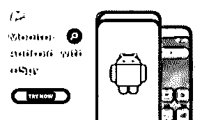

# 安卓间谍软件

> 原文：<https://www.educba.com/spying-apps-for-android/>

## 安卓间谍软件简介

下面这篇文章提供了一个 Android 间谍软件的概要。然而，也有正当的理由在别人身上使用间谍软件。间谍应用程序通常有三种用途。首先，你会用它们来看你的手机，你孩子的手机，或者你员工的手机。我们不支持恶意使用此类软件，并且在未经对方允许的情况下，您绝不应使用间谍应用程序。

### 安卓最佳间谍应用列表

下面列出了 Android 手机上最好的间谍应用程序，下面会对它们进行深入的评论。这个监控系统是完全无法检测的。

<small>网页开发、编程语言、软件测试&其他</small>

#### 1. [mSpy](https://www.mspy.com/android-spy.html?utm_source=educba.com&utm_medium=referral&utm_campaign=spying-apps-for-android/)

mSpy 已经存在很长时间了，是手机间谍软件的首选之一。直到最近，mSpy 在创造力方面一直落后于其他间谍应用程序。然而，他们最新的屏幕记录功能。要查看来自脸书、Instagram 和 Snapchat 的聊天记录，许多最好的 Android 手机间谍应用程序都包含了手机寻根功能。这也包含在 mSpy 中。您可以使用 mSpy 查看他们在这些聊天应用程序中收到的更新。

**特性:**

*   请查看所有短信，无论是收到的、发出的还是删除的。
*   浏览他们的通话记录。
*   追踪设备的 GPS 位置。安装容易，远程控制是可能的。安装时间不到 10 分钟。
*   它在后台运行。在目标屏幕上，软件不可见。
*   价格合理的替代品。
*   安全可靠。所有信息都经过加密和保护。用户是唯一拥有密钥的人。
*   最新数据。每隔 5 分钟，目标手机的活动数据就会更新一次。

#### 2.SPYIC

SPYIC 是目前市场上最好的 Android 间谍应用程序。这是最受欢迎的监控应用之一。SPYIC 保护你是否需要记录短信，网页浏览历史，电话记录，GPS 追踪器，或联系人名单。还有一些你在其他游戏上找不到的高级功能。

**特性:**

*   **定位(GPS):** 实时跟踪目标的位置。查看电子邮件、时间戳和位置历史等。
*   短信间谍是一个程序，让你窥探。阅读你的目标的所有短信，加上那些被编辑过的。知道他们指的是谁，他们在说什么。
*   **通话监控:**对于来电和去电，您将获得全面的通话记录详情。检查通话时长、地址和联系频率。
*   地理围栏是屏幕上地理围栏的一种形式，在你的目标周围画出一个受限制的虚拟边界。当个人进入禁区，你会得到通知。
*   键盘记录。
*   目标在电脑上的任何按键都会被记录下来。密切关注孩子们和员工。
*   照片和视频。
*   搜索已经下载到您的 Android 智能手机上的所有图像和视频。
*   它让 Snapchat 成为一个社交媒体平台。查看目标的 Snapchat 操作，包括他们的地址、帖子和他们发布的媒体文件。
*   **浏览器历史:**跟踪您孩子的在线活动。请确保他们在网上是健康的。
*   **隐身模式:**几乎察觉不到的监控模式。

#### 3.uMobix

uMobix 对这个行业来说是新的，但它已经迅速成为最好的 iPhone(和 Android)间谍应用程序之一，也是任何 iOS 用户最好的应用程序之一。它们还有一个其他应用程序没有的功能。技术支持可以通过网络获得。它拥有下面提到的其他秘密间谍应用程序的所有监视功能，以及其他手机间谍应用程序没有的一些非常强大的功能。大多数 iPhone 间谍软件都需要破解系统来查看脸书、Instagram 和 WhatsApp 聊天记录。uMobix 的移动监控应用不需要越狱。要开始跟踪 iPhone，您只需要用户的 iCloud 用户名和密码。来自手机的输入将会出现在你的控制面板上。

**特性:**

*   它是可靠的。所以不需要排查。
*   Android 用户的键盘记录功能可以看到他们输入的任何内容。
*   它在目标手机上处于隐形模式，所以完全检测不到。
*   带有姓名和电话号码的通话记录
*   安装应用程序很容易，服务也很好。
*   摄像机的远程访问。

#### 4.FlexiSPY

毫无疑问，FlexiSPY 是最有效的追踪应用。这就是为什么它是我最喜欢的安卓间谍游戏之一。它具有其他设备的所有实时监控功能，以及一些其他手机监控解决方案所不具备的极其强大的专业功能。这个有用的软件可以帮助你存档和收听电话，并实时收听。其他任何 app 都没有这个功能。你也可以代表手机主人发送短信或伪造短信。此外，该应用程序非常安全，其客户服务也很快，很有帮助。

**特性:**

*   高级功能包括实时呼叫跟踪、呼叫记录和呼叫日志都可用。
*   它是隐藏的，目标 Android 手机在隐形模式下无法访问。
*   远程摄像机监控、环境监听和环绕录音。
*   在 iOS 和 Android 上，很容易设置和使用。
*   通知 sim 卡升级，短信订单，电话通话记录，短信，位置和通话数据。

### 结论

在这篇文章中，我们看到了各种移动间谍应用程序及其功能。您可以根据自己的需求选择任何一种。

### 推荐文章

这是一个安卓间谍软件的指南。这里我们分别讨论 android 的最佳间谍应用程序的介绍和列表。您也可以看看以下文章，了解更多信息–

1.  [安卓版 Alexa 应用](https://www.educba.com/alexa-app-for-android/)
2.  [安卓热点](https://www.educba.com/hotspot-for-android/)
3.  [扎根安卓应用](https://www.educba.com/rooting-android-apps/)
4.  [安卓电子邮件应用](https://www.educba.com/email-apps-for-android/)

