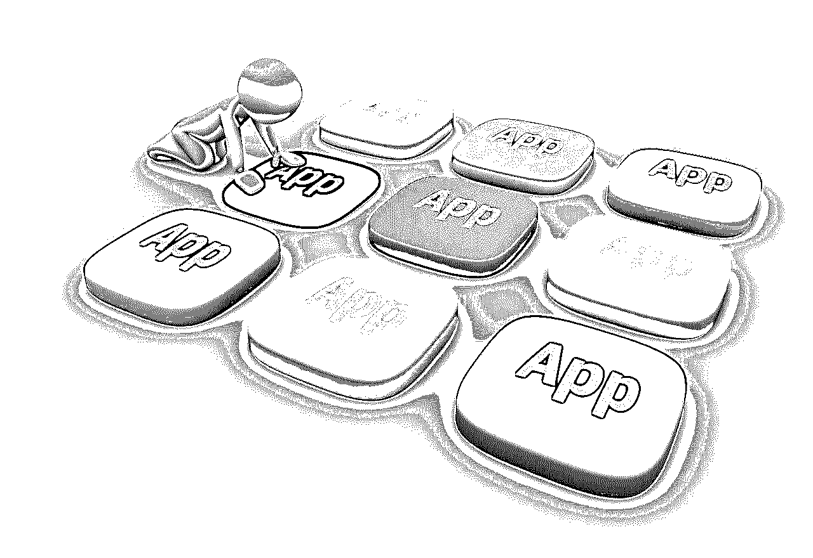

# 面向初学者的 Android 应用开发者

> 原文：<https://www.educba.com/android-apps-development/>

## 面向初学者的 Android 应用程序开发介绍

为手机和智能设备构建和开发 android 应用程序开发软件和应用程序的过程在当今的数字世界中越来越受欢迎。重要的是要知道，如果你在经营一家公司或企业，面向初学者的 Android 应用开发现在对任何产品或服务的成功都是至关重要的。

 

<small>网页开发、编程语言、软件测试&其他</small>

然而，如果你没有时间、知识或技能来创建一个伟大的应用程序，你可以雇佣一个 android 应用程序开发团队。但是，如果你正在为初学者寻找一个可以在所有平台上工作的 android 应用程序开发，那么你必须非常擅长你的搜索，因为来自特定平台的专业人员可能不适合其他平台。例如，iPhone 应用程序开发人员可能无法在 Android 或 Windows 等其他平台上工作。

### 在移动设备上开发 Android 应用的重要性

android 应用程序手机的范围每天都在飞速增长，你今天的业务取决于你如何聪明地利用 android 应用程序开发。在移动设备上使用 android 应用程序开发背后的一个重要事实是，它提供了与客户开展业务的灵活性和便利性。一个高质量标准的移动 android 应用程序开发服务可以帮助你在这个竞争激烈的 android 应用程序市场中占据显著的位置。移动设备上的 Android 应用程序开发在将手机变成智能手机的过程中发挥了重要作用。

### 为移动设备上的 Android 应用开发选择合适的技巧

在这个互联网时代，你不会有第二次机会，因此你必须非常清楚你想要开发的手机应用程序的隐私或保密性。你应该雇佣 [android 应用开发者](https://www.educba.com/android-developers-for-beginners/)来满足你的需求，记住以下建议，以确保你雇佣的是正确的专家。

*   #### Select the developer who owns and is familiar with all kinds of equipment

你们中的大多数人会希望将黑莓、Android 或 iPhone 等普通智能手机作为应用程序开发的目标。因此，您应该选择拥有并熟悉这些设备的[移动应用](https://www.educba.com/testing-of-mobile-application/)开发者。在寻找应用程序开发者之前，有一个你希望你的应用程序兼容哪种设备的想法是非常重要的。

### 浏览以前客户的列表，创建特定应用程序开发公司的应用程序

一个有经验的 app 开发者可以给你更好的体验和效果。因此，你有必要看一看创建的应用程序和为其创建的客户。检查应用程序时，请务必询问参考资料，并记住几个问题。

*   #### Look for developers who design applications suitable for various mobile devices

在选择移动应用程序开发人员时，你应该确保你选择的人能够定制你的应用程序，以适应各种移动设备，如 iPhones 和 Android。

*   #### Looking for mobile application developers who provide additional services

许多应用程序开发者还提供额外的服务，如 android 应用程序安全功能和营销服务。因此，除了设计应用程序，你应该尝试寻找一个能够提供 android 应用程序开发服务的应用程序开发者。

android 应用程序开发公司最重要的特征是可信度。在选择特定的移动应用程序开发公司之前，你应该首先确定该公司是真实的，并且遵守保密规则。大多数移动应用程序开发人员都有巨大的天赋和设计技能，雇佣一个合适的移动应用程序开发人员可以为你的应用程序需求提供一个完美的解决方案。

### 与移动应用开发商签订合同，以获得有效的 Android 应用开发解决方案

人们熟悉 IT 外包业务，这一流程对于大型 android 应用程序开发软件公司非常有效。这些外包公司将开发等一些任务外包给其他公司。外包的概念并不新鲜，今天许多任务都被大公司外包出去了。

目前，外包 Android 应用开发软件的趋势正在统治市场。事实证明，这对于公司和外包移动 android 应用开发的企业都非常有利。对于前者来说是更好的选择，因为外包其 Android 应用程序**软件**的开发任务是为了节省时间和金钱。

在移动设备上外包 android 应用程序开发有几个好处。首先，很赚钱。如果一家公司想开始自己的开发部门 Android，那么你必须花很多钱。在如此复杂的界面上开发应用程序需要训练有素的员工。

建立整个团队需要大量的资金。通过将这项工作外包给一家优秀的公司来开发 android 应用程序，您可以节省资金，并可以投资于您业务生产的任何其他部门。

Android 手机应用程序的开发是漫长的。执行这项任务也需要大量的技能和技术。你可以在一个地方找到所有这些东西，这是一个很好的外包公司 Android 开发。移动应用程序上的 android 应用程序开发拥有您正在寻找的一切。

你可以很快找到工作，也可以找到训练有素的专业人士。专业人士在规定的时间内把他们在移动应用上开发的 Android 应用交给你，这太准确了。他们在手机上开发 android 应用程序，完全依赖他们的想法。这意味着您可以在有限的时间内获得自己的定制应用程序，并且只需支付开发成本。

 

好了，现在你知道为 Android 开发应用程序的外包任务将对你非常有益，接下来你需要做的就是找到一家好公司来坚持你的标准。你只需要在网上冲浪，在那里你可以找到一些最好的外包开发公司，他们在移动应用程序开发方面有几年的 android 应用程序开发经验。这些开发公司为你的 Android 开发者提供合同服务，使他们的任务更加容易。

要扩展智能手机的功能，需要与 Android 应用程序开发服务提供商签约。现在，android 应用程序市场上有许多现有的移动应用程序开发公司，但要想让移动设备获得最好的服务，需要选择高端移动应用程序！

然而，一些公司在专业人士和客户之间建立了一个对话渠道，以监管 iPhone 应用程序开发者，雇佣 android 应用程序开发服务。它更好地理解用户需求，因此有助于补充。外包 android 应用开发要想获得高质量的 Android 应用开发服务，一定要选择最好的外包公司。

### 雇用 Android 应用程序开发团队时需要考虑的步骤

移动设备上的 android 应用程序开发正在取代笔记本电脑和台式机，并将世界带向一个不同的方向。现在，人们更喜欢用手机来保持更新，更容易地完成工作。同样，企业也在充分利用手机上的 Android 应用程序开发来接触他们的客户并产生可观的收入。

有各种平台可以开发移动应用程序，但 Android 在市场上越来越受到认可和欢迎。Android 是一个开源平台，由著名的操作系统 T1 驱动。自推出以来，它给用户带来了独特的快乐，并使越来越多的人争相购买 Android 智能手机。

如果你有一些关于强劲业务增长的有效的 android 应用程序的想法，把这些想法变成一个移动应用程序，最好是 android，因为你是这个领域的新手。Android 应用程序正在吸引全球越来越多的 Android 应用程序手机用户。而且，你可以在 android 开发行业找到很多机会。

世界各地的 android 应用程序开发公司没有限制，但是位于不同地方的面向初学者的 android 应用程序开发公司在向客户提供结果驱动的解决方案方面获得了惊人的声誉。但是在众多的公司中，你如何在一个移动公司找到一个理想的 android 应用程序开发来满足你的所有需求呢？

### 以下是寻找理想专业团队的一些重要步骤:

 

*   #### Start a thorough and unique research

在找到一家专业的 android 应用程序开发公司之前，你需要彻底研究这个国家大部分地区的 android 应用程序开发公司。探索这些公司的在线版本，并进行比较，挑选出最适合你的业务和你的预算。

*   #### Looking for portfolio and customers

你不应该把为你的想法提供一个突出平台的责任交给某人，而不仔细研究专业人士过去做了什么以及他们如何处理复杂项目的完整细节。这将让你清楚地了解你选择的 android 应用程序开发公司的工作流程。

*   #### Cross-check the customer's certificate

当你搜索可用的 android 应用程序开发公司时，你很可能会得到客户的推荐。但拿到之后，你需要反复核对客户的证明。这确保了在与这样一个专业的团队合作后，你会有怎样的体验。

因此，仅仅探索网站和挑选专业的 android 应用程序开发团队是不够的。你需要沉迷于一些重要的步骤，以使你雇佣了一个有意义的人。

### 雇佣一家成熟而廉价的 Android 应用开发公司

移动设备席卷了整个世界。尤其是商业部门严重依赖它。人们在不断移动，而技术世界正试图通过创造符合时代要求的设备来跟上时代的步伐。如今，网站变得响应迅速，可以在智能手机、平板电脑、笔记本电脑等各种设备上打开。说到移动设备，基于 android 的移动设备是最受欢迎和使用最广泛的。由于这个特殊原因**，Android 应用程序开发**应用程序最受欢迎。

Android apps 开发专为在由 Google Android 平台驱动的设备上使用而创建的软件应用程序。Android 应用程序开发软件可以在谷歌应用商店和其他商店买到。由于 Android 应用程序开发软件的需求很大，许多开发人员都对此感兴趣，他们中的许多人经验丰富，但仍有一些人是业余爱好者。在大多数地方，也有许多公司在市场上运营，雇用这些公司有一定的优势，这些优势如下:

大多数城市都有许多经验丰富、知识渊博的应用程序开发人员，他们非常有能力处理复杂的项目。

*   这些开发人员不仅有技术知识，而且他们对 android 应用程序市场非常了解，这有助于他们开发市场友好的应用程序。
*   预算始终是任何商业实体关注的问题，但该市的应用程序开发公司以经济合理的价格提供高级应用程序。

在雇用 android 应用程序开发公司之前，应评估他们的技术技能、经验和可信度，有一些需要考虑的事项如下:

*   android 应用程序开发公司必须有能力在规定的时间内交付最终产品。错过最后期限是不可接受的。
*   应用程序开发公司过去工作的投资组合非常重要。这可以为潜在客户提供一个机会，看看他们合作过的品牌和他们解决过的问题。
*   确保公司雇佣有经验的开发人员来完成项目，不要外包给小公司。
*   浏览所有可用的客户评价，这会让你对客户满意度有一个很好的了解。
*   如果你是应用程序开发领域的新手，那么试着通过推荐雇佣一家 **android 应用程序开发公司**，不要拐弯抹角。

现实地敲定一个 android 应用程序开发公司的招聘可能具有挑战性，但以上几点可能非常有帮助。

### 推荐文章

这是为新手开发 android 应用程序的基本指南。在这里，我们讨论了基本概念，重要性，以及寻找理想的专业团队需要遵循的一些重要步骤。您可以阅读以下文章了解更多信息——

1.  [安卓电子邮件应用](https://www.educba.com/email-apps-for-android/)
2.  [扎根安卓应用](https://www.educba.com/rooting-android-apps/)
3.  [安卓最佳浏览器](https://www.educba.com/best-browser-for-android/)
4.  [安卓键盘应用](https://www.educba.com/keyboard-apps-for-android/)

