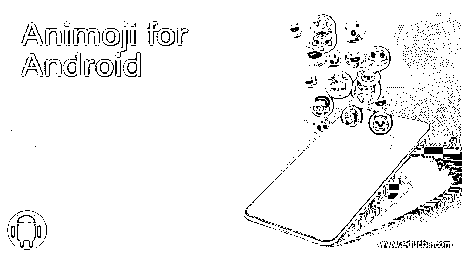

# Android 版 Animoji

> 原文：<https://www.educba.com/animoji-for-android/>

## Android 版 Animoji 简介

Animoji 是一种为 iPhone 制作的动画表情符号，用于提交各种不同头型、发型、眼睛等的面部头像。在他们的帖子中，每个智能手机用户都喜欢使用表情符号。我们将把这些表情符号发送给朋友、家人和其他人，分享我们的感受。只有 iPhone 可以使用 animoji 软件。如果你梦想在你的 Android 智能手机上使用 animoji 程序，它们就不能工作。

### Android Animoji 列表

我们来看看 Android Animoji。

<small>网页开发、编程语言、软件测试&其他</small>

#### 1\. Face Cam

Face Cam 是一个 3D 头像应用程序，具有实时自拍、面部交换和其他功能。我们将在我们的脸上渲染一个化身的 3D 表情符号。该软件就像眉毛、嘴巴和眼睛一样改造你的皮肤。Face Cam 框架具有多方面的识别功能，这也有助于与伴侣一起开发表情符号。这个程序可以用来制作朋友、亲戚和其他人的 3D 卡通。有不同的肤色，发型，头发和眼睛的颜色，鞋子等等。用户还可以通过这个程序与朋友和社交媒体网站一起捕捉和发布他们的视频。这个程序帮助用户构建符合他们个性的 3D 化身表情。我们可以创建多种表情符号，包括饥饿、悲伤、快乐、愤怒等等。

#### 2.MojiPop

MojiPop 是另一款 animoji 应用，允许制作多达三个不同的头像。我们可以和很多人一起定制 GIF 棒。MojiPop 有免费版和付费版。我们必须通过两个阶段来创建一个卡通贴纸。要制作新的贴纸，首先，使用 3D 相机程序按下一张图片，然后使用这张照片。我们将把表情符号从应用程序直接转移到图库和其他应用程序，如脸书和 WhatsApp。

#### 3.镜子

如果你参与向 WhatsApp 或其他聊天应用程序发送贴纸，你可能会喜欢使用镜像表情符号生成器软件。镜像表情符号软件使我们手机上的搞笑表情符号和 animoji 更容易开发。要创建一个新的头像，必须发布一张图片来产生几秒钟的表情符号。通过分享你朋友的照片，你甚至可以创建几个面部表情符号。该应用程序包含大量的项目，让我们可以轻松地建立独特的表情符号。

#### 4\. ZEPETO

ZEPETO 是另一个你喜欢使用的不错的 animoji 应用。从一张看起来像我们的图片，或者从预设的标志，我们可以创建 3D animoji。它为我们的 animoji 提供个性化资源，包括多种发型、服装、用具等等。该应用程序帮助我们在与他人交谈时创建和使用表情符号。通过点击相机或选择图库，我们可以方便地从图片中创建一个可爱的角色。Animoji 可以被编辑成多张脸或者角色的服装。

#### 5.纸板

谷歌键盘包含 Emoji Micro，通常被称为 Gboard。通过这个程序，我们可以扫描我们的脸，并生成许多类型和表情的贴纸。我们会使用 Gboard，Gboard 键盘，作为我们手机的键盘来使用谷歌表情符号。它还具有许多出色的功能，如语音打字、手写、滑动风格、快速搜索和共享 gif，以确保您能够做正确的事情。安装好 Gboard 后，启动键盘，然后点击贴纸按钮。在顶部，您可以看到需要选择的“构建”部分。你现在可以自己创造三种贴纸类型:甜蜜、表情符号和粗体。如果你没有正确拍摄，它还可以帮助你个性化你的面部表情符号。如果一切正常，点击“完成”,你就可以使用你的表情符号了。在 Gboard 键盘的贴纸栏上，会出现摇篮表情符号。

#### 6.表情符号

Emojidom 是最常见的 animoji 应用程序之一，拥有大量动画表情符号。该应用程序还允许在我们的 Android 和 iOS 智能手机上创建 GIF 图标和贴纸。我们会将 GIF 表情符号直接发送给我们在 WhatsApp、Line、Skype、YouTube 和其他聊天工具上的联系人。该程序是免费的，可以在更短的时间内用来建立动画表情符号。通过向我们的帖子发送表情符号，这使得谈话更加有趣和愉快。用户还可以通过不同的消息程序或网络与他们的联系人捕捉和分发有趣的视频。

#### 7.超级电影

Supermoji 是另一个你喜欢用的常见 animoji 软件。这个软件可以让我们快速构建有趣的视频和声音动画。Supermoji 是一个备受推崇的 animoji 程序，我们可以在其中免费使用 3D 表情符号。安卓和 iOS 平板电脑都有这个应用。

### 结论

在这篇文章中，我们看到了 Android 中各种针对键盘的 Animoji 工具。您可以根据自己使用键盘的难易程度选择其中任何一种。我们希望这篇文章对您有所帮助。

### 推荐文章

这是 Android 版 Animoji 的指南。这里我们分别讨论 Android 版 Animoji 的介绍和列表。您也可以看看以下文章，了解更多信息–

1.  [安卓电子邮件应用](https://www.educba.com/email-apps-for-android/)
2.  [扎根安卓应用](https://www.educba.com/rooting-android-apps/)
3.  [安卓版 mob dro](https://www.educba.com/mobdro-for-android/)
4.  [安卓应用锁](https://www.educba.com/android-app-locker/)

