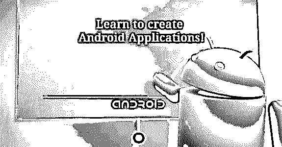

# Android 认证应用平台开发者最佳指南

> 原文：<https://www.educba.com/application-platforms/>

 

## Android 认证应用平台开发人员

你已经知道了一个事实，Android 操作系统是最受欢迎的操作系统，主导着移动和平板电脑行业。事实上，它的需求一直在令人难以置信地增长，对熟练的 Android 应用平台开发人员的需求也在增长。Android 操作系统可以支持几乎所有的应用程序。如果你是一个狂热的智能手机爱好者，热衷于开发新的有用的应用程序，那么 Android 认证应用平台开发者是一个促进你的[编程](https://www.educba.com/concepts-of-programming-languages/ "Programming Concepts for Beginners")职业生涯的完美课程。通过选择这个[认证](https://www.educba.com/certifications-skills/ "15 Best Certifications 2016")，你将有资格申请薪酬最高的[工作](https://www.educba.com/new-job-career/ "10 Things to Do When Starting a New Job")。

### 资格标准

在你申请 Android 认证课程之前，熟悉一些基本标准是很重要的，没有这些标准你就不能参加这个项目。首先，你的首要任务是通过[和-401 考试](https://androidatc.com/pages-4/Android-Certifications-and-Exams "AND-401 examination")。考试基本上是为了测试申请人关于 [Android 开发](https://www.educba.com/android-app-development-for-beginners/ "Beginner's Guide to Android App Development")的知识和经验。候选人必须参加课程和培训。你只能通过 VUE 考试中心参加考试。但是，你必须记住，你至少需要达到百分之七十才能通过考试。一旦你跨过了这道坎，你会在十天之后收到一封邮件。它会引导你到一个机器人空管学生的董事会。您还将获得一个登录 id，然后能够下载 PDF 格式的证书。此外，你也可以查看你的记分卡，并要求其硬拷贝和身份证。

<small>网页开发、编程语言、软件测试&其他</small>

### 关于考试的信息

Android 与 VUE 考试中心合作，为所有考生提供在线考试的便利。你只能在授权的 VUE 中心参加考试。这些中心遍布世界各地。可以从安卓认证开发者官网了解该中心。基本上有四种考试；即，

#### 和-400:Android ATC 认证培训师考试培训技巧

如果你想进入教学领域，成为一名认证的机器人培训师，那就开始准备这个考试吧。这是为了确定你是否适合成为一名教练。除此之外，你的沟通能力也将受到考验。

**考试形式**

大约有 45 道选择题，如前所述，及格分数是 70%。这些问题通常来自电子书，所以如果你适当地学习电子书，你可以轻松地通过考试。但是，如果你没有参加考试，你就不能申请这个项目。如果你愿意，你也可以从 Android 培训中心获得帮助，或者选择自学。

#### 和-401:安卓应用平台开发考试

 

现在我们进入考试的主要部分。这是获得 Android 开发证书的一个非常重要的考试。在这里，您可以直接从“Android 应用平台开发课程”中获得问题。你必须强制性地通过这次考试，在此之后，证书将在考试后一个月内连同身份证一起通过电子邮件发送。你可以在 Android 应用平台开发的官方网站上看看样题。这确实会使你的准备工作容易得多。

#### 和-402:安卓安全基础考试

你要应对的下一个考试是 android 安全基础，其中的问题将与 Android 应用程序开发的安全方面相关。你可以通过访问网站浏览课程内容。但是，如果你通过了考试，你只会得到一张记分卡。你必须仔细阅读和-403 货币化 Android 应用平台考试，以获得认证的 Android 应用平台工程师证书。

#### 和-403:货币化安卓应用平台考试

你会从官网本身了解到课程大纲。正如前面提到的，AND-402 和 AND 403 都是相互依赖的。为了获得认证，您必须完成 Android Security Essentials 考试。

**关于考试的一些其他重要信息**

请注意这些要点-

*   你会很高兴地知道，Android 认证应用程序开发人员的考试是闭卷的，因此以多种流行语言进行，包括英语、中文、葡萄牙语和西班牙语
*   你必须参加 45 次 mcq 考试，并取得大约 70 分才能通过考试。持续时间大约是九十分钟。所有考试的形式都是一样的。
*   如果你参加培训课程，你会发现取得考试资格并不困难；但这不是强制性的。
*   完成在线测试后，您可以立即查看结果。如果你通过了，那么你会在三天内通过电子邮件得到一份成绩单。
*   考试费大约为 150 美元，将支付给授权的考试中心。

### App 开发的重要课程

提供 Android 认证应用程序开发人员的组织为有抱负的候选人提供了大量课程。这些都是设计 Android 应用平台的重要和有帮助的。一些受欢迎和要求高的课程包括-

### **Android 开发 Java 基础**

 

如果你想为手机或平板电脑开发一个安卓、T2 应用，Java 编程知识是必不可少的。培训课程通常持续几天，让你熟悉 java 编程及其框架的基础知识。该计划提供了与 Android 软件开发包(SDK)相关的有效方法，以便开发者可以非常容易和更快地设计应用程序。如果你对 Java 编程一无所知，那就选择这门课程，因为它是为你量身定做的。

然而，你也应该知道它的额外好处。任何与 IT 部门相关的专业人士或任何对应用程序开发感兴趣的人都可以申请这门课程。但是你需要有一些[电脑编程](//www.educba.com/computer-programming-language/ "Fundamentals of Computer Programming")的经验才能申请。事实上，这也将证明是有益的。

**课程大纲**

*   Java 虚拟机简介
*   如何编写、编译和运行 Java 应用程序
*   学会使用 [Eclipse](https://www.educba.com/course/exploring-the-eclipse-ide/ "Eclipse IDE 101") I [DE](https://www.educba.com/course/exploring-the-eclipse-ide/ "Eclipse IDE 101")
*   Java 控件和基本语法
*   Java 编程的概念等等
*   编译文件输入或输出
*   如何安装 Android SDK、插件和 Android 模拟器
*   最后写 Hello World Android 应用程序

### 安卓应用质量开发版 5，棒棒糖

这是第二个流行的 Android 应用质量开发课程。完成该课程的时间为五天(30 小时)。它通常专注于设计和开发 Android 应用程序的技能。棒棒糖版本目前在智能手机中广泛使用。这是一门非常重要的课程，因为它涉及 Android 开发的主要方面。AND-401 考试的题基本上只从这一段放上去。

只有具备 Java 编程和基础知识的候选人才有资格参加本课程的相关培训。因此，在申请本课程之前，您应该先完成前面的程序，即 Android 开发的 Java 基础，这样理解起来会简单得多。

**课程大纲**

*   [如何开发完整的 android 应用](https://www.educba.com/android-app-development-for-beginners/ "Beginner's Guide to Android App Development")
*   如何在应用程序开发过程中解决问题
*   阅读 android 应用的生命周期及其主要元素
*   如何利用外部资源、清单文件和适配器
*   获取关于利用 Android 存储技术的知识
*   如何使用 Android 设置和处理方法

### 安卓安全必备

Android Security Essentials 课程持续几天，分配了 12 个小时来完成。顾名思义，它与 Android 应用程序访问的安全模型相关联，这对开发者和用户都很重要。

就课程的合格性而言，你需要具备 Android 开发方面的知识。如果你愿意，你甚至可以参加培训。

**课程大纲**

*   你开始了解 android 软件架构
*   熟悉 Android 的安全模型
*   为每个开发的应用程序提供强大的安全性

### 将 Android 应用质量货币化

这门课程对新的应用程序开发人员以及有经验的和与应用程序开发公司有联系的人员都非常有帮助。这是一个为期两天的课程，你可以通过设计一个应用程序获得创造财富的基本知识，并获得巨额利润。

为了使你有资格学习这门课程，你应该具备 Java 编程的知识。因此，建议首先仔细阅读 Android 编程的 Java 基础知识，然后进一步申请这个程序。

**课程大纲**

*   了解如何将您的应用质量货币化
*   如何添加广告而不破坏用户体验
*   使用应用计费制作 Android 应用
*   发布和推广您的应用

### 与该领域相关的各种工作机会

现在是时候讨论在完成课程后你可以期待的不同的工作前景了。下面列出了它。

**Android 认证应用质量开发者**

这个认证计划将有助于促进你的编程生涯，你可以成为一个认证的应用程序开发人员。这意味着您将了解与设计和创建用户友好的应用程序访问相关的所有方面。只要通过 AND-401 考试。因此，当今市场对熟练应用程序开发人员有巨大的需求，这也许是抓住机会的最佳时机。

**安卓认证应用质量工程师**

这是另一个非常有收获的机会，你可以给你的职业生涯和光明的未来带来额外的优势。Android 认证应用平台工程师应该对 Android 应用平台开发流程有更深入的了解。要在这个领域提供服务，你必须通过三项考试，即 401、402 和 403。你的工作职责将主要是修复与安全和货币化相关的技术问题。这是一份高薪工作，特别是如果你是一名经验丰富的 android 认证专家。

**安卓认证培训师**

如果你更有兴趣向年轻的有志候选人教授 Android 认证开发流程，那么你可以选择这个领域作为你的职业生涯。一个 Android 培训师你应该有关于 Android 开发和培训的知识。为了成为一名培训师，你必须通过所有基于 android 的考试，然后还要通过 Android ATC 认证培训师考试的培训技能。你必须执行导师的任务，了解需要教给考生什么。然而，你只能在授权的 Android 培训中心工作。

**作为 Android 自由开发者提供服务**

Android 培训中心推出 Android 自由开发者课程，这是一个好消息。现在[你可以作为自由职业者自己开发一个应用程序](https://www.educba.com/freelance-web-graphic-designer/ "How to Be a Successful Freelance Web Designer")，然后卖给任何客户或商业机构，赚取巨额利润。这是一个展示你作为创新应用程序开发者的 [t](https://www.educba.com/course/talent-acquisition-planning-recruitment-and-selection-2/ "Talent Acquisition") a [lent](https://www.educba.com/course/talent-acquisition-planning-recruitment-and-selection-2/ "Talent Acquisition") 或[技能](https://www.educba.com/25-self-development-skills-to-learn/ "25 Self Development Skills to Learn")的绝佳机会。重要的是你可以自由地应用你的知识，并且可以在业余时间工作。

为了方便和帮助自由开发者，培训中心推出了免费会员俱乐部。这将使您能够公布您的姓名，国家，地址，电子邮件等。事实上，你可以直接与客户联系，并相应地为他们工作。客户要求 ATC 提供认证 Android 应用程序开发人员的信息，以满足他们的要求。但是，只有那些通过考试后从培训中心获得证书的人才有资格加入这个自由职业者俱乐部。

### 结论

全世界的 Android 培训中心都在提供有效的培训，为有能力的 Android 开发人员、工程师和培训师做准备。该课程非常简单，重点关注 Android 应用程序创建的整个生命周期，包括维护和调试。根据最近的一份报告，对熟练和有经验的需求在不久的将来肯定会增加，这对于具有创造性思维的人来说是一个黄金机会，可以设计他们自己独特的应用平台。

### 推荐文章

因此，这里有一些相关的文章，这将有助于您获得更多关于应用平台的细节，所以只需浏览下面给出的链接

1.  [移动应用](https://www.educba.com/mobile-applications/)
2.  [短信营销服务](https://www.educba.com/sms-marketing-services/)
3.  [移动测试工具](https://www.educba.com/mobile-testing-tools/)
4.  [移动自组织网络](https://www.educba.com/mobile-ad-hoc-network/)

