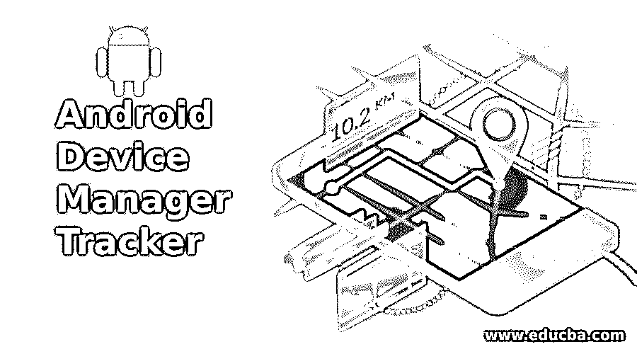

# Android 设备管理器跟踪器如何找到您丢失的手机？

> 原文：<https://www.educba.com/android-device-manager-tracker/>

## Android 设备管理器跟踪器

应用程序统治着当今世界，这是理所当然的，因为你生活中的每一项活动都有一个应用程序，从早上的闹钟到每天睡觉前阅读圣经。我常常在想，有没有一件事情是没有应用程序的。我还没有考虑这么多给你答案，但我肯定会。

吸引我的最新应用是安卓设备管理器跟踪器。顾名思义，它管理你的 android 设备。但最大的问题是如何实现？

<small>网页开发、编程语言、软件测试&其他</small>

让我们先熟悉一下 android 设备管理器软件，然后再来讨论如何操作的问题。

### 什么是 Android 设备管理器跟踪器？

Android Device Manager Tracker 实际上是一款谷歌应用，可以帮助用户远程保护和跟踪他们的设备。所以，丢失手机不应该让你紧张和担心，因为现在你只需点击一个按钮，就可以利用许多功能来找到你珍贵的丢失设备。谷歌允许你在地图上追踪你的设备最近一次使用或打开的位置。更重要的是，如果你问，这里有一个由 android 设备管理器软件提供的伟大功能列表，以保护您的手机以及您在手机中存储的数据。

### Android 设备管理器跟踪器功能

特林。特林。找到我的手机

不要看着我的标题嘲笑我，因为让我向你展示 android 设备管理器跟踪器的最佳功能，它肯定会在一天结束时让你发笑，因为它将解决你一天中最琐碎的问题-丢失手机或忘记它在哪里。

谷歌的安卓管理器可以让你以最大音量打电话，即使你已经把它保持在静音模式。如果你把手机忘在了你上次去过的地方，不要担心，谷歌可以非常有效地让你在地图上找到它，以确保设备可以很容易地找到。应用程序管理器还可以让您锁定您的手机，确保您的数据安全，如果它已经丢失。锁可以被激活，甚至在丢失手机后也可以被更改。因此，即使你的个人设备落入不法之徒手中，Android Manager 也能确保其完全安全。

消灭！

任何丢失手机无数次的人都会知道每次丢失存储数据并从头重新创建的痛苦。还有哦！天啊，害怕你的数据被用来对付你更可怕。如果你使用的是 Android 设备管理器追踪器，这种恐惧可以永久消除。ADM 允许你在没有希望找回你的手机的情况下完全清除(擦除你的数据)。

把我的手机还给我！

Android 设备管理器追踪器的最新功能是一个福音。现在，您可以在手机上添加一个号码，以确保找到您手机的人可以联系到您。这个人一接通你的电话，设备管理器就会提示一条信息，上面会闪现你的联系号码。

### 如何使用 Android 设备管理器跟踪器？

1.  打开你最喜欢的浏览器页面，输入以下地址[google.com/android/devicemanager](https://www.google.com/android/find?u=0)。谷歌将要求你授予它访问你的位置数据的权限，这是设备管理器顺利运行所必需的，考虑到它是一个跟踪服务。如果未处于自动模式，您需要打开定位服务。Nexus 手机提供自动开机模式。
2.  您可以查看手机的当前位置，也可以查看它最后一次使用的位置。切换到另一个设备的选项非常简单，只需点击下拉菜单中的设备名称即可。切换设备选项使您可以从一个地方轻松跟踪所有 Android 设备。一旦您选择新设备，地图将立即启用以跟踪它。重命名设备很容易，只需点击铅笔按钮。
3.  你现在需要从谷歌 Play 商店下载应用程序。请确保下载正确的应用程序，因为商店中有外观相似的应用程序。安装应用程序，并允许它访问您的位置数据，就像上面的步骤。
4.  一旦手机中的 GPS 系统被激活，您就可以根据需要使用它的各种功能。为了方便读者，每一个特性都有详细的阐述，以帮助他们工作。
5.  您有两个选项可用，即锁定和擦除以及在设备名称下以图标格式响铃。选择该选项后，应用程序会提示您更改其设置。您可以选择手机在振动模式下响铃的音量。你可以选择最大值或者根据你的选择改变它。
6.  要使用锁定和擦除功能，您需要选择其图标。选择后，会有一个对话框向您的设备发送通知，告知您该功能已激活。这是一个必要的步骤，需要虔诚地遵循。
7.  在锁定功能中，会提示你创建一个新密码来锁定手机屏幕，而擦除选项是你必须非常小心的。除非你不确定在任何情况下都能找回你的手机，否则你应该避免使用它。擦除选项的功能类似于工厂重置模式，并擦除您手机上的所有数据，以保护您免受数据被盗的困扰。
8.  它会抹掉储存在您的音乐、照片、视频和其他文件夹中的数据。这种删除是永久性的，无论如何都无法恢复。然而，擦除选项只能从您的手机中删除数据，而不能对存储在您的 SD 卡上的数据做任何事情。如果当你点击清除按钮时你的手机关机，一旦你的手机开机，该命令将立即生效。
9.  在应用程序的设置中，将要求您激活设备管理员，这将允许您访问应用程序的所有功能。为了让应用程序在您的设备上顺利运行，需要就某些管理权限达成一致。

现在你已经准备好使用 Android 设备管理器软件的服务了。然而，不要把丢手机当成一种习惯，把 Android 设备管理器软件当成一个简单的自救选项。永远记住；及时一针可省九针，你不知道为了你的一个愚蠢的习惯，你可能要牺牲什么数据。所以 ADM 是来帮助你的，但前提是你要正确地自助。

### 推荐文章

这是一个 Android 设备管理器跟踪器的指南，实际上是谷歌应用程序的最新功能，可以帮助用户远程保护和跟踪他们的设备。以下是与 android 设备管理器跟踪器相关的外部链接。

1.  [生根安卓](https://www.educba.com/rooting-android/)
2.  [安卓开发](https://www.educba.com/careers-in-android-development/)
3.  [安卓应用开发工具](https://www.educba.com/android-apps-development-tools/)
4.  [面向每个博客作者的安卓谷歌应用](https://www.educba.com/android-google-apps-for-every-blogger/)

