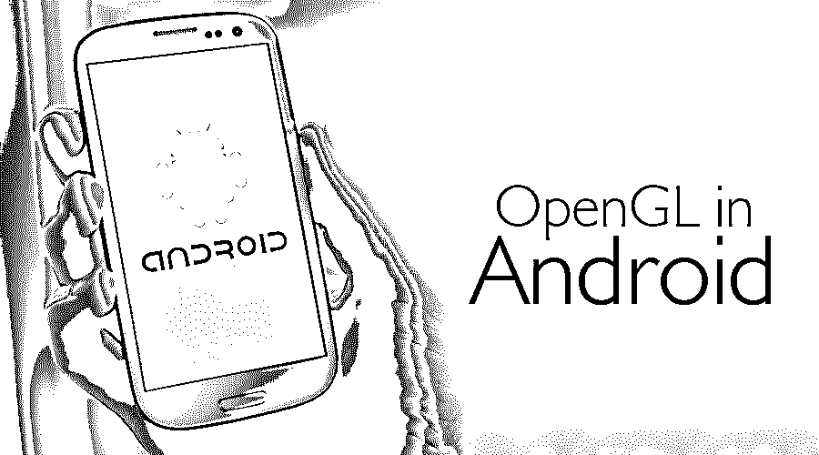

# Android 中的 OpenGL

> 原文：<https://www.educba.com/opengl-in-android/>

## Android 中的 OpenGL 介绍

Android 中的 OpenGL 是一个图形库，用于 Android 应用程序中的 2D 和 3D 图形开发。OpenGL 提供了跨平台的 API。它处理 CPU 和 GPU 之间的高性能数据传输。OpenGL 支持用于图形功能开发的 android 本地开发套件(NDK)。有三个与 OpenGL 一起使用的类，如 GLSurfVaceiew、Renderer 和 GLSurfaceView。有几个 OpenGL 对象与 Android 操作系统相关联。它在诸如逐顶点操作、图元组装、图元处理、光栅化、片段处理和逐片段操作的六个阶段中创建渲染管道。使用编程技能以及数学能力(如向量和矩阵)实现 OpenGL。

**GLSurfaceView**

<small>网页开发、编程语言、软件测试&其他</small>

您可以在此视图中绘制和操作对象。使用这个类很容易，因为您可以创建一个 GLSurfaceView 对象并向其添加一个渲染器。您可以通过扩展 GLSurfaceView 类来实现触摸侦听器，从而捕获触摸屏事件。

**GLSurfaceView。渲染器**

GLSurfaceView。renderer 接口包含在 GLSurfaceView 中绘制图形所需的方法。该接口的实现应该作为附加到 GLSurfaceView 实例的单独类使用 GLSurfaceView.setRenderer() **提供。**

您需要为 GLSurfaceView 实现以下方法。渲染器接口实现:

*   **onSurfaceCreated()** :在创建 GLSurfaceView 的过程中调用这个方法。
*   **onDrawFrame()** :在 GLSurfaceView 的每次重绘过程中调用该方法。
*   **onSurfaceChanged()** :当 GLSurfaceView 几何图形改变(大小、方向等)时调用该方法。

### Android 中的 OpenGL 是如何工作的？

存在几种类型的 OpenGL 对象。例如，顶点缓冲对象可以存储角色的顶点。第二个例子是可以存储图像数据的纹理。 **T2】**

代表网格特征的顶点、法线和 UV 坐标等数据被加载到顶点缓冲对象中，然后发送到 GPU 进行处理。一旦进入 GPU，这些数据将通过所谓的 OpenGL 渲染管道。

渲染管道负责的主要任务是将顶点转换到正确的坐标系，组装角色的顶点，应用颜色或纹理，并在默认的帧缓冲区(即屏幕)上显示角色。 **T2】**

Android 中 OpenGL 的渲染流水线过程包括以下六个阶段:

1.  逐顶点操作
2.  原始装配
3.  原始处理
4.  光栅化
5.  片段处理
6.  逐片段操作

#### 逐顶点操作

渲染图像的第一步也是最重要的一步是必须从一个坐标系转换到另一个坐标系的几何数据。

#### 原始装配

在这个特定步骤中，顶点被收集成 2 个、3 个或更多个的对，并且图元被组装，例如，三角形。

#### 原始处理

当图元被组装后，对它们进行测试以检查它们是否落在视见体积内。如果他们没有通过这个特殊的测试，他们将在后续步骤中被忽略。这种测试被称为削波。

#### 光栅化

然后，图元被分解成更小单元的块，并对应于帧缓冲区中的像素块。这些更小的单元中的每一个都被称为片段。

#### 片段处理

当图元被栅格化后，颜色或纹理被应用到几何体。

#### 逐片段操作

最后，碎片将接受各种测试，例如:

*   像素所有权测试
*   剪刀试验
*   智力测验
*   模板测试
*   深度测试

在这六个阶段中，有两个阶段由称为着色器的程序控制。

Shader，简而言之，就是一个只由你开发的，驻留在 GPU 中的小程序。有一种称为 OpenGL 着色语言(GLSL)的特殊图形语言，着色器是用这种语言编写的。发生着色器的 OpenGL 管道中的两个重要阶段被称为“逐顶点处理”和“逐片段处理”阶段。

在“逐顶点”阶段处理的着色器称为顶点着色器。在“逐片段”阶段处理的着色器称为片段着色器。顶点着色器的最终和基本目标是向渲染管道提供角色顶点的最终变换，而片段着色器的目标是向帧缓冲区的每个像素标题提供颜色和纹理数据。

当数据通过 OpenGL 渲染管道传递时，3D 或 2D 模型将出现在您设备的屏幕上。

### 总帐程序

以下是总帐程序:

#### Android 中 OpenGL 的建议

如果你是 OpenGL 程序员的初学者，那么下面的一些要点你可能还没有遇到过。以下是你在 Android 中使用 OpenGL 时需要注意的一些准则。它们是常见的错误。所以要时刻记住这些。

1.  照明的法线缩放不当
2.  不良镶嵌会影响照明
3.  永远记住你的矩阵模式
4.  投影矩阵堆栈溢出
5.  未设置所有 Mipmap 级别
6.  回读亮度像素

### Android 中 OpenGL 的先决条件

以下是 Android 中 OpenGL 所需的先决条件。

#### 软件技能

*   c 也就是编程语言。
*   C++知识不是必要的，但很有帮助。
*   各种静态或动态库的使用。

#### 数学

*   2D 和三维的向量知识。
*   矩阵
*   基础数学概念。

这些都是开始使用 OpenGL 所需要的主要和基本的概念。你可能需要学习更多的数学概念，但是在你达到中级水平之后。但这完全取决于你。在不同库的帮助下，你可以跳过很多东西。

### 结论

因此，OpenGL 是一个完全功能化的 API，它是原语级的，允许程序员有效地处理和利用图形硬件。大量的高级库和应用程序使用 OpenGL，因为它的性能、编程容易、可扩展性以及广泛的支持。

### 推荐文章

这是 Android 中 OpenGL 的指南。这里我们讨论了 Android 中 OpenGL 的工作过程和先决条件。您也可以浏览我们推荐的其他文章，了解更多信息——

1.  [WebGL vs OpenGL](https://www.educba.com/webgl-vs-opengl/)
2.  [Cognos 是什么？](https://www.educba.com/what-is-cognos/)
3.  [什么是吉拉软件？](https://www.educba.com/what-is-jira-software/)
4.  [在蔚蓝的职业生涯](https://www.educba.com/career-in-azure/)

