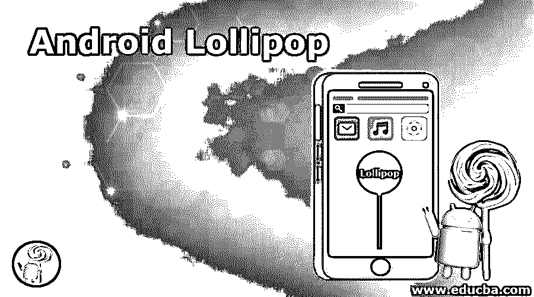

# 安卓棒棒糖

> 原文：<https://www.educba.com/android-lollipop/>

## 安卓棒棒糖简介

谷歌 Android 操作系统的第五大版本是“棒棒糖”(android 5)。是安卓的第 12 版。开发的代号是 Android L，Android Lollipop 的开发者版本出现在 2014 年 6 月 25 日的 Google I/O 大会上。2014 年 11 月 3 日，它在运行 Android 服务发行版的选定系统上正式公开。被称为材料设计的重新设计的用户界面是棒棒糖版本的关键变化之一。其他改进，如可以从锁定屏幕访问和查看警报。为了提高应用程序的性能，谷歌还通过用 Android 运行时替换官方的 Dalvik 来改变其内部架构。

### Android 棒棒糖的功能

Android Lollipop 的功能和特点如下:

<small>网页开发、编程语言、软件测试&其他</small>

#### 1.通知

Android 5.0 的更新更加可见，更加可用，也更加可配置。如果用户愿意，锁定屏幕可以包含各种通知信息。用户可以在受保护的锁显示器上不显示、显示任何通知信息或显示所有通知信息。在抬头屏幕中，一个小的浮动窗口显示关键的屏幕通知，如来电，允许用户在不离开当前设备的情况下响应或拒绝。现在，您可以使用新的元数据来收集关联的联系人(用于排名)、组和优先级通知。新的媒体报告模板通过多达六个操作按钮为通知提供一致的媒体控制，包括像“竖起大拇指”这样的自定义控制，不再需要远程视图。

#### 2.高性能显卡

Khronos OpenGL ES 3.1 还在支持的设备上为游戏和其他应用程序提供 2D 和 3D 图形功能。OpenGL ES 3.1 引入了设备着色器、模板纹理、视觉效果、高质量纹理压缩 ETC2/EAC、最先进的纹理渲染、统一大小和渲染缓冲区格式等。Android 5.0 还推出了 Android 扩展包(AEP)，让您能够访问诸如镶嵌着色器、几何着色器、ASTC 纹理压缩、每样本插值和着色等功能以及其他高级渲染功能。AEP 提供各种各样的高性能图形处理器。

#### 3.增强型摄像头和视频

Android 5.0 包括全新的相机 API，用于捕捉 YUV 和 Bayer RAW 等原始格式，并控制曝光时间、ISO 感光度和每帧帧时间等参数。新的完全同步的相机管道可以帮助您以 30 FPS 的速度捕捉 YUV 图像，而无需在兼容的计算机上以全分辨率压缩。最新的 API 不仅提高了图像捕捉能力，还提供了关于相机功能的全面信息和详细描述每帧捕捉环境的元数据。用于优化视频数据编码和解码的 H.265 高效视频编码(HEVC)应用程序现在允许通过互联网发送视频流。Android 5.0 还提供了对高清(4 K)内容的多媒体隧道支持，以及一起播放压缩音频和视频信息的能力。

#### 4.电池改进

谷歌还推出了 Volta 项目，以提高电池寿命。Project Volta 发布了 JobScedular API，帮助开发人员优化应用程序的功耗。最后，谷歌推出了 Lollipop 的“电池节电”模式，如果电池电量很小，可以手动设置或自动禁用。

#### 5.高级连接

在 Android 5.0 应用程序中，您将能够使用新的 API 进行搜索和广告，这些 API 支持应用程序同时运行蓝牙低能耗操作。新的多网络技术允许设备扫描可访问的网络功能，如 Wi-Fi、移动、计量或其他网络功能。然后，该应用程序将请求连接，并对缺乏连接或其他网络变化做出响应。应用程序现在允许 NFC APIs 动态注册辅助。还设置了活动用户偏好的卡仿真服务，并且生成了具有 UTF-8 文本数据的 NDEF 记录。

#### 6.锁屏增强功能

Android Lollipop 提供了“个人激活”功能，允许用户决定用户是否在主人手中。它使用蓝牙应用程序，可以在范围，地点，甚至语音中使用。例如，当使用蓝牙手表时，应用程序可能会要求输入密码，然后密码就会被删除。

#### 7.材料设计

材料设计允许开发人员在应用程序中定义产品标高值，自动为用户提供阴影和透视。谷歌还升级了其流行的 Roboto 字样，使开发者能够在各种平台上使用优化的字体。

### Android Lollipop 的特点

Android Lollipop 的功能如下:

*   Android lollipop 支持 64 位 CPU。
*   通过 USB 进行音频输入和输出。
*   刷新通知托盘和快速下拉配置。
*   更多的应用程序可用于访客登录和多个用户帐户。
*   出于安全考虑，WebViews 会自动从 Google Play 获取更新。
*   这将被禁用，直到用户登录他们的谷歌帐户时，设备被盗或丢失。

### 推荐文章

这是安卓棒棒糖的使用指南。在这里，我们讨论 Android Lollipop 的介绍及其功能和高级特性。您也可以浏览我们推荐的其他文章，了解更多信息——

1.  【Android 版 face time
2.  [Android Kitkat](https://www.educba.com/android-kitkat/)
3.  [安卓是什么？](https://www.educba.com/what-is-android/)
4.  [安卓广告拦截应用](https://www.educba.com/android-ad-blocker/)

