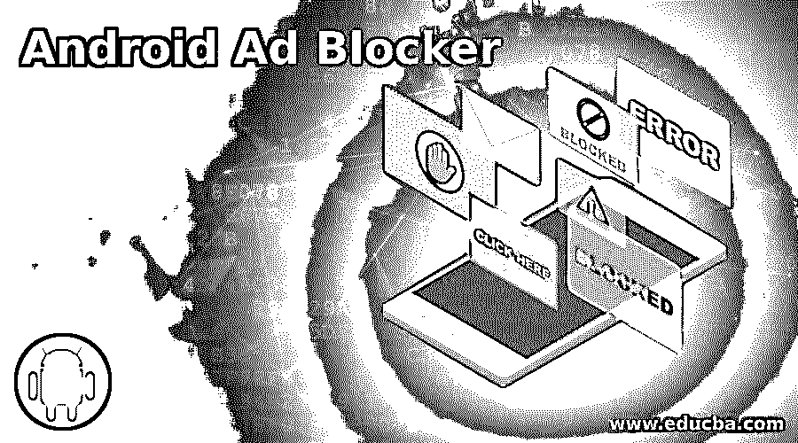

# android adblock

> 原文：<https://www.educba.com/android-ad-blocker/>

## Android 广告拦截器简介

以下文章提供了 Android 广告拦截器的概述。公司和不同的网站都在发展壮大，广告成为销售的主要方式。当您访问互联网、观看视频和玩游戏时，会显示广告。许多产品或服务使用应用程序或网站来移动它们。弹出式广告是为笔记本电脑和移动电脑保留的，但它们通常针对智能手机，因为它们可以被个人使用。因此，对于他们的智能手机，用户需要一些像样的广告拦截软件。谷歌 Play 商店没有大多数可用的广告拦截软件。您可以从第三方的任何来源下载并安装它们。

### 热门安卓广告拦截应用

以下是排名靠前的安卓广告拦截应用:

<small>网页开发、编程语言、软件测试&其他</small>

#### 1.阿达韦

*   AdAway 是一个基本的 Android 广告拦截应用程序。广告请求被发送到新 12.0.0.1。使用已更改的主机文件，您不会看到任何广告。
*   这个程序被设置为托管那些点击任何广告的文件，这些广告会迅速改变它们的进程。重定向破坏横幅广告，弹出窗口和任何体育广告。
*   该设备支持新的和修改的主机文件。Android 设备的只读部分存储主机文件。

#### 2.TrustGo 广告检测器

*   您知道通过应用程序收集您的个人数据的移动广告吗？检查您的 Android 设备，保护它免受可能的 id 和隐私泄露，这种情况有时会发生在您的 Android 应用程序上的广告中。
*   TrustGo Ad Detector 应用程序以透明的方式使用您的 Android 应用程序，确保个人信息的安全和保护。
*   TrustGo 广告检测器应用程序是一种独特的广告拦截器，用于保护您的个人信息。

#### 3.Adblock Plus 三星互联网

*   在 Adblock Plus Samsung Internet 上，您可以更快地搜索网络浏览器，而无需广告。该软件旨在通过仅加载必要的细节和停止浏览器广告来保存电池寿命。
*   还有反跟踪隐私功能。通常，当移动到另一个国家时，该软件会屏蔽特定国家的广告。
*   Adblock Plus Samsung 提供最高的 100%免费客户服务。当你使用三星手机时，这个应用程序当然适合你。你可以用的谷歌 Play 商店。

#### 4.AdBlock Fast

*   AdBlock Fast 是一个广告拦截程序，适用于旧的 Android 设备和互联网浏览器。这个广告拦截器可以下载到三星 4.0。
*   这被认为是最强大的广告拦截器之一。AdBlock Fast 有自己定制的过滤规则集，有助于更快地加载网站。
*   与其他广告拦截应用程序相比，它使用更少的电力，CPU 周期和磁盘空间。该应用程序是免费的，安全，快捷，简单易用。Google play 商店可以下载 AdBlock Quick 应用程序。

#### 5.AppBrain Ad 检测器

*   广告拦截器阻止来自 AppBrain 的弹出窗口和广告。它的功能和其他应用有些不同。当检测到危险的设备网络时，推送通知和垃圾广告将被锁定。
*   使用 AppBrain Ad Detector 应用程序很快。它有一个“关注”标签，可以帮助你立即看到任何伤害。
*   下载谷歌 Play 商店 AppBrain 广告检测应用程序。

#### 6.广告拦截器浏览器

*   Android 软件广告拦截器插件与其他广告拦截应用程序相同。它会自动屏蔽所有的广告，并为用户提供一个强大的衡量标准。
*   还有其他方法来禁用隐私和监控，恶意软件域和反垄断信息。
*   谷歌 Play 商店广告拦截软件可以下载。

#### 7.阻止这个

*   阻止这个广告拦截应用程序是一个简单的，开源和免费的用户应用程序。广告拦截器并不常见。它不使用过滤器，而是使用 DNS 阻止。
*   开发者声称在 DNS 拦截系统上使用比普通广告拦截器更少的电池。这是因为大多数研究都是在你的安卓智能手机收到结果之前完成的。
*   阻止这款安卓应用可以从他们的 block-this.com 网站下载。

#### 8.AdGuard

*   AdGuard 软件类似于 AdBlock Plus 程序。上下文运行，所有 web 流量被过滤。为了给你提供优雅而简单的浏览体验，AdGuard Android 应用程序声称可以删除网站上的所有恶意广告。
*   它需要一些额外的配置，没有核心也能工作。这也有一个强烈的感觉，材料设计的用户界面，以纳入任何东西。
*   它包括诸如提高页面速度、防火墙和恶意软件安全等功能。有高级版和免费版。

#### 9.涡轮浏览器

*   Turbo Browser 具有集成的浏览器广告拦截功能。它因能更快地加载网页而广受欢迎，并能提供几个文件的高速下载。
*   该应用程序还保存尽可能多的信息，以便访问您需要的唯一资料。阻止网站上的广告，这使得网上冲浪比标准浏览器更容易。

### 结论

在本文中，我们已经了解了什么是广告拦截器，以及为什么有必要将广告拦截器与 TopAndroid 广告拦截器应用程序一起使用。您可以根据自己的需求选择任何广告拦截器。

### 推荐文章

这是一个 Android 广告拦截器的指南。在这里，我们分别讨论了简介和 9 大 android 广告拦截应用程序，并给出了详细的解释。您也可以看看以下文章，了解更多信息–

1.  [安卓架构](https://www.educba.com/android-architecture/)
2.  [安卓是什么？](https://www.educba.com/what-is-android/)
3.  [操作系统中的多线程](https://www.educba.com/multithreading-in-operating-system/)
4.  [安卓 VPN 应用](https://www.educba.com/vpn-applications-for-android/)

